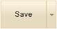
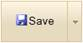
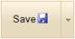
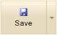
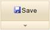
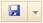
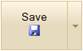
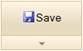

::: {style="DISPLAY: none"}
{#d2h_url_template}{#d2h_package_url style="WIDTH: 0px; DISPLAY: none; HEIGHT: 0px"}
:::

::: {.d2h_secondary_topic style="PADDING-BOTTOM: 10pt; MARGIN: 0pt; PADDING-LEFT: 0pt; PADDING-RIGHT: 0pt; PADDING-TOP: 0pt"}
#### Behaviors {#behaviors style="tab-stops: 0pt"}

The Split-Button supports various behaviors such as content type and image positioning.

**ContentType**: - The text and image of a button can be customized using the **ContentType** property(TextOnly, ImageOnly, TextAndImage).

**ImagePosition**: - the image of a button can be customized using the **ImagePosition** property (Left, Right, Top, and Bottom).

**ArrowPosition**: - The arrow of a split button can be customized using the **ArrowPosition** property (Right and Bottom).

 

Use Case Scenarios

The Split-Button control allows for easy customization of the content to be displayed on the Split-Button.

 

Adding Behavior[ ]{style="COLOR: red"}to an Application

The following steps guides you in defining the behavior of the Split-Button control.

The behaviors can be customized by two ways in the Split-Button.

[·      ]{style="FONT-FAMILY: Symbol"}Using Builder

[·      ]{style="FONT-FAMILY: Symbol"}Using Properties Model

 

Using Builder

 

1.   In View, invoke the SplitButton helper with the button id as the first argument followed by the button **Text**, **ImageUrl** and **ContentType** methods. Set the **DataSource** and **BindTo** properties.

 

[]{style="FONT-FAMILY: 'Myriad Pro','sans-serif'"} 

+---------------------------------------------------------------------------------------------------------------------------------------------------------------------------------------------------------------+
| **[View\[aspx\]]{style="FONT-FAMILY: 'Courier New'"}**                                                                                                                                                        |
|                                                                                                                                                                                                               |
| [        [\<%]{style="BACKGROUND: yellow"}[=]{style="COLOR: blue"}Html.Syncfusion().SplitButton([\"btnSplit\"]{style="COLOR: #a31515"})]{style="FONT-FAMILY: 'Courier New'"}                                  |
|                                                                                                                                                                                                               |
| [            .Text([\"Save\"]{style="COLOR: #a31515"})]{style="FONT-FAMILY: 'Courier New'"}                                                                                                                   |
|                                                                                                                                                                                                               |
| [            .ContentType([ContentTypes]{style="COLOR: #2b91af"}.TextAndImage)]{style="FONT-FAMILY: 'Courier New'"}                                                                                           |
|                                                                                                                                                                                                               |
| [            .ImageUrl([\"Content/icon_save.png\"]{style="COLOR: #a31515"})]{style="FONT-FAMILY: 'Courier New'"}                                                                                              |
|                                                                                                                                                                                                               |
| [            .ImagePosition([ImagePositions]{style="COLOR: #2b91af"}.Right)]{style="FONT-FAMILY: 'Courier New'"}                                                                                              |
|                                                                                                                                                                                                               |
| [            .ArrowPosition([ArrowPositions]{style="COLOR: #2b91af"}.Bottom)]{style="FONT-FAMILY: 'Courier New'"}                                                                                             |
|                                                                                                                                                                                                               |
| [            .DataSource(([IEnumerable]{style="COLOR: #2b91af"})ViewData\[[\"MenuData\"]{style="COLOR: #a31515"}\])]{style="FONT-FAMILY: 'Courier New'"}                                                      |
|                                                                                                                                                                                                               |
| [            .BindTo(mapping =\> mapping.Id([\"Id\"]{style="COLOR: #a31515"}).ParentId([\"ParentId\"]{style="COLOR: #a31515"}).Text([\"Text\"]{style="COLOR: #a31515"}))]{style="FONT-FAMILY: 'Courier New'"} |
|                                                                                                                                                                                                               |
| [        [%\>]{style="BACKGROUND: yellow"}]{style="FONT-FAMILY: 'Courier New'"}                                                                                                                               |
+---------------------------------------------------------------------------------------------------------------------------------------------------------------------------------------------------------------+

[]{style="FONT-FAMILY: 'Myriad Pro','sans-serif'"} 

[]{style="FONT-FAMILY: 'Myriad Pro','sans-serif'"} 

+---------------------------------------------------------------------------------------------------------------------------------------------------------------------------------------------------------------+
| **[View\[cshtml\]]{style="FONT-FAMILY: 'Courier New'"}**                                                                                                                                                      |
|                                                                                                                                                                                                               |
| [        [\@{]{style="BACKGROUND: yellow"}[ ]{style="COLOR: blue"}Html.Syncfusion().SplitButton([\"btnSplit\"]{style="COLOR: #a31515"})]{style="FONT-FAMILY: 'Courier New'"}                                  |
|                                                                                                                                                                                                               |
| [            .Text([\"Save\"]{style="COLOR: #a31515"})]{style="FONT-FAMILY: 'Courier New'"}                                                                                                                   |
|                                                                                                                                                                                                               |
| [            .ContentType([ContentTypes]{style="COLOR: #2b91af"}.TextAndImage)]{style="FONT-FAMILY: 'Courier New'"}                                                                                           |
|                                                                                                                                                                                                               |
| [            .ImageUrl([\"Content/icon_save.png\"]{style="COLOR: #a31515"})]{style="FONT-FAMILY: 'Courier New'"}                                                                                              |
|                                                                                                                                                                                                               |
| [            .ImagePosition([ImagePositions]{style="COLOR: #2b91af"}.Right)]{style="FONT-FAMILY: 'Courier New'"}                                                                                              |
|                                                                                                                                                                                                               |
| [            .ArrowPosition([ArrowPositions]{style="COLOR: #2b91af"}.Bottom)]{style="FONT-FAMILY: 'Courier New'"}                                                                                             |
|                                                                                                                                                                                                               |
| [            .DataSource(([IEnumerable]{style="COLOR: #2b91af"})ViewData\[[\"MenuData\"]{style="COLOR: #a31515"}\])]{style="FONT-FAMILY: 'Courier New'"}                                                      |
|                                                                                                                                                                                                               |
| [            .BindTo(mapping =\> mapping.Id([\"Id\"]{style="COLOR: #a31515"}).ParentId([\"ParentId\"]{style="COLOR: #a31515"}).Text([\"Text\"]{style="COLOR: #a31515"}))]{style="FONT-FAMILY: 'Courier New'"} |
|                                                                                                                                                                                                               |
| [            .Render();]{style="FONT-FAMILY: 'Courier New'"}                                                                                                                                                  |
|                                                                                                                                                                                                               |
| [        [}]{style="BACKGROUND: yellow"}]{style="FONT-FAMILY: 'Courier New'"}                                                                                                                                 |
+---------------------------------------------------------------------------------------------------------------------------------------------------------------------------------------------------------------+

[]{style="FONT-FAMILY: 'Myriad Pro','sans-serif'"} 

[]{style="FONT-FAMILY: 'Myriad Pro','sans-serif'"} 

[]{style="FONT-FAMILY: 'Myriad Pro','sans-serif'"} 

2.   Run the application.

 

The output is shown in the following screenshot.

 

{border="0"}          {border="0"} {border="0"}

Figure 243: Split Button with various ContentType

{border="0"}          {border="0"}   {border="0"}   {border="0"}

Figure 244: Split Button with various Image Position

{border="0"}          {border="0"}

Figure 245: Split Button with various Arrow Position

Using Properties Model

1.   In Controller, create an object for the SplitButtonModel class and set the **Text**, **ImageUrl**, **ContentType**, **ArrowPosition**, and **ImagePosition** properties. Assign this model class to view data.

 

+-------------------------------------------------------------------------------------------------------------------------------------------------------------------------------------------------------------------------------------------------------------------------------+
| **[\[Controller\]]{style="FONT-FAMILY: 'Courier New'"}**                                                                                                                                                                                                                      |
|                                                                                                                                                                                                                                                                               |
| [        [public]{style="COLOR: blue"} [ActionResult]{style="COLOR: #2b91af"} Index()]{style="FONT-FAMILY: 'Courier New'"}                                                                                                                                                    |
|                                                                                                                                                                                                                                                                               |
| [        {]{style="FONT-FAMILY: 'Courier New'"}                                                                                                                                                                                                                               |
|                                                                                                                                                                                                                                                                               |
| [            [SplitButtonModel]{style="COLOR: #2b91af"} splitButtonModel = [new]{style="COLOR: blue"} [SplitButtonModel]{style="COLOR: #2b91af"}()]{style="FONT-FAMILY: 'Courier New'"}                                                                                       |
|                                                                                                                                                                                                                                                                               |
| [            {]{style="FONT-FAMILY: 'Courier New'"}                                                                                                                                                                                                                           |
|                                                                                                                                                                                                                                                                               |
| [                Text = [\"Save\"]{style="COLOR: #a31515"},]{style="FONT-FAMILY: 'Courier New'"}                                                                                                                                                                              |
|                                                                                                                                                                                                                                                                               |
| [                ImageUrl = [\"Content/icon_save.png\"]{style="COLOR: #a31515"},]{style="FONT-FAMILY: 'Courier New'"}                                                                                                                                                         |
|                                                                                                                                                                                                                                                                               |
| [                Skin = [Skins]{style="COLOR: #2b91af"}.Almond,]{style="FONT-FAMILY: 'Courier New'"}                                                                                                                                                                          |
|                                                                                                                                                                                                                                                                               |
| [                ContentType = [ContentTypes]{style="COLOR: #2b91af"}.TextAndImage,]{style="FONT-FAMILY: 'Courier New'"}                                                                                                                                                      |
|                                                                                                                                                                                                                                                                               |
| [                ImagePosition = [ImagePositions]{style="COLOR: #2b91af"}.Right,]{style="FONT-FAMILY: 'Courier New'"}                                                                                                                                                         |
|                                                                                                                                                                                                                                                                               |
| [                ArrowPosition = [ArrowPositions]{style="COLOR: #2b91af"}.Right,]{style="FONT-FAMILY: 'Courier New'"}                                                                                                                                                         |
|                                                                                                                                                                                                                                                                               |
| [                DataSource = context.MenuData.ToList(),]{style="FONT-FAMILY: 'Courier New'"}                                                                                                                                                                                 |
|                                                                                                                                                                                                                                                                               |
| [                BindTo = [new]{style="COLOR: blue"} [DropDownFields]{style="COLOR: #2b91af"}() { Id = [\"Id\"]{style="COLOR: #a31515"}, ParentId = [\"ParentId\"]{style="COLOR: #a31515"}, Text = [\"Text\"]{style="COLOR: #a31515"} },]{style="FONT-FAMILY: 'Courier New'"} |
|                                                                                                                                                                                                                                                                               |
| [            };]{style="FONT-FAMILY: 'Courier New'"}                                                                                                                                                                                                                          |
|                                                                                                                                                                                                                                                                               |
| [            ViewData\[[\"SplitButtonModel\"]{style="COLOR: #a31515"}\] = splitButtonModel;]{style="FONT-FAMILY: 'Courier New'"}                                                                                                                                              |
|                                                                                                                                                                                                                                                                               |
| [        }]{style="FONT-FAMILY: 'Courier New'"}                                                                                                                                                                                                                               |
|                                                                                                                                                                                                                                                                               |
| []{style="FONT-FAMILY: 'Courier New'; BACKGROUND: yellow"}                                                                                                                                                                                                                    |
+-------------------------------------------------------------------------------------------------------------------------------------------------------------------------------------------------------------------------------------------------------------------------------+

[]{style="FONT-FAMILY: 'Myriad Pro','sans-serif'"} 

2.   In View, invoke the normal SplitButton helper with the button id as the first argument followed by the view data of the **SplitButtonModel** class.

[]{style="FONT-FAMILY: 'Myriad Pro','sans-serif'"} 

+-----------------------------------------------------------------------------------------------------------------------------------------------------------------------------------------------------------------------------------------------------------------------------------------------------------------------------------------------------------------------+
| **[View\[aspx\]]{style="FONT-FAMILY: 'Courier New'"}**                                                                                                                                                                                                                                                                                                                |
|                                                                                                                                                                                                                                                                                                                                                                       |
| **[]{style="FONT-FAMILY: 'Courier New'"}**                                                                                                                                                                                                                                                                                                                            |
|                                                                                                                                                                                                                                                                                                                                                                       |
| [\<%]{style="FONT-FAMILY: 'Courier New'; BACKGROUND: yellow"}[=]{style="FONT-FAMILY: 'Courier New'; COLOR: blue"}[Html.Syncfusion().SplitButton([\"btnSplit\"]{style="COLOR: #a31515"},([SplitButtonModel]{style="COLOR: #2b91af"})ViewData\[[\"SplitButtonModel\"]{style="COLOR: #a31515"}\]) [%\>]{style="BACKGROUND: yellow"}]{style="FONT-FAMILY: 'Courier New'"} |
|                                                                                                                                                                                                                                                                                                                                                                       |
| []{style="FONT-FAMILY: 'Courier New'; BACKGROUND: yellow"}                                                                                                                                                                                                                                                                                                            |
+-----------------------------------------------------------------------------------------------------------------------------------------------------------------------------------------------------------------------------------------------------------------------------------------------------------------------------------------------------------------------+

[]{style="FONT-FAMILY: 'Myriad Pro','sans-serif'"} 

[]{style="FONT-FAMILY: 'Myriad Pro','sans-serif'"} 

+-------------------------------------------------------------------------------------------------------------------------------------------------------------------------------------------------------------------------------------------------------------------------------------------------------------------------------------------------------------------------------+
| **[View\[cshtml\]]{style="FONT-FAMILY: 'Courier New'"}**                                                                                                                                                                                                                                                                                                                      |
|                                                                                                                                                                                                                                                                                                                                                                               |
| **[]{style="FONT-FAMILY: 'Courier New'"}**                                                                                                                                                                                                                                                                                                                                    |
|                                                                                                                                                                                                                                                                                                                                                                               |
| [\@{]{style="FONT-FAMILY: 'Courier New'; BACKGROUND: yellow"}[ ]{style="FONT-FAMILY: 'Courier New'; COLOR: blue"}[Html.Syncfusion().SplitButton([\"btnSplit\"]{style="COLOR: #a31515"},([SplitButtonModel]{style="COLOR: #2b91af"})ViewData\[[\"SplitButtonModel\"]{style="COLOR: #a31515"}\]).Render(); [}]{style="BACKGROUND: yellow"}]{style="FONT-FAMILY: 'Courier New'"} |
|                                                                                                                                                                                                                                                                                                                                                                               |
| []{style="FONT-FAMILY: 'Courier New'; BACKGROUND: yellow"}                                                                                                                                                                                                                                                                                                                    |
+-------------------------------------------------------------------------------------------------------------------------------------------------------------------------------------------------------------------------------------------------------------------------------------------------------------------------------------------------------------------------------+

[]{style="FONT-FAMILY: 'Myriad Pro','sans-serif'"} 

[]{style="FONT-FAMILY: 'Myriad Pro','sans-serif'"} 

3.   Run the application.

[]{style="FONT-SIZE: 9pt"} 

The output is shown in the following screenshot.

 

{border="0"}          {border="0"} {border="0"}

Figure 246: Split Button with various ContentType

{border="0"}          {border="0"}   {border="0"}   {border="0"}

Figure 247: Split Button with various Image Position

{border="0"}          {border="0"}

Figure 248: Split Button with various Arrow Position

Properties

The following table illustrates the properties which describes the behaviors of the split button.

 

+---------------+-------------------------------------------------------------------------+----------------------+-----------+-----------------------------------------------------+-------------+
| Name          | Description                                                             | Type of the property | Data Type | Value it accepts                                    | Dependency  |
+---------------+-------------------------------------------------------------------------+----------------------+-----------+-----------------------------------------------------+-------------+
| ContentType   | Specifies the field that provides the content of the button.            | Server side          | Enum      | [ContentTypes]{style="COLOR: #2b91af"}.TextOnly     | NA          |
|               |                                                                         |                      |           |                                                     |             |
|               |                                                                         |                      |           | [ContentTypes]{style="COLOR: #2b91af"}.ImageOnly    |             |
|               |                                                                         |                      |           |                                                     |             |
|               |                                                                         |                      |           | [ContentTypes]{style="COLOR: #2b91af"}.TextAndImage |             |
+---------------+-------------------------------------------------------------------------+----------------------+-----------+-----------------------------------------------------+-------------+
| ImagePosition | Specifies the field that provides the position of the button's image.   | Server side          | Enum      | [ImagePositions]{style="COLOR: #2b91af"}.Left       | ContentType |
|               |                                                                         |                      |           |                                                     |             |
|               |                                                                         |                      |           | [ImagePositions]{style="COLOR: #2b91af"}.Right      |             |
|               |                                                                         |                      |           |                                                     |             |
|               |                                                                         |                      |           | [ImagePositions]{style="COLOR: #2b91af"}.Top        |             |
|               |                                                                         |                      |           |                                                     |             |
|               |                                                                         |                      |           | [ImagePositions]{style="COLOR: #2b91af"}.Bottom     |             |
+---------------+-------------------------------------------------------------------------+----------------------+-----------+-----------------------------------------------------+-------------+
| ArrowPosition | Specifies the field that provides the position of the drop-down button. | Server side          | Enum      | [ArrowPositions]{style="COLOR: #2b91af"}.Right      | NA          |
|               |                                                                         |                      |           |                                                     |             |
|               |                                                                         |                      |           | [ArrowPositions]{style="COLOR: #2b91af"}.Bottom     |             |
+---------------+-------------------------------------------------------------------------+----------------------+-----------+-----------------------------------------------------+-------------+

[]{style="COLOR: black"} 

Sample Link

To view the samples, follow the steps below:

1.   Open the Tools Sample Browser from the Dashboard. (Refer to the Samples and Location chapter)

2.   Navigate to **Tools.Mvc -\> Button -\> Core Features Demo**.

 

[]{#related-topics}
:::
