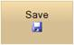

::: {style="DISPLAY: none"}
{#d2h_url_template}{#d2h_package_url style="WIDTH: 0px; DISPLAY: none; HEIGHT: 0px"}
:::

::: {.d2h_secondary_topic style="PADDING-BOTTOM: 10pt; MARGIN: 0pt; PADDING-LEFT: 0pt; PADDING-RIGHT: 0pt; PADDING-TOP: 0pt"}
#### Behaviors {#behaviors style="tab-stops: 0pt"}

The Toggle-Button supports various behaviors such as content type and image positioning.

**ContentType** - The text and the image of a button can be customized using the **ContentType** property (TextOnly, ImageOnly, TextAndImage).

**ImagePosition** - The image of a button can be customized using the **ImagePosition** property (Left, Right, Top, and Bottom).

 

Use Case Scenarios

It allows for easy customization of the content to be displayed on the Toggle-Button.

 

Adding Behavior[ ]{style="COLOR: red"}to an Application

 

The following steps guides you in defining the behavior of the Toggle-Button control.

Behaviors can be customized through two ways in Toggle-Button.

[·      ]{style="FONT-FAMILY: Symbol"}Using Builder

[·      ]{style="FONT-FAMILY: Symbol"}Using Properties Model

 

Using Builder

 

1.   In View, invoke the ToggleButton helper with the button id as the first argument followed by the button **Text** and **ImageUrl** and **ContentType** methods.

[]{style="FONT-FAMILY: 'Myriad Pro','sans-serif'"} 

+--------------------------------------------------------------------------------------------------------------------------------------------------------------------------------+
| **[View\[aspx\]]{style="FONT-FAMILY: 'Courier New'"}**                                                                                                                         |
|                                                                                                                                                                                |
| [        [\<%]{style="BACKGROUND: yellow"}[=]{style="COLOR: blue"}Html.Syncfusion().ToggleButton([\"btnToggle\"]{style="COLOR: #a31515"})]{style="FONT-FAMILY: 'Courier New'"} |
|                                                                                                                                                                                |
| [            .Text([\"Save\"]{style="COLOR: #a31515"})]{style="FONT-FAMILY: 'Courier New'"}                                                                                    |
|                                                                                                                                                                                |
| [            .IsChecked([true]{style="COLOR: blue"})]{style="FONT-FAMILY: 'Courier New'"}                                                                                      |
|                                                                                                                                                                                |
| [            .ContentType([ContentTypes]{style="COLOR: #2b91af"}.TextAndImage)]{style="FONT-FAMILY: 'Courier New'"}                                                            |
|                                                                                                                                                                                |
| [            .ImageUrl([\"Content/icon_save.png\"]{style="COLOR: #a31515"})]{style="FONT-FAMILY: 'Courier New'"}                                                               |
|                                                                                                                                                                                |
| [            .ImagePosition([ImagePositions]{style="COLOR: #2b91af"}.Right)]{style="FONT-FAMILY: 'Courier New'"}                                                               |
|                                                                                                                                                                                |
| [        [%\>]{style="BACKGROUND: yellow"}]{style="FONT-FAMILY: 'Courier New'"}                                                                                                |
|                                                                                                                                                                                |
| []{style="FONT-FAMILY: 'Courier New'; BACKGROUND: yellow"}                                                                                                                     |
+--------------------------------------------------------------------------------------------------------------------------------------------------------------------------------+

[]{style="FONT-FAMILY: 'Myriad Pro','sans-serif'"} 

[]{style="FONT-FAMILY: 'Myriad Pro','sans-serif'"} 

+--------------------------------------------------------------------------------------------------------------------------------------------------------------------------------+
| **[View\[cshtml\]]{style="FONT-FAMILY: 'Courier New'"}**                                                                                                                       |
|                                                                                                                                                                                |
| [        [\@{]{style="BACKGROUND: yellow"}[ ]{style="COLOR: blue"}Html.Syncfusion().ToggleButton([\"btnToggle\"]{style="COLOR: #a31515"})]{style="FONT-FAMILY: 'Courier New'"} |
|                                                                                                                                                                                |
| [            .Text([\"Save\"]{style="COLOR: #a31515"})]{style="FONT-FAMILY: 'Courier New'"}                                                                                    |
|                                                                                                                                                                                |
| [            .IsChecked([true]{style="COLOR: blue"})]{style="FONT-FAMILY: 'Courier New'"}                                                                                      |
|                                                                                                                                                                                |
| [            .ContentType([ContentTypes]{style="COLOR: #2b91af"}.TextAndImage)]{style="FONT-FAMILY: 'Courier New'"}                                                            |
|                                                                                                                                                                                |
| [            .ImageUrl([\"Content/icon_save.png\"]{style="COLOR: #a31515"})]{style="FONT-FAMILY: 'Courier New'"}                                                               |
|                                                                                                                                                                                |
| [            .ImagePosition([ImagePositions]{style="COLOR: #2b91af"}.Right)]{style="FONT-FAMILY: 'Courier New'"}                                                               |
|                                                                                                                                                                                |
| [            .Render();]{style="FONT-FAMILY: 'Courier New'"}                                                                                                                   |
|                                                                                                                                                                                |
| [        [}]{style="BACKGROUND: yellow"}]{style="FONT-FAMILY: 'Courier New'"}                                                                                                  |
|                                                                                                                                                                                |
| []{style="FONT-FAMILY: 'Courier New'; BACKGROUND: yellow"}                                                                                                                     |
+--------------------------------------------------------------------------------------------------------------------------------------------------------------------------------+

[]{style="FONT-FAMILY: 'Myriad Pro','sans-serif'"} 

[]{style="FONT-FAMILY: 'Myriad Pro','sans-serif'"} 

2.   Run the application.

 

The output is shown in the following screenshot.

 

{border="0"} {border="0"} {border="0"}

Figure 296: Toggle-Button with various ContentType

{border="0"} {border="0"}   {border="0"}   {border="0"}

Figure 297: Toggle-Button with various Image Position

Using Properties Model

 

1.   In Controller, create an object for the **ToggleButtonModel** class and set the **Text, ImageUrl**, **ContentType**, and **ImagePosition** properties. Assign this model class to view data.

 

+---------------------------------------------------------------------------------------------------------------------------------------------------------------------------------------------------------+
| **[\[Controller\]]{style="FONT-FAMILY: 'Courier New'"}**                                                                                                                                                |
|                                                                                                                                                                                                         |
| [        [public]{style="COLOR: blue"} [ActionResult]{style="COLOR: #2b91af"} Index()]{style="FONT-FAMILY: Consolas; FONT-SIZE: 9.5pt"}                                                                 |
|                                                                                                                                                                                                         |
| [        {]{style="FONT-FAMILY: Consolas; FONT-SIZE: 9.5pt"}                                                                                                                                            |
|                                                                                                                                                                                                         |
| [            [ToggleButtonModel]{style="COLOR: #2b91af"} toggleButtonModel = [new]{style="COLOR: blue"} [ToggleButtonModel]{style="COLOR: #2b91af"}()]{style="FONT-FAMILY: Consolas; FONT-SIZE: 9.5pt"} |
|                                                                                                                                                                                                         |
| [            {]{style="FONT-FAMILY: Consolas; FONT-SIZE: 9.5pt"}                                                                                                                                        |
|                                                                                                                                                                                                         |
| [                Text = [\"Save\"]{style="COLOR: #a31515"},]{style="FONT-FAMILY: Consolas; FONT-SIZE: 9.5pt"}                                                                                           |
|                                                                                                                                                                                                         |
| [                IsChecked = [true]{style="COLOR: blue"},]{style="FONT-FAMILY: Consolas; FONT-SIZE: 9.5pt"}                                                                                             |
|                                                                                                                                                                                                         |
| [                ImageUrl = [\"Content/icon_save.png\"]{style="COLOR: #a31515"},]{style="FONT-FAMILY: Consolas; FONT-SIZE: 9.5pt"}                                                                      |
|                                                                                                                                                                                                         |
| [                ContentType = [ContentTypes]{style="COLOR: #2b91af"}.TextAndImage,]{style="FONT-FAMILY: Consolas; FONT-SIZE: 9.5pt"}                                                                   |
|                                                                                                                                                                                                         |
| [                ImagePosition = [ImagePositions]{style="COLOR: #2b91af"}.Right]{style="FONT-FAMILY: Consolas; FONT-SIZE: 9.5pt"}                                                                       |
|                                                                                                                                                                                                         |
| [            };]{style="FONT-FAMILY: Consolas; FONT-SIZE: 9.5pt"}                                                                                                                                       |
|                                                                                                                                                                                                         |
| [            ViewData\[[\"ToggleButtonModel\"]{style="COLOR: #a31515"}\] = toggleButtonModel;]{style="FONT-FAMILY: Consolas; FONT-SIZE: 9.5pt"}                                                         |
|                                                                                                                                                                                                         |
| [        }]{style="FONT-FAMILY: Consolas; FONT-SIZE: 9.5pt"}                                                                                                                                            |
|                                                                                                                                                                                                         |
| []{style="FONT-FAMILY: 'Courier New'; BACKGROUND: yellow"}                                                                                                                                              |
+---------------------------------------------------------------------------------------------------------------------------------------------------------------------------------------------------------+

[]{style="FONT-FAMILY: 'Myriad Pro','sans-serif'"} 

2.   In View, invoke the ToggleButton helper with the button id as the first argument followed by the view data of the **ToggleButtonModel** class.

[]{style="FONT-FAMILY: 'Myriad Pro','sans-serif'"} 

+-----------------------------------------------------------------------------------------------------------------------------------------------------------------------------------------------------------------------------------------------------------------------------------------------------------------------------------------------------------------------------------------------------------------------------------------------------------------------------------------------------------+
| **[View\[aspx\]]{style="FONT-FAMILY: 'Courier New'"}**                                                                                                                                                                                                                                                                                                                                                                                                                                                    |
|                                                                                                                                                                                                                                                                                                                                                                                                                                                                                                           |
| [\<%]{style="FONT-FAMILY: Consolas; BACKGROUND: yellow; FONT-SIZE: 9.5pt"}[=]{style="FONT-FAMILY: Consolas; COLOR: blue; FONT-SIZE: 9.5pt"}[Html]{style="FONT-FAMILY: Consolas; FONT-SIZE: 9.5pt"}[.Syncfusion()]{style="FONT-FAMILY: 'Courier New'"}[.ToggleButton([\"btnToggle\"]{style="COLOR: #a31515"},([ToggleButtonModel]{style="COLOR: #2b91af"})ViewData\[[\"ToggleButtonModel\"]{style="COLOR: #a31515"}\]) [%\>]{style="BACKGROUND: yellow"}]{style="FONT-FAMILY: Consolas; FONT-SIZE: 9.5pt"} |
|                                                                                                                                                                                                                                                                                                                                                                                                                                                                                                           |
| []{style="FONT-FAMILY: 'Courier New'; BACKGROUND: yellow"}                                                                                                                                                                                                                                                                                                                                                                                                                                                |
+-----------------------------------------------------------------------------------------------------------------------------------------------------------------------------------------------------------------------------------------------------------------------------------------------------------------------------------------------------------------------------------------------------------------------------------------------------------------------------------------------------------+

[]{style="FONT-FAMILY: 'Myriad Pro','sans-serif'"} 

+------------------------------------------------------------------------------------------------------------------------------------------------------------------------------------------------------------------------------------------------------------------------------------------------------------------------------------------------------------------------------------------------------------------------------------------------------------------------------------------------------------------+
| **[View\[cshtml\]]{style="FONT-FAMILY: 'Courier New'"}**                                                                                                                                                                                                                                                                                                                                                                                                                                                         |
|                                                                                                                                                                                                                                                                                                                                                                                                                                                                                                                  |
| [\@{]{style="FONT-FAMILY: Consolas; BACKGROUND: yellow; FONT-SIZE: 9.5pt"}[ ]{style="FONT-FAMILY: Consolas; COLOR: blue; FONT-SIZE: 9.5pt"}[Html]{style="FONT-FAMILY: Consolas; FONT-SIZE: 9.5pt"}[.Syncfusion()]{style="FONT-FAMILY: 'Courier New'"}[.ToggleButton([\"btnToggle\"]{style="COLOR: #a31515"},([ToggleButtonModel]{style="COLOR: #2b91af"})ViewData\[[\"ToggleButtonModel\"]{style="COLOR: #a31515"}\]).Render();[}]{style="BACKGROUND: yellow"}]{style="FONT-FAMILY: Consolas; FONT-SIZE: 9.5pt"} |
|                                                                                                                                                                                                                                                                                                                                                                                                                                                                                                                  |
| []{style="FONT-FAMILY: 'Courier New'; BACKGROUND: yellow"}                                                                                                                                                                                                                                                                                                                                                                                                                                                       |
+------------------------------------------------------------------------------------------------------------------------------------------------------------------------------------------------------------------------------------------------------------------------------------------------------------------------------------------------------------------------------------------------------------------------------------------------------------------------------------------------------------------+

[]{style="FONT-FAMILY: 'Myriad Pro','sans-serif'"} 

[]{style="FONT-FAMILY: 'Myriad Pro','sans-serif'"} 

3.   Run the application.

 

The output is shown in the following screenshot.

 

{border="0"} {border="0"} {border="0"}

Figure 298: Toggle-Button with various ContentType

{border="0"} {border="0"}   {border="0"}   {border="0"}

Figure 299: Toggle-Button with various Image Position

Properties

 

The following table illustrates the properties which describes the behaviors of the Toggle-Button.

Table 7: Property Table

+---------------+-----------------------------------------------------------------------+----------------------+----------------+---------------------------+-------------+
| Name          | Description                                                           | Type of the property | Data Type      | Value it accepts          | Dependency  |
+---------------+-----------------------------------------------------------------------+----------------------+----------------+---------------------------+-------------+
| ContentType   | Specifies the field that provides the content of the button.          | Server side          | ContentTypes   | ContentTypes.TextOnly     | NA          |
|               |                                                                       |                      |                |                           |             |
|               |                                                                       |                      |                | ContentTypes.ImageOnly    |             |
|               |                                                                       |                      |                |                           |             |
|               |                                                                       |                      |                | ContentTypes.TextAndImage |             |
+---------------+-----------------------------------------------------------------------+----------------------+----------------+---------------------------+-------------+
| ImagePosition | Specifies the field that provides the position of the button's image. | Server side          | ImagePositions | ImagePositions.Left       | ContentType |
|               |                                                                       |                      |                |                           |             |
|               |                                                                       |                      |                | ImagePositions.Right      |             |
|               |                                                                       |                      |                |                           |             |
|               |                                                                       |                      |                | ImagePositions.Top        |             |
|               |                                                                       |                      |                |                           |             |
|               |                                                                       |                      |                | ImagePositions.Bottom     |             |
+---------------+-----------------------------------------------------------------------+----------------------+----------------+---------------------------+-------------+

[]{style="COLOR: black"} 

Sample Link

To view the samples, follow the steps below.

1.   Open the **Tools** sample browser from the dashboard. (Refer to the Samples and Location chapter)

2.   Navigate to **Tools.Mvc -\> Button -\> Core Features Demo**.

 

[]{#related-topics}
:::
