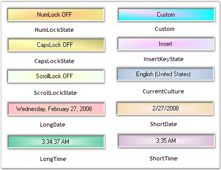

::: {style="DISPLAY: none"}
{#d2h_url_template}{#d2h_package_url style="WIDTH: 0px; DISPLAY: none; HEIGHT: 0px"}
:::

:::::: {.d2h_secondary_topic style="PADDING-BOTTOM: 10pt; MARGIN: 0pt; PADDING-LEFT: 0pt; PADDING-RIGHT: 0pt; PADDING-TOP: 0pt"}
##### Behavior Settings {#behavior-settings style="MARGIN-LEFT: 18pt; tab-stops: 18.0pt"}

[]{style="FONT-SIZE: 8pt"} 

Panel Types

[]{style="COLOR: #15428b"} 

 The format of the data in the panel can be set using the property given below.

[]{style="COLOR: #15428b"} 

::: {align="center"}
  ---------------------------- ----------------------------------
  StatusBarAdvPanel Property   Description
  PanelType                    Indicates the type of the panel.
  ---------------------------- ----------------------------------
:::

[]{style="COLOR: #15428b"} 

The PanelType property can be used to display predefined text representing key states, date / time or culture information.

[]{style="COLOR: #15428b"} 

::: {style="BORDER-BOTTOM: windowtext 1pt solid; BORDER-LEFT: medium none; PADDING-BOTTOM: 1pt; MARGIN: 9pt 0pt 9pt 18pt; PADDING-LEFT: 0pt; PADDING-RIGHT: 0pt; BORDER-TOP: windowtext 1pt solid; BORDER-RIGHT: medium none; PADDING-TOP: 1pt"}
{border="0"} Note: Users can also specify their own text to be displayed in the control by setting the PanelType property to \'Custom\'. The text to be displayed is set using the Text property of the StatusBarAdvPanel.
:::

[]{style="COLOR: #15428b"} 

+------------------------------------------------------------------------------------------------------------------------------------------------------------------------------------------------------------------------+
| **[\[C#\]]{style="FONT-FAMILY: 'Courier New'; COLOR: black"}**                                                                                                                                                         |
|                                                                                                                                                                                                                        |
| []{style="FONT-FAMILY: 'Courier New'; COLOR: black"}                                                                                                                                                                   |
|                                                                                                                                                                                                                        |
| [this]{style="FONT-FAMILY: 'Courier New'; COLOR: blue"}[.statusBarAdvPanel1.PanelType = Syncfusion.Windows.Forms.Tools.[StatusBarAdvPanelType]{style="COLOR: teal"}.NumLockState;]{style="FONT-FAMILY: 'Courier New'"} |
+------------------------------------------------------------------------------------------------------------------------------------------------------------------------------------------------------------------------+

[]{style="COLOR: #15428b"} 

+----------------------------------------------------------------------------------------------------------------------------------------------------------------------------------------------+
| **[\[VB.NET\]]{style="FONT-FAMILY: 'Courier New'; COLOR: black"}**                                                                                                                           |
|                                                                                                                                                                                              |
| []{style="FONT-FAMILY: 'Courier New'; COLOR: black"}                                                                                                                                         |
|                                                                                                                                                                                              |
| [Me]{style="FONT-FAMILY: 'Courier New'; COLOR: blue"}[.statusBarAdvPanel1.PanelType = Syncfusion.Windows.Forms.Tools.StatusBarAdvPanelType.NumLockState]{style="FONT-FAMILY: 'Courier New'"} |
+----------------------------------------------------------------------------------------------------------------------------------------------------------------------------------------------+

[]{style="FONT-SIZE: 8pt"} 

{border="0"}

[]{style="COLOR: #15428b"} 

Figure 1024: Panel Types

[]{style="COLOR: #15428b"} 

Panel Size

[]{style="COLOR: #15428b"} 

The StatusBarAdvPanel can be automatically resized using the property given below.

[]{style="COLOR: #15428b"} 

::: {align="center"}
  ---------------------------- ----------------------------------------------------------------------------------------------------
  StatusBarAdvPanel Property   Description
  SizeToContent                Indicates if the size of the panel will be automatically calculated by the size of it\'s contents.
  PreferredSize                Gets / sets the preferred size of the panel in the FlowLayout.
  ---------------------------- ----------------------------------------------------------------------------------------------------
:::

[]{style="COLOR: #15428b"} 

+-----------------------------------------------------------------------------------------------------------------------------------------------------------------------------------------------------------------+
| **[\[C#\]]{style="FONT-FAMILY: 'Courier New'; COLOR: black"}**                                                                                                                                                  |
|                                                                                                                                                                                                                 |
| []{style="FONT-FAMILY: 'Courier New'; COLOR: black"}                                                                                                                                                            |
|                                                                                                                                                                                                                 |
| [this]{style="FONT-FAMILY: 'Courier New'; COLOR: blue"}[.statusBarAdvPanel1.SizeToContent = [true]{style="COLOR: blue"};]{style="FONT-FAMILY: 'Courier New'"}                                                   |
|                                                                                                                                                                                                                 |
| [this]{style="FONT-FAMILY: 'Courier New'; COLOR: blue"}[.statusBarAdvPanel1.PreferredSize = [new]{style="COLOR: blue"} System.Drawing.[Size]{style="COLOR: teal"}(99, 21);]{style="FONT-FAMILY: 'Courier New'"} |
+-----------------------------------------------------------------------------------------------------------------------------------------------------------------------------------------------------------------+

[]{style="COLOR: #15428b"} 

+---------------------------------------------------------------------------------------------------------------------------------------------------------------------------------------+
| **[\[VB.NET\]]{style="FONT-FAMILY: 'Courier New'; COLOR: black"}**                                                                                                                    |
|                                                                                                                                                                                       |
| []{style="FONT-FAMILY: 'Courier New'; COLOR: black"}                                                                                                                                  |
|                                                                                                                                                                                       |
| [Me]{style="FONT-FAMILY: 'Courier New'; COLOR: blue"}[.statusBarAdvPanel1.SizeToContent = [True]{style="COLOR: blue"}]{style="FONT-FAMILY: 'Courier New'"}                            |
|                                                                                                                                                                                       |
| [Me]{style="FONT-FAMILY: 'Courier New'; COLOR: blue"}[.statusBarAdvPanel1.PreferredSize = [New]{style="COLOR: blue"} System.Drawing.Size(99, 21)]{style="FONT-FAMILY: 'Courier New'"} |
+---------------------------------------------------------------------------------------------------------------------------------------------------------------------------------------+

[]{style="COLOR: #15428b"} 

A Sample which demonstrates the Panel Types of the StatusBarAdvPanel is available in the below sample installation path.

[]{style="COLOR: #15428b"} 

***..My Documents\\Syncfusion\\EssentialStudio\\Version Number\\Windows\\Tools.Windows\\Samples\\2.0\\Notification Package\\StatusBarAdvPanel***

 

 

 

 

[]{#related-topics}
::::::
