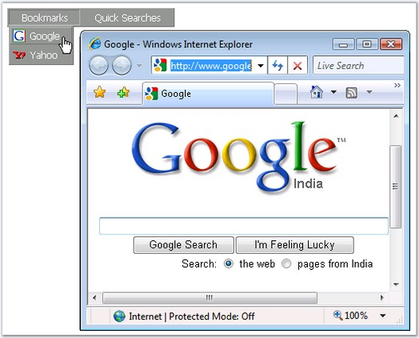
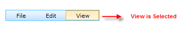
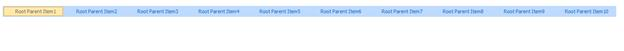

::: {style="DISPLAY: none"}
{#d2h_url_template}{#d2h_package_url style="WIDTH: 0px; DISPLAY: none; HEIGHT: 0px"}
:::

:::::::: {.d2h_secondary_topic style="PADDING-BOTTOM: 10pt; MARGIN: 0pt; PADDING-LEFT: 0pt; PADDING-RIGHT: 0pt; PADDING-TOP: 0pt"}
##### Behavior Settings {#behavior-settings style="tab-stops: 0pt"}

[]{style="FONT-FAMILY: 'Trebuchet MS','sans-serif'; COLOR: #15428b; FONT-SIZE: 9pt"} 

Navigation

[]{style="FONT-FAMILY: 'Trebuchet MS','sans-serif'; COLOR: #15428b; FONT-SIZE: 9pt"} 

Menu supports navigating to the given link on liking an item. This feature can be set by specifying the target link to the **NavigateUrl** property of an item, in the Designer dialog, which will be displayed on the click of that item.

[]{style="FONT-FAMILY: 'Trebuchet MS','sans-serif'; COLOR: #15428b; FONT-SIZE: 9pt"} 

{border="0"}

**[]{style="FONT-FAMILY: 'Trebuchet MS','sans-serif'; COLOR: #15428b; FONT-SIZE: 9pt"}** 

Figure 228: Menu with NavigateUrl (Target set to blank)

[]{style="FONT-FAMILY: 'Trebuchet MS','sans-serif'; COLOR: #15428b; FONT-SIZE: 9pt"} 

The **Target** property allows the user to set whether to open the links in the same window, or a new window, or in a different frame by setting the required option.

[]{style="FONT-FAMILY: 'Trebuchet MS','sans-serif'; COLOR: #15428b; FONT-SIZE: 9pt"} 

::: {align="center"}
+-----------------------------------+--------------------------------------------------------------------------------------------------------------------------+
| Property                          | Description                                                                                                              |
+-----------------------------------+--------------------------------------------------------------------------------------------------------------------------+
| NavigateUrl                       | URL to navigate to, when NavigateUrl method is called for an item.                                                       |
+-----------------------------------+--------------------------------------------------------------------------------------------------------------------------+
| Target                            | Specifies where the target of the url to be displayed. Default value is \'\_self\'. The options included are as follows: |
|                                   |                                                                                                                          |
|                                   |                                                                                                                          |
|                                   |                                                                                                                          |
|                                   | [·      ]{style="FONT-FAMILY: Symbol"}self                                                                               |
|                                   |                                                                                                                          |
|                                   | [·      ]{style="FONT-FAMILY: Symbol"}blank                                                                              |
|                                   |                                                                                                                          |
|                                   | [·      ]{style="FONT-FAMILY: Symbol"}Frame name                                                                         |
+-----------------------------------+--------------------------------------------------------------------------------------------------------------------------+
:::

[]{style="FONT-FAMILY: 'Trebuchet MS','sans-serif'; COLOR: #15428b; FONT-SIZE: 9pt"} 

Disabled state

[]{style="FONT-FAMILY: 'Trebuchet MS','sans-serif'; COLOR: #15428b; FONT-SIZE: 9pt"} 

The items can be set to the disabled state that denies any access to that item. This can be done by setting the **Disabled** property for the required items.

[]{style="FONT-FAMILY: 'Trebuchet MS','sans-serif'; COLOR: #15428b; FONT-SIZE: 9pt"} 

::: {align="center"}
  -------------------------- ------------------------------------------------------------------------------------------------------------------------------------------------
           Property          Description
  Disabled                   Gets/sets the boolean value, whether a menu item is functional. When set to true, it does not respond to user actions. Default value if false.
  -------------------------- ------------------------------------------------------------------------------------------------------------------------------------------------
:::

[]{style="FONT-FAMILY: 'Trebuchet MS','sans-serif'; COLOR: #15428b; FONT-SIZE: 9pt"} 

StatusBar and Text order Appearance

[]{style="FONT-FAMILY: 'Trebuchet MS','sans-serif'; COLOR: #15428b; FONT-SIZE: 9pt"} 

The menu items can displayed in the reverse order using the **RightToLeft** property.

 

Any text can be displayed on the browser window\'s status bar during callback by setting **StatusBarText** to the text to be displayed.

[]{style="FONT-FAMILY: 'Trebuchet MS','sans-serif'; COLOR: #15428b; FONT-SIZE: 9pt"} 

::: {align="center"}
  --------------- ----------------------------------------------------------------------------------------------------------------
  Property        Description
  RightToLeft     Gets/sets the boolean value, whether to change the menu reading order from right to left. Default value is No.
  StatusBarText   Specifies the text to be displayed on the status bar of the browser during callback.
  --------------- ----------------------------------------------------------------------------------------------------------------
:::

 

Selection Behavior

**[]{style="FONT-FAMILY: 'Trebuchet MS','sans-serif'; COLOR: #15428b"}** 

Selected State

The item can be set to the Selected state, which applies to the selected css class of the menu item. This can be done by setting the **Selected** property for the required item or by clicking the menu item and the item will be automatically selected.

**[]{style="FONT-FAMILY: 'Trebuchet MS','sans-serif'; COLOR: #15428b"}** 

Properties

Table 2: Property Table

::: {align="center"}
  ---------- ------------------------------------------- ------------- -----------
  Property   Description                                 Type          Data Type
  Selected   Specifies if the item is Selected or not.   Server side   Boolean
  ---------- ------------------------------------------- ------------- -----------
:::

[]{style="FONT-FAMILY: 'Calibri','sans-serif'"} 

{border="0"}

 Figure 229: Selected item

Selectable

[]{style="FONT-FAMILY: 'Trebuchet MS','sans-serif'; COLOR: #15428b; FONT-SIZE: 9pt"} 

The item can be set to Selectable state, which avoids selecting the menu item and also postback of the page. Client side functionalities will work when we set the Selectable to false but it avoids server side postback when clicking it.

 

Properties

 

::: {align="center"}
  ------------ --------------------------------------------- ------------- -----------
  Property     Description                                   Type          Data Type
  Selectable   Specifies if the item is Selectable or not.   Server side   Boolean
  ------------ --------------------------------------------- ------------- -----------
:::

[]{style="FONT-FAMILY: 'Calibri','sans-serif'"} 

Setting the Selection Settings

The following code snippets show how to set the selected and selectable property.

+--------------------------------------------------------------------------------------------------------------------------------------------------------------------------------------------------------------------------------------------------------------------------------------------------------------------------------------------------------------------------------------------------------------------------------------------------------------------------------------+
| [\[ASPX\]]{style="FONT-FAMILY: 'Courier New'; COLOR: blue"}                                                                                                                                                                                                                                                                                                                                                                                                                          |
|                                                                                                                                                                                                                                                                                                                                                                                                                                                                                      |
| [\<]{style="FONT-FAMILY: 'Courier New'; COLOR: blue"}[syncfusion]{style="FONT-FAMILY: 'Courier New'; COLOR: #a31515"}[:]{style="FONT-FAMILY: 'Courier New'; COLOR: blue"}[Menu]{style="FONT-FAMILY: 'Courier New'; COLOR: #a31515"}[ [ID]{style="COLOR: red"}[=\"Menu\"]{style="COLOR: blue"} [runat]{style="COLOR: red"}[=\"server\"]{style="COLOR: blue"}  [AutoFormat]{style="COLOR: red"}[=\"Office2007 Luna Blue\"\>]{style="COLOR: blue"}]{style="FONT-FAMILY: 'Courier New'"} |
|                                                                                                                                                                                                                                                                                                                                                                                                                                                                                      |
| [            [\<]{style="COLOR: blue"}[Items]{style="COLOR: #a31515"}[\>]{style="COLOR: blue"}]{style="FONT-FAMILY: 'Courier New'"}                                                                                                                                                                                                                                                                                                                                                  |
|                                                                                                                                                                                                                                                                                                                                                                                                                                                                                      |
| [                [\<]{style="COLOR: blue"}[syncfusion]{style="COLOR: #a31515"}[:]{style="COLOR: blue"}[MenuItem]{style="COLOR: #a31515"} [Text]{style="COLOR: red"}[=\"Root Parent Item1\"]{style="COLOR: blue"} [Selected]{style="COLOR: red"}[=\"true\"\>]{style="COLOR: blue"}]{style="FONT-FAMILY: 'Courier New'"}                                                                                                                                                               |
|                                                                                                                                                                                                                                                                                                                                                                                                                                                                                      |
| [               [\</]{style="COLOR: blue"}[syncfusion]{style="COLOR: #a31515"}[:]{style="COLOR: blue"}[MenuItem]{style="COLOR: #a31515"}[\>]{style="COLOR: blue"}]{style="FONT-FAMILY: 'Courier New'"}                                                                                                                                                                                                                                                                               |
|                                                                                                                                                                                                                                                                                                                                                                                                                                                                                      |
| [                [\<]{style="COLOR: blue"}[syncfusion]{style="COLOR: #a31515"}[:]{style="COLOR: blue"}[MenuItem]{style="COLOR: #a31515"} [Text]{style="COLOR: red"}[=\"Root Parent Item2\"]{style="COLOR: blue"} [Selectable]{style="COLOR: red"}[=\"false\"\>]{style="COLOR: blue"}]{style="FONT-FAMILY: 'Courier New'"}                                                                                                                                                            |
|                                                                                                                                                                                                                                                                                                                                                                                                                                                                                      |
| [                [\</]{style="COLOR: blue"}[syncfusion]{style="COLOR: #a31515"}[:]{style="COLOR: blue"}[MenuItem]{style="COLOR: #a31515"}[\>]{style="COLOR: blue"}]{style="FONT-FAMILY: 'Courier New'"}                                                                                                                                                                                                                                                                              |
|                                                                                                                                                                                                                                                                                                                                                                                                                                                                                      |
| [                [\<]{style="COLOR: blue"}[syncfusion]{style="COLOR: #a31515"}[:]{style="COLOR: blue"}[MenuItem]{style="COLOR: #a31515"} [Text]{style="COLOR: red"}[=\"Root Parent Item3\"\>]{style="COLOR: blue"}]{style="FONT-FAMILY: 'Courier New'"}                                                                                                                                                                                                                              |
|                                                                                                                                                                                                                                                                                                                                                                                                                                                                                      |
| [                [\</]{style="COLOR: blue"}[syncfusion]{style="COLOR: #a31515"}[:]{style="COLOR: blue"}[MenuItem]{style="COLOR: #a31515"}[\>]{style="COLOR: blue"}]{style="FONT-FAMILY: 'Courier New'"}                                                                                                                                                                                                                                                                              |
|                                                                                                                                                                                                                                                                                                                                                                                                                                                                                      |
| [                [\<]{style="COLOR: blue"}[syncfusion]{style="COLOR: #a31515"}[:]{style="COLOR: blue"}[MenuItem]{style="COLOR: #a31515"} [Text]{style="COLOR: red"}[=\"Root Parent Item4\"]{style="COLOR: blue"} [Selectable]{style="COLOR: red"}[=\"false\"\>]{style="COLOR: blue"}]{style="FONT-FAMILY: 'Courier New'"}                                                                                                                                                            |
|                                                                                                                                                                                                                                                                                                                                                                                                                                                                                      |
| [                [\</]{style="COLOR: blue"}[syncfusion]{style="COLOR: #a31515"}[:]{style="COLOR: blue"}[MenuItem]{style="COLOR: #a31515"}[\>]{style="COLOR: blue"}]{style="FONT-FAMILY: 'Courier New'"}                                                                                                                                                                                                                                                                              |
|                                                                                                                                                                                                                                                                                                                                                                                                                                                                                      |
| [                [\<]{style="COLOR: blue"}[syncfusion]{style="COLOR: #a31515"}[:]{style="COLOR: blue"}[MenuItem]{style="COLOR: #a31515"} [Text]{style="COLOR: red"}[=\"Root Parent Item5\"\>]{style="COLOR: blue"}]{style="FONT-FAMILY: 'Courier New'"}                                                                                                                                                                                                                              |
|                                                                                                                                                                                                                                                                                                                                                                                                                                                                                      |
| [                [\</]{style="COLOR: blue"}[syncfusion]{style="COLOR: #a31515"}[:]{style="COLOR: blue"}[MenuItem]{style="COLOR: #a31515"}[\>]{style="COLOR: blue"}]{style="FONT-FAMILY: 'Courier New'"}                                                                                                                                                                                                                                                                              |
|                                                                                                                                                                                                                                                                                                                                                                                                                                                                                      |
| [                [\<]{style="COLOR: blue"}[syncfusion]{style="COLOR: #a31515"}[:]{style="COLOR: blue"}[MenuItem]{style="COLOR: #a31515"} [Text]{style="COLOR: red"}[=\"Root Parent Item6\"\>]{style="COLOR: blue"}]{style="FONT-FAMILY: 'Courier New'"}                                                                                                                                                                                                                              |
|                                                                                                                                                                                                                                                                                                                                                                                                                                                                                      |
| [                [\</]{style="COLOR: blue"}[syncfusion]{style="COLOR: #a31515"}[:]{style="COLOR: blue"}[MenuItem]{style="COLOR: #a31515"}[\>]{style="COLOR: blue"}]{style="FONT-FAMILY: 'Courier New'"}                                                                                                                                                                                                                                                                              |
|                                                                                                                                                                                                                                                                                                                                                                                                                                                                                      |
| [                [\<]{style="COLOR: blue"}[syncfusion]{style="COLOR: #a31515"}[:]{style="COLOR: blue"}[MenuItem]{style="COLOR: #a31515"} [Text]{style="COLOR: red"}[=\"Root Parent Item7\"\>]{style="COLOR: blue"}]{style="FONT-FAMILY: 'Courier New'"}                                                                                                                                                                                                                              |
|                                                                                                                                                                                                                                                                                                                                                                                                                                                                                      |
| [                [\</]{style="COLOR: blue"}[syncfusion]{style="COLOR: #a31515"}[:]{style="COLOR: blue"}[MenuItem]{style="COLOR: #a31515"}[\>]{style="COLOR: blue"}]{style="FONT-FAMILY: 'Courier New'"}                                                                                                                                                                                                                                                                              |
|                                                                                                                                                                                                                                                                                                                                                                                                                                                                                      |
| [                [\<]{style="COLOR: blue"}[syncfusion]{style="COLOR: #a31515"}[:]{style="COLOR: blue"}[MenuItem]{style="COLOR: #a31515"} [Text]{style="COLOR: red"}[=\"Root Parent Item8\"\>]{style="COLOR: blue"}]{style="FONT-FAMILY: 'Courier New'"}                                                                                                                                                                                                                              |
|                                                                                                                                                                                                                                                                                                                                                                                                                                                                                      |
| [                [\</]{style="COLOR: blue"}[syncfusion]{style="COLOR: #a31515"}[:]{style="COLOR: blue"}[MenuItem]{style="COLOR: #a31515"}[\>]{style="COLOR: blue"}]{style="FONT-FAMILY: 'Courier New'"}                                                                                                                                                                                                                                                                              |
|                                                                                                                                                                                                                                                                                                                                                                                                                                                                                      |
| [                [\<]{style="COLOR: blue"}[syncfusion]{style="COLOR: #a31515"}[:]{style="COLOR: blue"}[MenuItem]{style="COLOR: #a31515"} [Text]{style="COLOR: red"}[=\"Root Parent Item9\"\>]{style="COLOR: blue"}]{style="FONT-FAMILY: 'Courier New'"}                                                                                                                                                                                                                              |
|                                                                                                                                                                                                                                                                                                                                                                                                                                                                                      |
| [                [\</]{style="COLOR: blue"}[syncfusion]{style="COLOR: #a31515"}[:]{style="COLOR: blue"}[MenuItem]{style="COLOR: #a31515"}[\>]{style="COLOR: blue"}]{style="FONT-FAMILY: 'Courier New'"}                                                                                                                                                                                                                                                                              |
|                                                                                                                                                                                                                                                                                                                                                                                                                                                                                      |
| [                [\<]{style="COLOR: blue"}[syncfusion]{style="COLOR: #a31515"}[:]{style="COLOR: blue"}[MenuItem]{style="COLOR: #a31515"} [Text]{style="COLOR: red"}[=\"Root Parent Item10\"\>]{style="COLOR: blue"}]{style="FONT-FAMILY: 'Courier New'"}                                                                                                                                                                                                                             |
|                                                                                                                                                                                                                                                                                                                                                                                                                                                                                      |
| [                [\</]{style="COLOR: blue"}[syncfusion]{style="COLOR: #a31515"}[:]{style="COLOR: blue"}[MenuItem]{style="COLOR: #a31515"}[\>]{style="COLOR: blue"}]{style="FONT-FAMILY: 'Courier New'"}                                                                                                                                                                                                                                                                              |
|                                                                                                                                                                                                                                                                                                                                                                                                                                                                                      |
| [                [\<]{style="COLOR: blue"}[syncfusion]{style="COLOR: #a31515"}[:]{style="COLOR: blue"}[MenuItem]{style="COLOR: #a31515"} [Text]{style="COLOR: red"}[=\"Root Parent Item11\"\>]{style="COLOR: blue"}]{style="FONT-FAMILY: 'Courier New'"}                                                                                                                                                                                                                             |
|                                                                                                                                                                                                                                                                                                                                                                                                                                                                                      |
| [                [\</]{style="COLOR: blue"}[syncfusion]{style="COLOR: #a31515"}[:]{style="COLOR: blue"}[MenuItem]{style="COLOR: #a31515"}[\>]{style="COLOR: blue"}]{style="FONT-FAMILY: 'Courier New'"}                                                                                                                                                                                                                                                                              |
|                                                                                                                                                                                                                                                                                                                                                                                                                                                                                      |
| [                [\<]{style="COLOR: blue"}[syncfusion]{style="COLOR: #a31515"}[:]{style="COLOR: blue"}[MenuItem]{style="COLOR: #a31515"} [Text]{style="COLOR: red"}[=\"Root Parent Item12\"\>]{style="COLOR: blue"}]{style="FONT-FAMILY: 'Courier New'"}                                                                                                                                                                                                                             |
|                                                                                                                                                                                                                                                                                                                                                                                                                                                                                      |
| [                [\</]{style="COLOR: blue"}[syncfusion]{style="COLOR: #a31515"}[:]{style="COLOR: blue"}[MenuItem]{style="COLOR: #a31515"}[\>]{style="COLOR: blue"}]{style="FONT-FAMILY: 'Courier New'"}                                                                                                                                                                                                                                                                              |
|                                                                                                                                                                                                                                                                                                                                                                                                                                                                                      |
| [                [\<]{style="COLOR: blue"}[syncfusion]{style="COLOR: #a31515"}[:]{style="COLOR: blue"}[MenuItem]{style="COLOR: #a31515"} [Text]{style="COLOR: red"}[=\"Root Parent Item13\"\>]{style="COLOR: blue"}]{style="FONT-FAMILY: 'Courier New'"}                                                                                                                                                                                                                             |
|                                                                                                                                                                                                                                                                                                                                                                                                                                                                                      |
| [                [\</]{style="COLOR: blue"}[syncfusion]{style="COLOR: #a31515"}[:]{style="COLOR: blue"}[MenuItem]{style="COLOR: #a31515"}[\>]{style="COLOR: blue"}]{style="FONT-FAMILY: 'Courier New'"}                                                                                                                                                                                                                                                                              |
|                                                                                                                                                                                                                                                                                                                                                                                                                                                                                      |
| [            [\</]{style="COLOR: blue"}[Items]{style="COLOR: #a31515"}[\>]{style="COLOR: blue"}]{style="FONT-FAMILY: 'Courier New'"}                                                                                                                                                                                                                                                                                                                                                 |
|                                                                                                                                                                                                                                                                                                                                                                                                                                                                                      |
| [        [\</]{style="COLOR: blue"}[syncfusion]{style="COLOR: #a31515"}[:]{style="COLOR: blue"}[Menu]{style="COLOR: #a31515"}[\>]{style="COLOR: blue"}]{style="FONT-FAMILY: 'Courier New'"}                                                                                                                                                                                                                                                                                          |
+--------------------------------------------------------------------------------------------------------------------------------------------------------------------------------------------------------------------------------------------------------------------------------------------------------------------------------------------------------------------------------------------------------------------------------------------------------------------------------------+

 

+------------------------------------------------------------------------------------------------------------------------------------------------------------------------------------------------+
| [\[C#\]]{style="FONT-FAMILY: 'Courier New'; COLOR: blue"}                                                                                                                                      |
|                                                                                                                                                                                                |
| []{style="FONT-FAMILY: 'Courier New'"}                                                                                                                                                         |
|                                                                                                                                                                                                |
| [     [protected]{style="COLOR: blue"} [void]{style="COLOR: blue"} Page_Load([object]{style="COLOR: blue"} sender, [EventArgs]{style="COLOR: #2b91af"} e)]{style="FONT-FAMILY: 'Courier New'"} |
|                                                                                                                                                                                                |
| [    {]{style="FONT-FAMILY: 'Courier New'"}                                                                                                                                                    |
|                                                                                                                                                                                                |
| [        [//Changing the Selected property to true. Which applies the Selected css. ]{style="COLOR: green"}]{style="FONT-FAMILY: 'Courier New'"}                                               |
|                                                                                                                                                                                                |
| [        [this]{style="COLOR: blue"}.Menu1.Items\[0\].Selected = [true]{style="COLOR: blue"};]{style="FONT-FAMILY: 'Courier New'"}                                                             |
|                                                                                                                                                                                                |
| []{style="FONT-FAMILY: 'Courier New'"}                                                                                                                                                         |
|                                                                                                                                                                                                |
| [        [//Changing the Selectable property to false which avoids postback. ]{style="COLOR: green"}]{style="FONT-FAMILY: 'Courier New'"}                                                      |
|                                                                                                                                                                                                |
| [        [this]{style="COLOR: blue"}.Menu1.Items\[3\].Selectable = [false]{style="COLOR: blue"};]{style="FONT-FAMILY: 'Courier New'"}                                                          |
|                                                                                                                                                                                                |
| [        [this]{style="COLOR: blue"}.Menu1.Items\[2\].Items\[0\].Selectable = [false]{style="COLOR: blue"};]{style="FONT-FAMILY: 'Courier New'"}                                               |
|                                                                                                                                                                                                |
| [    }]{style="FONT-FAMILY: 'Courier New'"}                                                                                                                                                    |
+------------------------------------------------------------------------------------------------------------------------------------------------------------------------------------------------+

 

+------------------------------------------------------------------------------------------------------------------------+
| [\[VB\]]{style="FONT-FAMILY: 'Courier New'; COLOR: blue"}                                                              |
|                                                                                                                        |
| []{style="FONT-FAMILY: 'Courier New'"}                                                                                 |
|                                                                                                                        |
| [  Protected Sub Page_Load(sender As Object, e As EventArgs)]{style="FONT-FAMILY: 'Courier New'"}                      |
|                                                                                                                        |
| [      \'Changing the Selected property to true. Which applies the Selected css. ]{style="FONT-FAMILY: 'Courier New'"} |
|                                                                                                                        |
| [      Me.Menu1.Items(0).Selected = True]{style="FONT-FAMILY: 'Courier New'"}                                          |
|                                                                                                                        |
| []{style="FONT-FAMILY: 'Courier New'"}                                                                                 |
|                                                                                                                        |
| [      \'Changing the Selectable property to false which avoids postback. ]{style="FONT-FAMILY: 'Courier New'"}        |
|                                                                                                                        |
| [      Me.Menu1.Items(3).Selectable = False]{style="FONT-FAMILY: 'Courier New'"}                                       |
|                                                                                                                        |
| [      Me.Menu1.Items(2).Items(0).Selectable = False]{style="FONT-FAMILY: 'Courier New'"}                              |
|                                                                                                                        |
| [End Sub]{style="FONT-FAMILY: 'Courier New'"}                                                                          |
+------------------------------------------------------------------------------------------------------------------------+

[]{style="FONT-FAMILY: 'Calibri','sans-serif'"} 

{border="0"}[]{style="FONT-FAMILY: 'Calibri','sans-serif'"}

 Figure 230: Selection behaviour

Use Case Scenarios

[]{style="FONT-FAMILY: 'Trebuchet MS','sans-serif'; COLOR: #15428b; FONT-SIZE: 9pt"} 

The "Selected" property of the Menu item helps the user to highlight a particular menu item for the end-user when it is selected and the "Selectable" state avoids reselecting the menu item and also postback of the page (explained in the above sections Selected State and Selectable).

**[]{style="FONT-FAMILY: 'Trebuchet MS','sans-serif'; COLOR: #15428b"}** 

Sample Link

[]{style="FONT-FAMILY: 'Trebuchet MS','sans-serif'; COLOR: #15428b; FONT-SIZE: 9pt"} 

To access a Selection behavior sample:

1.   Open the Syncfusion Dashboard.

74.  Click **User Interface**.

75.  Click the **ASP.NET** drop-down list, and select **Locally Installed Samples**. 

76.  Navigate to **MenuPackage- -\>Menu-Basic Features \-- \> Core Features samples**.

 

[]{#related-topics}
::::::::
