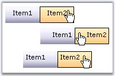

::: {style="DISPLAY: none"}
{#d2h_url_template}{#d2h_package_url style="WIDTH: 0px; DISPLAY: none; HEIGHT: 0px"}
:::

::::: {.d2h_secondary_topic style="PADDING-BOTTOM: 10pt; MARGIN: 0pt; PADDING-LEFT: 0pt; PADDING-RIGHT: 0pt; PADDING-TOP: 0pt"}
##### Behavior Settings {#behavior-settings style="tab-stops: 0pt"}

[]{style="FONT-FAMILY: 'Trebuchet MS','sans-serif'; COLOR: #15428b; FONT-SIZE: 9pt"} 

Control Layout and Item Alignment

[]{style="FONT-FAMILY: 'Trebuchet MS','sans-serif'; COLOR: #15428b; FONT-SIZE: 9pt"} 

The control can be aligned either horizontally or vertically by setting the **Layout** property.

[]{style="FONT-FAMILY: 'Trebuchet MS','sans-serif'; COLOR: #15428b; FONT-SIZE: 9pt"} 

{border="0"}

*[Figure ]{style="FONT-SIZE: 9pt"}[261]{style="FONT-SIZE: 9pt"}*

**[]{style="FONT-FAMILY: 'Trebuchet MS','sans-serif'; COLOR: #15428b; FONT-SIZE: 9pt"}** 

Table 3: Item Horizontal and Vertical position : Center / Middle, Right / Bottom and Left / Top

[]{style="FONT-FAMILY: 'Trebuchet MS','sans-serif'; COLOR: #15428b; FONT-SIZE: 9pt"} 

The items can be aligned accordingly by setting the **HorizontalAlign** and **VerticalAlign**.

 

These properties can be set for the control, enabling all the items to inherit the value, else can be set for individual items using the Toolbar Designer dialog.

[]{style="FONT-FAMILY: 'Trebuchet MS','sans-serif'; COLOR: #15428b; FONT-SIZE: 9pt"} 

::: {align="center"}
+-----------------------------------+---------------------------------------------------------------------------------------------+
| Property                          | Description                                                                                 |
+===================================+=============================================================================================+
| Layout                            | Specifies toolbar layout. Default value is Horizontal. The options included are as follows: |
|                                   |                                                                                             |
|                                   | [·      ]{style="FONT-FAMILY: Symbol"}Horizontal                                            |
|                                   |                                                                                             |
|                                   | [·      ]{style="FONT-FAMILY: Symbol"}Vertical                                              |
+-----------------------------------+---------------------------------------------------------------------------------------------+
| HorizontalAlign                   | Specifies the horizontal layout for toolbar item. The options included are as follows:      |
|                                   |                                                                                             |
|                                   | [·      ]{style="FONT-FAMILY: Symbol"}Left                                                  |
|                                   |                                                                                             |
|                                   | [·      ]{style="FONT-FAMILY: Symbol"}Center                                                |
|                                   |                                                                                             |
|                                   | [·      ]{style="FONT-FAMILY: Symbol"}Right                                                 |
+-----------------------------------+---------------------------------------------------------------------------------------------+
| VerticalAlign                     | Specifies the vertical layout for toolbar item. The options included are as follows:        |
|                                   |                                                                                             |
|                                   | [·      ]{style="FONT-FAMILY: Symbol"}Top                                                   |
|                                   |                                                                                             |
|                                   | [·      ]{style="FONT-FAMILY: Symbol"}Middle                                                |
|                                   |                                                                                             |
|                                   | [·      ]{style="FONT-FAMILY: Symbol"}Bottom                                                |
+-----------------------------------+---------------------------------------------------------------------------------------------+
:::

[]{style="FONT-FAMILY: 'Trebuchet MS','sans-serif'; COLOR: #15428b; FONT-SIZE: 9pt"} 

+------------------------------------------------------------------------------------------------------------------------------------------------------------------------------------+
| **[\[C#\]]{style="FONT-FAMILY: 'Courier New'; FONT-SIZE: 9pt"}**                                                                                                                   |
|                                                                                                                                                                                    |
| []{style="FONT-FAMILY: 'Courier New'; FONT-SIZE: 9pt"}                                                                                                                             |
|                                                                                                                                                                                    |
| [ToolBar1.Layout = [Layout]{style="COLOR: teal"}.Vertical;]{style="FONT-FAMILY: 'Courier New'; FONT-SIZE: 9pt"}                                                                    |
|                                                                                                                                                                                    |
| [ToolBar1.HorizontalAlign = Syncfusion.Web.UI.WebControls.Tools.ToolBarControl.[HorizontalAlign]{style="COLOR: teal"}.Center;]{style="FONT-FAMILY: 'Courier New'; FONT-SIZE: 9pt"} |
|                                                                                                                                                                                    |
| [ToolBar1.VerticalAlign = Syncfusion.Web.UI.WebControls.Tools.ToolBarControl.[VerticalAlign]{style="COLOR: teal"}.Middle;]{style="FONT-FAMILY: 'Courier New'; FONT-SIZE: 9pt"}     |
+------------------------------------------------------------------------------------------------------------------------------------------------------------------------------------+

[]{style="FONT-FAMILY: 'Trebuchet MS','sans-serif'; COLOR: #15428b; FONT-SIZE: 9pt"} 

+---------------------------------------------------------------------------------------------------------------------------------------------------------------------------------------------------------------------------------------+
| **[\[VB\]]{style="FONT-FAMILY: 'Courier New'; FONT-SIZE: 9pt"}**                                                                                                                                                                      |
|                                                                                                                                                                                                                                       |
| []{style="FONT-FAMILY: 'Courier New'; COLOR: blue; FONT-SIZE: 9pt"}                                                                                                                                                                   |
|                                                                                                                                                                                                                                       |
| [Private]{style="FONT-FAMILY: 'Courier New'; COLOR: blue; FONT-SIZE: 9pt"}[ ToolBar1.Layout = Layout.Vertical]{style="FONT-FAMILY: 'Courier New'; FONT-SIZE: 9pt"}                                                                    |
|                                                                                                                                                                                                                                       |
| [Private]{style="FONT-FAMILY: 'Courier New'; COLOR: blue; FONT-SIZE: 9pt"}[ ToolBar1.HorizontalAlign = Syncfusion.Web.UI.WebControls.Tools.ToolBarControl.HorizontalAlign.Center]{style="FONT-FAMILY: 'Courier New'; FONT-SIZE: 9pt"} |
|                                                                                                                                                                                                                                       |
| [Private]{style="FONT-FAMILY: 'Courier New'; COLOR: blue; FONT-SIZE: 9pt"}[ ToolBar1.VerticalAlign = Syncfusion.Web.UI.WebControls.Tools.ToolBarControl.VerticalAlign.Middle]{style="FONT-FAMILY: 'Courier New'; FONT-SIZE: 9pt"}     |
+---------------------------------------------------------------------------------------------------------------------------------------------------------------------------------------------------------------------------------------+

[]{style="FONT-FAMILY: 'Trebuchet MS','sans-serif'; COLOR: #15428b; FONT-SIZE: 9pt"} 

Changing control Layout using methods

[]{style="FONT-FAMILY: 'Trebuchet MS','sans-serif'; COLOR: #15428b; FONT-SIZE: 9pt"} 

The layout of the control can be aligned horizontally or vertically by calling the **SetHorizontalLayout** method and passing the appropriate parameter as required.

[]{style="FONT-FAMILY: 'Trebuchet MS','sans-serif'; COLOR: #15428b; FONT-SIZE: 9pt"} 

::: {align="center"}
  --------------------- ----------- ------------------------------------------------------
  Method                Parameter   Description
  SetHorizontalLayout   bool        Sets horizontal/vertical layout for ToolBar control.
  --------------------- ----------- ------------------------------------------------------
:::

[]{style="FONT-FAMILY: 'Trebuchet MS','sans-serif'; COLOR: #15428b; FONT-SIZE: 9pt"} 

Here, the toolbar is laid vertically by calling the SetHorizontalLayout method on button click.

[]{style="FONT-FAMILY: 'Trebuchet MS','sans-serif'; COLOR: #15428b; FONT-SIZE: 9pt"} 

+--------------------------------------------------------------------------------------------------------------------------------------------------------------------------------------------------------------------------------------------------------------------------------+
| **[\[script\]]{style="FONT-FAMILY: 'Courier New'; COLOR: black; FONT-SIZE: 9pt"}**                                                                                                                                                                                             |
|                                                                                                                                                                                                                                                                                |
| []{style="FONT-FAMILY: 'Courier New'; COLOR: maroon; FONT-SIZE: 9pt"}                                                                                                                                                                                                          |
|                                                                                                                                                                                                                                                                                |
| [\<]{style="FONT-FAMILY: 'Courier New'; COLOR: blue; FONT-SIZE: 9pt"}[script]{style="FONT-FAMILY: 'Courier New'; COLOR: maroon; FONT-SIZE: 9pt"}[ [type]{style="COLOR: red"}[=\"text/javascript\"\>]{style="COLOR: blue"}]{style="FONT-FAMILY: 'Courier New'; FONT-SIZE: 9pt"} |
|                                                                                                                                                                                                                                                                                |
| [    [function]{style="COLOR: blue"} GetData(obj)]{style="FONT-FAMILY: 'Courier New'; FONT-SIZE: 9pt"}                                                                                                                                                                         |
|                                                                                                                                                                                                                                                                                |
| [    {]{style="FONT-FAMILY: 'Courier New'; FONT-SIZE: 9pt"}                                                                                                                                                                                                                    |
|                                                                                                                                                                                                                                                                                |
| [       toolbar.SetHorizontalLayout([false]{style="COLOR: blue"});]{style="FONT-FAMILY: 'Courier New'; FONT-SIZE: 9pt"}                                                                                                                                                        |
|                                                                                                                                                                                                                                                                                |
| [    }]{style="FONT-FAMILY: 'Courier New'; FONT-SIZE: 9pt"}                                                                                                                                                                                                                    |
|                                                                                                                                                                                                                                                                                |
| [\</]{style="FONT-FAMILY: 'Courier New'; COLOR: blue; FONT-SIZE: 9pt"}[script]{style="FONT-FAMILY: 'Courier New'; COLOR: maroon; FONT-SIZE: 9pt"}[\>]{style="FONT-FAMILY: 'Courier New'; COLOR: blue; FONT-SIZE: 9pt"}                                                         |
+--------------------------------------------------------------------------------------------------------------------------------------------------------------------------------------------------------------------------------------------------------------------------------+

[]{style="FONT-FAMILY: 'Trebuchet MS','sans-serif'; COLOR: #15428b; FONT-SIZE: 9pt"} 

+----------------------------------------------------------------------------------------------------------------------------------------------------------------------------------------------------------------------------------------------------------------------------------------------------------------------------------------------------------------------------------------------------------------------------------------------------------------------------------------------------------------------------------------------------------+
| **[\[aspx\]]{style="FONT-FAMILY: 'Courier New'; COLOR: black; FONT-SIZE: 9pt"}**                                                                                                                                                                                                                                                                                                                                                                                                                                                                         |
|                                                                                                                                                                                                                                                                                                                                                                                                                                                                                                                                                          |
| []{style="FONT-FAMILY: 'Courier New'; COLOR: maroon; FONT-SIZE: 9pt"}                                                                                                                                                                                                                                                                                                                                                                                                                                                                                    |
|                                                                                                                                                                                                                                                                                                                                                                                                                                                                                                                                                          |
| [\<]{style="FONT-FAMILY: 'Courier New'; COLOR: blue; FONT-SIZE: 9pt"}[input]{style="FONT-FAMILY: 'Courier New'; COLOR: maroon; FONT-SIZE: 9pt"}[ [type]{style="COLOR: red"}[=\"button\"]{style="COLOR: blue"} [id]{style="COLOR: red"}[=\"inputClick\"]{style="COLOR: blue"} [onclick]{style="COLOR: red"}[=\"GetData(this)\"]{style="COLOR: blue"} [style]{style="COLOR: red"}[=\"width: 56px\"]{style="COLOR: blue"} [/\>]{style="COLOR: blue"}]{style="FONT-FAMILY: 'Courier New'; FONT-SIZE: 9pt"}                                                   |
|                                                                                                                                                                                                                                                                                                                                                                                                                                                                                                                                                          |
| [\<]{style="FONT-FAMILY: 'Courier New'; COLOR: blue; FONT-SIZE: 9pt"}[br]{style="FONT-FAMILY: 'Courier New'; COLOR: maroon; FONT-SIZE: 9pt"}[ [/\>]{style="COLOR: blue"}]{style="FONT-FAMILY: 'Courier New'; FONT-SIZE: 9pt"}                                                                                                                                                                                                                                                                                                                            |
|                                                                                                                                                                                                                                                                                                                                                                                                                                                                                                                                                          |
| [\<]{style="FONT-FAMILY: 'Courier New'; COLOR: blue; FONT-SIZE: 9pt"}[br]{style="FONT-FAMILY: 'Courier New'; COLOR: maroon; FONT-SIZE: 9pt"}[ [/\>]{style="COLOR: blue"}]{style="FONT-FAMILY: 'Courier New'; FONT-SIZE: 9pt"}                                                                                                                                                                                                                                                                                                                            |
|                                                                                                                                                                                                                                                                                                                                                                                                                                                                                                                                                          |
| [\<]{style="FONT-FAMILY: 'Courier New'; COLOR: blue; FONT-SIZE: 9pt"}[cc1]{style="FONT-FAMILY: 'Courier New'; COLOR: maroon; FONT-SIZE: 9pt"}[:]{style="FONT-FAMILY: 'Courier New'; COLOR: blue; FONT-SIZE: 9pt"}[ToolBar]{style="FONT-FAMILY: 'Courier New'; COLOR: maroon; FONT-SIZE: 9pt"}[ [ID]{style="COLOR: red"}[=\"ToolBar1\"]{style="COLOR: blue"} [runat]{style="COLOR: red"}[=\"server\"]{style="COLOR: blue"} [ClientObjectId]{style="COLOR: red"}[=\"toolbar\"\>]{style="COLOR: blue"}]{style="FONT-FAMILY: 'Courier New'; FONT-SIZE: 9pt"} |
|                                                                                                                                                                                                                                                                                                                                                                                                                                                                                                                                                          |
| [    \.....]{style="FONT-FAMILY: 'Courier New'; FONT-SIZE: 9pt"}                                                                                                                                                                                                                                                                                                                                                                                                                                                                                         |
|                                                                                                                                                                                                                                                                                                                                                                                                                                                                                                                                                          |
| [\</]{style="FONT-FAMILY: 'Courier New'; COLOR: blue; FONT-SIZE: 9pt"}[cc1]{style="FONT-FAMILY: 'Courier New'; COLOR: maroon; FONT-SIZE: 9pt"}[:]{style="FONT-FAMILY: 'Courier New'; COLOR: blue; FONT-SIZE: 9pt"}[ToolBar]{style="FONT-FAMILY: 'Courier New'; COLOR: maroon; FONT-SIZE: 9pt"}[\>]{style="FONT-FAMILY: 'Courier New'; COLOR: blue; FONT-SIZE: 9pt"}                                                                                                                                                                                      |
+----------------------------------------------------------------------------------------------------------------------------------------------------------------------------------------------------------------------------------------------------------------------------------------------------------------------------------------------------------------------------------------------------------------------------------------------------------------------------------------------------------------------------------------------------------+

 

[]{#related-topics}
:::::
