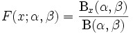

::: {style="DISPLAY: none"}
{#d2h_url_template}{#d2h_package_url style="WIDTH: 0px; DISPLAY: none; HEIGHT: 0px"}
:::

:::: {.d2h_secondary_topic style="PADDING-BOTTOM: 10pt; MARGIN: 0pt; PADDING-LEFT: 0pt; PADDING-RIGHT: 0pt; PADDING-TOP: 0pt"}
#### Beta Cumulative Distribution {#beta-cumulative-distribution style="tab-stops: 0pt"}

[]{style="FONT-FAMILY: 'Trebuchet MS','sans-serif'; FONT-SIZE: 9pt"} 

The **Beta Distribution** can be defined as a family of probability distributions differing in the values of [α ]{style="FONT-SIZE: 12pt"}[and]{style="FONT-SIZE: 8pt"}[ β]{style="FONT-SIZE: 12pt"}[. ]{style="FONT-SIZE: 8pt"}The **Cumulative distribution** function is given below.

[]{style="FONT-FAMILY: 'Trebuchet MS','sans-serif'; FONT-SIZE: 9pt"} 

[{border="0"}]{style="FONT-FAMILY: 'Trebuchet MS','sans-serif'; FONT-SIZE: 9pt"}[]{style="FONT-FAMILY: 'Trebuchet MS','sans-serif'; FONT-SIZE: 9pt"}

[]{style="FONT-FAMILY: 'Trebuchet MS','sans-serif'; FONT-SIZE: 9pt"} 

where Bx(a,ß) is the incomplete beta function and Ix(a,ß) is the regularized incomplete beta function.

[]{style="FONT-FAMILY: 'Trebuchet MS','sans-serif'; FONT-SIZE: 9pt"} 

Using the Formula

**[]{style="FONT-FAMILY: 'Trebuchet MS','sans-serif'"}** 

The **BetaCumulativeDistribution** method of the **UtilityFunctions** class returns the cumulative beta distribution for x\>=0, a \>0, b\>0.

[]{style="FONT-FAMILY: 'Trebuchet MS','sans-serif'; FONT-SIZE: 9pt"} 

::: {align="center"}
+----------------------------+--------------------------------------------------------------------+------------------------------------------------------------+
| Method Name                | Parameters                                                         | Return Value                                               |
+----------------------------+--------------------------------------------------------------------+------------------------------------------------------------+
| BetaCumulativeDistribution | 1.   a: The lower limit.                                           | A double that represents the cumulative beta distribution. |
|                            |                                                                    |                                                            |
|                            | 2.   b: The upper limit.                                           |                                                            |
|                            |                                                                    |                                                            |
|                            | 3.   x: the value for which the distribution has to be calculated. |                                                            |
+----------------------------+--------------------------------------------------------------------+------------------------------------------------------------+
:::

[]{style="FONT-FAMILY: 'Trebuchet MS','sans-serif'; FONT-SIZE: 9pt"} 

Example

[]{style="FONT-FAMILY: 'Trebuchet MS','sans-serif'; FONT-SIZE: 9pt"} 

Here is a code snippet that shows a sample usage.

[]{style="FONT-FAMILY: 'Trebuchet MS','sans-serif'; FONT-SIZE: 9pt"} 

+---------------------------------------------------------------------------------------------------------------------------------------------------------------------------------------------------------------------------------------------+
| **[\[C#\]]{style="FONT-FAMILY: 'Courier New'; COLOR: black"}**                                                                                                                                                                              |
|                                                                                                                                                                                                                                             |
| []{style="COLOR: black"}                                                                                                                                                                                                                    |
|                                                                                                                                                                                                                                             |
| [ChartSeries series = ]{style="FONT-FAMILY: 'Courier New'; COLOR: black"}[this]{style="FONT-FAMILY: 'Courier New'; COLOR: blue"}[.ChartWebControl1.Model.NewSeries(\"a=b=0.5\");]{style="FONT-FAMILY: 'Courier New'; COLOR: black"}         |
|                                                                                                                                                                                                                                             |
| [for]{style="FONT-FAMILY: 'Courier New'; COLOR: blue"}[(]{style="FONT-FAMILY: 'Courier New'; COLOR: black"}[double]{style="FONT-FAMILY: 'Courier New'; COLOR: blue"}[ i=0;i\<=1;i=i+0.1)]{style="FONT-FAMILY: 'Courier New'; COLOR: black"} |
|                                                                                                                                                                                                                                             |
| [{]{style="FONT-FAMILY: 'Courier New'; COLOR: black"}                                                                                                                                                                                       |
|                                                                                                                                                                                                                                             |
| [// Calculate Beta cumulative function for a points and plot the points in chart control.]{style="FONT-FAMILY: 'Courier New'; COLOR: green"}                                                                                                |
|                                                                                                                                                                                                                                             |
| [series.Points.Add(i,Syncfusion.Windows.Forms.Chart.Statistics.UtilityFunctions.BetaCumulativeDistribution(0.5,0.5,i));]{style="FONT-FAMILY: 'Courier New'; COLOR: black"}                                                                  |
|                                                                                                                                                                                                                                             |
| [}]{style="FONT-FAMILY: 'Courier New'; COLOR: black"}                                                                                                                                                                                       |
|                                                                                                                                                                                                                                             |
| [series.Type = ChartSeriesType.Spline;]{style="FONT-FAMILY: 'Courier New'; COLOR: black"}                                                                                                                                                   |
|                                                                                                                                                                                                                                             |
| [series.Tex = series.Name;]{style="FONT-FAMILY: 'Courier New'; COLOR: black"}                                                                                                                                                               |
|                                                                                                                                                                                                                                             |
| [this]{style="FONT-FAMILY: 'Courier New'; COLOR: blue"}[.ChartWebControl1.Series.Add(series);]{style="FONT-FAMILY: 'Courier New'; COLOR: black"}                                                                                            |
+---------------------------------------------------------------------------------------------------------------------------------------------------------------------------------------------------------------------------------------------+

[]{style="FONT-FAMILY: 'Trebuchet MS','sans-serif'; FONT-SIZE: 9pt"} 

+---------------------------------------------------------------------------------------------------------------------------------------------------------------------------------------------------------------------------------------------------------------------------------------------------------------------------------------------------------------------------------------------------------------------------------------------------------------+
| **[\[VB.NET\]]{style="FONT-FAMILY: 'Courier New'; COLOR: black"}**                                                                                                                                                                                                                                                                                                                                                                                            |
|                                                                                                                                                                                                                                                                                                                                                                                                                                                               |
| []{style="COLOR: black"}                                                                                                                                                                                                                                                                                                                                                                                                                                      |
|                                                                                                                                                                                                                                                                                                                                                                                                                                                               |
| [\'Calculate Beta cumulative function for a points and plot the points in chart control.]{style="FONT-FAMILY: 'Courier New'; COLOR: green"}                                                                                                                                                                                                                                                                                                                   |
|                                                                                                                                                                                                                                                                                                                                                                                                                                                               |
| [Dim]{style="FONT-FAMILY: 'Courier New'; COLOR: blue"}[ series ]{style="FONT-FAMILY: 'Courier New'; COLOR: black"}[As]{style="FONT-FAMILY: 'Courier New'; COLOR: blue"}[ ChartSeries = ]{style="FONT-FAMILY: 'Courier New'; COLOR: black"}[Me]{style="FONT-FAMILY: 'Courier New'; COLOR: blue"}[.ChartWebControl1.Model.NewSeries(\"a=b=0.5\")]{style="FONT-FAMILY: 'Courier New'; COLOR: black"}                                                             |
|                                                                                                                                                                                                                                                                                                                                                                                                                                                               |
| [For]{style="FONT-FAMILY: 'Courier New'; COLOR: blue"}[ i ]{style="FONT-FAMILY: 'Courier New'; COLOR: black"}[As Double]{style="FONT-FAMILY: 'Courier New'; COLOR: blue"}[ = 0 ]{style="FONT-FAMILY: 'Courier New'; COLOR: black"}[To]{style="FONT-FAMILY: 'Courier New'; COLOR: blue"}[ 1 ]{style="FONT-FAMILY: 'Courier New'; COLOR: black"}[Step]{style="FONT-FAMILY: 'Courier New'; COLOR: blue"}[ 0.1]{style="FONT-FAMILY: 'Courier New'; COLOR: black"} |
|                                                                                                                                                                                                                                                                                                                                                                                                                                                               |
| [series.Points.Add(i,Syncfusion.Windows.Forms.Chart.Statistics.UtilityFunctions.BetaCumulativeDistribution(0.5,0.5,i))]{style="FONT-FAMILY: 'Courier New'; COLOR: black"}                                                                                                                                                                                                                                                                                     |
|                                                                                                                                                                                                                                                                                                                                                                                                                                                               |
| [Next]{style="FONT-FAMILY: 'Courier New'; COLOR: blue"}[ i]{style="FONT-FAMILY: 'Courier New'; COLOR: black"}                                                                                                                                                                                                                                                                                                                                                 |
|                                                                                                                                                                                                                                                                                                                                                                                                                                                               |
| [series.Type = ChartSeriesType.Spline]{style="FONT-FAMILY: 'Courier New'; COLOR: black"}                                                                                                                                                                                                                                                                                                                                                                      |
|                                                                                                                                                                                                                                                                                                                                                                                                                                                               |
| [series.Text = series.Name]{style="FONT-FAMILY: 'Courier New'; COLOR: black"}                                                                                                                                                                                                                                                                                                                                                                                 |
|                                                                                                                                                                                                                                                                                                                                                                                                                                                               |
| [Me]{style="FONT-FAMILY: 'Courier New'; COLOR: blue"}[.ChartWebControl1.Series.Add(series)]{style="FONT-FAMILY: 'Courier New'; COLOR: black"}                                                                                                                                                                                                                                                                                                                 |
+---------------------------------------------------------------------------------------------------------------------------------------------------------------------------------------------------------------------------------------------------------------------------------------------------------------------------------------------------------------------------------------------------------------------------------------------------------------+

[]{#p233} 

[]{#related-topics}
::::
