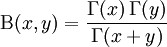

::: {style="DISPLAY: none"}
{#d2h_url_template}{#d2h_package_url style="WIDTH: 0px; DISPLAY: none; HEIGHT: 0px"}
:::

:::: {.d2h_secondary_topic style="PADDING-BOTTOM: 10pt; MARGIN: 0pt; PADDING-LEFT: 0pt; PADDING-RIGHT: 0pt; PADDING-TOP: 0pt"}
#### Beta Function {#beta-function style="tab-stops: 0pt"}

[]{style="FONT-FAMILY: 'Trebuchet MS','sans-serif'; FONT-SIZE: 9pt"} 

There are two widely used utility functions, the Gamma and Beta functions, which are used in statistics to calculate distribution values. These functions always return a double value and use two double values for input. The beta function was studied by Euler and Legendre and was named by Jacques Binet. In mathematics, the beta function (occasionally written as Beta function) which, is also called the Euler integral of the first kind, is a special function defined by:

[]{style="FONT-FAMILY: 'Trebuchet MS','sans-serif'; FONT-SIZE: 9pt"} 

[{border="0"}]{style="FONT-FAMILY: 'Trebuchet MS','sans-serif'; FONT-SIZE: 9pt"}[]{style="FONT-FAMILY: 'Trebuchet MS','sans-serif'; FONT-SIZE: 9pt"}

[]{style="FONT-FAMILY: 'Trebuchet MS','sans-serif'; FONT-SIZE: 9pt"} 

where G(x) is the gamma function.

[]{style="FONT-FAMILY: 'Trebuchet MS','sans-serif'; FONT-SIZE: 9pt"} 

Using the Formula

**[]{style="FONT-FAMILY: 'Trebuchet MS','sans-serif'"}** 

[]{style="FONT-FAMILY: 'Trebuchet MS','sans-serif'; FONT-SIZE: 9pt"} 

The **Beta** method of the **UtilityFunctions** class calculates the beta function for given two values.

[]{style="FONT-FAMILY: 'Trebuchet MS','sans-serif'; FONT-SIZE: 9pt"} 

::: {align="center"}
+-----------------------+---------------------------+---------------------------------------------------+
|                       |                           |                                                   |
|                       |                           |                                                   |
| Method Name           | Parameters                | Return Value                                      |
+-----------------------+---------------------------+---------------------------------------------------+
|                       | 1.   a: The first value.  | A double that represents the beta function value. |
|                       |                           |                                                   |
| Beta                  | 2.   b: The second value. |                                                   |
+-----------------------+---------------------------+---------------------------------------------------+
:::

[]{style="FONT-FAMILY: 'Trebuchet MS','sans-serif'; FONT-SIZE: 9pt"} 

Example

[]{style="FONT-FAMILY: 'Trebuchet MS','sans-serif'; FONT-SIZE: 9pt"} 

Here is a code snippet that shows a sample usage.

[]{style="FONT-FAMILY: 'Trebuchet MS','sans-serif'; FONT-SIZE: 9pt"} 

+----------------------------------------------------------------------------------------------------------------------------------------------------+
| **[\[C#\]]{style="FONT-FAMILY: 'Courier New'; COLOR: black"}**                                                                                     |
|                                                                                                                                                    |
| **[]{style="FONT-FAMILY: 'Courier New'; COLOR: black"}**                                                                                           |
|                                                                                                                                                    |
| [using Syncfusion.Windows.Forms.Chart.Statistics;]{style="FONT-FAMILY: 'Courier New'; COLOR: black"}                                               |
|                                                                                                                                                    |
| [double]{style="FONT-FAMILY: 'Courier New'; COLOR: blue"}[ result = UtilityFunctions.Beta(a,b);]{style="FONT-FAMILY: 'Courier New'; COLOR: black"} |
+----------------------------------------------------------------------------------------------------------------------------------------------------+

[]{style="FONT-FAMILY: 'Trebuchet MS','sans-serif'; FONT-SIZE: 9pt"} 

+-------------------------------------------------------------------------------------------------------------------------------------------------------------------------------------------------------------------------------------------------------------------------------------------------------------------------------------------------------------------------+
| **[\[VB.NET\]]{style="FONT-FAMILY: 'Courier New'; COLOR: black"}**                                                                                                                                                                                                                                                                                                      |
|                                                                                                                                                                                                                                                                                                                                                                         |
| **[]{style="FONT-FAMILY: 'Courier New'; COLOR: black"}**                                                                                                                                                                                                                                                                                                                |
|                                                                                                                                                                                                                                                                                                                                                                         |
| [Imports Syncfusion.Windows.Forms.Chart.Statistics]{style="FONT-FAMILY: 'Courier New'; COLOR: black"}                                                                                                                                                                                                                                                                   |
|                                                                                                                                                                                                                                                                                                                                                                         |
| [Dim]{style="FONT-FAMILY: 'Courier New'; COLOR: blue"}[ ]{style="FONT-FAMILY: 'Courier New'; COLOR: black"}[double]{style="FONT-FAMILY: 'Courier New'; COLOR: blue"}[ ]{style="FONT-FAMILY: 'Courier New'; COLOR: black"}[as]{style="FONT-FAMILY: 'Courier New'; COLOR: blue"}[ result = UtilityFunctions.Beta(a,b);]{style="FONT-FAMILY: 'Courier New'; COLOR: black"} |
+-------------------------------------------------------------------------------------------------------------------------------------------------------------------------------------------------------------------------------------------------------------------------------------------------------------------------------------------------------------------------+

 

[]{#p232} 

[]{#related-topics}
::::
