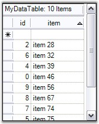

::: {style="DISPLAY: none"}
{#d2h_url_template}{#d2h_package_url style="WIDTH: 0px; DISPLAY: none; HEIGHT: 0px"}
:::

::: {.d2h_secondary_topic style="PADDING-BOTTOM: 10pt; MARGIN: 0pt; PADDING-LEFT: 0pt; PADDING-RIGHT: 0pt; PADDING-TOP: 0pt"}
##### Bind a Grid Grouping Control to a Manual Data Source {#bind-a-grid-grouping-control-to-a-manual-data-source style="tab-stops: 0pt"}

[]{style="FONT-FAMILY: 'Trebuchet MS','sans-serif'; COLOR: #15428b; FONT-SIZE: 9pt"} 

Here are some code samples that will create a **DataTable** and bind it to a Grid Grouping control. Once you have a DataTable object populated you can use the **GridGroupingControl.DataSource** property to implement the binding.

[]{style="FONT-FAMILY: 'Trebuchet MS','sans-serif'; COLOR: #15428b; FONT-SIZE: 9pt"} 

1.   Include the required namespace.

[]{style="FONT-FAMILY: 'Trebuchet MS','sans-serif'; COLOR: #15428b; FONT-SIZE: 9pt"} 

+----------------------------------------------------------------------------------------------------------------------------------------------------------------+
| **[\[C#\]]{style="FONT-FAMILY: 'Courier New'; COLOR: black"}**                                                                                                 |
|                                                                                                                                                                |
| []{style="FONT-FAMILY: 'Courier New'; COLOR: #15428b"}                                                                                                         |
|                                                                                                                                                                |
| [using ]{style="FONT-FAMILY: 'Courier New'; COLOR: blue"}[Synctusion.Windows.Forms.Grid.Grouping[;]{style="COLOR: black"}]{style="FONT-FAMILY: 'Courier New'"} |
+----------------------------------------------------------------------------------------------------------------------------------------------------------------+

[]{style="FONT-FAMILY: 'Trebuchet MS','sans-serif'; COLOR: #15428b; FONT-SIZE: 9pt"} 

+-----------------------------------------------------------------------------------------------------------------------------------------+
| **[\[VB.NET\]]{style="FONT-FAMILY: 'Courier New'; COLOR: black"}**                                                                      |
|                                                                                                                                         |
| []{style="FONT-FAMILY: 'Courier New'; COLOR: #15428b"}                                                                                  |
|                                                                                                                                         |
| [Imports ]{style="FONT-FAMILY: 'Courier New'; COLOR: blue"}[Synctusion.Windows.Forms.Grid.Grouping]{style="FONT-FAMILY: 'Courier New'"} |
+-----------------------------------------------------------------------------------------------------------------------------------------+

[]{style="FONT-FAMILY: 'Trebuchet MS','sans-serif'; COLOR: #15428b; FONT-SIZE: 9pt"} 

2.   Create an instance of Grid Grouping control and specify its size.

[]{style="FONT-FAMILY: 'Trebuchet MS','sans-serif'; COLOR: #15428b; FONT-SIZE: 9pt"} 

+-----------------------------------------------------------------------------------------------------------------------------------------------------------------------------------------------------------------------------------------+
| **[\[C#\]]{style="FONT-FAMILY: 'Courier New'; COLOR: black"}**                                                                                                                                                                          |
|                                                                                                                                                                                                                                         |
| []{style="FONT-FAMILY: 'Courier New'; COLOR: #15428b"}                                                                                                                                                                                  |
|                                                                                                                                                                                                                                         |
| [private]{style="FONT-FAMILY: 'Courier New'; COLOR: blue"}[ Syncfusion.Windows.Forms.Grid.Grouping.[GridGroupingControl]{style="COLOR: #2b91af"} gridGroupingControl1;]{style="FONT-FAMILY: 'Courier New'"}                             |
|                                                                                                                                                                                                                                         |
| []{style="FONT-FAMILY: 'Courier New'"}                                                                                                                                                                                                  |
|                                                                                                                                                                                                                                         |
| [this]{style="FONT-FAMILY: 'Courier New'; COLOR: blue"}[.gridGroupingControl1 = [new]{style="COLOR: blue"} Syncfusion.Windows.Forms.Grid.Grouping.[GridGroupingControl]{style="COLOR: #2b91af"}();]{style="FONT-FAMILY: 'Courier New'"} |
|                                                                                                                                                                                                                                         |
| [this]{style="FONT-FAMILY: 'Courier New'; COLOR: blue"}[.gridGroupingControl1.Size = [new]{style="COLOR: blue"} System.Drawing.[Size]{style="COLOR: #2b91af"}(160, 200 );]{style="FONT-FAMILY: 'Courier New'"}                          |
+-----------------------------------------------------------------------------------------------------------------------------------------------------------------------------------------------------------------------------------------+

[]{style="FONT-FAMILY: 'Trebuchet MS','sans-serif'; COLOR: #15428b; FONT-SIZE: 9pt"} 

+------------------------------------------------------------------------------------------------------------------------------------------------------------------------------------------------------------+
| **[\[VB.NET\]]{style="FONT-FAMILY: 'Courier New'; COLOR: black"}**                                                                                                                                         |
|                                                                                                                                                                                                            |
| []{style="FONT-FAMILY: 'Courier New'; COLOR: #15428b"}                                                                                                                                                     |
|                                                                                                                                                                                                            |
| [Private]{style="FONT-FAMILY: 'Courier New'; COLOR: blue"}[ gridGroupingControl1 [As]{style="COLOR: blue"} Syncfusion.Windows.Forms.Grid.Grouping.GridGroupingControl]{style="FONT-FAMILY: 'Courier New'"} |
|                                                                                                                                                                                                            |
| []{style="FONT-FAMILY: 'Courier New'; COLOR: blue"}                                                                                                                                                        |
|                                                                                                                                                                                                            |
| [Me]{style="FONT-FAMILY: 'Courier New'; COLOR: blue"}[.gridGroupingControl1 = [New]{style="COLOR: blue"} Syncfusion.Windows.Forms.Grid.Grouping.GridGroupingControl()]{style="FONT-FAMILY: 'Courier New'"} |
|                                                                                                                                                                                                            |
| [Me]{style="FONT-FAMILY: 'Courier New'; COLOR: blue"}[.gridGroupingControl1.Size = [New]{style="COLOR: blue"} System.Drawing.Size(160, 200 )]{style="FONT-FAMILY: 'Courier New'"}                          |
+------------------------------------------------------------------------------------------------------------------------------------------------------------------------------------------------------------+

[]{style="FONT-FAMILY: 'Trebuchet MS','sans-serif'; COLOR: #15428b; FONT-SIZE: 9pt"} 

3.   Set up the Data Source.

[]{style="FONT-FAMILY: 'Trebuchet MS','sans-serif'; COLOR: #15428b; FONT-SIZE: 9pt"} 

+--------------------------------------------------------------------------------------------------------------------------------------------------------------------------------------------------------------------------------+
| **[\[C#\]]{style="FONT-FAMILY: 'Courier New'; COLOR: black"}**                                                                                                                                                                 |
|                                                                                                                                                                                                                                |
| []{style="FONT-FAMILY: 'Courier New'; COLOR: #15428b"}                                                                                                                                                                         |
|                                                                                                                                                                                                                                |
| [DataTable]{style="FONT-FAMILY: 'Courier New'; COLOR: #2b91af"}[ myDataTable = [new]{style="COLOR: blue"} [DataTable]{style="COLOR: #2b91af"}([\"MyDataTable\"]{style="COLOR: #a31515"});]{style="FONT-FAMILY: 'Courier New'"} |
|                                                                                                                                                                                                                                |
| []{style="FONT-FAMILY: 'Courier New'"}                                                                                                                                                                                         |
|                                                                                                                                                                                                                                |
| [// Declare the Data Column and Data Row variables.]{style="FONT-FAMILY: 'Courier New'; COLOR: green"}                                                                                                                         |
|                                                                                                                                                                                                                                |
| [DataColumn]{style="FONT-FAMILY: 'Courier New'; COLOR: #2b91af"}[ myDataColumn;]{style="FONT-FAMILY: 'Courier New'"}                                                                                                           |
|                                                                                                                                                                                                                                |
| [DataRow]{style="FONT-FAMILY: 'Courier New'; COLOR: #2b91af"}[ myDataRow;]{style="FONT-FAMILY: 'Courier New'"}                                                                                                                 |
|                                                                                                                                                                                                                                |
| []{style="FONT-FAMILY: 'Courier New'"}                                                                                                                                                                                         |
|                                                                                                                                                                                                                                |
| [// Create a new Data Column, set the Data Type and Column Name and add to the Data Table.   ]{style="FONT-FAMILY: 'Courier New'; COLOR: green"}                                                                               |
|                                                                                                                                                                                                                                |
| [myDataColumn = [new]{style="COLOR: blue"} [DataColumn]{style="COLOR: #2b91af"}();]{style="FONT-FAMILY: 'Courier New'"}                                                                                                        |
|                                                                                                                                                                                                                                |
| [myDataColumn.DataType = System.[Type]{style="COLOR: #2b91af"}.GetType([\"System.Int32\"]{style="COLOR: #a31515"});]{style="FONT-FAMILY: 'Courier New'"}                                                                       |
|                                                                                                                                                                                                                                |
| [myDataColumn.ColumnName = [\"id\"]{style="COLOR: #a31515"};]{style="FONT-FAMILY: 'Courier New'"}                                                                                                                              |
|                                                                                                                                                                                                                                |
| [myDataTable.Columns.Add(myDataColumn);]{style="FONT-FAMILY: 'Courier New'"}                                                                                                                                                   |
|                                                                                                                                                                                                                                |
| []{style="FONT-FAMILY: 'Courier New'"}                                                                                                                                                                                         |
|                                                                                                                                                                                                                                |
| [// Create a second column.]{style="FONT-FAMILY: 'Courier New'; COLOR: green"}                                                                                                                                                 |
|                                                                                                                                                                                                                                |
| [myDataColumn = [new]{style="COLOR: blue"} [DataColumn]{style="COLOR: #2b91af"}();]{style="FONT-FAMILY: 'Courier New'"}                                                                                                        |
|                                                                                                                                                                                                                                |
| [myDataColumn.DataType = [Type]{style="COLOR: #2b91af"}.GetType([\"System.String\"]{style="COLOR: #a31515"});]{style="FONT-FAMILY: 'Courier New'"}                                                                             |
|                                                                                                                                                                                                                                |
| [myDataColumn.ColumnName = [\"item\"]{style="COLOR: #a31515"};]{style="FONT-FAMILY: 'Courier New'"}                                                                                                                            |
|                                                                                                                                                                                                                                |
| [myDataTable.Columns.Add(myDataColumn);]{style="FONT-FAMILY: 'Courier New'"}                                                                                                                                                   |
|                                                                                                                                                                                                                                |
| []{style="FONT-FAMILY: 'Courier New'"}                                                                                                                                                                                         |
|                                                                                                                                                                                                                                |
| [// Create new Data Row objects and add to the Data Table.    ]{style="FONT-FAMILY: 'Courier New'; COLOR: green"}                                                                                                              |
|                                                                                                                                                                                                                                |
| [for]{style="FONT-FAMILY: 'Courier New'; COLOR: blue"}[ ([int]{style="COLOR: blue"} i = 0; i \<= 10; i++)]{style="FONT-FAMILY: 'Courier New'"}                                                                                 |
|                                                                                                                                                                                                                                |
| [{]{style="FONT-FAMILY: 'Courier New'"}                                                                                                                                                                                        |
|                                                                                                                                                                                                                                |
| [    myDataRow = myDataTable.NewRow();]{style="FONT-FAMILY: 'Courier New'"}                                                                                                                                                    |
|                                                                                                                                                                                                                                |
| [    myDataRow\[[\"id\"]{style="COLOR: #a31515"}\] = i;]{style="FONT-FAMILY: 'Courier New'"}                                                                                                                                   |
|                                                                                                                                                                                                                                |
| [    myDataRow\[[\"item\"]{style="COLOR: #a31515"}\] = [\"item \"]{style="COLOR: #a31515"} + i.ToString();]{style="FONT-FAMILY: 'Courier New'"}                                                                                |
|                                                                                                                                                                                                                                |
| [    myDataTable.Rows.Add(myDataRow);]{style="FONT-FAMILY: 'Courier New'"}                                                                                                                                                     |
|                                                                                                                                                                                                                                |
| [}]{style="FONT-FAMILY: 'Courier New'"}                                                                                                                                                                                        |
+--------------------------------------------------------------------------------------------------------------------------------------------------------------------------------------------------------------------------------+

[]{style="FONT-FAMILY: 'Trebuchet MS','sans-serif'; COLOR: #15428b; FONT-SIZE: 9pt"} 

+--------------------------------------------------------------------------------------------------------------------------------------------------------------------------------------------------------------------------------+
| **[\[VB.NET\]]{style="FONT-FAMILY: 'Courier New'; COLOR: black"}**                                                                                                                                                             |
|                                                                                                                                                                                                                                |
| []{style="FONT-FAMILY: 'Courier New'; COLOR: #15428b"}                                                                                                                                                                         |
|                                                                                                                                                                                                                                |
| [Dim]{style="FONT-FAMILY: 'Courier New'; COLOR: blue"}[ myDataTable [As]{style="COLOR: blue"} DataTable = [New]{style="COLOR: blue"} DataTable([\"MyDataTable\"]{style="COLOR: #a31515"})]{style="FONT-FAMILY: 'Courier New'"} |
|                                                                                                                                                                                                                                |
| []{style="FONT-FAMILY: 'Courier New'"}                                                                                                                                                                                         |
|                                                                                                                                                                                                                                |
| [\' Declare the Data Column and Data Row variables.]{style="FONT-FAMILY: 'Courier New'; COLOR: green"}                                                                                                                         |
|                                                                                                                                                                                                                                |
| [Dim]{style="FONT-FAMILY: 'Courier New'; COLOR: blue"}[ myDataColumn [As]{style="COLOR: blue"} DataColumn]{style="FONT-FAMILY: 'Courier New'"}                                                                                 |
|                                                                                                                                                                                                                                |
| [Dim]{style="FONT-FAMILY: 'Courier New'; COLOR: blue"}[ myDataRow [As]{style="COLOR: blue"} DataRow]{style="FONT-FAMILY: 'Courier New'"}                                                                                       |
|                                                                                                                                                                                                                                |
| []{style="FONT-FAMILY: 'Courier New'"}                                                                                                                                                                                         |
|                                                                                                                                                                                                                                |
| [\' Create a new Data Column, set the Data Type and Column Name and add to the Data Table. ]{style="FONT-FAMILY: 'Courier New'; COLOR: green"}                                                                                 |
|                                                                                                                                                                                                                                |
| [myDataColumn = [New]{style="COLOR: blue"} DataColumn()]{style="FONT-FAMILY: 'Courier New'"}                                                                                                                                   |
|                                                                                                                                                                                                                                |
| [myDataColumn.DataType = System.Type.GetType([\"System.Int32\"]{style="COLOR: #a31515"})]{style="FONT-FAMILY: 'Courier New'"}                                                                                                  |
|                                                                                                                                                                                                                                |
| [myDataColumn.ColumnName = [\"id\"]{style="COLOR: #a31515"}]{style="FONT-FAMILY: 'Courier New'"}                                                                                                                               |
|                                                                                                                                                                                                                                |
| [myDataTable.Columns.Add(myDataColumn)]{style="FONT-FAMILY: 'Courier New'"}                                                                                                                                                    |
|                                                                                                                                                                                                                                |
| []{style="FONT-FAMILY: 'Courier New'"}                                                                                                                                                                                         |
|                                                                                                                                                                                                                                |
| [\' Create a second column.]{style="FONT-FAMILY: 'Courier New'; COLOR: green"}                                                                                                                                                 |
|                                                                                                                                                                                                                                |
| [myDataColumn = [New]{style="COLOR: blue"} DataColumn()]{style="FONT-FAMILY: 'Courier New'"}                                                                                                                                   |
|                                                                                                                                                                                                                                |
| [myDataColumn.DataType = Type.GetType([\"System.String\"]{style="COLOR: #a31515"})]{style="FONT-FAMILY: 'Courier New'"}                                                                                                        |
|                                                                                                                                                                                                                                |
| [myDataColumn.ColumnName = [\"item\"]{style="COLOR: #a31515"}]{style="FONT-FAMILY: 'Courier New'"}                                                                                                                             |
|                                                                                                                                                                                                                                |
| [myDataTable.Columns.Add(myDataColumn)]{style="FONT-FAMILY: 'Courier New'"}                                                                                                                                                    |
|                                                                                                                                                                                                                                |
| []{style="FONT-FAMILY: 'Courier New'"}                                                                                                                                                                                         |
|                                                                                                                                                                                                                                |
| [\' Create new Data Row objects and add to the Data Table.    ]{style="FONT-FAMILY: 'Courier New'; COLOR: green"}                                                                                                              |
|                                                                                                                                                                                                                                |
| [Dim]{style="FONT-FAMILY: 'Courier New'; COLOR: blue"}[ i [As]{style="COLOR: blue"} [Integer]{style="COLOR: blue"}]{style="FONT-FAMILY: 'Courier New'"}                                                                        |
|                                                                                                                                                                                                                                |
| [For]{style="FONT-FAMILY: 'Courier New'; COLOR: blue"}[ i = 0 [To]{style="COLOR: blue"} 10]{style="FONT-FAMILY: 'Courier New'"}                                                                                                |
|                                                                                                                                                                                                                                |
| [myDataRow = myDataTable.NewRow]{style="FONT-FAMILY: 'Courier New'"}                                                                                                                                                           |
|                                                                                                                                                                                                                                |
| [myDataRow([\"id\"]{style="COLOR: #a31515"}) = i]{style="FONT-FAMILY: 'Courier New'"}                                                                                                                                          |
|                                                                                                                                                                                                                                |
| [myDataRow([\"item\"]{style="COLOR: #a31515"}) = [\"item \"]{style="COLOR: #a31515"} & i]{style="FONT-FAMILY: 'Courier New'"}                                                                                                  |
|                                                                                                                                                                                                                                |
| [myDataTable.Rows.Add(myDataRow)]{style="FONT-FAMILY: 'Courier New'"}                                                                                                                                                          |
|                                                                                                                                                                                                                                |
| [Next]{style="FONT-FAMILY: 'Courier New'; COLOR: blue"}[ i]{style="FONT-FAMILY: 'Courier New'"}                                                                                                                                |
+--------------------------------------------------------------------------------------------------------------------------------------------------------------------------------------------------------------------------------+

[]{style="FONT-FAMILY: 'Trebuchet MS','sans-serif'; COLOR: #15428b; FONT-SIZE: 9pt"} 

4.   Bind the grid grouping control to this data table by setting its **DataSource** property.

[]{style="FONT-FAMILY: 'Trebuchet MS','sans-serif'; COLOR: #15428b; FONT-SIZE: 9pt"} 

+-------------------------------------------------------------------------------------------------------------------------------------------------------------+
| **[\[C#\]]{style="FONT-FAMILY: 'Courier New'; COLOR: black"}**                                                                                              |
|                                                                                                                                                             |
| []{style="FONT-FAMILY: 'Courier New'; COLOR: #15428b"}                                                                                                      |
|                                                                                                                                                             |
| [this]{style="FONT-FAMILY: 'Courier New'; COLOR: blue"}[.gridGroupingControl1.DataSource = myDataTable; ]{style="FONT-FAMILY: 'Courier New'; COLOR: black"} |
+-------------------------------------------------------------------------------------------------------------------------------------------------------------+

[]{style="FONT-FAMILY: 'Trebuchet MS','sans-serif'; COLOR: #15428b; FONT-SIZE: 9pt"} 

+---------------------------------------------------------------------------------------------------------------------------------------------------------+
| **[\[VB.NET\]]{style="FONT-FAMILY: 'Courier New'; COLOR: black"}**                                                                                      |
|                                                                                                                                                         |
| []{style="FONT-FAMILY: 'Courier New'; COLOR: #15428b"}                                                                                                  |
|                                                                                                                                                         |
| [Me]{style="FONT-FAMILY: 'Courier New'; COLOR: blue"}[.GridGroupingControl1.DataSource = myDataTable]{style="FONT-FAMILY: 'Courier New'; COLOR: black"} |
+---------------------------------------------------------------------------------------------------------------------------------------------------------+

 

5.   Finally, add the grid grouping control to the form.

[]{style="FONT-FAMILY: 'Trebuchet MS','sans-serif'; COLOR: #15428b; FONT-SIZE: 9pt"} 

+--------------------------------------------------------------------------------------------------------------------------------------------------------------------------------------------------------------------------------------------------------------+
| **[\[C#\]]{style="FONT-FAMILY: 'Courier New'; COLOR: black"}**                                                                                                                                                                                               |
|                                                                                                                                                                                                                                                              |
| []{style="FONT-FAMILY: 'Courier New'; COLOR: #15428b"}                                                                                                                                                                                                       |
|                                                                                                                                                                                                                                                              |
| [this]{style="FONT-FAMILY: 'Courier New'; COLOR: blue"}[.Controls.Add(]{style="FONT-FAMILY: 'Courier New'; COLOR: black"}[this]{style="FONT-FAMILY: 'Courier New'; COLOR: blue"}[.gridGroupingControl1); ]{style="FONT-FAMILY: 'Courier New'; COLOR: black"} |
+--------------------------------------------------------------------------------------------------------------------------------------------------------------------------------------------------------------------------------------------------------------+

[]{style="FONT-FAMILY: 'Trebuchet MS','sans-serif'; COLOR: #15428b; FONT-SIZE: 9pt"} 

+--------------------------------------------------------------------------------------------------------------------------------------------------------------------------------------------------------------------------------------------------------+
| **[\[VB.NET\]]{style="FONT-FAMILY: 'Courier New'; COLOR: black"}**                                                                                                                                                                                     |
|                                                                                                                                                                                                                                                        |
| []{style="FONT-FAMILY: 'Courier New'; COLOR: #15428b"}                                                                                                                                                                                                 |
|                                                                                                                                                                                                                                                        |
| [Me]{style="FONT-FAMILY: 'Courier New'; COLOR: blue"}[.Controls.Add(]{style="FONT-FAMILY: 'Courier New'; COLOR: black"}[Me]{style="FONT-FAMILY: 'Courier New'; COLOR: blue"}[.GridGroupingControl1)]{style="FONT-FAMILY: 'Courier New'; COLOR: black"} |
+--------------------------------------------------------------------------------------------------------------------------------------------------------------------------------------------------------------------------------------------------------+

 

6.   When you run the application, the grid will look like the one in the following image. You will be able to sort the data by clicking the header of the column you want to sort.

[]{style="FONT-FAMILY: 'Trebuchet MS','sans-serif'; COLOR: #15428b; FONT-SIZE: 9pt"} 

{border="0"}

*[Figure ]{style="FONT-SIZE: 9pt"}[232]{style="FONT-SIZE: 9pt"}[: Binding a Grid Grouping control to a Manual Data Source]{style="FONT-SIZE: 9pt"}*

 

[]{#p394} 

 

[]{#related-topics}
:::
