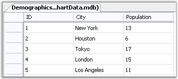
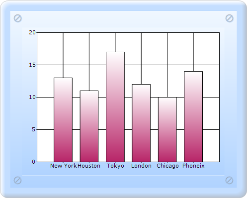

::: {style="DISPLAY: none"}
{#d2h_url_template}{#d2h_package_url style="WIDTH: 0px; DISPLAY: none; HEIGHT: 0px"}
:::

::::: {#nsbanner .d2h_main_nsbanner style="BORDER-BOTTOM: #999999 1px solid; POSITION: relative; PADDING-BOTTOM: 0px; BACKGROUND-COLOR: transparent; PADDING-LEFT: 0px; PADDING-RIGHT: 0px; DISPLAY: none; BORDER-TOP: #999999 1px solid; PADDING-TOP: 0px; LEFT: 0px"}
:::: {#TitleRow .d2h_main_titlerow style="PADDING-BOTTOM: 4px; BACKGROUND-COLOR: transparent; PADDING-LEFT: 22px; WIDTH: 100%; PADDING-RIGHT: 10px; DISPLAY: none; PADDING-TOP: 4px"}
::: {#ienav .d2h_main_ienav style="DISPLAY: none"}
{#D2HPrevious .D2HPreviousEnabled}  {#D2HNext .D2HNextEnabled}
:::
::::
:::::

::::::: {#nstext .d2h_main_nstext style="PADDING-BOTTOM: 10px; BACKGROUND-COLOR: transparent; PADDING-LEFT: 22px; PADDING-RIGHT: 10px; HEIGHT: 100%; OVERFLOW: auto; PADDING-TOP: 5px" hasuserbackground="true" valign="bottom"}
::: {#d2h_breadcrumbs .d2h_breadcrumbs}
[Essential Studio User Guide Documentation](ms-xhelp:///?Id=12457748-09e3-4d74-a240-8e049cedf030){.d2h_breadcrumbsNormal}[ \> ]{.d2h_breadcrumbsLinkSeparator}[User Interface Edition](ms-xhelp:///?Id=c29296b7-531c-413b-a0ec-488ca1f7f669){.d2h_breadcrumbsNormal}[ \> ]{.d2h_breadcrumbsLinkSeparator}[Essential ASP.NET MVC](ms-xhelp:///?Id=4b14e7d1-65c4-4f67-b1aa-2c37709905a5){.d2h_breadcrumbsNormal}[ \> ]{.d2h_breadcrumbsLinkSeparator}[Essential Chart]{.d2h_breadcrumbsContentsOnly}[ \> ]{.d2h_breadcrumbsLinkSeparator}[Concepts and Features](ms-xhelp:///?Id=696f5666-8b81-4685-9bd9-12198f06f3ad){.d2h_breadcrumbsNormal}[ \> ]{.d2h_breadcrumbsLinkSeparator}[Chart Data](ms-xhelp:///?Id=1c4580ce-85a3-4687-a83d-1ba13cec0e65){.d2h_breadcrumbsNormal}
:::

### Binding a DataSet to the Chart {#binding-a-dataset-to-the-chart style="tab-stops: 0pt"}

The following sample code illustrates how a custom **DataSet** can be bound to a ChartSeries to provide data points and to a ChartAxis to provide label names. Note that the DataSet can easily be replaced with a **DataTable** or **DataView**.

[]{style="FONT-FAMILY: 'Times New Roman','serif'; FONT-SIZE: 12pt"} 

{border="0"}

Figure 278: Access table data that is about to get bound to Chart

[]{style="FONT-FAMILY: 'Times New Roman','serif'; FONT-SIZE: 12pt"} 

To bind the dataset to the chart:

1.   In Controller, create an instance of **MVCChartModel**.

2.   Create an instance of **ChartSeries**, and set the SeriesType.

3.   Set the ChartSeries, ChartArea, and ChartModel properties.

4.   Open the **OlEDBConnection**.

5.   Create an instance **ChartDataBindAxisLabelModel** and **ChartDataBindModel**, and bind as shown in the following code snippet.

6.   Return view to the corresponding View page after setting the ChartModel to the ViewData.

::: {style="BORDER-BOTTOM: #c8c8c8 1pt solid; BORDER-LEFT: #c8c8c8 1pt solid; PADDING-BOTTOM: 1pt; MARGIN-TOP: 0pt; PADDING-LEFT: 4pt; PADDING-RIGHT: 4pt; MARGIN-BOTTOM: 0pt; BACKGROUND: #f0f0f0; BORDER-TOP: #c8c8c8 1pt solid; BORDER-RIGHT: #c8c8c8 1pt solid; PADDING-TOP: 1pt"}
\[C#\]            

[       ]{style="FONT-FAMILY: Consolas; FONT-SIZE: 9.5pt"}[public]{style="FONT-FAMILY: 'Courier New'; COLOR: blue"}[ [ActionResult]{style="COLOR: #2b91af"} SimpleChart()]{style="FONT-FAMILY: 'Courier New'"}

[        {]{style="FONT-FAMILY: 'Courier New'"}

[            [MVCChartModel]{style="COLOR: #2b91af"} chartModel = [new]{style="COLOR: blue"} [MVCChartModel]{style="COLOR: #2b91af"}();]{style="FONT-FAMILY: 'Courier New'"}

[            [// Create a chart series and add data points to it.]{style="COLOR: green"}]{style="FONT-FAMILY: 'Courier New'"}

[]{style="FONT-FAMILY: 'Courier New'"} 

[            [// The Access database]{style="COLOR: green"}]{style="FONT-FAMILY: 'Courier New'"}

[            [string]{style="COLOR: blue"} fileName = Server.MapPath([string]{style="COLOR: blue"}.Empty) + ([@\"\\App_Data\\ChartData.mdb\"]{style="COLOR: #a31515"});]{style="FONT-FAMILY: 'Courier New'"}

[            [string]{style="COLOR: blue"} myConnectionString = [\"PROVIDER=Microsoft.Jet.OLEDB.4.0;Data Source=\"]{style="COLOR: #a31515"} + fileName;]{style="FONT-FAMILY: 'Courier New'"}

[]{style="FONT-FAMILY: 'Courier New'"} 

[            [// Define the database query    ]{style="COLOR: green"}]{style="FONT-FAMILY: 'Courier New'"}

[            [string]{style="COLOR: blue"} mySelectQuery = [\"SELECT City, ID, Population FROM Demographics\"]{style="COLOR: #a31515"};]{style="FONT-FAMILY: 'Courier New'"}

[]{style="FONT-FAMILY: 'Courier New'"} 

[            [// Create a database connection object using the connection string    ]{style="COLOR: green"}]{style="FONT-FAMILY: 'Courier New'"}

[            [OleDbConnection]{style="COLOR: #2b91af"} myConnection = [new]{style="COLOR: blue"} [OleDbConnection]{style="COLOR: #2b91af"}(myConnectionString);]{style="FONT-FAMILY: 'Courier New'"}

[]{style="FONT-FAMILY: 'Courier New'"} 

[            [// Create a database command on the connection using query    ]{style="COLOR: green"}]{style="FONT-FAMILY: 'Courier New'"}

[            [OleDbCommand]{style="COLOR: #2b91af"} myCommand = [new]{style="COLOR: blue"} [OleDbCommand]{style="COLOR: #2b91af"}(mySelectQuery, myConnection);]{style="FONT-FAMILY: 'Courier New'"}

[]{style="FONT-FAMILY: 'Courier New'"} 

[            myCommand.Connection.Open();]{style="FONT-FAMILY: 'Courier New'"}

[]{style="FONT-FAMILY: 'Courier New'"} 

[            [ChartDataBindAxisLabelModel]{style="COLOR: #2b91af"} xAxisLabelModel = [null]{style="COLOR: blue"};]{style="FONT-FAMILY: 'Courier New'"}

[]{style="FONT-FAMILY: 'Courier New'"} 

[            [// Create a database reader    ]{style="COLOR: green"}]{style="FONT-FAMILY: 'Courier New'"}

[            [OleDbDataReader]{style="COLOR: #2b91af"} myReader = myCommand.ExecuteReader([CommandBehavior]{style="COLOR: #2b91af"}.CloseConnection);]{style="FONT-FAMILY: 'Courier New'"}

[]{style="FONT-FAMILY: 'Courier New'"} 

[            [//Load the contents to a dataset.]{style="COLOR: green"}]{style="FONT-FAMILY: 'Courier New'"}

[            [DataSet]{style="COLOR: #2b91af"} dataSet = ConvertToDataSet(myReader, [\"Demographics\"]{style="COLOR: #a31515"});]{style="FONT-FAMILY: 'Courier New'"}

[]{style="FONT-FAMILY: 'Courier New'"} 

[            [//Initializes new chart series.]{style="COLOR: green"}]{style="FONT-FAMILY: 'Courier New'"}

[            [ChartSeries]{style="COLOR: #2b91af"} series = [new]{style="COLOR: blue"} [ChartSeries]{style="COLOR: #2b91af"}();]{style="FONT-FAMILY: 'Courier New'"}

[            series.Name = [\"Products\"]{style="COLOR: #a31515"};]{style="FONT-FAMILY: 'Courier New'"}

[]{style="FONT-FAMILY: 'Courier New'"} 

**[            [ChartDataBindModel]{style="COLOR: #2b91af"} model = [new]{style="COLOR: blue"} [ChartDataBindModel]{style="COLOR: #2b91af"}(dataSet, [\"Demographics\"]{style="COLOR: #a31515"});]{style="FONT-FAMILY: 'Courier New'"}**

**[            model.XName = [\"ID\"]{style="COLOR: #a31515"};]{style="FONT-FAMILY: 'Courier New'"}**

**[            model.YNames = [new]{style="COLOR: blue"} [string]{style="COLOR: blue"}\[\] { [\"Population\"]{style="COLOR: #a31515"} };]{style="FONT-FAMILY: 'Courier New'"}**

**[]{style="FONT-FAMILY: 'Courier New'"}** 

**[            series.SeriesModel = model;]{style="FONT-FAMILY: 'Courier New'"}**

**[            series.Type = [ChartSeriesType]{style="COLOR: #2b91af"}.Column;      ]{style="FONT-FAMILY: 'Courier New'"}**

**[]{style="FONT-FAMILY: 'Courier New'"}** 

**[            xAxisLabelModel = [new]{style="COLOR: blue"} [ChartDataBindAxisLabelModel]{style="COLOR: #2b91af"}(dataSet, [\"Demographics\"]{style="COLOR: #a31515"});]{style="FONT-FAMILY: 'Courier New'"}**

**[            xAxisLabelModel.LabelName = [\"City\"]{style="COLOR: #a31515"};]{style="FONT-FAMILY: 'Courier New'"}**

[]{style="FONT-FAMILY: 'Courier New'"} 

[            [//Adds the series to the ChartSeriesCollection.]{style="COLOR: green"}]{style="FONT-FAMILY: 'Courier New'"}

[            chartModel.Series.Add(series);]{style="FONT-FAMILY: 'Courier New'"}

[          ]{style="FONT-FAMILY: 'Courier New'"}

**[            chartModel.PrimaryXAxis.LabelsImpl = xAxisLabelModel;]{style="FONT-FAMILY: 'Courier New'"}**

**[]{style="FONT-FAMILY: 'Courier New'"}** 

**[            xAxisLabelModel.PositionIndex = 1;]{style="FONT-FAMILY: 'Courier New'"}**

**[            chartModel.PrimaryXAxis.TickLabelsDrawingMode = [ChartAxisTickLabelDrawingMode]{style="COLOR: #2b91af"}.UserMode;]{style="FONT-FAMILY: 'Courier New'"}**

[]{style="FONT-FAMILY: 'Courier New'"} 

[            chartModel.Skins = [ChartModelSkins]{style="COLOR: #2b91af"}.Office2007Blue;]{style="FONT-FAMILY: 'Courier New'"}

[            chartModel.ChartSeriesSkins = [ChartSeriesSkins]{style="COLOR: #2b91af"}.Analog;]{style="FONT-FAMILY: 'Courier New'"}

[]{style="FONT-FAMILY: 'Courier New'"} 

[            chartModel.BorderAppearance.SkinStyle = [ChartBorderSkinStyle]{style="COLOR: #2b91af"}.Pinned;]{style="FONT-FAMILY: 'Courier New'"}

[            chartModel.Size = [new]{style="COLOR: blue"} [Size]{style="COLOR: #2b91af"}(500, 400);]{style="FONT-FAMILY: 'Courier New'"}

[]{style="FONT-FAMILY: 'Courier New'"} 

[            ViewData.Model = chartModel;]{style="FONT-FAMILY: 'Courier New'"}

[]{style="FONT-FAMILY: 'Courier New'"} 

[            [return]{style="COLOR: blue"} View();]{style="FONT-FAMILY: 'Courier New'"}

[        }]{style="FONT-FAMILY: 'Courier New'"}

[]{style="FONT-FAMILY: 'Courier New'"} 

[        [protected]{style="COLOR: blue"} [DataSet]{style="COLOR: #2b91af"} ConvertToDataSet([OleDbDataReader]{style="COLOR: #2b91af"} dataReader, [string]{style="COLOR: blue"} tableName)]{style="FONT-FAMILY: 'Courier New'"}

[        {]{style="FONT-FAMILY: 'Courier New'"}

[            [DataSet]{style="COLOR: #2b91af"} dataSet = [new]{style="COLOR: blue"} [DataSet]{style="COLOR: #2b91af"}();]{style="FONT-FAMILY: 'Courier New'"}

[            [do]{style="COLOR: blue"}]{style="FONT-FAMILY: 'Courier New'"}

[            {]{style="FONT-FAMILY: 'Courier New'"}

[                [// Create new data table]{style="COLOR: green"}]{style="FONT-FAMILY: 'Courier New'"}

[]{style="FONT-FAMILY: 'Courier New'"} 

[                [DataTable]{style="COLOR: #2b91af"} schemaTable = dataReader.GetSchemaTable();]{style="FONT-FAMILY: 'Courier New'"}

[                [DataTable]{style="COLOR: #2b91af"} dataTable = [new]{style="COLOR: blue"} [DataTable]{style="COLOR: #2b91af"}(tableName);]{style="FONT-FAMILY: 'Courier New'"}

[]{style="FONT-FAMILY: 'Courier New'"} 

[                [if]{style="COLOR: blue"} (schemaTable != [null]{style="COLOR: blue"})]{style="FONT-FAMILY: 'Courier New'"}

[                {]{style="FONT-FAMILY: 'Courier New'"}

[                    [// A query returning records was executed]{style="COLOR: green"}]{style="FONT-FAMILY: 'Courier New'"}

[]{style="FONT-FAMILY: 'Courier New'"} 

[                    [for]{style="COLOR: blue"} ([int]{style="COLOR: blue"} i = 0; i \< schemaTable.Rows.Count; i++)]{style="FONT-FAMILY: 'Courier New'"}

[                    {]{style="FONT-FAMILY: 'Courier New'"}

[                        [DataRow]{style="COLOR: #2b91af"} dataRow = schemaTable.Rows\[i\];]{style="FONT-FAMILY: 'Courier New'"}

[                        [// Create a column name that is unique in the data table]{style="COLOR: green"}]{style="FONT-FAMILY: 'Courier New'"}

[                        [string]{style="COLOR: blue"} columnName = ([string]{style="COLOR: blue"})dataRow\[[\"ColumnName\"]{style="COLOR: #a31515"}\]; [//+ \"\<C\" + i + \"/\>\";]{style="COLOR: green"}]{style="FONT-FAMILY: 'Courier New'"}

[                        [// Add the column definition to the data table]{style="COLOR: green"}]{style="FONT-FAMILY: 'Courier New'"}

[                        [DataColumn]{style="COLOR: #2b91af"} column = [new]{style="COLOR: blue"} [DataColumn]{style="COLOR: #2b91af"}(columnName, ([Type]{style="COLOR: #2b91af"})dataRow\[[\"DataType\"]{style="COLOR: #a31515"}\]);]{style="FONT-FAMILY: 'Courier New'"}

[                        dataTable.Columns.Add(column);]{style="FONT-FAMILY: 'Courier New'"}

[                    }]{style="FONT-FAMILY: 'Courier New'"}

[]{style="FONT-FAMILY: 'Courier New'"} 

[                    [//Add the data table to the dataset]{style="COLOR: green"}]{style="FONT-FAMILY: 'Courier New'"}

[                    dataSet.Tables.Add(dataTable);]{style="FONT-FAMILY: 'Courier New'"}

[]{style="FONT-FAMILY: 'Courier New'"} 

[                    [// Fill the data table]{style="COLOR: green"}]{style="FONT-FAMILY: 'Courier New'"}

[                    [while]{style="COLOR: blue"} (dataReader.Read())]{style="FONT-FAMILY: 'Courier New'"}

[                    {]{style="FONT-FAMILY: 'Courier New'"}

[                        [DataRow]{style="COLOR: #2b91af"} dataRow = dataTable.NewRow();]{style="FONT-FAMILY: 'Courier New'"}

[]{style="FONT-FAMILY: 'Courier New'"} 

[                        [for]{style="COLOR: blue"} ([int]{style="COLOR: blue"} i = 0; i \< dataReader.FieldCount; i++)]{style="FONT-FAMILY: 'Courier New'"}

[                            dataRow\[i\] = dataReader.GetValue(i);]{style="FONT-FAMILY: 'Courier New'"}

[]{style="FONT-FAMILY: 'Courier New'"} 

[                        dataTable.Rows.Add(dataRow);]{style="FONT-FAMILY: 'Courier New'"}

[                    }]{style="FONT-FAMILY: 'Courier New'"}

[                }]{style="FONT-FAMILY: 'Courier New'"}

[                [else]{style="COLOR: blue"}]{style="FONT-FAMILY: 'Courier New'"}

[                {]{style="FONT-FAMILY: 'Courier New'"}

[                    [// No records were returned.]{style="COLOR: green"}]{style="FONT-FAMILY: 'Courier New'"}

[                    [DataColumn]{style="COLOR: #2b91af"} column = [new]{style="COLOR: blue"} [DataColumn]{style="COLOR: #2b91af"}([\"RowsAffected\"]{style="COLOR: #a31515"});]{style="FONT-FAMILY: 'Courier New'"}

[                    dataTable.Columns.Add(column);]{style="FONT-FAMILY: 'Courier New'"}

[                    dataSet.Tables.Add(dataTable);]{style="FONT-FAMILY: 'Courier New'"}

[                    [DataRow]{style="COLOR: #2b91af"} dataRow = dataTable.NewRow();]{style="FONT-FAMILY: 'Courier New'"}

[                    dataRow\[0\] = dataReader.RecordsAffected;]{style="FONT-FAMILY: 'Courier New'"}

[                    dataTable.Rows.Add(dataRow);]{style="FONT-FAMILY: 'Courier New'"}

[                }]{style="FONT-FAMILY: 'Courier New'"}

[            }]{style="FONT-FAMILY: 'Courier New'"}

[            [while]{style="COLOR: blue"} (dataReader.NextResult());]{style="FONT-FAMILY: 'Courier New'"}

[            [return]{style="COLOR: blue"} dataSet;]{style="FONT-FAMILY: 'Courier New'"}

[        }]{style="FONT-FAMILY: 'Courier New'"}
:::

[]{style="FONT-FAMILY: Consolas; FONT-SIZE: 9.5pt"} 

7.   In the View page, invoke the ChartBuilder by using the control ID as the first argument, and convert the ViewData to **MVCChartModel** and set it as the second argument.

[]{style="FONT-FAMILY: Consolas; FONT-SIZE: 9.5pt"} 

::: {style="BORDER-BOTTOM: #c8c8c8 1pt solid; BORDER-LEFT: #c8c8c8 1pt solid; PADDING-BOTTOM: 1pt; MARGIN-TOP: 0pt; PADDING-LEFT: 4pt; PADDING-RIGHT: 4pt; MARGIN-BOTTOM: 0pt; BACKGROUND: #f0f0f0; BORDER-TOP: #c8c8c8 1pt solid; BORDER-RIGHT: #c8c8c8 1pt solid; PADDING-TOP: 1pt"}
View \[ASPX\]

[]{style="FONT-FAMILY: 'Calibri','sans-serif'"} 

[\<%]{style="FONT-FAMILY: 'Courier New'; BACKGROUND: yellow"}[=]{style="FONT-FAMILY: 'Courier New'; COLOR: blue"}[ Html.Chart([\"SimpleChart\"]{style="COLOR: #a31515"},([MVCChartModel]{style="COLOR: #2b91af"})ViewData.Model) [%\>]{style="BACKGROUND: yellow"}]{style="FONT-FAMILY: 'Courier New'"}

[]{style="FONT-FAMILY: 'Courier New'; BACKGROUND: yellow"} 
:::

[]{style="FONT-FAMILY: Consolas; BACKGROUND: yellow; FONT-SIZE: 9.5pt"} 

[]{style="FONT-FAMILY: Consolas; FONT-SIZE: 9.5pt"} 

::: {style="BORDER-BOTTOM: #c8c8c8 1pt solid; BORDER-LEFT: #c8c8c8 1pt solid; PADDING-BOTTOM: 1pt; MARGIN-TOP: 0pt; PADDING-LEFT: 4pt; PADDING-RIGHT: 4pt; MARGIN-BOTTOM: 0pt; BACKGROUND: #f0f0f0; BORDER-TOP: #c8c8c8 1pt solid; BORDER-RIGHT: #c8c8c8 1pt solid; PADDING-TOP: 1pt"}
View \[cshtml\]

[]{style="FONT-FAMILY: 'Calibri','sans-serif'"} 

[@(]{style="FONT-FAMILY: 'Courier New'; BACKGROUND: yellow"}[new]{style="FONT-FAMILY: Consolas; COLOR: blue; FONT-SIZE: 9.5pt"}[ [HtmlString]{style="COLOR: #2b91af"}]{style="FONT-FAMILY: Consolas; FONT-SIZE: 9.5pt"}[(Html.Chart([\"SimpleChart\"]{style="COLOR: #a31515"},([MVCChartModel]{style="COLOR: #2b91af"})ViewData.Model).ToString())[)]{style="BACKGROUND: yellow"}]{style="FONT-FAMILY: 'Courier New'"}

[]{style="FONT-FAMILY: 'Courier New'; BACKGROUND: yellow"} 
:::

[]{style="FONT-FAMILY: Consolas; BACKGROUND: yellow; FONT-SIZE: 9.5pt"} 

[]{style="FONT-FAMILY: Consolas; BACKGROUND: yellow; FONT-SIZE: 9.5pt"} 

8.   Build and run the code, to get the following output.

[]{style="FONT-FAMILY: Consolas; BACKGROUND: yellow; FONT-SIZE: 9.5pt"} 

[]{style="FONT-FAMILY: Consolas; BACKGROUND: yellow; FONT-SIZE: 9.5pt"} 

{border="0"}

Figure 279: Data Binding

 

[]{#related-topics}
:::::::
