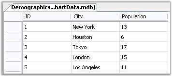

::: {style="DISPLAY: none"}
{#d2h_url_template}{#d2h_package_url style="WIDTH: 0px; DISPLAY: none; HEIGHT: 0px"}
:::

::::: {#nsbanner .d2h_main_nsbanner style="BORDER-BOTTOM: #999999 1px solid; POSITION: relative; PADDING-BOTTOM: 0px; BACKGROUND-COLOR: transparent; PADDING-LEFT: 0px; PADDING-RIGHT: 0px; DISPLAY: none; BORDER-TOP: #999999 1px solid; PADDING-TOP: 0px; LEFT: 0px"}
:::: {#TitleRow .d2h_main_titlerow style="PADDING-BOTTOM: 4px; BACKGROUND-COLOR: transparent; PADDING-LEFT: 22px; WIDTH: 100%; PADDING-RIGHT: 10px; DISPLAY: none; PADDING-TOP: 4px"}
::: {#ienav .d2h_main_ienav style="DISPLAY: none"}
{#D2HPrevious .D2HPreviousEnabled}  {#D2HNext .D2HNextEnabled}
:::
::::
:::::

:::: {#nstext .d2h_main_nstext style="PADDING-BOTTOM: 10px; BACKGROUND-COLOR: transparent; PADDING-LEFT: 22px; PADDING-RIGHT: 10px; HEIGHT: 100%; OVERFLOW: auto; PADDING-TOP: 5px" hasuserbackground="true" valign="bottom"}
::: {#d2h_breadcrumbs .d2h_breadcrumbs}
[Essential Studio User Guide Documentation](ms-xhelp:///?Id=12457748-09e3-4d74-a240-8e049cedf030){.d2h_breadcrumbsNormal}[ \> ]{.d2h_breadcrumbsLinkSeparator}[User Interface Edition](ms-xhelp:///?Id=c29296b7-531c-413b-a0ec-488ca1f7f669){.d2h_breadcrumbsNormal}[ \> ]{.d2h_breadcrumbsLinkSeparator}[Essential Windows](ms-xhelp:///?Id=e60759d8-47a4-4570-9d7a-16a68d63f2ea){.d2h_breadcrumbsNormal}[ \> ]{.d2h_breadcrumbsLinkSeparator}[Essential Chart]{.d2h_breadcrumbsContentsOnly}[ \> ]{.d2h_breadcrumbsLinkSeparator}[Concepts and Features](ms-xhelp:///?Id=71321e9c-336c-4c1c-a127-be9f135ad4bb){.d2h_breadcrumbsNormal}[ \> ]{.d2h_breadcrumbsLinkSeparator}[Chart Data](ms-xhelp:///?Id=419e4d4d-9b27-4bd7-b74d-dbc80d98fca5){.d2h_breadcrumbsNormal}
:::

### Binding a DataSet to the Chart {#binding-a-dataset-to-the-chart style="tab-stops: 0pt"}

 

The following sample code illustrates how a custom **DataSet** can be bound to a **ChartSeries** to provide data points and to a **ChartAxis** to provide label names. Note that the DataSet can easily be replaced with a **DataTable** or **DataView**.

 

{border="0"}

 

Figure 24: Access Table data that is about to get bound to Chart

 

+---------------------------------------------------------------------------------------------------------------------------------------------------------------------------------------------------------------------------------+
| **[\[C#\]]{style="FONT-FAMILY: 'Courier New'; COLOR: black"}**                                                                                                                                                                  |
|                                                                                                                                                                                                                                 |
| []{style="FONT-FAMILY: 'Courier New'; COLOR: black"}                                                                                                                                                                            |
|                                                                                                                                                                                                                                 |
| [ChartDataBindModel model = [null]{style="COLOR: blue"};]{style="FONT-FAMILY: 'Courier New'"}                                                                                                                                   |
|                                                                                                                                                                                                                                 |
| [ChartDataBindAxisLabelModel xAxisLabelModel = [null]{style="COLOR: blue"};]{style="FONT-FAMILY: 'Courier New'"}                                                                                                                |
|                                                                                                                                                                                                                                 |
| []{style="FONT-FAMILY: 'Courier New'"}                                                                                                                                                                                          |
|                                                                                                                                                                                                                                 |
| [// A custom DataSet bound to the Demographics table]{style="FONT-FAMILY: 'Courier New'; COLOR: green"}                                                                                                                         |
|                                                                                                                                                                                                                                 |
| [private]{style="FONT-FAMILY: 'Courier New'; COLOR: blue"}[ ChartAccessDataBind.DataSet1 dataSet11;]{style="FONT-FAMILY: 'Courier New'"}                                                                                        |
|                                                                                                                                                                                                                                 |
| []{style="FONT-FAMILY: 'Courier New'"}                                                                                                                                                                                          |
|                                                                                                                                                                                                                                 |
| [this]{style="FONT-FAMILY: 'Courier New'; COLOR: blue"}[.oleDbDataAdapter1.Fill([this]{style="COLOR: blue"}.dataSet11.Demographics);]{style="FONT-FAMILY: 'Courier New'"}                                                       |
|                                                                                                                                                                                                                                 |
| []{style="FONT-FAMILY: 'Courier New'"}                                                                                                                                                                                          |
|                                                                                                                                                                                                                                 |
| [model = [new]{style="COLOR: blue"} ChartDataBindModel([this]{style="COLOR: blue"}.dataSet11,\"Demographics\");]{style="FONT-FAMILY: 'Courier New'"}                                                                            |
|                                                                                                                                                                                                                                 |
| [// The column that contains the X values.]{style="FONT-FAMILY: 'Courier New'; COLOR: green"}                                                                                                                                   |
|                                                                                                                                                                                                                                 |
| [model.XName = \"ID\";]{style="FONT-FAMILY: 'Courier New'"}                                                                                                                                                                     |
|                                                                                                                                                                                                                                 |
| [// The columns that contain the Y values.]{style="FONT-FAMILY: 'Courier New'; COLOR: green"}                                                                                                                                   |
|                                                                                                                                                                                                                                 |
| [model.YNames = [new]{style="COLOR: blue"} [string]{style="COLOR: blue"}\[\]{\"Population\"};]{style="FONT-FAMILY: 'Courier New'"}                                                                                              |
|                                                                                                                                                                                                                                 |
| []{style="FONT-FAMILY: 'Courier New'"}                                                                                                                                                                                          |
|                                                                                                                                                                                                                                 |
| [ChartSeries series = [this]{style="COLOR: blue"}.chartControl1.Model.NewSeries(\"Data Bound Series\");]{style="FONT-FAMILY: 'Courier New'"}                                                                                    |
|                                                                                                                                                                                                                                 |
| [series.Text = series.Name;]{style="FONT-FAMILY: 'Courier New'"}                                                                                                                                                                |
|                                                                                                                                                                                                                                 |
| [series.SeriesModelImpl = model;]{style="FONT-FAMILY: 'Courier New'"}                                                                                                                                                           |
|                                                                                                                                                                                                                                 |
| []{style="FONT-FAMILY: 'Courier New'"}                                                                                                                                                                                          |
|                                                                                                                                                                                                                                 |
| [series.Style.TextColor = Color.White ;]{style="FONT-FAMILY: 'Courier New'"}                                                                                                                                                    |
|                                                                                                                                                                                                                                 |
| [series.Style.Font.Bold = [true]{style="COLOR: blue"};]{style="FONT-FAMILY: 'Courier New'"}                                                                                                                                     |
|                                                                                                                                                                                                                                 |
| []{style="FONT-FAMILY: 'Courier New'"}                                                                                                                                                                                          |
|                                                                                                                                                                                                                                 |
| [this]{style="FONT-FAMILY: 'Courier New'; COLOR: blue"}[.chartControl1.Series.Add(series);]{style="FONT-FAMILY: 'Courier New'"}                                                                                                 |
|                                                                                                                                                                                                                                 |
| []{style="FONT-FAMILY: 'Courier New'"}                                                                                                                                                                                          |
|                                                                                                                                                                                                                                 |
| [this]{style="FONT-FAMILY: 'Courier New'; COLOR: blue"}[.xAxisLabelModel = [new]{style="COLOR: blue"} ChartDataBindAxisLabelModel([this]{style="COLOR: blue"}.dataSet11,\"Demographics\");]{style="FONT-FAMILY: 'Courier New'"} |
|                                                                                                                                                                                                                                 |
| [// The columns that has the label values for the corresponding X values.]{style="FONT-FAMILY: 'Courier New'; COLOR: green"}                                                                                                    |
|                                                                                                                                                                                                                                 |
| [this]{style="FONT-FAMILY: 'Courier New'; COLOR: blue"}[.xAxisLabelModel.LabelName = \"City\";]{style="FONT-FAMILY: 'Courier New'"}                                                                                             |
|                                                                                                                                                                                                                                 |
| []{style="FONT-FAMILY: 'Courier New'"}                                                                                                                                                                                          |
|                                                                                                                                                                                                                                 |
| [this]{style="FONT-FAMILY: 'Courier New'; COLOR: blue"}[.chartControl1.PrimaryXAxis.LabelsImpl = [this]{style="COLOR: blue"}.xAxisLabelModel;]{style="FONT-FAMILY: 'Courier New'"}                                              |
|                                                                                                                                                                                                                                 |
| [this]{style="FONT-FAMILY: 'Courier New'; COLOR: blue"}[.chartControl1.PrimaryXAxis.ValueType = ChartValueType.Custom;]{style="FONT-FAMILY: 'Courier New'"}                                                                     |
+---------------------------------------------------------------------------------------------------------------------------------------------------------------------------------------------------------------------------------+

 

+----------------------------------------------------------------------------------------------------------------------------------------------------------------------------------------------------------------------------+
| **[\[VB.NET\]]{style="FONT-FAMILY: 'Courier New'; COLOR: black"}**                                                                                                                                                         |
|                                                                                                                                                                                                                            |
| []{style="FONT-FAMILY: 'Courier New'; COLOR: black"}                                                                                                                                                                       |
|                                                                                                                                                                                                                            |
| [Dim]{style="FONT-FAMILY: 'Courier New'; COLOR: blue"}[ model [As]{style="COLOR: blue"} ChartDataBindModel =[ Nothing]{style="COLOR: blue"}]{style="FONT-FAMILY: 'Courier New'"}                                           |
|                                                                                                                                                                                                                            |
| [Dim]{style="FONT-FAMILY: 'Courier New'; COLOR: blue"}[ xAxisLabelModel [As]{style="COLOR: blue"} ChartDataBindAxisLabelModel = [Nothing]{style="COLOR: blue"}]{style="FONT-FAMILY: 'Courier New'"}                        |
|                                                                                                                                                                                                                            |
| []{style="FONT-FAMILY: 'Courier New'"}                                                                                                                                                                                     |
|                                                                                                                                                                                                                            |
| [\' A custom DataSet bound to the Demographics table]{style="FONT-FAMILY: 'Courier New'; COLOR: green"}                                                                                                                    |
|                                                                                                                                                                                                                            |
| [Private]{style="FONT-FAMILY: 'Courier New'; COLOR: blue"}[ dataSet11 [As]{style="COLOR: blue"} ChartAccessDataBind.DataSet1]{style="FONT-FAMILY: 'Courier New'"}                                                          |
|                                                                                                                                                                                                                            |
| []{style="FONT-FAMILY: 'Courier New'"}                                                                                                                                                                                     |
|                                                                                                                                                                                                                            |
| [Me]{style="FONT-FAMILY: 'Courier New'; COLOR: blue"}[.oleDbDataAdapter1.Fill([Me]{style="COLOR: blue"}.dataSet11.Demographics)]{style="FONT-FAMILY: 'Courier New'"}                                                       |
|                                                                                                                                                                                                                            |
| []{style="FONT-FAMILY: 'Courier New'"}                                                                                                                                                                                     |
|                                                                                                                                                                                                                            |
| [model = [New]{style="COLOR: blue"} ChartDataBindModel([Me]{style="COLOR: blue"}.dataSet11,\"Demographics\")]{style="FONT-FAMILY: 'Courier New'"}                                                                          |
|                                                                                                                                                                                                                            |
| [\' The column that contains the X values.]{style="FONT-FAMILY: 'Courier New'; COLOR: green"}                                                                                                                              |
|                                                                                                                                                                                                                            |
| [model.XName = \"ID\"]{style="FONT-FAMILY: 'Courier New'"}                                                                                                                                                                 |
|                                                                                                                                                                                                                            |
| [\' The columns that contain the Y values.]{style="FONT-FAMILY: 'Courier New'; COLOR: green"}                                                                                                                              |
|                                                                                                                                                                                                                            |
| [model.YNames = [New String]{style="COLOR: blue"}(){\"Population\"}]{style="FONT-FAMILY: 'Courier New'"}                                                                                                                   |
|                                                                                                                                                                                                                            |
| []{style="FONT-FAMILY: 'Courier New'"}                                                                                                                                                                                     |
|                                                                                                                                                                                                                            |
| [Dim]{style="FONT-FAMILY: 'Courier New'; COLOR: blue"}[ series [As]{style="COLOR: blue"} ChartSeries = [Me]{style="COLOR: blue"}.chartControl1.Model.NewSeries(\"Data Bound Series\")]{style="FONT-FAMILY: 'Courier New'"} |
|                                                                                                                                                                                                                            |
| [series.Text = series.Name]{style="FONT-FAMILY: 'Courier New'"}                                                                                                                                                            |
|                                                                                                                                                                                                                            |
| [series.SeriesModelImpl = model]{style="FONT-FAMILY: 'Courier New'"}                                                                                                                                                       |
|                                                                                                                                                                                                                            |
| []{style="FONT-FAMILY: 'Courier New'"}                                                                                                                                                                                     |
|                                                                                                                                                                                                                            |
| [series.Style.TextColor = Color.White]{style="FONT-FAMILY: 'Courier New'"}                                                                                                                                                 |
|                                                                                                                                                                                                                            |
| [series.Style.Font.Bold = [True]{style="COLOR: blue"}]{style="FONT-FAMILY: 'Courier New'"}                                                                                                                                 |
|                                                                                                                                                                                                                            |
| []{style="FONT-FAMILY: 'Courier New'"}                                                                                                                                                                                     |
|                                                                                                                                                                                                                            |
| [Me]{style="FONT-FAMILY: 'Courier New'; COLOR: blue"}[.chartControl1.Series.Add(series)]{style="FONT-FAMILY: 'Courier New'"}                                                                                               |
|                                                                                                                                                                                                                            |
| []{style="FONT-FAMILY: 'Courier New'"}                                                                                                                                                                                     |
|                                                                                                                                                                                                                            |
| [Me]{style="FONT-FAMILY: 'Courier New'; COLOR: blue"}[.xAxisLabelModel = [New]{style="COLOR: blue"} ChartDataBindAxisLabelModel(Me.dataSet11,\"Demographics\")]{style="FONT-FAMILY: 'Courier New'"}                        |
|                                                                                                                                                                                                                            |
| [\' The columns that has the label values for the corresponding X values.]{style="FONT-FAMILY: 'Courier New'; COLOR: green"}                                                                                               |
|                                                                                                                                                                                                                            |
| [Me]{style="FONT-FAMILY: 'Courier New'; COLOR: blue"}[.xAxisLabelModel.LabelName = \"City\"]{style="FONT-FAMILY: 'Courier New'"}                                                                                           |
|                                                                                                                                                                                                                            |
| []{style="FONT-FAMILY: 'Courier New'"}                                                                                                                                                                                     |
|                                                                                                                                                                                                                            |
| [Me]{style="FONT-FAMILY: 'Courier New'; COLOR: blue"}[.chartControl1.PrimaryXAxis.LabelsImpl = [Me]{style="COLOR: blue"}.xAxisLabelModel]{style="FONT-FAMILY: 'Courier New'"}                                              |
|                                                                                                                                                                                                                            |
| [Me]{style="FONT-FAMILY: 'Courier New'; COLOR: blue"}[.chartControl1.PrimaryXAxis.ValueType = ChartValueType.Custom]{style="FONT-FAMILY: 'Courier New'"}                                                                   |
+----------------------------------------------------------------------------------------------------------------------------------------------------------------------------------------------------------------------------+

 

{border="0"}

 

Figure 25: Demographics DataSet bounded to the Chart

 

[]{#p22} 

 

 

[]{#related-topics}
::::
