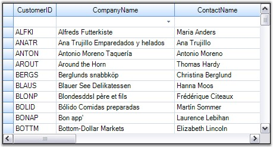

::: {style="DISPLAY: none"}
{#d2h_url_template}{#d2h_package_url style="WIDTH: 0px; DISPLAY: none; HEIGHT: 0px"}
:::

::: {.d2h_secondary_topic style="PADDING-BOTTOM: 10pt; MARGIN: 0pt; PADDING-LEFT: 0pt; PADDING-RIGHT: 0pt; PADDING-TOP: 0pt"}
##### Binding a Grid Grouping Control to an MDB File {#binding-a-grid-grouping-control-to-an-mdb-file style="tab-stops: 0pt"}

[]{style="FONT-FAMILY: 'Trebuchet MS','sans-serif'; COLOR: #15428b; FONT-SIZE: 9pt"} 

This example illustrates how to bind a Grid Grouping control to an MDB file at run time. It uses OleDbConnection and OleDbAdapter objects to get connected to a data source that exposes OLE DB interface. Try a similar approach to connect to a database from MS SQL Server.

[]{style="FONT-FAMILY: 'Trebuchet MS','sans-serif'; COLOR: #15428b; FONT-SIZE: 9pt"} 

1.   Include the required namespace.

[]{style="FONT-FAMILY: 'Trebuchet MS','sans-serif'; COLOR: #15428b; FONT-SIZE: 9pt"} 

+-----------------------------------------------------------------------+
| \[C#\]                                                                |
|                                                                       |
| []{style="COLOR: #15428b"}                                            |
|                                                                       |
| [using ]{style="COLOR: blue"}Synctusion.Windows.Forms.Grid.Grouping;  |
|                                                                       |
| [using]{style="COLOR: blue"} System.Data.OleDb;                       |
+-----------------------------------------------------------------------+

[]{style="FONT-FAMILY: 'Trebuchet MS','sans-serif'; COLOR: #15428b; FONT-SIZE: 9pt"} 

+-----------------------------------------------------------------------------------------------------------------------------------------+
| **[\[VB.NET\]]{style="FONT-FAMILY: 'Courier New'; COLOR: black"}**                                                                      |
|                                                                                                                                         |
| []{style="FONT-FAMILY: 'Courier New'; COLOR: #15428b"}                                                                                  |
|                                                                                                                                         |
| [Imports ]{style="FONT-FAMILY: 'Courier New'; COLOR: blue"}[Synctusion.Windows.Forms.Grid.Grouping]{style="FONT-FAMILY: 'Courier New'"} |
|                                                                                                                                         |
| [Imports ]{style="FONT-FAMILY: 'Courier New'; COLOR: blue"}[System.Data.OleDb]{style="FONT-FAMILY: 'Courier New'"}                      |
+-----------------------------------------------------------------------------------------------------------------------------------------+

[]{style="FONT-FAMILY: 'Trebuchet MS','sans-serif'; COLOR: #15428b; FONT-SIZE: 9pt"} 

2.   Create an instance of Grid Grouping control and specify its size.

[]{style="FONT-FAMILY: 'Trebuchet MS','sans-serif'; COLOR: #15428b; FONT-SIZE: 9pt"} 

+-----------------------------------------------------------------------------------------------------------------------------------------------------------------------------------------------------------------------------------------+
| **[\[C#\]]{style="FONT-FAMILY: 'Courier New'; COLOR: black"}**                                                                                                                                                                          |
|                                                                                                                                                                                                                                         |
| []{style="FONT-FAMILY: 'Courier New'; COLOR: #15428b"}                                                                                                                                                                                  |
|                                                                                                                                                                                                                                         |
| [private]{style="FONT-FAMILY: 'Courier New'; COLOR: blue"}[ Syncfusion.Windows.Forms.Grid.Grouping.[GridGroupingControl]{style="COLOR: #2b91af"} gridGroupingControl1;]{style="FONT-FAMILY: 'Courier New'"}                             |
|                                                                                                                                                                                                                                         |
| []{style="FONT-FAMILY: 'Courier New'"}                                                                                                                                                                                                  |
|                                                                                                                                                                                                                                         |
| [this]{style="FONT-FAMILY: 'Courier New'; COLOR: blue"}[.gridGroupingControl1 = [new]{style="COLOR: blue"} Syncfusion.Windows.Forms.Grid.Grouping.[GridGroupingControl]{style="COLOR: #2b91af"}();]{style="FONT-FAMILY: 'Courier New'"} |
|                                                                                                                                                                                                                                         |
| [this]{style="FONT-FAMILY: 'Courier New'; COLOR: blue"}[.gridGroupingControl1.Size = [new]{style="COLOR: blue"} System.Drawing.[Size]{style="COLOR: #2b91af"}(160, 200 );]{style="FONT-FAMILY: 'Courier New'"}                          |
+-----------------------------------------------------------------------------------------------------------------------------------------------------------------------------------------------------------------------------------------+

[]{style="FONT-FAMILY: 'Trebuchet MS','sans-serif'; COLOR: #15428b; FONT-SIZE: 9pt"} 

+------------------------------------------------------------------------------------------------------------------------------------------------------------------------------------------------------------+
| **[\[VB.NET\]]{style="FONT-FAMILY: 'Courier New'; COLOR: black"}**                                                                                                                                         |
|                                                                                                                                                                                                            |
| []{style="FONT-FAMILY: 'Courier New'; COLOR: #15428b"}                                                                                                                                                     |
|                                                                                                                                                                                                            |
| [Private]{style="FONT-FAMILY: 'Courier New'; COLOR: blue"}[ gridGroupingControl1 [As]{style="COLOR: blue"} Syncfusion.Windows.Forms.Grid.Grouping.GridGroupingControl]{style="FONT-FAMILY: 'Courier New'"} |
|                                                                                                                                                                                                            |
| []{style="FONT-FAMILY: 'Courier New'; COLOR: blue"}                                                                                                                                                        |
|                                                                                                                                                                                                            |
| [Me]{style="FONT-FAMILY: 'Courier New'; COLOR: blue"}[.gridGroupingControl1 = [New]{style="COLOR: blue"} Syncfusion.Windows.Forms.Grid.Grouping.GridGroupingControl()]{style="FONT-FAMILY: 'Courier New'"} |
|                                                                                                                                                                                                            |
| [Me]{style="FONT-FAMILY: 'Courier New'; COLOR: blue"}[.gridGroupingControl1.Size = [New]{style="COLOR: blue"} System.Drawing.Size(160, 200 )]{style="FONT-FAMILY: 'Courier New'"}                          |
+------------------------------------------------------------------------------------------------------------------------------------------------------------------------------------------------------------+

 

3.   Set up the Data Source.

[]{style="FONT-FAMILY: 'Trebuchet MS','sans-serif'; COLOR: #15428b; FONT-SIZE: 9pt"} 

+----------------------------------------------------------------------------------------------------------------------------------------------------------------------------------------------------------------------------------------------------------------------------------------------------+
| **[\[C#\]]{style="FONT-FAMILY: 'Courier New'; COLOR: black"}**                                                                                                                                                                                                                                     |
|                                                                                                                                                                                                                                                                                                    |
| []{style="FONT-FAMILY: 'Courier New'; COLOR: #15428b"}                                                                                                                                                                                                                                             |
|                                                                                                                                                                                                                                                                                                    |
| [// Create a Connection Object. ]{style="FONT-FAMILY: 'Courier New'; COLOR: green"}                                                                                                                                                                                                                |
|                                                                                                                                                                                                                                                                                                    |
| [OleDbConnection]{style="FONT-FAMILY: 'Courier New'; COLOR: #2b91af"}[ connection = [new]{style="COLOR: blue"} [OleDbConnection]{style="COLOR: #2b91af"}([\"Provider=Microsoft.Jet.OLEDB.4.0;Data Source=C:\\\\Data\\\\NWIND.MDB\"]{style="COLOR: #a31515"});]{style="FONT-FAMILY: 'Courier New'"} |
|                                                                                                                                                                                                                                                                                                    |
| []{style="FONT-FAMILY: 'Courier New'"}                                                                                                                                                                                                                                                             |
|                                                                                                                                                                                                                                                                                                    |
| [// Create a Data Adapter. ]{style="FONT-FAMILY: 'Courier New'; COLOR: green"}                                                                                                                                                                                                                     |
|                                                                                                                                                                                                                                                                                                    |
| [OleDbDataAdapter]{style="FONT-FAMILY: 'Courier New'; COLOR: #2b91af"}[ adapter = [new]{style="COLOR: blue"} [OleDbDataAdapter]{style="COLOR: #2b91af"}([\"SELECT \* FROM Customers\"]{style="COLOR: #a31515"}, connection);]{style="FONT-FAMILY: 'Courier New'"}                                  |
|                                                                                                                                                                                                                                                                                                    |
| []{style="FONT-FAMILY: 'Courier New'"}                                                                                                                                                                                                                                                             |
|                                                                                                                                                                                                                                                                                                    |
| [// Create and fill a Data Set. ]{style="FONT-FAMILY: 'Courier New'; COLOR: green"}                                                                                                                                                                                                                |
|                                                                                                                                                                                                                                                                                                    |
| [DataSet]{style="FONT-FAMILY: 'Courier New'; COLOR: #2b91af"}[ dtSet = [new]{style="COLOR: blue"} [DataSet]{style="COLOR: #2b91af"}();]{style="FONT-FAMILY: 'Courier New'"}                                                                                                                        |
|                                                                                                                                                                                                                                                                                                    |
| [adapter.Fill(dtSet);]{style="FONT-FAMILY: 'Courier New'"}                                                                                                                                                                                                                                         |
+----------------------------------------------------------------------------------------------------------------------------------------------------------------------------------------------------------------------------------------------------------------------------------------------------+

[]{style="FONT-FAMILY: 'Trebuchet MS','sans-serif'; COLOR: #15428b; FONT-SIZE: 9pt"} 

+----------------------------------------------------------------------------------------------------------------------------------------------------------------------------------------------------------------------------------------------------------------------------------------------------+
| **[\[VB.NET\]]{style="FONT-FAMILY: 'Courier New'; COLOR: black"}**                                                                                                                                                                                                                                 |
|                                                                                                                                                                                                                                                                                                    |
| []{style="FONT-FAMILY: 'Courier New'; COLOR: green"}                                                                                                                                                                                                                                               |
|                                                                                                                                                                                                                                                                                                    |
| [\' Create a Connection Object. ]{style="FONT-FAMILY: 'Courier New'; COLOR: green"}                                                                                                                                                                                                                |
|                                                                                                                                                                                                                                                                                                    |
| [Dim]{style="FONT-FAMILY: 'Courier New'; COLOR: blue"}[ Connection [As]{style="COLOR: blue"} OleDbConnection = [New]{style="COLOR: blue"} OleDbConnection([\"Provider=Microsoft.Jet.OLEDB.4.0;Data Source=C:\\\\Data\\\\NWIND.MDB\"]{style="COLOR: #a31515"})]{style="FONT-FAMILY: 'Courier New'"} |
|                                                                                                                                                                                                                                                                                                    |
| []{style="FONT-FAMILY: 'Courier New'"}                                                                                                                                                                                                                                                             |
|                                                                                                                                                                                                                                                                                                    |
| [\' Create a Data Adapter. ]{style="FONT-FAMILY: 'Courier New'; COLOR: green"}                                                                                                                                                                                                                     |
|                                                                                                                                                                                                                                                                                                    |
| [Dim]{style="FONT-FAMILY: 'Courier New'; COLOR: blue"}[ Adapter [As]{style="COLOR: blue"} OleDbDataAdapter = [New]{style="COLOR: blue"} OleDbDataAdapter([\"SELECT \* FROM Customers\"]{style="COLOR: #a31515"}, Connection)]{style="FONT-FAMILY: 'Courier New'"}                                  |
|                                                                                                                                                                                                                                                                                                    |
| []{style="FONT-FAMILY: 'Courier New'"}                                                                                                                                                                                                                                                             |
|                                                                                                                                                                                                                                                                                                    |
| [\' Create and fill a Data Set.]{style="FONT-FAMILY: 'Courier New'; COLOR: green"}                                                                                                                                                                                                                 |
|                                                                                                                                                                                                                                                                                                    |
| [Dim]{style="FONT-FAMILY: 'Courier New'; COLOR: blue"}[ dtSet [As]{style="COLOR: blue"} DataSet = [New]{style="COLOR: blue"} DataSet()]{style="FONT-FAMILY: 'Courier New'"}                                                                                                                        |
|                                                                                                                                                                                                                                                                                                    |
| [Adapter.Fill(dtSet)]{style="FONT-FAMILY: 'Courier New'"}                                                                                                                                                                                                                                          |
+----------------------------------------------------------------------------------------------------------------------------------------------------------------------------------------------------------------------------------------------------------------------------------------------------+

[]{style="FONT-FAMILY: 'Trebuchet MS','sans-serif'; COLOR: #15428b; FONT-SIZE: 9pt"} 

4.   Bind the grid grouping control to this data table by setting its **DataSource** property.

[]{style="FONT-FAMILY: 'Trebuchet MS','sans-serif'; COLOR: #15428b; FONT-SIZE: 9pt"} 

+---------------------------------------------------------------------------------------------------------------------------------------------------------------------------------------------------------------------------------+
| **[\[C#\]]{style="FONT-FAMILY: 'Courier New'; COLOR: black"}**                                                                                                                                                                  |
|                                                                                                                                                                                                                                 |
| []{style="FONT-FAMILY: 'Courier New'; COLOR: #15428b"}                                                                                                                                                                          |
|                                                                                                                                                                                                                                 |
| [this]{style="FONT-FAMILY: 'Courier New'; COLOR: blue"}[.gridGroupingControl1.DataSource = ]{style="FONT-FAMILY: 'Courier New'; COLOR: black"}[dtSet.Tables\[0\][; ]{style="COLOR: black"}]{style="FONT-FAMILY: 'Courier New'"} |
+---------------------------------------------------------------------------------------------------------------------------------------------------------------------------------------------------------------------------------+

[]{style="FONT-FAMILY: 'Trebuchet MS','sans-serif'; COLOR: #15428b; FONT-SIZE: 9pt"} 

+---------------------------------------------------------------------------------------------------------------------------------------------------------------------------------------------------+
| **[\[VB.NET\]]{style="FONT-FAMILY: 'Courier New'; COLOR: black"}**                                                                                                                                |
|                                                                                                                                                                                                   |
| []{style="FONT-FAMILY: 'Courier New'; COLOR: #15428b"}                                                                                                                                            |
|                                                                                                                                                                                                   |
| [Me]{style="FONT-FAMILY: 'Courier New'; COLOR: blue"}[.GridGroupingControl1.DataSource = ]{style="FONT-FAMILY: 'Courier New'; COLOR: black"}[dtSet.Tables(0)]{style="FONT-FAMILY: 'Courier New'"} |
+---------------------------------------------------------------------------------------------------------------------------------------------------------------------------------------------------+

[]{style="FONT-FAMILY: 'Trebuchet MS','sans-serif'; COLOR: #15428b; FONT-SIZE: 9pt"} 

5.   Finally add the grid grouping control to the form.

[]{style="FONT-FAMILY: 'Trebuchet MS','sans-serif'; COLOR: #15428b; FONT-SIZE: 9pt"} 

+--------------------------------------------------------------------------------------------------------------------------------------------------------------------------------------------------------------------------------------------------------------+
| **[\[C#\]]{style="FONT-FAMILY: 'Courier New'; COLOR: black"}**                                                                                                                                                                                               |
|                                                                                                                                                                                                                                                              |
| []{style="FONT-FAMILY: 'Courier New'; COLOR: #15428b"}                                                                                                                                                                                                       |
|                                                                                                                                                                                                                                                              |
| [this]{style="FONT-FAMILY: 'Courier New'; COLOR: blue"}[.Controls.Add(]{style="FONT-FAMILY: 'Courier New'; COLOR: black"}[this]{style="FONT-FAMILY: 'Courier New'; COLOR: blue"}[.gridGroupingControl1); ]{style="FONT-FAMILY: 'Courier New'; COLOR: black"} |
+--------------------------------------------------------------------------------------------------------------------------------------------------------------------------------------------------------------------------------------------------------------+

[]{style="FONT-FAMILY: 'Trebuchet MS','sans-serif'; COLOR: #15428b; FONT-SIZE: 9pt"} 

+--------------------------------------------------------------------------------------------------------------------------------------------------------------------------------------------------------------------------------------------------------+
| **[\[VB.NET\]]{style="FONT-FAMILY: 'Courier New'; COLOR: black"}**                                                                                                                                                                                     |
|                                                                                                                                                                                                                                                        |
| []{style="FONT-FAMILY: 'Courier New'; COLOR: #15428b"}                                                                                                                                                                                                 |
|                                                                                                                                                                                                                                                        |
| [Me]{style="FONT-FAMILY: 'Courier New'; COLOR: blue"}[.Controls.Add(]{style="FONT-FAMILY: 'Courier New'; COLOR: black"}[Me]{style="FONT-FAMILY: 'Courier New'; COLOR: blue"}[.GridGroupingControl1)]{style="FONT-FAMILY: 'Courier New'; COLOR: black"} |
+--------------------------------------------------------------------------------------------------------------------------------------------------------------------------------------------------------------------------------------------------------+

[]{style="FONT-FAMILY: 'Trebuchet MS','sans-serif'; COLOR: #15428b; FONT-SIZE: 9pt"} 

6.   When you run the application, the grid will look like the one in the following image.

[]{style="FONT-FAMILY: 'Trebuchet MS','sans-serif'; COLOR: #15428b; FONT-SIZE: 9pt"} 

{border="0"}

[]{style="FONT-FAMILY: 'Trebuchet MS','sans-serif'; COLOR: #15428b; FONT-SIZE: 9pt"} 

*[Figure ]{style="FONT-SIZE: 9pt"}[231]{style="FONT-SIZE: 9pt"}[: Binding a Grid Grouping control to an MDB File]{style="FONT-SIZE: 9pt"}*

 

[]{#p393} 

 

[]{#related-topics}
:::
