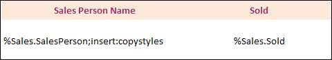
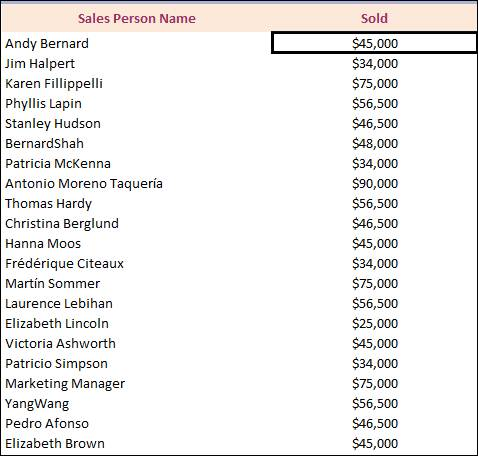
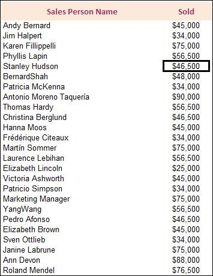

::: {style="DISPLAY: none"}
{#d2h_url_template}{#d2h_package_url style="WIDTH: 0px; DISPLAY: none; HEIGHT: 0px"}
:::

::: {.d2h_secondary_topic style="PADDING-BOTTOM: 10pt; MARGIN: 0pt; PADDING-LEFT: 0pt; PADDING-RIGHT: 0pt; PADDING-TOP: 0pt"}
##### Binding Business Objects to Template Markers {#binding-business-objects-to-template-markers style="tab-stops: 0pt"}

[]{style="BACKGROUND: white; COLOR: black"} 

The Marker Syntax with business objects is shown below:

[]{style="BACKGROUND: white; COLOR: black"} 

{border="0"}[]{style="BACKGROUND: white; COLOR: black"}

Figure 97

[]{style="BACKGROUND: white; COLOR: black"} 

[The following code snippet illustrates the binding of data from a business object, to a marker.]{style="BACKGROUND: white"}

[]{style="BACKGROUND: white; COLOR: black"} 

+-----------------------------------------------------------------------------------------------------------------------------------------------------------------------+
| **[\[C#\]]{style="FONT-FAMILY: 'Courier New'"}**                                                                                                                      |
|                                                                                                                                                                       |
|  [//Definition of the business objects]{style="FONT-FAMILY: Consolas; COLOR: green; FONT-SIZE: 9.5pt"}                                                                |
|                                                                                                                                                                       |
| [class]{style="FONT-FAMILY: Consolas; COLOR: blue; FONT-SIZE: 9.5pt"}[ [Sales]{style="COLOR: #2b91af"}]{style="FONT-FAMILY: Consolas; FONT-SIZE: 9.5pt"}              |
|                                                                                                                                                                       |
| [    {]{style="FONT-FAMILY: Consolas; FONT-SIZE: 9.5pt"}                                                                                                              |
|                                                                                                                                                                       |
| [        [private]{style="COLOR: blue"} [string]{style="COLOR: blue"} m_salesPerson;]{style="FONT-FAMILY: Consolas; FONT-SIZE: 9.5pt"}                                |
|                                                                                                                                                                       |
| [        [private]{style="COLOR: blue"} [int]{style="COLOR: blue"} m_sold;]{style="FONT-FAMILY: Consolas; FONT-SIZE: 9.5pt"}                                          |
|                                                                                                                                                                       |
| []{style="FONT-FAMILY: Consolas; FONT-SIZE: 9.5pt"}                                                                                                                   |
|                                                                                                                                                                       |
| [        [public]{style="COLOR: blue"} [string]{style="COLOR: blue"} SalesPerson]{style="FONT-FAMILY: Consolas; FONT-SIZE: 9.5pt"}                                    |
|                                                                                                                                                                       |
| [        {]{style="FONT-FAMILY: Consolas; FONT-SIZE: 9.5pt"}                                                                                                          |
|                                                                                                                                                                       |
| [            [get]{style="COLOR: blue"}]{style="FONT-FAMILY: Consolas; FONT-SIZE: 9.5pt"}                                                                             |
|                                                                                                                                                                       |
| [            {]{style="FONT-FAMILY: Consolas; FONT-SIZE: 9.5pt"}                                                                                                      |
|                                                                                                                                                                       |
| [                [return]{style="COLOR: blue"} m_salesPerson;]{style="FONT-FAMILY: Consolas; FONT-SIZE: 9.5pt"}                                                       |
|                                                                                                                                                                       |
| [            }]{style="FONT-FAMILY: Consolas; FONT-SIZE: 9.5pt"}                                                                                                      |
|                                                                                                                                                                       |
| [            [set]{style="COLOR: blue"}]{style="FONT-FAMILY: Consolas; FONT-SIZE: 9.5pt"}                                                                             |
|                                                                                                                                                                       |
| [            {]{style="FONT-FAMILY: Consolas; FONT-SIZE: 9.5pt"}                                                                                                      |
|                                                                                                                                                                       |
| [                m_salesPerson = [value]{style="COLOR: blue"};]{style="FONT-FAMILY: Consolas; FONT-SIZE: 9.5pt"}                                                      |
|                                                                                                                                                                       |
| [            }]{style="FONT-FAMILY: Consolas; FONT-SIZE: 9.5pt"}                                                                                                      |
|                                                                                                                                                                       |
| [        }]{style="FONT-FAMILY: Consolas; FONT-SIZE: 9.5pt"}                                                                                                          |
|                                                                                                                                                                       |
| []{style="FONT-FAMILY: Consolas; FONT-SIZE: 9.5pt"}                                                                                                                   |
|                                                                                                                                                                       |
| [        [public]{style="COLOR: blue"} [int]{style="COLOR: blue"} Sold]{style="FONT-FAMILY: Consolas; FONT-SIZE: 9.5pt"}                                              |
|                                                                                                                                                                       |
| [        {]{style="FONT-FAMILY: Consolas; FONT-SIZE: 9.5pt"}                                                                                                          |
|                                                                                                                                                                       |
| [            [get]{style="COLOR: blue"}]{style="FONT-FAMILY: Consolas; FONT-SIZE: 9.5pt"}                                                                             |
|                                                                                                                                                                       |
| [            {]{style="FONT-FAMILY: Consolas; FONT-SIZE: 9.5pt"}                                                                                                      |
|                                                                                                                                                                       |
| [                [return]{style="COLOR: blue"} m_sold ;]{style="FONT-FAMILY: Consolas; FONT-SIZE: 9.5pt"}                                                             |
|                                                                                                                                                                       |
| [            }]{style="FONT-FAMILY: Consolas; FONT-SIZE: 9.5pt"}                                                                                                      |
|                                                                                                                                                                       |
| [            [set]{style="COLOR: blue"}]{style="FONT-FAMILY: Consolas; FONT-SIZE: 9.5pt"}                                                                             |
|                                                                                                                                                                       |
| [            {]{style="FONT-FAMILY: Consolas; FONT-SIZE: 9.5pt"}                                                                                                      |
|                                                                                                                                                                       |
| [                m_sold = [value]{style="COLOR: blue"};]{style="FONT-FAMILY: Consolas; FONT-SIZE: 9.5pt"}                                                             |
|                                                                                                                                                                       |
| [            }]{style="FONT-FAMILY: Consolas; FONT-SIZE: 9.5pt"}                                                                                                      |
|                                                                                                                                                                       |
| []{style="FONT-FAMILY: Consolas; FONT-SIZE: 9.5pt"}                                                                                                                   |
|                                                                                                                                                                       |
| [        }]{style="FONT-FAMILY: Consolas; FONT-SIZE: 9.5pt"}                                                                                                          |
|                                                                                                                                                                       |
| [        [public]{style="COLOR: blue"} Customer([string]{style="COLOR: blue"} name,[int]{style="COLOR: blue"} sold)]{style="FONT-FAMILY: Consolas; FONT-SIZE: 9.5pt"} |
|                                                                                                                                                                       |
| [        {]{style="FONT-FAMILY: Consolas; FONT-SIZE: 9.5pt"}                                                                                                          |
|                                                                                                                                                                       |
| [            [this]{style="COLOR: blue"}.m_salesPerson = name;]{style="FONT-FAMILY: Consolas; FONT-SIZE: 9.5pt"}                                                      |
|                                                                                                                                                                       |
| [            [this]{style="COLOR: blue"}.m_sold = sold;]{style="FONT-FAMILY: Consolas; FONT-SIZE: 9.5pt"}                                                             |
|                                                                                                                                                                       |
| [        }]{style="FONT-FAMILY: Consolas; FONT-SIZE: 9.5pt"}                                                                                                          |
|                                                                                                                                                                       |
| [    }]{style="FONT-FAMILY: Consolas; FONT-SIZE: 9.5pt"}                                                                                                              |
|                                                                                                                                                                       |
|                                                                                                                                                                       |
|                                                                                                                                                                       |
|                                                                                                                                                                       |
|                                                                                                                                                                       |
| [// Creating Template Marker Processor]{style="FONT-FAMILY: 'Courier New'; COLOR: green"}                                                                             |
|                                                                                                                                                                       |
| [// Northwind Customers Table]{style="FONT-FAMILY: 'Courier New'; COLOR: green"}                                                                                      |
|                                                                                                                                                                       |
| [ITemplateMarkersProcessor marker = workbook.CreateTemplateMarkersProcessor();]{style="FONT-FAMILY: 'Courier New'"}                                                   |
|                                                                                                                                                                       |
| [marker.AddVariable([\"Sales\"]{style="COLOR: #a31515"}, arrSalesPerson);]{style="FONT-FAMILY: Consolas; FONT-SIZE: 9.5pt"}                                           |
|                                                                                                                                                                       |
|                                                                                                                                                                       |
|                                                                                                                                                                       |
|                                                                                                                                                                       |
|                                                                                                                                                                       |
| [// Processing the markers in the template]{style="FONT-FAMILY: 'Courier New'; COLOR: green"}                                                                         |
|                                                                                                                                                                       |
| [marker.ApplyMarkers();]{style="FONT-FAMILY: 'Courier New'"}                                                                                                          |
+-----------------------------------------------------------------------------------------------------------------------------------------------------------------------+

[]{style="BACKGROUND: white; COLOR: black"} 

Template Marker representing the HeaderName and NumberFormat

**[]{style="BACKGROUND: white; COLOR: black"}** 

[The following code example illustrates the binding of data from a business object to a marker, with the NumberFormat and HeaderName arguments.]{style="BACKGROUND: white"}

[]{style="BACKGROUND: white; COLOR: black"} 

{border="0"}

Figure 98

[]{style="BACKGROUND: white; COLOR: black"} 

+---------------------------------------------------------------------------------------------------------------------------------------------------------------------------------------------+
| **[\[C#\]]{style="FONT-FAMILY: 'Courier New'"}**                                                                                                                                            |
|                                                                                                                                                                                             |
|  [//Definition of the business objects with the marker argument]{style="FONT-FAMILY: Consolas; COLOR: green; FONT-SIZE: 9.5pt"}[]{style="FONT-FAMILY: Consolas; FONT-SIZE: 9.5pt"}          |
|                                                                                                                                                                                             |
| [    [class]{style="COLOR: blue"} [Sales]{style="COLOR: #2b91af"}]{style="FONT-FAMILY: Consolas; FONT-SIZE: 9.5pt"}                                                                         |
|                                                                                                                                                                                             |
| [    {]{style="FONT-FAMILY: Consolas; FONT-SIZE: 9.5pt"}                                                                                                                                    |
|                                                                                                                                                                                             |
| [        [private]{style="COLOR: blue"} [string]{style="COLOR: blue"} m_salesPerson;]{style="FONT-FAMILY: Consolas; FONT-SIZE: 9.5pt"}                                                      |
|                                                                                                                                                                                             |
| [        [private]{style="COLOR: blue"} [int]{style="COLOR: blue"} m_sold;]{style="FONT-FAMILY: Consolas; FONT-SIZE: 9.5pt"}                                                                |
|                                                                                                                                                                                             |
| []{style="FONT-FAMILY: Consolas; FONT-SIZE: 9.5pt"}                                                                                                                                         |
|                                                                                                                                                                                             |
| [        [public]{style="COLOR: blue"} [string]{style="COLOR: blue"} SalesPerson]{style="FONT-FAMILY: Consolas; FONT-SIZE: 9.5pt"}                                                          |
|                                                                                                                                                                                             |
| [        {]{style="FONT-FAMILY: Consolas; FONT-SIZE: 9.5pt"}                                                                                                                                |
|                                                                                                                                                                                             |
| [            [get]{style="COLOR: blue"}]{style="FONT-FAMILY: Consolas; FONT-SIZE: 9.5pt"}                                                                                                   |
|                                                                                                                                                                                             |
| [            {]{style="FONT-FAMILY: Consolas; FONT-SIZE: 9.5pt"}                                                                                                                            |
|                                                                                                                                                                                             |
| [                [return]{style="COLOR: blue"} m_salesPerson;]{style="FONT-FAMILY: Consolas; FONT-SIZE: 9.5pt"}                                                                             |
|                                                                                                                                                                                             |
| [            }]{style="FONT-FAMILY: Consolas; FONT-SIZE: 9.5pt"}                                                                                                                            |
|                                                                                                                                                                                             |
| [            [set]{style="COLOR: blue"}]{style="FONT-FAMILY: Consolas; FONT-SIZE: 9.5pt"}                                                                                                   |
|                                                                                                                                                                                             |
| [            {]{style="FONT-FAMILY: Consolas; FONT-SIZE: 9.5pt"}                                                                                                                            |
|                                                                                                                                                                                             |
| [                m_salesPerson = [value]{style="COLOR: blue"};]{style="FONT-FAMILY: Consolas; FONT-SIZE: 9.5pt"}                                                                            |
|                                                                                                                                                                                             |
| [            }]{style="FONT-FAMILY: Consolas; FONT-SIZE: 9.5pt"}                                                                                                                            |
|                                                                                                                                                                                             |
| [        }]{style="FONT-FAMILY: Consolas; FONT-SIZE: 9.5pt"}                                                                                                                                |
|                                                                                                                                                                                             |
| [        \[[TemplateMarkerAttributes]{style="COLOR: #2b91af"}([\"Sold\"]{style="COLOR: #a31515"},[\"\$#,###\"]{style="COLOR: #a31515"})\]]{style="FONT-FAMILY: Consolas; FONT-SIZE: 9.5pt"} |
|                                                                                                                                                                                             |
| [        [public]{style="COLOR: blue"} [int]{style="COLOR: blue"} Sold]{style="FONT-FAMILY: Consolas; FONT-SIZE: 9.5pt"}                                                                    |
|                                                                                                                                                                                             |
| [        {]{style="FONT-FAMILY: Consolas; FONT-SIZE: 9.5pt"}                                                                                                                                |
|                                                                                                                                                                                             |
| [            [get]{style="COLOR: blue"}]{style="FONT-FAMILY: Consolas; FONT-SIZE: 9.5pt"}                                                                                                   |
|                                                                                                                                                                                             |
| [            {]{style="FONT-FAMILY: Consolas; FONT-SIZE: 9.5pt"}                                                                                                                            |
|                                                                                                                                                                                             |
| [                [return]{style="COLOR: blue"} m_sold ;]{style="FONT-FAMILY: Consolas; FONT-SIZE: 9.5pt"}                                                                                   |
|                                                                                                                                                                                             |
| [            }]{style="FONT-FAMILY: Consolas; FONT-SIZE: 9.5pt"}                                                                                                                            |
|                                                                                                                                                                                             |
| [            [set]{style="COLOR: blue"}]{style="FONT-FAMILY: Consolas; FONT-SIZE: 9.5pt"}                                                                                                   |
|                                                                                                                                                                                             |
| [            {]{style="FONT-FAMILY: Consolas; FONT-SIZE: 9.5pt"}                                                                                                                            |
|                                                                                                                                                                                             |
| [                m_sold = [value]{style="COLOR: blue"};]{style="FONT-FAMILY: Consolas; FONT-SIZE: 9.5pt"}                                                                                   |
|                                                                                                                                                                                             |
| [            }]{style="FONT-FAMILY: Consolas; FONT-SIZE: 9.5pt"}                                                                                                                            |
|                                                                                                                                                                                             |
| []{style="FONT-FAMILY: Consolas; FONT-SIZE: 9.5pt"}                                                                                                                                         |
|                                                                                                                                                                                             |
| [        }]{style="FONT-FAMILY: Consolas; FONT-SIZE: 9.5pt"}                                                                                                                                |
|                                                                                                                                                                                             |
| [        [public]{style="COLOR: blue"} Sales()]{style="FONT-FAMILY: Consolas; FONT-SIZE: 9.5pt"}                                                                                            |
|                                                                                                                                                                                             |
| [        {]{style="FONT-FAMILY: Consolas; FONT-SIZE: 9.5pt"}                                                                                                                                |
|                                                                                                                                                                                             |
| [        }]{style="FONT-FAMILY: Consolas; FONT-SIZE: 9.5pt"}                                                                                                                                |
|                                                                                                                                                                                             |
| [        [public]{style="COLOR: blue"} Sales([string]{style="COLOR: blue"} name,[int]{style="COLOR: blue"} sold)]{style="FONT-FAMILY: Consolas; FONT-SIZE: 9.5pt"}                          |
|                                                                                                                                                                                             |
| [        {]{style="FONT-FAMILY: Consolas; FONT-SIZE: 9.5pt"}                                                                                                                                |
|                                                                                                                                                                                             |
| [            [this]{style="COLOR: blue"}.m_salesPerson = name;]{style="FONT-FAMILY: Consolas; FONT-SIZE: 9.5pt"}                                                                            |
|                                                                                                                                                                                             |
| [            [this]{style="COLOR: blue"}.m_sold = sold;]{style="FONT-FAMILY: Consolas; FONT-SIZE: 9.5pt"}                                                                                   |
|                                                                                                                                                                                             |
| [        }]{style="FONT-FAMILY: Consolas; FONT-SIZE: 9.5pt"}                                                                                                                                |
|                                                                                                                                                                                             |
| [    }]{style="FONT-FAMILY: Consolas; FONT-SIZE: 9.5pt"}                                                                                                                                    |
|                                                                                                                                                                                             |
|                                                                                                                                                                                             |
|                                                                                                                                                                                             |
|                                                                                                                                                                                             |
|                                                                                                                                                                                             |
| [// Creating the Template Marker Processor]{style="FONT-FAMILY: 'Courier New'; COLOR: green"}                                                                                               |
|                                                                                                                                                                                             |
| [// Northwind Customers Table]{style="FONT-FAMILY: 'Courier New'; COLOR: green"}                                                                                                            |
|                                                                                                                                                                                             |
| [ITemplateMarkersProcessor marker = workbook.CreateTemplateMarkersProcessor();]{style="FONT-FAMILY: 'Courier New'"}                                                                         |
|                                                                                                                                                                                             |
| [marker.AddVariable([\"Sales\"]{style="COLOR: #a31515"}, arrSalesPerson);]{style="FONT-FAMILY: Consolas; FONT-SIZE: 9.5pt"}                                                                 |
|                                                                                                                                                                                             |
|                                                                                                                                                                                             |
|                                                                                                                                                                                             |
|                                                                                                                                                                                             |
|                                                                                                                                                                                             |
| [// Processing the markers in the template]{style="FONT-FAMILY: 'Courier New'; COLOR: green"}                                                                                               |
|                                                                                                                                                                                             |
| [marker.ApplyMarkers();]{style="FONT-FAMILY: 'Courier New'"}                                                                                                                                |
+---------------------------------------------------------------------------------------------------------------------------------------------------------------------------------------------+

[]{style="BACKGROUND: white; COLOR: black"} 

Output:

{border="0"}

Figure 99

 

Template Marker with the Class name

The following is the Marker syntax with the Class Name:

{border="0"}

Figure 100[]{style="BACKGROUND: white; COLOR: black"}

[]{style="BACKGROUND: white; COLOR: black"} 

+---------------------------------------------------------------------------------------------------------------------------------------------------------------------------------------------+
| **[\[C#\]]{style="FONT-FAMILY: 'Courier New'"}**                                                                                                                                            |
|                                                                                                                                                                                             |
|  [//Definition of the business objects with the marker argument]{style="FONT-FAMILY: Consolas; COLOR: green; FONT-SIZE: 9.5pt"}[]{style="FONT-FAMILY: Consolas; FONT-SIZE: 9.5pt"}          |
|                                                                                                                                                                                             |
| [    [class]{style="COLOR: blue"} [Sales]{style="COLOR: #2b91af"}]{style="FONT-FAMILY: Consolas; FONT-SIZE: 9.5pt"}                                                                         |
|                                                                                                                                                                                             |
| [    {]{style="FONT-FAMILY: Consolas; FONT-SIZE: 9.5pt"}                                                                                                                                    |
|                                                                                                                                                                                             |
| [        [private]{style="COLOR: blue"} [string]{style="COLOR: blue"} m_salesPerson;]{style="FONT-FAMILY: Consolas; FONT-SIZE: 9.5pt"}                                                      |
|                                                                                                                                                                                             |
| [        [private]{style="COLOR: blue"} [int]{style="COLOR: blue"} m_sold;]{style="FONT-FAMILY: Consolas; FONT-SIZE: 9.5pt"}                                                                |
|                                                                                                                                                                                             |
| [        \[[TemplateMarkerAttributes]{style="COLOR: #2b91af"}([\"Sales Person Name\"]{style="COLOR: #a31515"})\]]{style="FONT-FAMILY: Consolas; FONT-SIZE: 9.5pt"}                          |
|                                                                                                                                                                                             |
| [        [public]{style="COLOR: blue"} [string]{style="COLOR: blue"} SalesPerson]{style="FONT-FAMILY: Consolas; FONT-SIZE: 9.5pt"}                                                          |
|                                                                                                                                                                                             |
| [        {]{style="FONT-FAMILY: Consolas; FONT-SIZE: 9.5pt"}                                                                                                                                |
|                                                                                                                                                                                             |
| [            [get]{style="COLOR: blue"}]{style="FONT-FAMILY: Consolas; FONT-SIZE: 9.5pt"}                                                                                                   |
|                                                                                                                                                                                             |
| [            {]{style="FONT-FAMILY: Consolas; FONT-SIZE: 9.5pt"}                                                                                                                            |
|                                                                                                                                                                                             |
| [                [return]{style="COLOR: blue"} m_salesPerson;]{style="FONT-FAMILY: Consolas; FONT-SIZE: 9.5pt"}                                                                             |
|                                                                                                                                                                                             |
| [            }]{style="FONT-FAMILY: Consolas; FONT-SIZE: 9.5pt"}                                                                                                                            |
|                                                                                                                                                                                             |
| [            [set]{style="COLOR: blue"}]{style="FONT-FAMILY: Consolas; FONT-SIZE: 9.5pt"}                                                                                                   |
|                                                                                                                                                                                             |
| [            {]{style="FONT-FAMILY: Consolas; FONT-SIZE: 9.5pt"}                                                                                                                            |
|                                                                                                                                                                                             |
| [                m_salesPerson = [value]{style="COLOR: blue"};]{style="FONT-FAMILY: Consolas; FONT-SIZE: 9.5pt"}                                                                            |
|                                                                                                                                                                                             |
| [            }]{style="FONT-FAMILY: Consolas; FONT-SIZE: 9.5pt"}                                                                                                                            |
|                                                                                                                                                                                             |
| [        }]{style="FONT-FAMILY: Consolas; FONT-SIZE: 9.5pt"}                                                                                                                                |
|                                                                                                                                                                                             |
| [        \[[TemplateMarkerAttributes]{style="COLOR: #2b91af"}([\"Sold\"]{style="COLOR: #a31515"},[\"\$#,###\"]{style="COLOR: #a31515"})\]]{style="FONT-FAMILY: Consolas; FONT-SIZE: 9.5pt"} |
|                                                                                                                                                                                             |
| [        [public]{style="COLOR: blue"} [int]{style="COLOR: blue"} Sold]{style="FONT-FAMILY: Consolas; FONT-SIZE: 9.5pt"}                                                                    |
|                                                                                                                                                                                             |
| [        {]{style="FONT-FAMILY: Consolas; FONT-SIZE: 9.5pt"}                                                                                                                                |
|                                                                                                                                                                                             |
| [            [get]{style="COLOR: blue"}]{style="FONT-FAMILY: Consolas; FONT-SIZE: 9.5pt"}                                                                                                   |
|                                                                                                                                                                                             |
| [            {]{style="FONT-FAMILY: Consolas; FONT-SIZE: 9.5pt"}                                                                                                                            |
|                                                                                                                                                                                             |
| [                [return]{style="COLOR: blue"} m_sold ;]{style="FONT-FAMILY: Consolas; FONT-SIZE: 9.5pt"}                                                                                   |
|                                                                                                                                                                                             |
| [            }]{style="FONT-FAMILY: Consolas; FONT-SIZE: 9.5pt"}                                                                                                                            |
|                                                                                                                                                                                             |
| [            [set]{style="COLOR: blue"}]{style="FONT-FAMILY: Consolas; FONT-SIZE: 9.5pt"}                                                                                                   |
|                                                                                                                                                                                             |
| [            {]{style="FONT-FAMILY: Consolas; FONT-SIZE: 9.5pt"}                                                                                                                            |
|                                                                                                                                                                                             |
| [                m_sold = [value]{style="COLOR: blue"};]{style="FONT-FAMILY: Consolas; FONT-SIZE: 9.5pt"}                                                                                   |
|                                                                                                                                                                                             |
| [            }]{style="FONT-FAMILY: Consolas; FONT-SIZE: 9.5pt"}                                                                                                                            |
|                                                                                                                                                                                             |
| []{style="FONT-FAMILY: Consolas; FONT-SIZE: 9.5pt"}                                                                                                                                         |
|                                                                                                                                                                                             |
| [        }]{style="FONT-FAMILY: Consolas; FONT-SIZE: 9.5pt"}                                                                                                                                |
|                                                                                                                                                                                             |
| [        [public]{style="COLOR: blue"} Sales()]{style="FONT-FAMILY: Consolas; FONT-SIZE: 9.5pt"}                                                                                            |
|                                                                                                                                                                                             |
| [        {]{style="FONT-FAMILY: Consolas; FONT-SIZE: 9.5pt"}                                                                                                                                |
|                                                                                                                                                                                             |
| [        }]{style="FONT-FAMILY: Consolas; FONT-SIZE: 9.5pt"}                                                                                                                                |
|                                                                                                                                                                                             |
| [        [public]{style="COLOR: blue"} Sales([string]{style="COLOR: blue"} name,[int]{style="COLOR: blue"} sold)]{style="FONT-FAMILY: Consolas; FONT-SIZE: 9.5pt"}                          |
|                                                                                                                                                                                             |
| [        {]{style="FONT-FAMILY: Consolas; FONT-SIZE: 9.5pt"}                                                                                                                                |
|                                                                                                                                                                                             |
| [            [this]{style="COLOR: blue"}.m_salesPerson = name;]{style="FONT-FAMILY: Consolas; FONT-SIZE: 9.5pt"}                                                                            |
|                                                                                                                                                                                             |
| [            [this]{style="COLOR: blue"}.m_sold = sold;]{style="FONT-FAMILY: Consolas; FONT-SIZE: 9.5pt"}                                                                                   |
|                                                                                                                                                                                             |
| [        }]{style="FONT-FAMILY: Consolas; FONT-SIZE: 9.5pt"}                                                                                                                                |
|                                                                                                                                                                                             |
| [    }]{style="FONT-FAMILY: Consolas; FONT-SIZE: 9.5pt"}                                                                                                                                    |
|                                                                                                                                                                                             |
| []{style="FONT-FAMILY: Consolas; FONT-SIZE: 9.5pt"}                                                                                                                                         |
|                                                                                                                                                                                             |
| [// Creating Template Marker Processor]{style="FONT-FAMILY: 'Courier New'; COLOR: green"}                                                                                                   |
|                                                                                                                                                                                             |
| [// Northwind Customers Table]{style="FONT-FAMILY: 'Courier New'; COLOR: green"}                                                                                                            |
|                                                                                                                                                                                             |
| [ITemplateMarkersProcessor marker = workbook.CreateTemplateMarkersProcessor();]{style="FONT-FAMILY: 'Courier New'"}                                                                         |
|                                                                                                                                                                                             |
| [marker.AddVariable([\"Sales\"]{style="COLOR: #a31515"}, arrSalesPerson);]{style="FONT-FAMILY: Consolas; FONT-SIZE: 9.5pt"}                                                                 |
|                                                                                                                                                                                             |
|                                                                                                                                                                                             |
|                                                                                                                                                                                             |
|                                                                                                                                                                                             |
|                                                                                                                                                                                             |
| [// Processing the markers in the template]{style="FONT-FAMILY: 'Courier New'; COLOR: green"}                                                                                               |
|                                                                                                                                                                                             |
| [marker.ApplyMarkers();]{style="FONT-FAMILY: 'Courier New'"}                                                                                                                                |
+---------------------------------------------------------------------------------------------------------------------------------------------------------------------------------------------+

[]{style="BACKGROUND: white; COLOR: black"} 

Output

{border="0"}

Figure 101

 

[]{#related-topics}
:::
