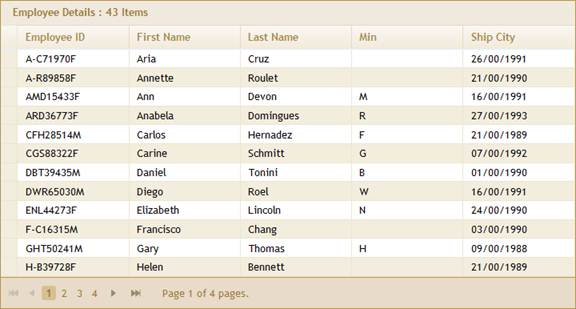

::: {style="DISPLAY: none"}
{#d2h_url_template}{#d2h_package_url style="WIDTH: 0px; DISPLAY: none; HEIGHT: 0px"}
:::

::: {.d2h_secondary_topic style="PADDING-BOTTOM: 10pt; MARGIN: 0pt; PADDING-LEFT: 0pt; PADDING-RIGHT: 0pt; PADDING-TOP: 0pt"}
#### Binding Data through GridBuilder {#binding-data-through-gridbuilder style="tab-stops: 0pt"}

 

Data can be bound by customizing the view. To do so, there are the six steps involved:

1.   Create an Entity model in an application (see [Creating the ADO.NET Entity Data Model]{.UGHyperlink}).

2.   Create a strongly typed view (see [Creating a Strongly Typed View]{.UGHyperlink}).

3.   In the view, use the **Model** property in **Datasource** to bind the data source.

 

+---------------------------------------------------------------------------------------------------------------------------------------------------------------------------------------------------------------------------------------------------------------+
| **[View \[]{style="FONT-FAMILY: 'Courier New'; FONT-SIZE: 11pt"}[ASPX]{style="FONT-FAMILY: 'Courier New'"}[\]]{style="FONT-FAMILY: 'Courier New'; FONT-SIZE: 11pt"}**                                                                                         |
|                                                                                                                                                                                                                                                               |
| []{style="FONT-FAMILY: 'Courier New'"}                                                                                                                                                                                                                        |
|                                                                                                                                                                                                                                                               |
| [\<%]{style="FONT-FAMILY: 'Courier New'; BACKGROUND: yellow"}[=]{style="FONT-FAMILY: 'Courier New'; COLOR: blue"}[Html.Syncfusion().Grid\<[employee]{style="COLOR: #2b91af"}\>([\"EntityGrid\"]{style="COLOR: #a31515"})]{style="FONT-FAMILY: 'Courier New'"} |
|                                                                                                                                                                                                                                                               |
| [              .Datasource(Model)]{style="FONT-FAMILY: 'Courier New'"}                                                                                                                                                                                        |
|                                                                                                                                                                                                                                                               |
| [              .Caption([\"Employee Details\"]{style="COLOR: #a31515"})]{style="FONT-FAMILY: 'Courier New'"}                                                                                                                                                  |
|                                                                                                                                                                                                                                                               |
| [                 .AutoFormat([Skins]{style="COLOR: #2b91af"}.Sandune)]{style="FONT-FAMILY: 'Courier New'"}[]{style="FONT-FAMILY: 'Courier New'"}                                                                                                             |
|                                                                                                                                                                                                                                                               |
| [.EnablePaging()]{style="FONT-FAMILY: 'Courier New'"}                                                                                                                                                                                                         |
|                                                                                                                                                                                                                                                               |
| [              .EnableSorting()]{style="FONT-FAMILY: 'Courier New'"}                                                                                                                                                                                          |
|                                                                                                                                                                                                                                                               |
| [              .Column(cols =\>]{style="FONT-FAMILY: 'Courier New'"}                                                                                                                                                                                          |
|                                                                                                                                                                                                                                                               |
| [                {]{style="FONT-FAMILY: 'Courier New'"}                                                                                                                                                                                                       |
|                                                                                                                                                                                                                                                               |
| [                    cols.Add(c =\> c.emp_id).HeaderText([\"Employee ID\"]{style="COLOR: #a31515"});]{style="FONT-FAMILY: 'Courier New'"}                                                                                                                     |
|                                                                                                                                                                                                                                                               |
| [                    cols.Add(c =\> c.fname).HeaderText([\"First Name\"]{style="COLOR: #a31515"});]{style="FONT-FAMILY: 'Courier New'"}                                                                                                                       |
|                                                                                                                                                                                                                                                               |
| [                    cols.Add(c =\> c.lname).HeaderText([\"Last Name\"]{style="COLOR: #a31515"});]{style="FONT-FAMILY: 'Courier New'"}                                                                                                                        |
|                                                                                                                                                                                                                                                               |
| [                    cols.Add(c =\> c.minit).HeaderText([\"Min\"]{style="COLOR: #a31515"});]{style="FONT-FAMILY: 'Courier New'"}                                                                                                                              |
|                                                                                                                                                                                                                                                               |
| [                    cols.Add(c =\> c.hire_date).HeaderText([\"Ship City\"]{style="COLOR: #a31515"}).Format([\"{hire_date:dd/mm/yyyy}\"]{style="COLOR: #a31515"});]{style="FONT-FAMILY: 'Courier New'"}                                                       |
|                                                                                                                                                                                                                                                               |
| [                })       ]{style="FONT-FAMILY: 'Courier New'"}                                                                                                                                                                                               |
|                                                                                                                                                                                                                                                               |
| [       [%\>]{style="BACKGROUND: yellow"}]{style="FONT-FAMILY: 'Courier New'"}                                                                                                                                                                                |
|                                                                                                                                                                                                                                                               |
|                                                                                                                                                                                                                                                               |
+---------------------------------------------------------------------------------------------------------------------------------------------------------------------------------------------------------------------------------------------------------------+

 

+------------------------------------------------------------------------------------------------------------------------------------------------------------------------------------------------------------+
| **[View \[]{style="FONT-FAMILY: 'Courier New'; FONT-SIZE: 11pt"}[cshtml]{style="FONT-FAMILY: 'Courier New'"}[\]]{style="FONT-FAMILY: 'Courier New'; FONT-SIZE: 11pt"}**                                    |
|                                                                                                                                                                                                            |
| []{style="FONT-FAMILY: 'Courier New'"}                                                                                                                                                                     |
|                                                                                                                                                                                                            |
| [\@{]{style="FONT-FAMILY: 'Courier New'; BACKGROUND: yellow"}[ Html.Syncfusion().Grid\<[employee]{style="COLOR: #2b91af"}\>([\"EntityGrid\"]{style="COLOR: #a31515"})]{style="FONT-FAMILY: 'Courier New'"} |
|                                                                                                                                                                                                            |
| [              .Datasource(Model)]{style="FONT-FAMILY: 'Courier New'"}                                                                                                                                     |
|                                                                                                                                                                                                            |
| [              .Caption([\"Employee Details\"]{style="COLOR: #a31515"})]{style="FONT-FAMILY: 'Courier New'"}                                                                                               |
|                                                                                                                                                                                                            |
| [                 .AutoFormat([Skins]{style="COLOR: #2b91af"}.Sandune)]{style="FONT-FAMILY: 'Courier New'"}[]{style="FONT-FAMILY: 'Courier New'"}                                                          |
|                                                                                                                                                                                                            |
| [.EnablePaging()]{style="FONT-FAMILY: 'Courier New'"}                                                                                                                                                      |
|                                                                                                                                                                                                            |
| [              .EnableSorting()]{style="FONT-FAMILY: 'Courier New'"}                                                                                                                                       |
|                                                                                                                                                                                                            |
| [              .Column(cols =\>]{style="FONT-FAMILY: 'Courier New'"}                                                                                                                                       |
|                                                                                                                                                                                                            |
| [                {]{style="FONT-FAMILY: 'Courier New'"}                                                                                                                                                    |
|                                                                                                                                                                                                            |
| [                    cols.Add(c =\> c.emp_id).HeaderText([\"Employee ID\"]{style="COLOR: #a31515"});]{style="FONT-FAMILY: 'Courier New'"}                                                                  |
|                                                                                                                                                                                                            |
| [                    cols.Add(c =\> c.fname).HeaderText([\"First Name\"]{style="COLOR: #a31515"});]{style="FONT-FAMILY: 'Courier New'"}                                                                    |
|                                                                                                                                                                                                            |
| [                    cols.Add(c =\> c.lname).HeaderText([\"Last Name\"]{style="COLOR: #a31515"});]{style="FONT-FAMILY: 'Courier New'"}                                                                     |
|                                                                                                                                                                                                            |
| [                    cols.Add(c =\> c.minit).HeaderText([\"Min\"]{style="COLOR: #a31515"});]{style="FONT-FAMILY: 'Courier New'"}                                                                           |
|                                                                                                                                                                                                            |
| [                    cols.Add(c =\> c.hire_date).HeaderText([\"Ship City\"]{style="COLOR: #a31515"}).Format([\"{hire_date:dd/mm/yyyy}\"]{style="COLOR: #a31515"});]{style="FONT-FAMILY: 'Courier New'"}    |
|                                                                                                                                                                                                            |
| [                }).Render();     ]{style="FONT-FAMILY: 'Courier New'"}                                                                                                                                    |
|                                                                                                                                                                                                            |
| [       [}]{style="BACKGROUND: yellow"}]{style="FONT-FAMILY: 'Courier New'"}                                                                                                                               |
|                                                                                                                                                                                                            |
|                                                                                                                                                                                                            |
+------------------------------------------------------------------------------------------------------------------------------------------------------------------------------------------------------------+

 

4.   Set the data source and render the view.

 

+--------------------------------------------------------------------------------------------------------------------------------------------------------------------------------------------------------------------------------+
| **[Controller]{style="FONT-FAMILY: 'Courier New'; COLOR: black"}**                                                                                                                                                             |
|                                                                                                                                                                                                                                |
| []{style="FONT-FAMILY: 'Courier New'; COLOR: black"}                                                                                                                                                                           |
|                                                                                                                                                                                                                                |
| [///]{style="FONT-FAMILY: 'Courier New'; COLOR: gray"}[ ]{style="FONT-FAMILY: 'Courier New'; COLOR: green"}[\<summary\>]{style="FONT-FAMILY: 'Courier New'; COLOR: gray"}[]{style="FONT-FAMILY: 'Courier New'"}                |
|                                                                                                                                                                                                                                |
| [        [///]{style="COLOR: gray"}[ Used for rendering the grid initially.]{style="COLOR: green"}]{style="FONT-FAMILY: 'Courier New'"}                                                                                        |
|                                                                                                                                                                                                                                |
| [///]{style="FONT-FAMILY: 'Courier New'; COLOR: gray"}[ ]{style="FONT-FAMILY: 'Courier New'; COLOR: green"}[\</summary\>]{style="FONT-FAMILY: 'Courier New'; COLOR: gray"}[]{style="FONT-FAMILY: 'Courier New'"}               |
|                                                                                                                                                                                                                                |
| [        [///]{style="COLOR: gray"}[ ]{style="COLOR: green"}[\<returns\>]{style="COLOR: gray"}[View page; it displays the grid.]{style="COLOR: green"}[\</returns\>]{style="COLOR: gray"}]{style="FONT-FAMILY: 'Courier New'"} |
|                                                                                                                                                                                                                                |
| [        [public]{style="COLOR: blue"} [ActionResult]{style="COLOR: #2b91af"} Index()]{style="FONT-FAMILY: 'Courier New'"}                                                                                                     |
|                                                                                                                                                                                                                                |
| [        {]{style="FONT-FAMILY: 'Courier New'"}                                                                                                                                                                                |
|                                                                                                                                                                                                                                |
| [            [var]{style="COLOR: blue"} data = [new]{style="COLOR: blue"} [PUBSEntities]{style="COLOR: #2b91af"}().employees; ]{style="FONT-FAMILY: 'Courier New'"}                                                            |
|                                                                                                                                                                                                                                |
| [            [return]{style="COLOR: blue"} View(data);]{style="FONT-FAMILY: 'Courier New'"}                                                                                                                                    |
|                                                                                                                                                                                                                                |
| [        }****]{style="FONT-FAMILY: 'Courier New'"}                                                                                                                                                                            |
+--------------------------------------------------------------------------------------------------------------------------------------------------------------------------------------------------------------------------------+

[]{style="FONT-WEIGHT: normal"} 

5.   In order to work with paging and sorting actions, create a **Post** method for the **Index** actions and bind the data source to the grid, as seen in the code below.

[]{style="FONT-FAMILY: 'Calibri','sans-serif'"} 

+--------------------------------------------------------------------------------------------------------------------------------------------------------------------------------------------------------------------------------------------------------+
| **[Controller]{style="FONT-FAMILY: 'Courier New'; COLOR: black"}**                                                                                                                                                                                     |
|                                                                                                                                                                                                                                                        |
| []{style="FONT-FAMILY: 'Times New Roman','serif'; COLOR: gray"}                                                                                                                                                                                        |
|                                                                                                                                                                                                                                                        |
| [///]{style="FONT-FAMILY: 'Courier New'; COLOR: gray"}[ ]{style="FONT-FAMILY: 'Courier New'; COLOR: green"}[\<summary\>]{style="FONT-FAMILY: 'Courier New'; COLOR: gray"}[]{style="FONT-FAMILY: 'Courier New'"}                                        |
|                                                                                                                                                                                                                                                        |
| [        [///]{style="COLOR: gray"}[ Sorting/paging requests are mapped to this method.]{style="COLOR: green"}]{style="FONT-FAMILY: 'Courier New'"}                                                                                                    |
|                                                                                                                                                                                                                                                        |
| [        [///]{style="COLOR: gray"}[ This method invokes the HtmlActionResult from the grid.]{style="COLOR: green"}]{style="FONT-FAMILY: 'Courier New'"}                                                                                               |
|                                                                                                                                                                                                                                                        |
| [        [///]{style="COLOR: gray"}[ The required response is generated.]{style="COLOR: green"}]{style="FONT-FAMILY: 'Courier New'"}                                                                                                                   |
|                                                                                                                                                                                                                                                        |
| [        [///]{style="COLOR: gray"}[ ]{style="COLOR: green"}[\</summary\>]{style="COLOR: gray"}]{style="FONT-FAMILY: 'Courier New'"}                                                                                                                   |
|                                                                                                                                                                                                                                                        |
| [        [///]{style="COLOR: gray"}[ ]{style="COLOR: green"}[\<returns\>]{style="COLOR: gray"}[HtmlActionResult returns the data displayed on the grid.]{style="COLOR: green"}[\</returns\>]{style="COLOR: gray"}]{style="FONT-FAMILY: 'Courier New'"} |
|                                                                                                                                                                                                                                                        |
| [        \[[AcceptVerbs]{style="COLOR: #2b91af"}([HttpVerbs]{style="COLOR: #2b91af"}.Post)\]]{style="FONT-FAMILY: 'Courier New'"}                                                                                                                      |
|                                                                                                                                                                                                                                                        |
| [        [public]{style="COLOR: blue"} [ActionResult]{style="COLOR: #2b91af"} Index([PagingParams]{style="COLOR: #2b91af"} args)]{style="FONT-FAMILY: 'Courier New'"}                                                                                  |
|                                                                                                                                                                                                                                                        |
| [        {]{style="FONT-FAMILY: 'Courier New'"}                                                                                                                                                                                                        |
|                                                                                                                                                                                                                                                        |
| [            [IEnumerable]{style="COLOR: #2b91af"} data = [new]{style="COLOR: blue"} [PUBSEntities]{style="COLOR: #2b91af"}().employees;]{style="FONT-FAMILY: 'Courier New'"}                                                                          |
|                                                                                                                                                                                                                                                        |
| [            [return]{style="COLOR: blue"} data.GridActions\<[employee]{style="COLOR: #2b91af"}\>();]{style="FONT-FAMILY: 'Courier New'"}                                                                                                              |
|                                                                                                                                                                                                                                                        |
| [        }]{style="FONT-FAMILY: 'Courier New'"}[]{style="FONT-FAMILY: 'Times New Roman','serif'"}                                                                                                                                                      |
+--------------------------------------------------------------------------------------------------------------------------------------------------------------------------------------------------------------------------------------------------------+

 

6.   Run the application; the grid will then appear as seen in the following image.

 

{border="0"}

Figure 89: Entity Model Grid

[]{#related-topics}
:::
