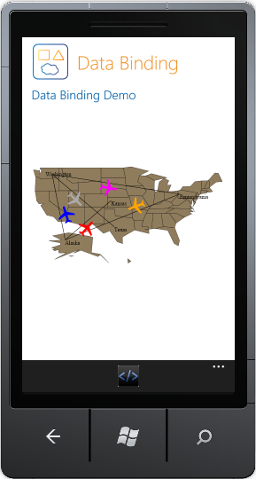

::: {style="DISPLAY: none"}
{#d2h_url_template}{#d2h_package_url style="WIDTH: 0px; DISPLAY: none; HEIGHT: 0px"}
:::

::::: {#nsbanner .d2h_main_nsbanner style="BORDER-BOTTOM: #999999 1px solid; POSITION: relative; PADDING-BOTTOM: 0px; BACKGROUND-COLOR: transparent; PADDING-LEFT: 0px; PADDING-RIGHT: 0px; DISPLAY: none; BORDER-TOP: #999999 1px solid; PADDING-TOP: 0px; LEFT: 0px"}
:::: {#TitleRow .d2h_main_titlerow style="PADDING-BOTTOM: 4px; BACKGROUND-COLOR: transparent; PADDING-LEFT: 22px; WIDTH: 100%; PADDING-RIGHT: 10px; DISPLAY: none; PADDING-TOP: 4px"}
::: {#ienav .d2h_main_ienav style="DISPLAY: none"}
{#D2HPrevious .D2HPreviousEnabled}  {#D2HNext .D2HNextEnabled}
:::
::::
:::::

:::::::: {#nstext .d2h_main_nstext style="PADDING-BOTTOM: 10px; BACKGROUND-COLOR: transparent; PADDING-LEFT: 22px; PADDING-RIGHT: 10px; HEIGHT: 100%; OVERFLOW: auto; PADDING-TOP: 5px" hasuserbackground="true" valign="bottom"}
::: {#d2h_breadcrumbs .d2h_breadcrumbs}
[Essential Studio User Guide Documentation](ms-xhelp:///?Id=12457748-09e3-4d74-a240-8e049cedf030){.d2h_breadcrumbsNormal}[ \> ]{.d2h_breadcrumbsLinkSeparator}[User Interface Edition](ms-xhelp:///?Id=c29296b7-531c-413b-a0ec-488ca1f7f669){.d2h_breadcrumbsNormal}[ \> ]{.d2h_breadcrumbsLinkSeparator}[Essential Windows Phone](ms-xhelp:///?Id=5ea1999c-4eff-4775-b84e-407dc825f555){.d2h_breadcrumbsNormal}[ \> ]{.d2h_breadcrumbsLinkSeparator}[Essential Maps]{.d2h_breadcrumbsContentsOnly}[ \> ]{.d2h_breadcrumbsLinkSeparator}[Concepts and Features](ms-xhelp:///?Id=fe4335c8-1cb6-47a4-a6f3-e9bc318bba8d){.d2h_breadcrumbsNormal}[ \> ]{.d2h_breadcrumbsLinkSeparator}[Data Binding Support for Labels, Symbols and Paths](ms-xhelp:///?Id=64815c2a-246f-418b-8272-4ff49af43c2b){.d2h_breadcrumbsNormal}
:::

### Binding the Path Source {#binding-the-path-source style="tab-stops: 0pt"}

 

The following are steps to bind path source with the map:

1.   Create a class with the following properties:

 

::: {align="center"}
  ------------------- -------------------------------
  **Name**            **Data Type**
  Points\*            ObservableCollection\<Point\>
  Label               String
  Color               Brush
  LabelColor          Brush
  LabelPosition\*\*   PathLabelPosition
  LabelPoint\*\*      Point
  FontFamily          FontFamily
  FontSize            Double
  FontStyle           FontStyle
  ------------------- -------------------------------
:::

 

::: {style="BORDER-BOTTOM: windowtext 1pt solid; BORDER-LEFT: medium none; PADDING-BOTTOM: 1pt; MARGIN-TOP: 9pt; PADDING-LEFT: 0pt; PADDING-RIGHT: 0pt; MARGIN-BOTTOM: 9pt; BORDER-TOP: windowtext 1pt solid; BORDER-RIGHT: medium none; PADDING-TOP: 1pt"}
Note:
:::

::: {style="BORDER-BOTTOM: windowtext 1pt solid; BORDER-LEFT: medium none; PADDING-BOTTOM: 1pt; MARGIN: 9pt 0pt 9pt 18pt; PADDING-LEFT: 0pt; PADDING-RIGHT: 0pt; BORDER-TOP: windowtext 1pt solid; BORDER-RIGHT: medium none; PADDING-TOP: 1pt"}
***[·    ]{style="FONT-FAMILY: Symbol"}***Properties marked with \* are mandatory.

***[·    ]{style="FONT-FAMILY: Symbol"}***Properties marked with \*\* are mandatory when label is set.
:::

::: {style="BORDER-BOTTOM: windowtext 1pt solid; BORDER-LEFT: medium none; PADDING-BOTTOM: 1pt; MARGIN-TOP: 9pt; PADDING-LEFT: 0pt; PADDING-RIGHT: 0pt; MARGIN-BOTTOM: 9pt; BORDER-TOP: windowtext 1pt solid; BORDER-RIGHT: medium none; PADDING-TOP: 1pt"}
 
:::

2.   Create another class with the collection of the previous class. Type of this class should be collection. For example List and ObservableCollection.

3.   Create an object for the Collection Class.

4.   Bind the object to the *LabelSource*.

 

The following code examples illustrate this:

**     **

Create a collection class as given in the following code example:

+-------------------------------------------------------------------------------------------------------------------------------------------------------------------------------------------------------------------------------------------------+
| [\[C#\]]{style="FONT-FAMILY: Consolas; COLOR: #a31515; FONT-SIZE: 9.5pt"}                                                                                                                                                                       |
|                                                                                                                                                                                                                                                 |
| [namespace]{style="FONT-FAMILY: Consolas; COLOR: blue; FONT-SIZE: 9.5pt"}[ SampleBrowser]{style="FONT-FAMILY: Consolas; FONT-SIZE: 9.5pt"}                                                                                                      |
|                                                                                                                                                                                                                                                 |
| [{]{style="FONT-FAMILY: Consolas; FONT-SIZE: 9.5pt"}                                                                                                                                                                                            |
|                                                                                                                                                                                                                                                 |
| []{style="FONT-FAMILY: Consolas; FONT-SIZE: 9.5pt"}                                                                                                                                                                                             |
|                                                                                                                                                                                                                                                 |
| [    [using]{style="COLOR: blue"} System;]{style="FONT-FAMILY: Consolas; FONT-SIZE: 9.5pt"}                                                                                                                                                     |
|                                                                                                                                                                                                                                                 |
| [    [using]{style="COLOR: blue"} System.Net;]{style="FONT-FAMILY: Consolas; FONT-SIZE: 9.5pt"}                                                                                                                                                 |
|                                                                                                                                                                                                                                                 |
| [    [using]{style="COLOR: blue"} System.Windows;]{style="FONT-FAMILY: Consolas; FONT-SIZE: 9.5pt"}                                                                                                                                             |
|                                                                                                                                                                                                                                                 |
| [    [using]{style="COLOR: blue"} System.Windows.Controls;]{style="FONT-FAMILY: Consolas; FONT-SIZE: 9.5pt"}                                                                                                                                    |
|                                                                                                                                                                                                                                                 |
| [    [using]{style="COLOR: blue"} System.Windows.Documents;]{style="FONT-FAMILY: Consolas; FONT-SIZE: 9.5pt"}                                                                                                                                   |
|                                                                                                                                                                                                                                                 |
| [    [using]{style="COLOR: blue"} System.Windows.Ink;]{style="FONT-FAMILY: Consolas; FONT-SIZE: 9.5pt"}                                                                                                                                         |
|                                                                                                                                                                                                                                                 |
| [    [using]{style="COLOR: blue"} System.Windows.Input;]{style="FONT-FAMILY: Consolas; FONT-SIZE: 9.5pt"}                                                                                                                                       |
|                                                                                                                                                                                                                                                 |
| [    [using]{style="COLOR: blue"} System.Windows.Media;]{style="FONT-FAMILY: Consolas; FONT-SIZE: 9.5pt"}                                                                                                                                       |
|                                                                                                                                                                                                                                                 |
| [    [using]{style="COLOR: blue"} System.Windows.Media.Animation;]{style="FONT-FAMILY: Consolas; FONT-SIZE: 9.5pt"}                                                                                                                             |
|                                                                                                                                                                                                                                                 |
| [    [using]{style="COLOR: blue"} System.Windows.Shapes;]{style="FONT-FAMILY: Consolas; FONT-SIZE: 9.5pt"}                                                                                                                                      |
|                                                                                                                                                                                                                                                 |
| [    [using]{style="COLOR: blue"} System.Collections.ObjectModel;]{style="FONT-FAMILY: Consolas; FONT-SIZE: 9.5pt"}                                                                                                                             |
|                                                                                                                                                                                                                                                 |
| []{style="FONT-FAMILY: Consolas; COLOR: #a31515; FONT-SIZE: 9.5pt"}                                                                                                                                                                             |
|                                                                                                                                                                                                                                                 |
| [  [public]{style="COLOR: blue"} [class]{style="COLOR: blue"} [PathCollection]{style="COLOR: #2b91af"} : [ObservableCollection]{style="COLOR: #2b91af"}\<[MapsPath]{style="COLOR: #2b91af"}\>]{style="FONT-FAMILY: Consolas; FONT-SIZE: 9.5pt"} |
|                                                                                                                                                                                                                                                 |
| [    {]{style="FONT-FAMILY: Consolas; FONT-SIZE: 9.5pt"}                                                                                                                                                                                        |
|                                                                                                                                                                                                                                                 |
| [        [MapsPath]{style="COLOR: #2b91af"} mpath;]{style="FONT-FAMILY: Consolas; FONT-SIZE: 9.5pt"}                                                                                                                                            |
|                                                                                                                                                                                                                                                 |
| [        [public]{style="COLOR: blue"} PathCollection()]{style="FONT-FAMILY: Consolas; FONT-SIZE: 9.5pt"}                                                                                                                                       |
|                                                                                                                                                                                                                                                 |
| [        {]{style="FONT-FAMILY: Consolas; FONT-SIZE: 9.5pt"}                                                                                                                                                                                    |
|                                                                                                                                                                                                                                                 |
| [           // Adding a New MapsPath in the PathCollection class]{style="FONT-FAMILY: Consolas; COLOR: green; FONT-SIZE: 9.5pt"}[]{style="FONT-FAMILY: Consolas; FONT-SIZE: 9.5pt"}                                                             |
|                                                                                                                                                                                                                                                 |
| []{style="FONT-FAMILY: Consolas; FONT-SIZE: 9.5pt"}                                                                                                                                                                                             |
|                                                                                                                                                                                                                                                 |
| [            mpath = [new]{style="COLOR: blue"} [MapsPath]{style="COLOR: #2b91af"}();]{style="FONT-FAMILY: Consolas; FONT-SIZE: 9.5pt"}                                                                                                         |
|                                                                                                                                                                                                                                                 |
| [            mpath.Points = [new]{style="COLOR: blue"} [ObservableCollection]{style="COLOR: #2b91af"}\<[Point]{style="COLOR: #2b91af"}\>();]{style="FONT-FAMILY: Consolas; FONT-SIZE: 9.5pt"}                                                   |
|                                                                                                                                                                                                                                                 |
| [            mpath.Points.Add([new]{style="COLOR: blue"} [Point]{style="COLOR: #2b91af"}(-119, 47));]{style="FONT-FAMILY: Consolas; FONT-SIZE: 9.5pt"}                                                                                          |
|                                                                                                                                                                                                                                                 |
| [            mpath.Points.Add([new]{style="COLOR: blue"} [Point]{style="COLOR: #2b91af"}(-115, 27));]{style="FONT-FAMILY: Consolas; FONT-SIZE: 9.5pt"}                                                                                          |
|                                                                                                                                                                                                                                                 |
| [            mpath.LabelPoint = mpath.Points\[0\];]{style="FONT-FAMILY: Consolas; FONT-SIZE: 9.5pt"}                                                                                                                                            |
|                                                                                                                                                                                                                                                 |
| [            mpath.Label = [string]{style="COLOR: blue"}.Empty;]{style="FONT-FAMILY: Consolas; FONT-SIZE: 9.5pt"}                                                                                                                               |
|                                                                                                                                                                                                                                                 |
| [            [this]{style="COLOR: blue"}.Add(mpath);]{style="FONT-FAMILY: Consolas; FONT-SIZE: 9.5pt"}                                                                                                                                          |
|                                                                                                                                                                                                                                                 |
| []{style="FONT-FAMILY: Consolas; FONT-SIZE: 9.5pt"}                                                                                                                                                                                             |
|                                                                                                                                                                                                                                                 |
| [            mpath = [new]{style="COLOR: blue"} [MapsPath]{style="COLOR: #2b91af"}();]{style="FONT-FAMILY: Consolas; FONT-SIZE: 9.5pt"}                                                                                                         |
|                                                                                                                                                                                                                                                 |
| [            mpath.Points = [new]{style="COLOR: blue"} [ObservableCollection]{style="COLOR: #2b91af"}\<[Point]{style="COLOR: #2b91af"}\>();]{style="FONT-FAMILY: Consolas; FONT-SIZE: 9.5pt"}                                                   |
|                                                                                                                                                                                                                                                 |
| [            mpath.Points.Add([new]{style="COLOR: blue"} [Point]{style="COLOR: #2b91af"}(-119, 47));]{style="FONT-FAMILY: Consolas; FONT-SIZE: 9.5pt"}                                                                                          |
|                                                                                                                                                                                                                                                 |
| [            mpath.Points.Add([new]{style="COLOR: blue"} [Point]{style="COLOR: #2b91af"}(-80, 41));]{style="FONT-FAMILY: Consolas; FONT-SIZE: 9.5pt"}                                                                                           |
|                                                                                                                                                                                                                                                 |
| [            mpath.LabelPoint = mpath.Points\[0\];]{style="FONT-FAMILY: Consolas; FONT-SIZE: 9.5pt"}                                                                                                                                            |
|                                                                                                                                                                                                                                                 |
| [            mpath.Label = [string]{style="COLOR: blue"}.Empty;]{style="FONT-FAMILY: Consolas; FONT-SIZE: 9.5pt"}                                                                                                                               |
|                                                                                                                                                                                                                                                 |
| [            [this]{style="COLOR: blue"}.Add(mpath);]{style="FONT-FAMILY: Consolas; FONT-SIZE: 9.5pt"}                                                                                                                                          |
|                                                                                                                                                                                                                                                 |
| []{style="FONT-FAMILY: Consolas; FONT-SIZE: 9.5pt"}                                                                                                                                                                                             |
|                                                                                                                                                                                                                                                 |
| [            mpath = [new]{style="COLOR: blue"} [MapsPath]{style="COLOR: #2b91af"}();]{style="FONT-FAMILY: Consolas; FONT-SIZE: 9.5pt"}                                                                                                         |
|                                                                                                                                                                                                                                                 |
| [            mpath.Points = [new]{style="COLOR: blue"} [ObservableCollection]{style="COLOR: #2b91af"}\<[Point]{style="COLOR: #2b91af"}\>();]{style="FONT-FAMILY: Consolas; FONT-SIZE: 9.5pt"}                                                   |
|                                                                                                                                                                                                                                                 |
| [            mpath.Points.Add([new]{style="COLOR: blue"} [Point]{style="COLOR: #2b91af"}(-115, 27));]{style="FONT-FAMILY: Consolas; FONT-SIZE: 9.5pt"}                                                                                          |
|                                                                                                                                                                                                                                                 |
| [            mpath.Points.Add([new]{style="COLOR: blue"} [Point]{style="COLOR: #2b91af"}(-80, 41));]{style="FONT-FAMILY: Consolas; FONT-SIZE: 9.5pt"}                                                                                           |
|                                                                                                                                                                                                                                                 |
| [            mpath.LabelPoint = mpath.Points\[0\];]{style="FONT-FAMILY: Consolas; FONT-SIZE: 9.5pt"}                                                                                                                                            |
|                                                                                                                                                                                                                                                 |
| [            mpath.Label = [string]{style="COLOR: blue"}.Empty;]{style="FONT-FAMILY: Consolas; FONT-SIZE: 9.5pt"}                                                                                                                               |
|                                                                                                                                                                                                                                                 |
| [            [this]{style="COLOR: blue"}.Add(mpath);]{style="FONT-FAMILY: Consolas; FONT-SIZE: 9.5pt"}                                                                                                                                          |
|                                                                                                                                                                                                                                                 |
| []{style="FONT-FAMILY: Consolas; FONT-SIZE: 9.5pt"}                                                                                                                                                                                             |
|                                                                                                                                                                                                                                                 |
| [            mpath = [new]{style="COLOR: blue"} [MapsPath]{style="COLOR: #2b91af"}();]{style="FONT-FAMILY: Consolas; FONT-SIZE: 9.5pt"}                                                                                                         |
|                                                                                                                                                                                                                                                 |
| [            mpath.Points = [new]{style="COLOR: blue"} [ObservableCollection]{style="COLOR: #2b91af"}\<[Point]{style="COLOR: #2b91af"}\>();]{style="FONT-FAMILY: Consolas; FONT-SIZE: 9.5pt"}                                                   |
|                                                                                                                                                                                                                                                 |
| [            mpath.Points.Add([new]{style="COLOR: blue"} [Point]{style="COLOR: #2b91af"}(-101, 39));]{style="FONT-FAMILY: Consolas; FONT-SIZE: 9.5pt"}                                                                                          |
|                                                                                                                                                                                                                                                 |
| [            mpath.Points.Add([new]{style="COLOR: blue"} [Point]{style="COLOR: #2b91af"}(-115, 27));]{style="FONT-FAMILY: Consolas; FONT-SIZE: 9.5pt"}                                                                                          |
|                                                                                                                                                                                                                                                 |
| [            mpath.LabelPoint = mpath.Points\[0\];]{style="FONT-FAMILY: Consolas; FONT-SIZE: 9.5pt"}                                                                                                                                            |
|                                                                                                                                                                                                                                                 |
| [            mpath.Label = [string]{style="COLOR: blue"}.Empty;]{style="FONT-FAMILY: Consolas; FONT-SIZE: 9.5pt"}                                                                                                                               |
|                                                                                                                                                                                                                                                 |
| [            [this]{style="COLOR: blue"}.Add(mpath);]{style="FONT-FAMILY: Consolas; FONT-SIZE: 9.5pt"}                                                                                                                                          |
|                                                                                                                                                                                                                                                 |
| []{style="FONT-FAMILY: Consolas; FONT-SIZE: 9.5pt"}                                                                                                                                                                                             |
|                                                                                                                                                                                                                                                 |
| [            mpath = [new]{style="COLOR: blue"} [MapsPath]{style="COLOR: #2b91af"}();]{style="FONT-FAMILY: Consolas; FONT-SIZE: 9.5pt"}                                                                                                         |
|                                                                                                                                                                                                                                                 |
| [            mpath.Points = [new]{style="COLOR: blue"} [ObservableCollection]{style="COLOR: #2b91af"}\<[Point]{style="COLOR: #2b91af"}\>();]{style="FONT-FAMILY: Consolas; FONT-SIZE: 9.5pt"}                                                   |
|                                                                                                                                                                                                                                                 |
| [            mpath.Points.Add([new]{style="COLOR: blue"} [Point]{style="COLOR: #2b91af"}(-119, 47));]{style="FONT-FAMILY: Consolas; FONT-SIZE: 9.5pt"}                                                                                          |
|                                                                                                                                                                                                                                                 |
| [            mpath.Points.Add([new]{style="COLOR: blue"} [Point]{style="COLOR: #2b91af"}(-100, 31));]{style="FONT-FAMILY: Consolas; FONT-SIZE: 9.5pt"}                                                                                          |
|                                                                                                                                                                                                                                                 |
| [            mpath.LabelPoint = mpath.Points\[0\];]{style="FONT-FAMILY: Consolas; FONT-SIZE: 9.5pt"}                                                                                                                                            |
|                                                                                                                                                                                                                                                 |
| [            mpath.Label = [string]{style="COLOR: blue"}.Empty;]{style="FONT-FAMILY: Consolas; FONT-SIZE: 9.5pt"}                                                                                                                               |
|                                                                                                                                                                                                                                                 |
| [            [this]{style="COLOR: blue"}.Add(mpath);]{style="FONT-FAMILY: Consolas; FONT-SIZE: 9.5pt"}                                                                                                                                          |
|                                                                                                                                                                                                                                                 |
| []{style="FONT-FAMILY: Consolas; FONT-SIZE: 9.5pt"}                                                                                                                                                                                             |
|                                                                                                                                                                                                                                                 |
| [            mpath = [new]{style="COLOR: blue"} [MapsPath]{style="COLOR: #2b91af"}();]{style="FONT-FAMILY: Consolas; FONT-SIZE: 9.5pt"}                                                                                                         |
|                                                                                                                                                                                                                                                 |
| [            mpath.Points = [new]{style="COLOR: blue"} [ObservableCollection]{style="COLOR: #2b91af"}\<[Point]{style="COLOR: #2b91af"}\>();]{style="FONT-FAMILY: Consolas; FONT-SIZE: 9.5pt"}                                                   |
|                                                                                                                                                                                                                                                 |
| [            mpath.Points.Add([new]{style="COLOR: blue"} [Point]{style="COLOR: #2b91af"}(0, 0));]{style="FONT-FAMILY: Consolas; FONT-SIZE: 9.5pt"}                                                                                              |
|                                                                                                                                                                                                                                                 |
| [            mpath.Points.Add([new]{style="COLOR: blue"} [Point]{style="COLOR: #2b91af"}(0, 0));]{style="FONT-FAMILY: Consolas; FONT-SIZE: 9.5pt"}                                                                                              |
|                                                                                                                                                                                                                                                 |
| [            mpath.LabelPoint = mpath.Points\[0\];]{style="FONT-FAMILY: Consolas; FONT-SIZE: 9.5pt"}                                                                                                                                            |
|                                                                                                                                                                                                                                                 |
| [            mpath.Label = [string]{style="COLOR: blue"}.Empty;]{style="FONT-FAMILY: Consolas; FONT-SIZE: 9.5pt"}                                                                                                                               |
|                                                                                                                                                                                                                                                 |
| [            [this]{style="COLOR: blue"}.Add(mpath);]{style="FONT-FAMILY: Consolas; FONT-SIZE: 9.5pt"}                                                                                                                                          |
|                                                                                                                                                                                                                                                 |
| []{style="FONT-FAMILY: Consolas; FONT-SIZE: 9.5pt"}                                                                                                                                                                                             |
|                                                                                                                                                                                                                                                 |
| [            mpath = [new]{style="COLOR: blue"} [MapsPath]{style="COLOR: #2b91af"}();]{style="FONT-FAMILY: Consolas; FONT-SIZE: 9.5pt"}                                                                                                         |
|                                                                                                                                                                                                                                                 |
| [            mpath.Points = [new]{style="COLOR: blue"} [ObservableCollection]{style="COLOR: #2b91af"}\<[Point]{style="COLOR: #2b91af"}\>();]{style="FONT-FAMILY: Consolas; FONT-SIZE: 9.5pt"}                                                   |
|                                                                                                                                                                                                                                                 |
| [            mpath.Points.Add([new]{style="COLOR: blue"} [Point]{style="COLOR: #2b91af"}(0, 0));]{style="FONT-FAMILY: Consolas; FONT-SIZE: 9.5pt"}                                                                                              |
|                                                                                                                                                                                                                                                 |
| [            mpath.Points.Add([new]{style="COLOR: blue"} [Point]{style="COLOR: #2b91af"}(0, 0));]{style="FONT-FAMILY: Consolas; FONT-SIZE: 9.5pt"}                                                                                              |
|                                                                                                                                                                                                                                                 |
| [            mpath.LabelPoint = mpath.Points\[0\];]{style="FONT-FAMILY: Consolas; FONT-SIZE: 9.5pt"}                                                                                                                                            |
|                                                                                                                                                                                                                                                 |
| [            mpath.Label = [string]{style="COLOR: blue"}.Empty;]{style="FONT-FAMILY: Consolas; FONT-SIZE: 9.5pt"}                                                                                                                               |
|                                                                                                                                                                                                                                                 |
| [            [this]{style="COLOR: blue"}.Add(mpath);]{style="FONT-FAMILY: Consolas; FONT-SIZE: 9.5pt"}                                                                                                                                          |
|                                                                                                                                                                                                                                                 |
| []{style="FONT-FAMILY: Consolas; FONT-SIZE: 9.5pt"}                                                                                                                                                                                             |
|                                                                                                                                                                                                                                                 |
| [            mpath = [new]{style="COLOR: blue"} [MapsPath]{style="COLOR: #2b91af"}();]{style="FONT-FAMILY: Consolas; FONT-SIZE: 9.5pt"}                                                                                                         |
|                                                                                                                                                                                                                                                 |
| [            mpath.Points = [new]{style="COLOR: blue"} [ObservableCollection]{style="COLOR: #2b91af"}\<[Point]{style="COLOR: #2b91af"}\>();]{style="FONT-FAMILY: Consolas; FONT-SIZE: 9.5pt"}                                                   |
|                                                                                                                                                                                                                                                 |
| [            mpath.Points.Add([new]{style="COLOR: blue"} [Point]{style="COLOR: #2b91af"}(0, 0));]{style="FONT-FAMILY: Consolas; FONT-SIZE: 9.5pt"}                                                                                              |
|                                                                                                                                                                                                                                                 |
| [            mpath.Points.Add([new]{style="COLOR: blue"} [Point]{style="COLOR: #2b91af"}(0, 0));]{style="FONT-FAMILY: Consolas; FONT-SIZE: 9.5pt"}                                                                                              |
|                                                                                                                                                                                                                                                 |
| [            mpath.LabelPoint = mpath.Points\[0\];]{style="FONT-FAMILY: Consolas; FONT-SIZE: 9.5pt"}                                                                                                                                            |
|                                                                                                                                                                                                                                                 |
| [            mpath.Label = [string]{style="COLOR: blue"}.Empty;]{style="FONT-FAMILY: Consolas; FONT-SIZE: 9.5pt"}                                                                                                                               |
|                                                                                                                                                                                                                                                 |
| [            [this]{style="COLOR: blue"}.Add(mpath);]{style="FONT-FAMILY: Consolas; FONT-SIZE: 9.5pt"}                                                                                                                                          |
|                                                                                                                                                                                                                                                 |
| [        }]{style="FONT-FAMILY: Consolas; FONT-SIZE: 9.5pt"}                                                                                                                                                                                    |
|                                                                                                                                                                                                                                                 |
| [    }]{style="FONT-FAMILY: Consolas; FONT-SIZE: 9.5pt"}                                                                                                                                                                                        |
|                                                                                                                                                                                                                                                 |
| [    // Creating a MapPath class]{style="FONT-FAMILY: Consolas; COLOR: green; FONT-SIZE: 9.5pt"}[]{style="FONT-FAMILY: Consolas; FONT-SIZE: 9.5pt"}                                                                                             |
|                                                                                                                                                                                                                                                 |
| [    public]{style="FONT-FAMILY: Consolas; COLOR: blue; FONT-SIZE: 9.5pt"}[ [class]{style="COLOR: blue"} [MapsPath]{style="COLOR: #2b91af"}]{style="FONT-FAMILY: Consolas; FONT-SIZE: 9.5pt"}                                                   |
|                                                                                                                                                                                                                                                 |
| [    {]{style="FONT-FAMILY: Consolas; FONT-SIZE: 9.5pt"}                                                                                                                                                                                        |
|                                                                                                                                                                                                                                                 |
| [        [public]{style="COLOR: blue"} [ObservableCollection]{style="COLOR: #2b91af"}\<[Point]{style="COLOR: #2b91af"}\> Points { [get]{style="COLOR: blue"}; [set]{style="COLOR: blue"}; }]{style="FONT-FAMILY: Consolas; FONT-SIZE: 9.5pt"}   |
|                                                                                                                                                                                                                                                 |
| [        [public]{style="COLOR: blue"} [Point]{style="COLOR: #2b91af"} LabelPoint { [get]{style="COLOR: blue"}; [set]{style="COLOR: blue"}; }]{style="FONT-FAMILY: Consolas; FONT-SIZE: 9.5pt"}                                                 |
|                                                                                                                                                                                                                                                 |
| [        [public]{style="COLOR: blue"} [string]{style="COLOR: blue"} Label { [get]{style="COLOR: blue"}; [set]{style="COLOR: blue"}; }]{style="FONT-FAMILY: Consolas; FONT-SIZE: 9.5pt"}                                                        |
|                                                                                                                                                                                                                                                 |
| [    }]{style="FONT-FAMILY: Consolas; FONT-SIZE: 9.5pt"}                                                                                                                                                                                        |
|                                                                                                                                                                                                                                                 |
| [}]{style="FONT-FAMILY: Consolas; FONT-SIZE: 9.5pt"}                                                                                                                                                                                            |
+-------------------------------------------------------------------------------------------------------------------------------------------------------------------------------------------------------------------------------------------------+

 

Add the following code in Resource Dictionary

+----------------------------------------------------------------------------------------------------------------------------------------------------------------------------------------------------------------------------------------------------------------------------------------------------------------------------------------------------------------------------------------------------------------------------------------------------------------------------------------------------------------------------------------------------------------------------+
| **[\[Xaml\]]{style="FONT-FAMILY: Consolas; FONT-SIZE: 9.5pt"}**                                                                                                                                                                                                                                                                                                                                                                                                                                                                                                            |
|                                                                                                                                                                                                                                                                                                                                                                                                                                                                                                                                                                            |
| [\<!\-- Local Refers the Namespace of the Project.  \"xmlns:local=\"clr-namespace:Syncfusion.Phone.Map;assembly=Syncfusion.Maps.Phone\"  \--\>]{style="FONT-FAMILY: Consolas; COLOR: green; FONT-SIZE: 9.5pt"}                                                                                                                                                                                                                                                                                                                                                             |
|                                                                                                                                                                                                                                                                                                                                                                                                                                                                                                                                                                            |
| []{style="FONT-FAMILY: Consolas; COLOR: blue; FONT-SIZE: 9.5pt"}                                                                                                                                                                                                                                                                                                                                                                                                                                                                                                           |
|                                                                                                                                                                                                                                                                                                                                                                                                                                                                                                                                                                            |
| [\<]{style="FONT-FAMILY: Consolas; COLOR: blue; FONT-SIZE: 9.5pt"}[local]{style="FONT-FAMILY: Consolas; COLOR: #a31515; FONT-SIZE: 9.5pt"}[:]{style="FONT-FAMILY: Consolas; COLOR: blue; FONT-SIZE: 9.5pt"}[PathCollection]{style="FONT-FAMILY: Consolas; COLOR: #a31515; FONT-SIZE: 9.5pt"}[ x]{style="FONT-FAMILY: Consolas; COLOR: red; FONT-SIZE: 9.5pt"}[:]{style="FONT-FAMILY: Consolas; COLOR: blue; FONT-SIZE: 9.5pt"}[Key]{style="FONT-FAMILY: Consolas; COLOR: red; FONT-SIZE: 9.5pt"}[=\"pc\"/\>]{style="FONT-FAMILY: Consolas; COLOR: blue; FONT-SIZE: 9.5pt"} |
+----------------------------------------------------------------------------------------------------------------------------------------------------------------------------------------------------------------------------------------------------------------------------------------------------------------------------------------------------------------------------------------------------------------------------------------------------------------------------------------------------------------------------------------------------------------------------+

 

+------------------------------------------------------------------------------------------------------------------------------------------------------------------------------------------------------------------------------------------------------------------------------------------------------------------------------------------------------------------------------------------------------------------------------------------------------------------------------------------------------------------------------------------------------------------------------------------------------------------------------------------------------------------------------------------------------------------------------------------------------------------------------------------------------------------------------------------------------------------------------------------------------------------------+
| **[\[Xaml\]]{style="FONT-FAMILY: Consolas; FONT-SIZE: 9.5pt"}**                                                                                                                                                                                                                                                                                                                                                                                                                                                                                                                                                                                                                                                                                                                                                                                                                                                        |
|                                                                                                                                                                                                                                                                                                                                                                                                                                                                                                                                                                                                                                                                                                                                                                                                                                                                                                                        |
| **[]{style="FONT-FAMILY: Consolas; FONT-SIZE: 9.5pt"}**                                                                                                                                                                                                                                                                                                                                                                                                                                                                                                                                                                                                                                                                                                                                                                                                                                                                |
|                                                                                                                                                                                                                                                                                                                                                                                                                                                                                                                                                                                                                                                                                                                                                                                                                                                                                                                        |
| [\<!\--syncfusion refers : xmlns:syncfusion=\"http://schemas.syncfusion.com/wpf\" \--\>]{style="FONT-FAMILY: Consolas; COLOR: green; FONT-SIZE: 9.5pt"}[]{style="FONT-FAMILY: Consolas; COLOR: #a31515; FONT-SIZE: 9.5pt"}                                                                                                                                                                                                                                                                                                                                                                                                                                                                                                                                                                                                                                                                                             |
|                                                                                                                                                                                                                                                                                                                                                                                                                                                                                                                                                                                                                                                                                                                                                                                                                                                                                                                        |
| [\<syncfusion]{style="FONT-FAMILY: Consolas; COLOR: #a31515; FONT-SIZE: 9.5pt"}[:]{style="FONT-FAMILY: Consolas; COLOR: blue; FONT-SIZE: 9.5pt"}[MapControl]{style="FONT-FAMILY: Consolas; COLOR: #a31515; FONT-SIZE: 9.5pt"}[ ShapeFill]{style="FONT-FAMILY: Consolas; COLOR: red; FONT-SIZE: 9.5pt"}[=\"#8f7c5c\"]{style="FONT-FAMILY: Consolas; COLOR: blue; FONT-SIZE: 9.5pt"}[ Name]{style="FONT-FAMILY: Consolas; COLOR: red; FONT-SIZE: 9.5pt"}[=\"Map\"]{style="FONT-FAMILY: Consolas; COLOR: blue; FONT-SIZE: 9.5pt"}[ LayeredContent]{style="FONT-FAMILY: Consolas; COLOR: red; FONT-SIZE: 9.5pt"}[=\"{]{style="FONT-FAMILY: Consolas; COLOR: blue; FONT-SIZE: 9.5pt"}[Binding]{style="FONT-FAMILY: Consolas; COLOR: #a31515; FONT-SIZE: 9.5pt"}[ ElementName]{style="FONT-FAMILY: Consolas; COLOR: red; FONT-SIZE: 9.5pt"}[=shapeLayer}\" \>]{style="FONT-FAMILY: Consolas; COLOR: blue; FONT-SIZE: 9.5pt"} |
|                                                                                                                                                                                                                                                                                                                                                                                                                                                                                                                                                                                                                                                                                                                                                                                                                                                                                                                        |
| [\<]{style="FONT-FAMILY: Consolas; COLOR: blue; FONT-SIZE: 9.5pt"}[syncfusion]{style="FONT-FAMILY: Consolas; COLOR: #a31515; FONT-SIZE: 9.5pt"}[:]{style="FONT-FAMILY: Consolas; COLOR: blue; FONT-SIZE: 9.5pt"}[MapControl.Layers]{style="FONT-FAMILY: Consolas; COLOR: #a31515; FONT-SIZE: 9.5pt"}[\>]{style="FONT-FAMILY: Consolas; COLOR: blue; FONT-SIZE: 9.5pt"}[                                        ]{style="FONT-FAMILY: Consolas; COLOR: #a31515; FONT-SIZE: 9.5pt"}[\<]{style="FONT-FAMILY: Consolas; COLOR: blue; FONT-SIZE: 9.5pt"}[syncfusion]{style="FONT-FAMILY: Consolas; COLOR: #a31515; FONT-SIZE: 9.5pt"}[:]{style="FONT-FAMILY: Consolas; COLOR: blue; FONT-SIZE: 9.5pt"}[Layers\>]{style="FONT-FAMILY: Consolas; COLOR: #a31515; FONT-SIZE: 9.5pt"}[]{style="FONT-FAMILY: Consolas; COLOR: blue; FONT-SIZE: 9.5pt"}                                                                           |
|                                                                                                                                                                                                                                                                                                                                                                                                                                                                                                                                                                                                                                                                                                                                                                                                                                                                                                                        |
| [\<]{style="FONT-FAMILY: Consolas; COLOR: blue; FONT-SIZE: 9.5pt"}[syncfusion]{style="FONT-FAMILY: Consolas; COLOR: #a31515; FONT-SIZE: 9.5pt"}[:]{style="FONT-FAMILY: Consolas; COLOR: blue; FONT-SIZE: 9.5pt"}[ShapeFileLayer]{style="FONT-FAMILY: Consolas; COLOR: #a31515; FONT-SIZE: 9.5pt"}[ PathSource="]{style="FONT-FAMILY: Consolas; COLOR: red; FONT-SIZE: 9.5pt"}[{]{style="FONT-FAMILY: Consolas; COLOR: blue; FONT-SIZE: 9.5pt"}[Binding]{style="FONT-FAMILY: Consolas; COLOR: #a31515; FONT-SIZE: 9.5pt"}[ Source]{style="FONT-FAMILY: Consolas; COLOR: red; FONT-SIZE: 9.5pt"}[={]{style="FONT-FAMILY: Consolas; COLOR: blue; FONT-SIZE: 9.5pt"}[StaticResource]{style="FONT-FAMILY: Consolas; COLOR: #a31515; FONT-SIZE: 9.5pt"}[ pc]{style="FONT-FAMILY: Consolas; COLOR: red; FONT-SIZE: 9.5pt"}[}}"]{style="FONT-FAMILY: Consolas; COLOR: blue; FONT-SIZE: 9.5pt"}                                 |
|                                                                                                                                                                                                                                                                                                                                                                                                                                                                                                                                                                                                                                                                                                                                                                                                                                                                                                                        |
| [ ]{style="FONT-FAMILY: Consolas; COLOR: blue; FONT-SIZE: 9.5pt"}[Uri]{style="FONT-FAMILY: Consolas; COLOR: red; FONT-SIZE: 9.5pt"}[=\"Maps.ShapeFiles.states.shp\"]{style="FONT-FAMILY: Consolas; COLOR: blue; FONT-SIZE: 9.5pt"}[ x]{style="FONT-FAMILY: Consolas; COLOR: red; FONT-SIZE: 9.5pt"}[:]{style="FONT-FAMILY: Consolas; COLOR: blue; FONT-SIZE: 9.5pt"}[Name]{style="FONT-FAMILY: Consolas; COLOR: red; FONT-SIZE: 9.5pt"}[=\"shapeLayer\"/\>]{style="FONT-FAMILY: Consolas; COLOR: blue; FONT-SIZE: 9.5pt"}[]{style="FONT-FAMILY: Consolas; FONT-SIZE: 9.5pt"}                                                                                                                                                                                                                                                                                                                                           |
|                                                                                                                                                                                                                                                                                                                                                                                                                                                                                                                                                                                                                                                                                                                                                                                                                                                                                                                        |
| [\</]{style="FONT-FAMILY: Consolas; COLOR: blue; FONT-SIZE: 9.5pt"}[syncfusion]{style="FONT-FAMILY: Consolas; COLOR: #a31515; FONT-SIZE: 9.5pt"}[:]{style="FONT-FAMILY: Consolas; COLOR: blue; FONT-SIZE: 9.5pt"}[Layers]{style="FONT-FAMILY: Consolas; COLOR: #a31515; FONT-SIZE: 9.5pt"}[\>]{style="FONT-FAMILY: Consolas; COLOR: blue; FONT-SIZE: 9.5pt"}[]{style="FONT-FAMILY: Consolas; FONT-SIZE: 9.5pt"}                                                                                                                                                                                                                                                                                                                                                                                                                                                                                                        |
|                                                                                                                                                                                                                                                                                                                                                                                                                                                                                                                                                                                                                                                                                                                                                                                                                                                                                                                        |
| [\</]{style="FONT-FAMILY: Consolas; COLOR: blue; FONT-SIZE: 9.5pt"}[syncfusion]{style="FONT-FAMILY: Consolas; COLOR: #a31515; FONT-SIZE: 9.5pt"}[:]{style="FONT-FAMILY: Consolas; COLOR: blue; FONT-SIZE: 9.5pt"}[MapControl.Layers]{style="FONT-FAMILY: Consolas; COLOR: #a31515; FONT-SIZE: 9.5pt"}[\>]{style="FONT-FAMILY: Consolas; COLOR: blue; FONT-SIZE: 9.5pt"}[]{style="FONT-FAMILY: Consolas; FONT-SIZE: 9.5pt"}                                                                                                                                                                                                                                                                                                                                                                                                                                                                                             |
|                                                                                                                                                                                                                                                                                                                                                                                                                                                                                                                                                                                                                                                                                                                                                                                                                                                                                                                        |
| [\</]{style="FONT-FAMILY: Consolas; COLOR: blue; FONT-SIZE: 9.5pt"}[syncfusion]{style="FONT-FAMILY: Consolas; COLOR: #a31515; FONT-SIZE: 9.5pt"}[:]{style="FONT-FAMILY: Consolas; COLOR: blue; FONT-SIZE: 9.5pt"}[MapControl]{style="FONT-FAMILY: Consolas; COLOR: #a31515; FONT-SIZE: 9.5pt"}[\>]{style="FONT-FAMILY: Consolas; COLOR: blue; FONT-SIZE: 9.5pt"}                                                                                                                                                                                                                                                                                                                                                                                                                                                                                                                                                       |
+------------------------------------------------------------------------------------------------------------------------------------------------------------------------------------------------------------------------------------------------------------------------------------------------------------------------------------------------------------------------------------------------------------------------------------------------------------------------------------------------------------------------------------------------------------------------------------------------------------------------------------------------------------------------------------------------------------------------------------------------------------------------------------------------------------------------------------------------------------------------------------------------------------------------+

 

+----------------------------------------------------------------------------------------------------------------------------------------------------------------------------------------+
| **[\[C#\]]{style="FONT-FAMILY: Consolas; FONT-SIZE: 9.5pt"}**                                                                                                                          |
|                                                                                                                                                                                        |
| **[]{style="FONT-FAMILY: Consolas; FONT-SIZE: 9.5pt"}**                                                                                                                                |
|                                                                                                                                                                                        |
| [  [// Create an Instance for PathCollection class]{style="COLOR: green"}]{style="FONT-FAMILY: Consolas; FONT-SIZE: 9.5pt"}                                                            |
|                                                                                                                                                                                        |
| [   [PathCollection]{style="COLOR: #2b91af"} pathCollection = [new]{style="COLOR: blue"} [PathCollection]{style="COLOR: #2b91af"}();]{style="FONT-FAMILY: Consolas; FONT-SIZE: 9.5pt"} |
|                                                                                                                                                                                        |
| []{style="FONT-FAMILY: Consolas; FONT-SIZE: 9.5pt"}                                                                                                                                    |
|                                                                                                                                                                                        |
| [  [// Assign the object as Path Source of the Shape File Layer]{style="COLOR: green"}]{style="FONT-FAMILY: Consolas; FONT-SIZE: 9.5pt"}                                               |
|                                                                                                                                                                                        |
| [  [this]{style="COLOR: blue"}.shapeLayer.PathSource = pathCollection;]{style="FONT-FAMILY: Consolas; FONT-SIZE: 9.5pt"}                                                               |
|                                                                                                                                                                                        |
| []{style="FONT-FAMILY: Consolas; FONT-SIZE: 9.5pt"}                                                                                                                                    |
|                                                                                                                                                                                        |
|                                                                                                                                                                                        |
+----------------------------------------------------------------------------------------------------------------------------------------------------------------------------------------+

 

{border="0"}

Figure 26: Data Binding

**[]{style="COLOR: #e36c0a"}** 

[]{#related-topics}
::::::::
