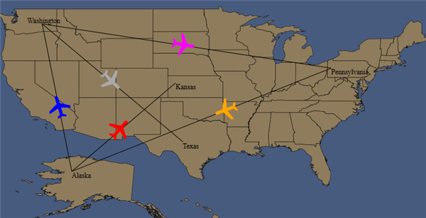

::: {style="DISPLAY: none"}
{#d2h_url_template}{#d2h_package_url style="WIDTH: 0px; DISPLAY: none; HEIGHT: 0px"}
:::

::::: {#nsbanner .d2h_main_nsbanner style="BORDER-BOTTOM: #999999 1px solid; POSITION: relative; PADDING-BOTTOM: 0px; BACKGROUND-COLOR: transparent; PADDING-LEFT: 0px; PADDING-RIGHT: 0px; DISPLAY: none; BORDER-TOP: #999999 1px solid; PADDING-TOP: 0px; LEFT: 0px"}
:::: {#TitleRow .d2h_main_titlerow style="PADDING-BOTTOM: 4px; BACKGROUND-COLOR: transparent; PADDING-LEFT: 22px; WIDTH: 100%; PADDING-RIGHT: 10px; DISPLAY: none; PADDING-TOP: 4px"}
::: {#ienav .d2h_main_ienav style="DISPLAY: none"}
{#D2HPrevious .D2HPreviousEnabled}  {#D2HNext .D2HNextEnabled}
:::
::::
:::::

:::::: {#nstext .d2h_main_nstext style="PADDING-BOTTOM: 10px; BACKGROUND-COLOR: transparent; PADDING-LEFT: 22px; PADDING-RIGHT: 10px; HEIGHT: 100%; OVERFLOW: auto; PADDING-TOP: 5px" hasuserbackground="true" valign="bottom"}
::: {#d2h_breadcrumbs .d2h_breadcrumbs}
[Essential Studio User Guide Documentation](ms-xhelp:///?Id=12457748-09e3-4d74-a240-8e049cedf030){.d2h_breadcrumbsNormal}[ \> ]{.d2h_breadcrumbsLinkSeparator}[User Interface Edition](ms-xhelp:///?Id=c29296b7-531c-413b-a0ec-488ca1f7f669){.d2h_breadcrumbsNormal}[ \> ]{.d2h_breadcrumbsLinkSeparator}[Essential Silverlight](ms-xhelp:///?Id=66221bd1-ba2e-43c2-94a7-618f50e01d24){.d2h_breadcrumbsNormal}[ \> ]{.d2h_breadcrumbsLinkSeparator}[Essential Maps]{.d2h_breadcrumbsContentsOnly}[ \> ]{.d2h_breadcrumbsLinkSeparator}[Concepts and Features](ms-xhelp:///?Id=ab523ca4-cfb2-4736-9bef-ec20b3268450){.d2h_breadcrumbsNormal}[ \> ]{.d2h_breadcrumbsLinkSeparator}[Data binding support for Label, Symbols and Paths](ms-xhelp:///?Id=40e580d0-a0d2-4146-8e08-8aecb5a1ceab){.d2h_breadcrumbsNormal}
:::

### Binding the Path Source {#binding-the-path-source style="tab-stops: 0pt"}

::: {align="center"}
  ------------------- -------------------------------
  Name                Data Type
  Points\*            ObservableCollection\<Point\>
  Label               String
  Color               Brush
  LabelColor          Brush
  LabelPosition\*\*   PathLabelPosition
  LabelPoint\*\*      Point
  FontFamily          FontFamily
  FontSize            Double
  FontStyle           FontStyle
  ------------------- -------------------------------
:::

 

::: {style="BORDER-BOTTOM: windowtext 1pt solid; BORDER-LEFT: medium none; PADDING-BOTTOM: 1pt; MARGIN-TOP: 9pt; PADDING-LEFT: 0pt; PADDING-RIGHT: 0pt; MARGIN-BOTTOM: 9pt; BORDER-TOP: windowtext 1pt solid; BORDER-RIGHT: medium none; PADDING-TOP: 1pt"}
Note:
:::

[·      ]{style="FONT-FAMILY: Symbol"}***Properties marked with \* are mandatory.***

[·      ]{style="FONT-FAMILY: Symbol"}***Properties marked with \*\* are mandatory when label is set.***

 

To create a collection class

 

+------------------------------------------------------------------------------------------------------------------------------------------------------------------------------------------------------------------------------------+
| [\[C#\]]{style="FONT-FAMILY: 'Courier New'; COLOR: #a31515"}                                                                                                                                                                       |
|                                                                                                                                                                                                                                    |
| [namespace]{style="FONT-FAMILY: 'Courier New'; COLOR: blue"}[ SilverlightSampleBrowser]{style="FONT-FAMILY: 'Courier New'"}                                                                                                        |
|                                                                                                                                                                                                                                    |
| [{]{style="FONT-FAMILY: 'Courier New'"}                                                                                                                                                                                            |
|                                                                                                                                                                                                                                    |
| []{style="FONT-FAMILY: 'Courier New'"}                                                                                                                                                                                             |
|                                                                                                                                                                                                                                    |
| [    [using]{style="COLOR: blue"} System;]{style="FONT-FAMILY: 'Courier New'"}                                                                                                                                                     |
|                                                                                                                                                                                                                                    |
| [    [using]{style="COLOR: blue"} System.Net;]{style="FONT-FAMILY: 'Courier New'"}                                                                                                                                                 |
|                                                                                                                                                                                                                                    |
| [    [using]{style="COLOR: blue"} System.Windows;]{style="FONT-FAMILY: 'Courier New'"}                                                                                                                                             |
|                                                                                                                                                                                                                                    |
| [    [using]{style="COLOR: blue"} System.Windows.Controls;]{style="FONT-FAMILY: 'Courier New'"}                                                                                                                                    |
|                                                                                                                                                                                                                                    |
| [    [using]{style="COLOR: blue"} System.Windows.Documents;]{style="FONT-FAMILY: 'Courier New'"}                                                                                                                                   |
|                                                                                                                                                                                                                                    |
| [    [using]{style="COLOR: blue"} System.Windows.Ink;]{style="FONT-FAMILY: 'Courier New'"}                                                                                                                                         |
|                                                                                                                                                                                                                                    |
| [    [using]{style="COLOR: blue"} System.Windows.Input;]{style="FONT-FAMILY: 'Courier New'"}                                                                                                                                       |
|                                                                                                                                                                                                                                    |
| [    [using]{style="COLOR: blue"} System.Windows.Media;]{style="FONT-FAMILY: 'Courier New'"}                                                                                                                                       |
|                                                                                                                                                                                                                                    |
| [    [using]{style="COLOR: blue"} System.Windows.Media.Animation;]{style="FONT-FAMILY: 'Courier New'"}                                                                                                                             |
|                                                                                                                                                                                                                                    |
| [    [using]{style="COLOR: blue"} System.Windows.Shapes;]{style="FONT-FAMILY: 'Courier New'"}                                                                                                                                      |
|                                                                                                                                                                                                                                    |
| [    [using]{style="COLOR: blue"} System.Collections.ObjectModel;]{style="FONT-FAMILY: 'Courier New'"}                                                                                                                             |
|                                                                                                                                                                                                                                    |
| []{style="FONT-FAMILY: 'Courier New'; COLOR: #a31515"}                                                                                                                                                                             |
|                                                                                                                                                                                                                                    |
| [  [public]{style="COLOR: blue"} [class]{style="COLOR: blue"} [PathCollection]{style="COLOR: #2b91af"} : [ObservableCollection]{style="COLOR: #2b91af"}\<[MapsPath]{style="COLOR: #2b91af"}\>]{style="FONT-FAMILY: 'Courier New'"} |
|                                                                                                                                                                                                                                    |
| [    {]{style="FONT-FAMILY: 'Courier New'"}                                                                                                                                                                                        |
|                                                                                                                                                                                                                                    |
| [        [MapsPath]{style="COLOR: #2b91af"} mpath;]{style="FONT-FAMILY: 'Courier New'"}                                                                                                                                            |
|                                                                                                                                                                                                                                    |
| [        [public]{style="COLOR: blue"} PathCollection()]{style="FONT-FAMILY: 'Courier New'"}                                                                                                                                       |
|                                                                                                                                                                                                                                    |
| [        {]{style="FONT-FAMILY: 'Courier New'"}                                                                                                                                                                                    |
|                                                                                                                                                                                                                                    |
| [            mpath = [new]{style="COLOR: blue"} [MapsPath]{style="COLOR: #2b91af"}();]{style="FONT-FAMILY: 'Courier New'"}                                                                                                         |
|                                                                                                                                                                                                                                    |
| [            mpath.Points = [new]{style="COLOR: blue"} [ObservableCollection]{style="COLOR: #2b91af"}\<[Point]{style="COLOR: #2b91af"}\>();]{style="FONT-FAMILY: 'Courier New'"}                                                   |
|                                                                                                                                                                                                                                    |
| [            mpath.Points.Add([new]{style="COLOR: blue"} [Point]{style="COLOR: #2b91af"}(-119, 47));]{style="FONT-FAMILY: 'Courier New'"}                                                                                          |
|                                                                                                                                                                                                                                    |
| [            mpath.Points.Add([new]{style="COLOR: blue"} [Point]{style="COLOR: #2b91af"}(-115, 27));]{style="FONT-FAMILY: 'Courier New'"}                                                                                          |
|                                                                                                                                                                                                                                    |
| [            mpath.LabelPoint = mpath.Points\[0\];]{style="FONT-FAMILY: 'Courier New'"}                                                                                                                                            |
|                                                                                                                                                                                                                                    |
| [            mpath.Label = [string]{style="COLOR: blue"}.Empty;]{style="FONT-FAMILY: 'Courier New'"}                                                                                                                               |
|                                                                                                                                                                                                                                    |
| [            [this]{style="COLOR: blue"}.Add(mpath);]{style="FONT-FAMILY: 'Courier New'"}                                                                                                                                          |
|                                                                                                                                                                                                                                    |
| []{style="FONT-FAMILY: 'Courier New'"}                                                                                                                                                                                             |
|                                                                                                                                                                                                                                    |
| [            mpath = [new]{style="COLOR: blue"} [MapsPath]{style="COLOR: #2b91af"}();]{style="FONT-FAMILY: 'Courier New'"}                                                                                                         |
|                                                                                                                                                                                                                                    |
| [            mpath.Points = [new]{style="COLOR: blue"} [ObservableCollection]{style="COLOR: #2b91af"}\<[Point]{style="COLOR: #2b91af"}\>();]{style="FONT-FAMILY: 'Courier New'"}                                                   |
|                                                                                                                                                                                                                                    |
| [            mpath.Points.Add([new]{style="COLOR: blue"} [Point]{style="COLOR: #2b91af"}(-119, 47));]{style="FONT-FAMILY: 'Courier New'"}                                                                                          |
|                                                                                                                                                                                                                                    |
| [            mpath.Points.Add([new]{style="COLOR: blue"} [Point]{style="COLOR: #2b91af"}(-80, 41));]{style="FONT-FAMILY: 'Courier New'"}                                                                                           |
|                                                                                                                                                                                                                                    |
| [            mpath.LabelPoint = mpath.Points\[0\];]{style="FONT-FAMILY: 'Courier New'"}                                                                                                                                            |
|                                                                                                                                                                                                                                    |
| [            mpath.Label = [string]{style="COLOR: blue"}.Empty;]{style="FONT-FAMILY: 'Courier New'"}                                                                                                                               |
|                                                                                                                                                                                                                                    |
| [            [this]{style="COLOR: blue"}.Add(mpath);]{style="FONT-FAMILY: 'Courier New'"}                                                                                                                                          |
|                                                                                                                                                                                                                                    |
| []{style="FONT-FAMILY: 'Courier New'"}                                                                                                                                                                                             |
|                                                                                                                                                                                                                                    |
| [            mpath = [new]{style="COLOR: blue"} [MapsPath]{style="COLOR: #2b91af"}();]{style="FONT-FAMILY: 'Courier New'"}                                                                                                         |
|                                                                                                                                                                                                                                    |
| [            mpath.Points = [new]{style="COLOR: blue"} [ObservableCollection]{style="COLOR: #2b91af"}\<[Point]{style="COLOR: #2b91af"}\>();]{style="FONT-FAMILY: 'Courier New'"}                                                   |
|                                                                                                                                                                                                                                    |
| [            mpath.Points.Add([new]{style="COLOR: blue"} [Point]{style="COLOR: #2b91af"}(-115, 27));]{style="FONT-FAMILY: 'Courier New'"}                                                                                          |
|                                                                                                                                                                                                                                    |
| [            mpath.Points.Add([new]{style="COLOR: blue"} [Point]{style="COLOR: #2b91af"}(-80, 41));]{style="FONT-FAMILY: 'Courier New'"}                                                                                           |
|                                                                                                                                                                                                                                    |
| [            mpath.LabelPoint = mpath.Points\[0\];]{style="FONT-FAMILY: 'Courier New'"}                                                                                                                                            |
|                                                                                                                                                                                                                                    |
| [            mpath.Label = [string]{style="COLOR: blue"}.Empty;]{style="FONT-FAMILY: 'Courier New'"}                                                                                                                               |
|                                                                                                                                                                                                                                    |
| [            [this]{style="COLOR: blue"}.Add(mpath);]{style="FONT-FAMILY: 'Courier New'"}                                                                                                                                          |
|                                                                                                                                                                                                                                    |
| []{style="FONT-FAMILY: 'Courier New'"}                                                                                                                                                                                             |
|                                                                                                                                                                                                                                    |
| [            mpath = [new]{style="COLOR: blue"} [MapsPath]{style="COLOR: #2b91af"}();]{style="FONT-FAMILY: 'Courier New'"}                                                                                                         |
|                                                                                                                                                                                                                                    |
| [            mpath.Points = [new]{style="COLOR: blue"} [ObservableCollection]{style="COLOR: #2b91af"}\<[Point]{style="COLOR: #2b91af"}\>();]{style="FONT-FAMILY: 'Courier New'"}                                                   |
|                                                                                                                                                                                                                                    |
| [            mpath.Points.Add([new]{style="COLOR: blue"} [Point]{style="COLOR: #2b91af"}(-101, 39));]{style="FONT-FAMILY: 'Courier New'"}                                                                                          |
|                                                                                                                                                                                                                                    |
| [            mpath.Points.Add([new]{style="COLOR: blue"} [Point]{style="COLOR: #2b91af"}(-115, 27));]{style="FONT-FAMILY: 'Courier New'"}                                                                                          |
|                                                                                                                                                                                                                                    |
| [            mpath.LabelPoint = mpath.Points\[0\];]{style="FONT-FAMILY: 'Courier New'"}                                                                                                                                            |
|                                                                                                                                                                                                                                    |
| [            mpath.Label = [string]{style="COLOR: blue"}.Empty;]{style="FONT-FAMILY: 'Courier New'"}                                                                                                                               |
|                                                                                                                                                                                                                                    |
| [            [this]{style="COLOR: blue"}.Add(mpath);]{style="FONT-FAMILY: 'Courier New'"}                                                                                                                                          |
|                                                                                                                                                                                                                                    |
| []{style="FONT-FAMILY: 'Courier New'"}                                                                                                                                                                                             |
|                                                                                                                                                                                                                                    |
| [            mpath = [new]{style="COLOR: blue"} [MapsPath]{style="COLOR: #2b91af"}();]{style="FONT-FAMILY: 'Courier New'"}                                                                                                         |
|                                                                                                                                                                                                                                    |
| [            mpath.Points = [new]{style="COLOR: blue"} [ObservableCollection]{style="COLOR: #2b91af"}\<[Point]{style="COLOR: #2b91af"}\>();]{style="FONT-FAMILY: 'Courier New'"}                                                   |
|                                                                                                                                                                                                                                    |
| [            mpath.Points.Add([new]{style="COLOR: blue"} [Point]{style="COLOR: #2b91af"}(-119, 47));]{style="FONT-FAMILY: 'Courier New'"}                                                                                          |
|                                                                                                                                                                                                                                    |
| [            mpath.Points.Add([new]{style="COLOR: blue"} [Point]{style="COLOR: #2b91af"}(-100, 31));]{style="FONT-FAMILY: 'Courier New'"}                                                                                          |
|                                                                                                                                                                                                                                    |
| [            mpath.LabelPoint = mpath.Points\[0\];]{style="FONT-FAMILY: 'Courier New'"}                                                                                                                                            |
|                                                                                                                                                                                                                                    |
| [            mpath.Label = [string]{style="COLOR: blue"}.Empty;]{style="FONT-FAMILY: 'Courier New'"}                                                                                                                               |
|                                                                                                                                                                                                                                    |
| [            [this]{style="COLOR: blue"}.Add(mpath);]{style="FONT-FAMILY: 'Courier New'"}                                                                                                                                          |
|                                                                                                                                                                                                                                    |
| []{style="FONT-FAMILY: 'Courier New'"}                                                                                                                                                                                             |
|                                                                                                                                                                                                                                    |
| [            mpath = [new]{style="COLOR: blue"} [MapsPath]{style="COLOR: #2b91af"}();]{style="FONT-FAMILY: 'Courier New'"}                                                                                                         |
|                                                                                                                                                                                                                                    |
| [            mpath.Points = [new]{style="COLOR: blue"} [ObservableCollection]{style="COLOR: #2b91af"}\<[Point]{style="COLOR: #2b91af"}\>();]{style="FONT-FAMILY: 'Courier New'"}                                                   |
|                                                                                                                                                                                                                                    |
| [            mpath.Points.Add([new]{style="COLOR: blue"} [Point]{style="COLOR: #2b91af"}(0, 0));]{style="FONT-FAMILY: 'Courier New'"}                                                                                              |
|                                                                                                                                                                                                                                    |
| [            mpath.Points.Add([new]{style="COLOR: blue"} [Point]{style="COLOR: #2b91af"}(0, 0));]{style="FONT-FAMILY: 'Courier New'"}                                                                                              |
|                                                                                                                                                                                                                                    |
| [            mpath.LabelPoint = mpath.Points\[0\];]{style="FONT-FAMILY: 'Courier New'"}                                                                                                                                            |
|                                                                                                                                                                                                                                    |
| [            mpath.Label = [string]{style="COLOR: blue"}.Empty;]{style="FONT-FAMILY: 'Courier New'"}                                                                                                                               |
|                                                                                                                                                                                                                                    |
| [            [this]{style="COLOR: blue"}.Add(mpath);]{style="FONT-FAMILY: 'Courier New'"}                                                                                                                                          |
|                                                                                                                                                                                                                                    |
| []{style="FONT-FAMILY: 'Courier New'"}                                                                                                                                                                                             |
|                                                                                                                                                                                                                                    |
| [            mpath = [new]{style="COLOR: blue"} [MapsPath]{style="COLOR: #2b91af"}();]{style="FONT-FAMILY: 'Courier New'"}                                                                                                         |
|                                                                                                                                                                                                                                    |
| [            mpath.Points = [new]{style="COLOR: blue"} [ObservableCollection]{style="COLOR: #2b91af"}\<[Point]{style="COLOR: #2b91af"}\>();]{style="FONT-FAMILY: 'Courier New'"}                                                   |
|                                                                                                                                                                                                                                    |
| [            mpath.Points.Add([new]{style="COLOR: blue"} [Point]{style="COLOR: #2b91af"}(0, 0));]{style="FONT-FAMILY: 'Courier New'"}                                                                                              |
|                                                                                                                                                                                                                                    |
| [            mpath.Points.Add([new]{style="COLOR: blue"} [Point]{style="COLOR: #2b91af"}(0, 0));]{style="FONT-FAMILY: 'Courier New'"}                                                                                              |
|                                                                                                                                                                                                                                    |
| [            mpath.LabelPoint = mpath.Points\[0\];]{style="FONT-FAMILY: 'Courier New'"}                                                                                                                                            |
|                                                                                                                                                                                                                                    |
| [            mpath.Label = [string]{style="COLOR: blue"}.Empty;]{style="FONT-FAMILY: 'Courier New'"}                                                                                                                               |
|                                                                                                                                                                                                                                    |
| [            [this]{style="COLOR: blue"}.Add(mpath);]{style="FONT-FAMILY: 'Courier New'"}                                                                                                                                          |
|                                                                                                                                                                                                                                    |
| []{style="FONT-FAMILY: 'Courier New'"}                                                                                                                                                                                             |
|                                                                                                                                                                                                                                    |
| [            mpath = [new]{style="COLOR: blue"} [MapsPath]{style="COLOR: #2b91af"}();]{style="FONT-FAMILY: 'Courier New'"}                                                                                                         |
|                                                                                                                                                                                                                                    |
| [            mpath.Points = [new]{style="COLOR: blue"} [ObservableCollection]{style="COLOR: #2b91af"}\<[Point]{style="COLOR: #2b91af"}\>();]{style="FONT-FAMILY: 'Courier New'"}                                                   |
|                                                                                                                                                                                                                                    |
| [            mpath.Points.Add([new]{style="COLOR: blue"} [Point]{style="COLOR: #2b91af"}(0, 0));]{style="FONT-FAMILY: 'Courier New'"}                                                                                              |
|                                                                                                                                                                                                                                    |
| [            mpath.Points.Add([new]{style="COLOR: blue"} [Point]{style="COLOR: #2b91af"}(0, 0));]{style="FONT-FAMILY: 'Courier New'"}                                                                                              |
|                                                                                                                                                                                                                                    |
| [            mpath.LabelPoint = mpath.Points\[0\];]{style="FONT-FAMILY: 'Courier New'"}                                                                                                                                            |
|                                                                                                                                                                                                                                    |
| [            mpath.Label = [string]{style="COLOR: blue"}.Empty;]{style="FONT-FAMILY: 'Courier New'"}                                                                                                                               |
|                                                                                                                                                                                                                                    |
| [            [this]{style="COLOR: blue"}.Add(mpath);]{style="FONT-FAMILY: 'Courier New'"}                                                                                                                                          |
|                                                                                                                                                                                                                                    |
| [        }]{style="FONT-FAMILY: 'Courier New'"}                                                                                                                                                                                    |
|                                                                                                                                                                                                                                    |
| []{style="FONT-FAMILY: 'Courier New'"}                                                                                                                                                                                             |
|                                                                                                                                                                                                                                    |
| [    }]{style="FONT-FAMILY: 'Courier New'"}                                                                                                                                                                                        |
|                                                                                                                                                                                                                                    |
| [    public]{style="FONT-FAMILY: 'Courier New'; COLOR: blue"}[ [class]{style="COLOR: blue"} [MapsPath]{style="COLOR: #2b91af"}]{style="FONT-FAMILY: 'Courier New'"}                                                                |
|                                                                                                                                                                                                                                    |
| [    {]{style="FONT-FAMILY: 'Courier New'"}                                                                                                                                                                                        |
|                                                                                                                                                                                                                                    |
| [        [public]{style="COLOR: blue"} [ObservableCollection]{style="COLOR: #2b91af"}\<[Point]{style="COLOR: #2b91af"}\> Points { [get]{style="COLOR: blue"}; [set]{style="COLOR: blue"}; }]{style="FONT-FAMILY: 'Courier New'"}   |
|                                                                                                                                                                                                                                    |
| [        [public]{style="COLOR: blue"} [Point]{style="COLOR: #2b91af"} LabelPoint { [get]{style="COLOR: blue"}; [set]{style="COLOR: blue"}; }]{style="FONT-FAMILY: 'Courier New'"}                                                 |
|                                                                                                                                                                                                                                    |
| [        [public]{style="COLOR: blue"} [string]{style="COLOR: blue"} Label { [get]{style="COLOR: blue"}; [set]{style="COLOR: blue"}; }]{style="FONT-FAMILY: 'Courier New'"}                                                        |
|                                                                                                                                                                                                                                    |
| [    }]{style="FONT-FAMILY: 'Courier New'"}                                                                                                                                                                                        |
|                                                                                                                                                                                                                                    |
| [}]{style="FONT-FAMILY: 'Courier New'"}[]{style="FONT-FAMILY: 'Courier New'"}                                                                                                                                                      |
+------------------------------------------------------------------------------------------------------------------------------------------------------------------------------------------------------------------------------------+

 

Add the Following code in Resource Dictionary

+----------------------------------------------------------------------------------------------------------------------------------------------------------------------------------------------------------------------------------------------------------------------------------------------------------------------------------------------------------------------------------------------------------------------------------------------------------------------------------------------------------+
| [\[Xaml\]]{style="FONT-FAMILY: 'Courier New'; COLOR: #a31515"}                                                                                                                                                                                                                                                                                                                                                                                                                                           |
|                                                                                                                                                                                                                                                                                                                                                                                                                                                                                                          |
| [\<!\-- Local Refers the Namespace of the Project :- xmlns:local=\"clr-namespace:SilverlightSampleBrowser\"  \--\>]{style="FONT-FAMILY: 'Courier New'; COLOR: green"}                                                                                                                                                                                                                                                                                                                                    |
|                                                                                                                                                                                                                                                                                                                                                                                                                                                                                                          |
| []{style="FONT-FAMILY: 'Courier New'; COLOR: blue"}                                                                                                                                                                                                                                                                                                                                                                                                                                                      |
|                                                                                                                                                                                                                                                                                                                                                                                                                                                                                                          |
| [\<]{style="FONT-FAMILY: 'Courier New'; COLOR: blue"}[local]{style="FONT-FAMILY: 'Courier New'; COLOR: #a31515"}[:]{style="FONT-FAMILY: 'Courier New'; COLOR: blue"}[PathCollection]{style="FONT-FAMILY: 'Courier New'; COLOR: #a31515"}[ x]{style="FONT-FAMILY: 'Courier New'; COLOR: red"}[:]{style="FONT-FAMILY: 'Courier New'; COLOR: blue"}[Key]{style="FONT-FAMILY: 'Courier New'; COLOR: red"}[=\"pc\"/\>]{style="FONT-FAMILY: 'Courier New'; COLOR: blue"}[]{style="FONT-FAMILY: 'Courier New'"} |
+----------------------------------------------------------------------------------------------------------------------------------------------------------------------------------------------------------------------------------------------------------------------------------------------------------------------------------------------------------------------------------------------------------------------------------------------------------------------------------------------------------+

 

+------------------------------------------------------------------------------------------------------------------------------------------------------------------------------------------------------------------------------------------------------------------------------------------------------------------------------------------------------------------------------------------------------------------------------------------------------------------------------------------------------------------------------------------------------------------------------------------------------------------------------------------------------------------------------------------------------------------------------------------------------------+
| [\[Xaml\]]{style="FONT-FAMILY: 'Courier New'; COLOR: #a31515"}                                                                                                                                                                                                                                                                                                                                                                                                                                                                                                                                                                                                                                                                                             |
|                                                                                                                                                                                                                                                                                                                                                                                                                                                                                                                                                                                                                                                                                                                                                            |
| [\<!\--syncfusion refers : xmlns:syncfusion=\"clr-namespace:Syncfusion.Windows.Controls.Map;assembly=Syncfusion.Maps.Silverlight\" \--\>]{style="FONT-FAMILY: 'Courier New'; COLOR: green"}[]{style="FONT-FAMILY: 'Courier New'"}                                                                                                                                                                                                                                                                                                                                                                                                                                                                                                                          |
|                                                                                                                                                                                                                                                                                                                                                                                                                                                                                                                                                                                                                                                                                                                                                            |
| []{style="FONT-FAMILY: 'Courier New'; COLOR: #a31515"}                                                                                                                                                                                                                                                                                                                                                                                                                                                                                                                                                                                                                                                                                                     |
|                                                                                                                                                                                                                                                                                                                                                                                                                                                                                                                                                                                                                                                                                                                                                            |
| [\<syncfusion]{style="FONT-FAMILY: 'Courier New'; COLOR: #a31515"}[:]{style="FONT-FAMILY: 'Courier New'; COLOR: blue"}[MapControl]{style="FONT-FAMILY: 'Courier New'; COLOR: #a31515"}[ ShapeFill]{style="FONT-FAMILY: 'Courier New'; COLOR: red"}[=\"#8f7c5c\"]{style="FONT-FAMILY: 'Courier New'; COLOR: blue"}[ Name]{style="FONT-FAMILY: 'Courier New'; COLOR: red"}[=\"Map\"]{style="FONT-FAMILY: 'Courier New'; COLOR: blue"}[ LayeredContent]{style="FONT-FAMILY: 'Courier New'; COLOR: red"}[=\"{]{style="FONT-FAMILY: 'Courier New'; COLOR: blue"}[Binding]{style="FONT-FAMILY: 'Courier New'; COLOR: #a31515"}[ ElementName]{style="FONT-FAMILY: 'Courier New'; COLOR: red"}[=shapeLayer}\" \>]{style="FONT-FAMILY: 'Courier New'; COLOR: blue"} |
|                                                                                                                                                                                                                                                                                                                                                                                                                                                                                                                                                                                                                                                                                                                                                            |
| [\<]{style="FONT-FAMILY: 'Courier New'; COLOR: blue"}[syncfusion]{style="FONT-FAMILY: 'Courier New'; COLOR: #a31515"}[:]{style="FONT-FAMILY: 'Courier New'; COLOR: blue"}[MapControl.Layers]{style="FONT-FAMILY: 'Courier New'; COLOR: #a31515"}[\>]{style="FONT-FAMILY: 'Courier New'; COLOR: blue"}[                                        ]{style="FONT-FAMILY: 'Courier New'; COLOR: #a31515"}[\<]{style="FONT-FAMILY: 'Courier New'; COLOR: blue"}[syncfusion]{style="FONT-FAMILY: 'Courier New'; COLOR: #a31515"}[:]{style="FONT-FAMILY: 'Courier New'; COLOR: blue"}[Layers\>]{style="FONT-FAMILY: 'Courier New'; COLOR: #a31515"}[]{style="FONT-FAMILY: 'Courier New'; COLOR: blue"}                                                              |
|                                                                                                                                                                                                                                                                                                                                                                                                                                                                                                                                                                                                                                                                                                                                                            |
| [\<]{style="FONT-FAMILY: 'Courier New'; COLOR: blue"}[syncfusion]{style="FONT-FAMILY: 'Courier New'; COLOR: #a31515"}[:]{style="FONT-FAMILY: 'Courier New'; COLOR: blue"}[ShapeFileLayer]{style="FONT-FAMILY: 'Courier New'; COLOR: #a31515"}[ PathSource="]{style="FONT-FAMILY: 'Courier New'; COLOR: red"}[{]{style="FONT-FAMILY: 'Courier New'; COLOR: blue"}[Binding]{style="FONT-FAMILY: 'Courier New'; COLOR: #a31515"}[ Source]{style="FONT-FAMILY: 'Courier New'; COLOR: red"}[={]{style="FONT-FAMILY: 'Courier New'; COLOR: blue"}[StaticResource]{style="FONT-FAMILY: 'Courier New'; COLOR: #a31515"}[ pc]{style="FONT-FAMILY: 'Courier New'; COLOR: red"}[}}"]{style="FONT-FAMILY: 'Courier New'; COLOR: blue"}                                 |
|                                                                                                                                                                                                                                                                                                                                                                                                                                                                                                                                                                                                                                                                                                                                                            |
| [ ]{style="FONT-FAMILY: 'Courier New'; COLOR: blue"}[Uri]{style="FONT-FAMILY: 'Courier New'; COLOR: red"}[=\"Maps.ShapeFiles.states.shp\"]{style="FONT-FAMILY: 'Courier New'; COLOR: blue"}[ x]{style="FONT-FAMILY: 'Courier New'; COLOR: red"}[:]{style="FONT-FAMILY: 'Courier New'; COLOR: blue"}[Name]{style="FONT-FAMILY: 'Courier New'; COLOR: red"}[=\"shapeLayer\"/\>]{style="FONT-FAMILY: 'Courier New'; COLOR: blue"}[]{style="FONT-FAMILY: 'Courier New'"}                                                                                                                                                                                                                                                                                       |
|                                                                                                                                                                                                                                                                                                                                                                                                                                                                                                                                                                                                                                                                                                                                                            |
| [\</]{style="FONT-FAMILY: 'Courier New'; COLOR: blue"}[syncfusion]{style="FONT-FAMILY: 'Courier New'; COLOR: #a31515"}[:]{style="FONT-FAMILY: 'Courier New'; COLOR: blue"}[Layers]{style="FONT-FAMILY: 'Courier New'; COLOR: #a31515"}[\>]{style="FONT-FAMILY: 'Courier New'; COLOR: blue"}[]{style="FONT-FAMILY: 'Courier New'"}                                                                                                                                                                                                                                                                                                                                                                                                                          |
|                                                                                                                                                                                                                                                                                                                                                                                                                                                                                                                                                                                                                                                                                                                                                            |
| [\</]{style="FONT-FAMILY: 'Courier New'; COLOR: blue"}[syncfusion]{style="FONT-FAMILY: 'Courier New'; COLOR: #a31515"}[:]{style="FONT-FAMILY: 'Courier New'; COLOR: blue"}[MapControl.Layers]{style="FONT-FAMILY: 'Courier New'; COLOR: #a31515"}[\>]{style="FONT-FAMILY: 'Courier New'; COLOR: blue"}[]{style="FONT-FAMILY: 'Courier New'"}                                                                                                                                                                                                                                                                                                                                                                                                               |
|                                                                                                                                                                                                                                                                                                                                                                                                                                                                                                                                                                                                                                                                                                                                                            |
| [\</]{style="FONT-FAMILY: 'Courier New'; COLOR: blue"}[syncfusion]{style="FONT-FAMILY: 'Courier New'; COLOR: #a31515"}[:]{style="FONT-FAMILY: 'Courier New'; COLOR: blue"}[MapControl]{style="FONT-FAMILY: 'Courier New'; COLOR: #a31515"}[\>]{style="FONT-FAMILY: 'Courier New'; COLOR: blue"}[]{style="FONT-FAMILY: 'Courier New'"}                                                                                                                                                                                                                                                                                                                                                                                                                      |
+------------------------------------------------------------------------------------------------------------------------------------------------------------------------------------------------------------------------------------------------------------------------------------------------------------------------------------------------------------------------------------------------------------------------------------------------------------------------------------------------------------------------------------------------------------------------------------------------------------------------------------------------------------------------------------------------------------------------------------------------------------+

 

+---------------------------------------------------------------------------------------------------------------------------------------------------------------------------+
| [\[C#\]]{style="FONT-FAMILY: 'Courier New'; COLOR: #a31515"}                                                                                                              |
|                                                                                                                                                                           |
| [  [// Create a Instance for PathCollection class]{style="COLOR: green"}]{style="FONT-FAMILY: 'Courier New'"}                                                             |
|                                                                                                                                                                           |
| [   [PathCollection]{style="COLOR: #2b91af"} pathCollection = [new]{style="COLOR: blue"} [PathCollection]{style="COLOR: #2b91af"}();]{style="FONT-FAMILY: 'Courier New'"} |
|                                                                                                                                                                           |
| []{style="FONT-FAMILY: 'Courier New'"}                                                                                                                                    |
|                                                                                                                                                                           |
| [  [// Assign the object as Path Source of the Shape File Layer]{style="COLOR: green"}]{style="FONT-FAMILY: 'Courier New'"}                                               |
|                                                                                                                                                                           |
| [  [this]{style="COLOR: blue"}.shapeLayer.PathSource = pathCollection;]{style="FONT-FAMILY: 'Courier New'"}                                                               |
|                                                                                                                                                                           |
| []{style="FONT-FAMILY: 'Courier New'"}                                                                                                                                    |
|                                                                                                                                                                           |
| []{style="FONT-FAMILY: 'Courier New'"}                                                                                                                                    |
+---------------------------------------------------------------------------------------------------------------------------------------------------------------------------+

 

{border="0"}

 

 

[]{#related-topics}
::::::
