::: {style="DISPLAY: none"}
{#d2h_url_template}{#d2h_package_url style="WIDTH: 0px; DISPLAY: none; HEIGHT: 0px"}
:::

:::: {.d2h_secondary_topic style="PADDING-BOTTOM: 10pt; MARGIN: 0pt; PADDING-LEFT: 0pt; PADDING-RIGHT: 0pt; PADDING-TOP: 0pt"}
#### Binding to an MDB File By Using VS 2003 {#binding-to-an-mdb-file-by-using-vs-2003 style="tab-stops: 0pt"}

[]{style="FONT-FAMILY: 'Trebuchet MS','sans-serif'; COLOR: #15428b; FONT-SIZE: 9pt"} 

The steps in this lesson are for use with Visual Studio 2003.

[]{style="FONT-FAMILY: 'Trebuchet MS','sans-serif'; COLOR: #15428b; FONT-SIZE: 9pt"} 

1.   Open the **Data** section of your toolbox and drag an **OleDbDataAdapter** onto your form. This will open the **Data** **Adapter** **Configuration** **Wizard**.

[]{style="FONT-FAMILY: 'Trebuchet MS','sans-serif'; FONT-SIZE: 9pt"} 

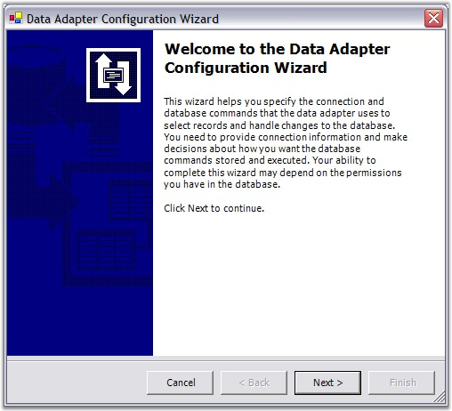{border="0"}

 

Figure 7: Data Adapter Configuration Wizard

[]{style="FONT-FAMILY: 'Trebuchet MS','sans-serif'; COLOR: #15428b; FONT-SIZE: 9pt"} 

[]{style="FONT-FAMILY: 'Trebuchet MS','sans-serif'; FONT-SIZE: 9pt"} 

2.   You can use this wizard to create a connection to the NWIND.mdb file. Click **Next** to continue.

[]{style="FONT-FAMILY: 'Trebuchet MS','sans-serif'; COLOR: #15428b; FONT-SIZE: 9pt"} 

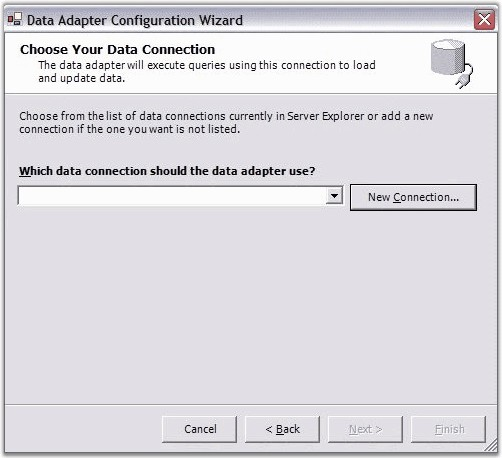{border="0"}

 

Figure 8:  Setting up the Data Connection

**[]{style="FONT-FAMILY: 'Trebuchet MS','sans-serif'; FONT-SIZE: 9pt"}** 

 

3.   Click New Connection. The Data Link Properties dialog box will be displayed. In the Provider tab, select Microsoft Jet 4.0 OLE DB Provider option as shown in the following screen shot.

[]{style="FONT-FAMILY: 'Trebuchet MS','sans-serif'; FONT-SIZE: 9pt"} 

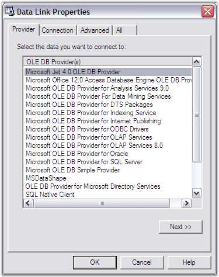{border="0"}

 

Figure 9: Choose the Access Data Provider, Jet 4.0[]{style="FONT-FAMILY: 'Trebuchet MS','sans-serif'"}

**[]{style="FONT-FAMILY: 'Trebuchet MS','sans-serif'; COLOR: #15428b; FONT-SIZE: 9pt"}** 

[]{style="FONT-FAMILY: 'Trebuchet MS','sans-serif'; COLOR: #15428b; FONT-SIZE: 9pt"} 

4.   Click **Next**. The **Connection** tab will be displayed as follows.

[]{style="FONT-FAMILY: 'Trebuchet MS','sans-serif'; FONT-SIZE: 9pt"} 

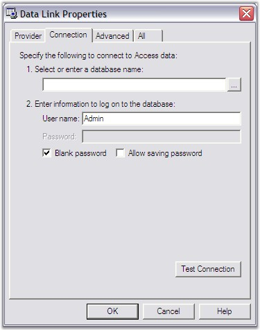{border="0"}

Figure 10: Click the Browse button to select the File[]{style="FONT-FAMILY: 'Trebuchet MS','sans-serif'"}

**[]{style="FONT-FAMILY: 'Trebuchet MS','sans-serif'; COLOR: #15428b; FONT-SIZE: 9pt"}** 

**[]{style="FONT-FAMILY: 'Trebuchet MS','sans-serif'; COLOR: #15428b; FONT-SIZE: 9pt"}** 

5.   Click the **Browse** button to browse and locate an mdb file. For example, \'NWIND.mdb\' is selected. This file is found in the following path: ***C:\\Syncfusion\\EssentialStudio\\\[Version Number\]\\Windows\\Data*** (this path will vary according to your installation location). Then click **OK**.

[]{style="FONT-FAMILY: 'Trebuchet MS','sans-serif'; COLOR: #15428b; FONT-SIZE: 9pt"} 

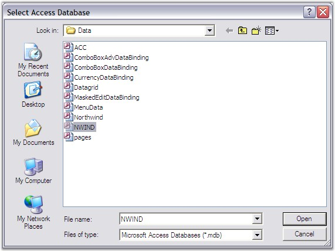{border="0"}

Figure 11: Locating the Access file, NWIND.MDB

**[]{style="FONT-FAMILY: 'Trebuchet MS','sans-serif'; COLOR: #15428b; FONT-SIZE: 9pt"}** 

[]{style="FONT-FAMILY: 'Trebuchet MS','sans-serif'; COLOR: #15428b; FONT-SIZE: 9pt"} 

6.   Click **Next**.

[]{style="FONT-FAMILY: 'Trebuchet MS','sans-serif'; COLOR: #15428b; FONT-SIZE: 9pt"} 

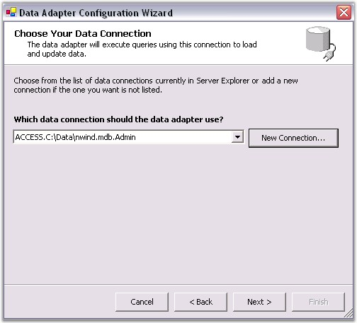{border="0"}

Figure 12: Setting the MDB file as the Data Connection

**[]{style="FONT-FAMILY: 'Trebuchet MS','sans-serif'; COLOR: #15428b; FONT-SIZE: 9pt"}** 

**[]{style="FONT-FAMILY: 'Trebuchet MS','sans-serif'; COLOR: #15428b; FONT-SIZE: 9pt"}** 

7.   Select **Use SQL statements** as your query type, and then click **Next**.

[]{style="FONT-SIZE: 8pt"} 

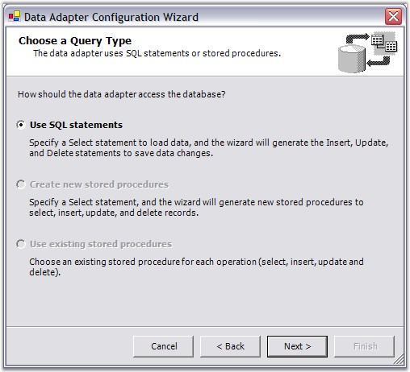{border="0"}

[]{style="FONT-FAMILY: 'Trebuchet MS','sans-serif'; COLOR: #15428b; FONT-SIZE: 9pt"} 

Figure 13: Select to Use SQL Statements

**[]{style="FONT-FAMILY: 'Trebuchet MS','sans-serif'; COLOR: #15428b; FONT-SIZE: 9pt"}** 

8.   To generate the SQL statement, click **Query Builder**.

[]{style="FONT-SIZE: 8pt"} 

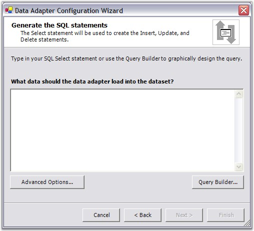{border="0"}

**[]{style="FONT-FAMILY: 'Trebuchet MS','sans-serif'; COLOR: #15428b; FONT-SIZE: 9pt"}** 

Figure 14: Select the Query Builder

**[]{style="FONT-FAMILY: 'Trebuchet MS','sans-serif'; COLOR: #15428b; FONT-SIZE: 9pt"}** 

9.   In the **Add Table** dialog box, select the \'Suppliers\' table, click **Add**, and then click **Close**.

[]{style="FONT-SIZE: 8pt"} 

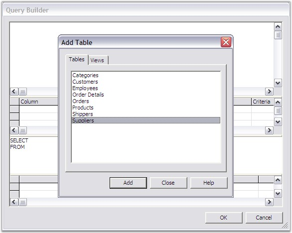{border="0"}

**[]{style="FONT-FAMILY: 'Trebuchet MS','sans-serif'; COLOR: #15428b; FONT-SIZE: 9pt"}** 

Figure 15: Select the Suppliers Table

[]{style="FONT-FAMILY: 'Trebuchet MS','sans-serif'; COLOR: #15428b; FONT-SIZE: 9pt"} 

10.  In this Query Builder window, select **All Columns**. Then click **OK**.

[]{style="FONT-FAMILY: 'Trebuchet MS','sans-serif'; COLOR: #15428b; FONT-SIZE: 9pt"} 

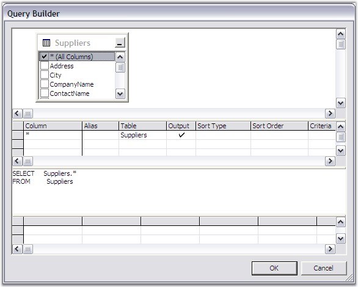{border="0"}

[]{style="FONT-FAMILY: 'Trebuchet MS','sans-serif'; COLOR: #15428b; FONT-SIZE: 9pt"} 

Figure 16: Select the Fields for your Query

 

11.  Click Next to confirm the Query that you have selected.

[]{style="FONT-SIZE: 8pt"} 

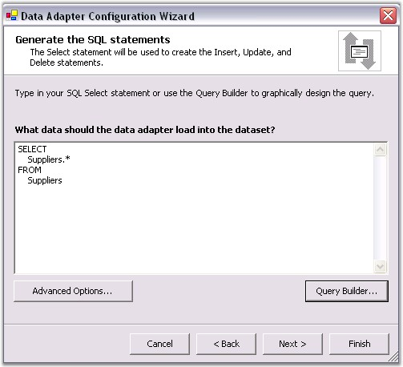{border="0"}

**[]{style="FONT-FAMILY: 'Trebuchet MS','sans-serif'; COLOR: #15428b; FONT-SIZE: 9pt"}** 

Figure 17: Confirm the Query

**[]{style="FONT-FAMILY: 'Trebuchet MS','sans-serif'; COLOR: #15428b; FONT-SIZE: 9pt"}** 

12.  Click **Finish**. Your design surface will look similar to this.

[]{style="FONT-SIZE: 8pt"} 

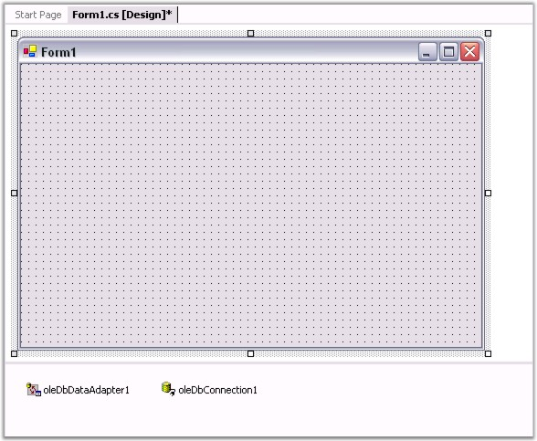{border="0"}

**[]{style="FONT-FAMILY: 'Trebuchet MS','sans-serif'; COLOR: #15428b; FONT-SIZE: 9pt"}** 

Figure 18: Adapter and Connection

[]{style="FONT-FAMILY: 'Trebuchet MS','sans-serif'; COLOR: #15428b; FONT-SIZE: 9pt"} 

13.  Next you will need to generate a data set from the OleDbDataAdapter. Right-click the **oleDbDataAdapter1** under the design surface and select **Generate DataSet**. The **Generate Dataset** dialog box will be displayed.

[]{style="FONT-FAMILY: 'Trebuchet MS','sans-serif'; COLOR: #15428b; FONT-SIZE: 9pt"} 

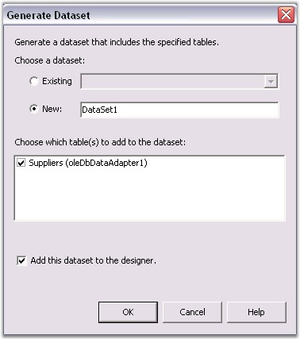{border="0"}

**[]{style="FONT-FAMILY: 'Trebuchet MS','sans-serif'; COLOR: #15428b; FONT-SIZE: 9pt"}** 

Figure 19: Generating a Dataset

**[]{style="FONT-FAMILY: 'Trebuchet MS','sans-serif'; COLOR: #15428b; FONT-SIZE: 9pt"}** 

14.  Click **OK** to add a DataSet11 object next to the oleDbConnection1 under the design surface.

 

15.  From the toolbox, drag the **Grid Grouping control** to your form. Size and position it. Also, set the **DataSource** property to *dataSet11.Suppliers* Data Table as shown in the following screen shot.

[]{style="FONT-FAMILY: 'Trebuchet MS','sans-serif'; COLOR: #15428b; FONT-SIZE: 9pt"} 

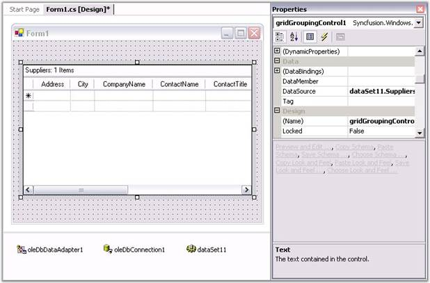{border="0"}

**[]{style="FONT-FAMILY: 'Trebuchet MS','sans-serif'; COLOR: #15428b; FONT-SIZE: 9pt"}** 

Figure 20: Designer with Grid Grouping control and setting the DataSource Property

[]{style="FONT-SIZE: 8pt"} 

16.  Double-click the form on the design surface to add a Load event handler. In this handler, add the following code.

[]{style="FONT-FAMILY: 'Trebuchet MS','sans-serif'; COLOR: #15428b; FONT-SIZE: 9pt"} 

+-----------------------------------------------------------------------------------------------------------------------------------------------------------------------------------------------------------------------------------------------------------+
| **[\[C#\]]{style="FONT-FAMILY: 'Courier New'; COLOR: black"}**                                                                                                                                                                                            |
|                                                                                                                                                                                                                                                           |
| []{style="FONT-FAMILY: 'Trebuchet MS','sans-serif'; COLOR: #15428b"}                                                                                                                                                                                      |
|                                                                                                                                                                                                                                                           |
| [this]{style="FONT-FAMILY: 'Courier New'; COLOR: blue"}[.oleDbDataAdapter.Fill(]{style="FONT-FAMILY: 'Courier New'; COLOR: black"}[this]{style="FONT-FAMILY: 'Courier New'; COLOR: blue"}[.dataSet11);]{style="FONT-FAMILY: 'Courier New'; COLOR: black"} |
+-----------------------------------------------------------------------------------------------------------------------------------------------------------------------------------------------------------------------------------------------------------+

[]{style="FONT-FAMILY: 'Trebuchet MS','sans-serif'; COLOR: #15428b; FONT-SIZE: 9pt"} 

+------------------------------------------------------------------------------------------------------------------------------------------------------------------------------------------------------------------------------------------------------+
| **[\[VB.NET\]]{style="FONT-FAMILY: 'Courier New'; COLOR: black"}**                                                                                                                                                                                   |
|                                                                                                                                                                                                                                                      |
| []{style="FONT-FAMILY: 'Trebuchet MS','sans-serif'; COLOR: #15428b"}                                                                                                                                                                                 |
|                                                                                                                                                                                                                                                      |
| [Me]{style="FONT-FAMILY: 'Courier New'; COLOR: blue"}[.oleDbDataAdapter.Fill(]{style="FONT-FAMILY: 'Courier New'; COLOR: black"}[Me]{style="FONT-FAMILY: 'Courier New'; COLOR: blue"}[.dataSet11)]{style="FONT-FAMILY: 'Courier New'; COLOR: black"} |
+------------------------------------------------------------------------------------------------------------------------------------------------------------------------------------------------------------------------------------------------------+

[]{style="FONT-FAMILY: 'Trebuchet MS','sans-serif'; COLOR: #15428b; FONT-SIZE: 9pt"} 

The preceding code is used to load the data from the Data Table. Without this code, you will see an empty Grid Grouping control at run time.

 

17.  Finally, set the **Anchor** property of the Grid Grouping control to *All*, so that the Grid Grouping control can be easily sized with the form. This is depicted in the following screen shot.

[]{style="FONT-FAMILY: 'Trebuchet MS','sans-serif'; COLOR: #15428b; FONT-SIZE: 9pt"} 

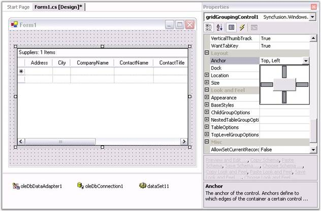{border="0"}

**[]{style="FONT-SIZE: 8pt"}** 

Figure 21: Setting the Anchor Property

**[]{style="FONT-SIZE: 8pt"}** 

18.  To allow grouping at run time, the Grid Grouping control displays a drop panel onto which the user can drag columns to be grouped. To display this drop panel, you need to set the **ShowGroupDropArea** property to *true* as shown in the following screen shot.

[]{style="FONT-FAMILY: 'Trebuchet MS','sans-serif'; COLOR: #15428b; FONT-SIZE: 9pt"} 

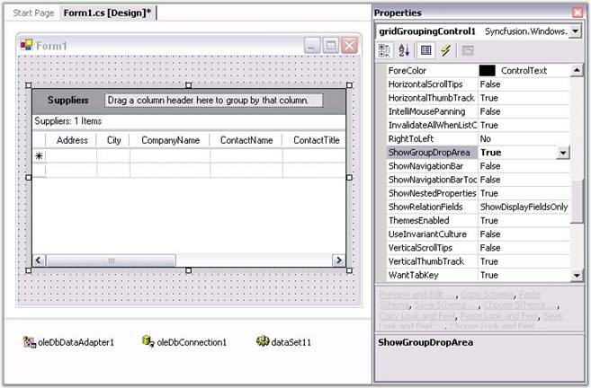{border="0"}

**[]{style="FONT-FAMILY: 'Trebuchet MS','sans-serif'; COLOR: #15428b; FONT-SIZE: 9pt"}** 

Figure 22: Adding the Group Drop Area

**[]{style="FONT-FAMILY: 'Trebuchet MS','sans-serif'; COLOR: #15428b; FONT-SIZE: 9pt"}** 

Run the project. You will see the basic Grid Grouping control with the data as follows.

[]{style="FONT-SIZE: 8pt"} 

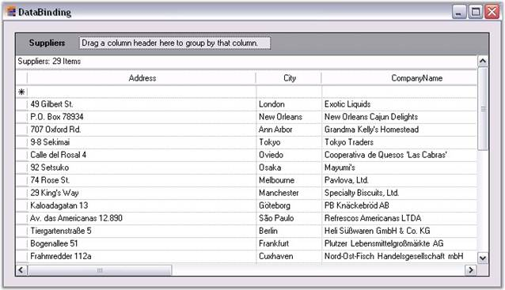{border="0"}

 

Figure 23: Application showing Grid Grouping control with Data

**[]{style="FONT-FAMILY: 'Trebuchet MS','sans-serif'; COLOR: #15428b; FONT-SIZE: 9pt"}** 

19.  To group by CompanyName, click on the CompanyName column header and drag it to the drop area as illustrated in the following screen shot.

[]{style="FONT-FAMILY: 'Trebuchet MS','sans-serif'; COLOR: #15428b; FONT-SIZE: 9pt"} 

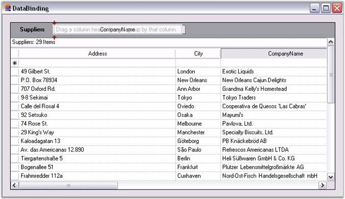{border="0"}

**[]{style="FONT-FAMILY: 'Trebuchet MS','sans-serif'; COLOR: #15428b; FONT-SIZE: 9pt"}** 

Figure 24: Grouping by the CompanyName Column

[]{style="FONT-FAMILY: 'Trebuchet MS','sans-serif'; COLOR: #15428b; FONT-SIZE: 9pt"} 

::: {style="BORDER-BOTTOM: windowtext 1pt solid; BORDER-LEFT: medium none; PADDING-BOTTOM: 1pt; MARGIN-TOP: 9pt; PADDING-LEFT: 0pt; PADDING-RIGHT: 0pt; MARGIN-BOTTOM: 9pt; BORDER-TOP: windowtext 1pt solid; BORDER-RIGHT: medium none; PADDING-TOP: 1pt"}
Note: Each set of grouped values has its own \"Caption\" row and its own \"AddNew\" row (\*). Each group has its own PlusMinus cell that will let you expand/collapse the group.
:::

[]{style="FONT-FAMILY: 'Trebuchet MS','sans-serif'; COLOR: #15428b; FONT-SIZE: 9pt"} 

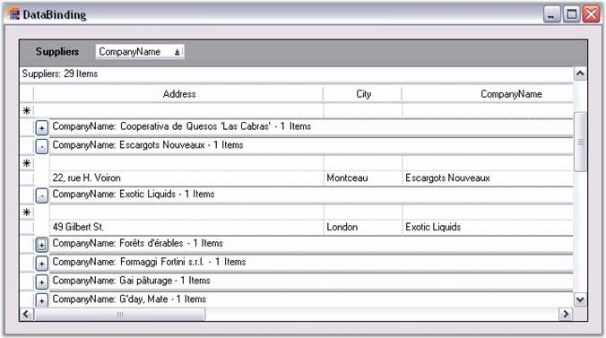{border="0"}

[]{style="FONT-FAMILY: 'Trebuchet MS','sans-serif'; COLOR: #15428b; FONT-SIZE: 9pt"} 

Figure 25: Grouped Grid

 

[]{#p13} 

 

[]{#related-topics}
::::
