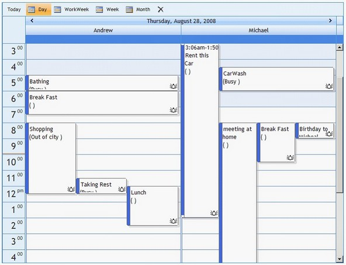

::: {style="DISPLAY: none"}
{#d2h_url_template}{#d2h_package_url style="WIDTH: 0px; DISPLAY: none; HEIGHT: 0px"}
:::

::::: {#nsbanner .d2h_main_nsbanner style="BORDER-BOTTOM: #999999 1px solid; POSITION: relative; PADDING-BOTTOM: 0px; BACKGROUND-COLOR: transparent; PADDING-LEFT: 0px; PADDING-RIGHT: 0px; DISPLAY: none; BORDER-TOP: #999999 1px solid; PADDING-TOP: 0px; LEFT: 0px"}
:::: {#TitleRow .d2h_main_titlerow style="PADDING-BOTTOM: 4px; BACKGROUND-COLOR: transparent; PADDING-LEFT: 22px; WIDTH: 100%; PADDING-RIGHT: 10px; DISPLAY: none; PADDING-TOP: 4px"}
::: {#ienav .d2h_main_ienav style="DISPLAY: none"}
{#D2HPrevious .D2HPreviousEnabled}  {#D2HNext .D2HNextEnabled}
:::
::::
:::::

:::: {#nstext .d2h_main_nstext style="PADDING-BOTTOM: 10px; BACKGROUND-COLOR: transparent; PADDING-LEFT: 22px; PADDING-RIGHT: 10px; HEIGHT: 100%; OVERFLOW: auto; PADDING-TOP: 5px" hasuserbackground="true" valign="bottom"}
::: {#d2h_breadcrumbs .d2h_breadcrumbs}
[Essential Studio User Guide Documentation](ms-xhelp:///?Id=12457748-09e3-4d74-a240-8e049cedf030){.d2h_breadcrumbsNormal}[ \> ]{.d2h_breadcrumbsLinkSeparator}[User Interface Edition](ms-xhelp:///?Id=c29296b7-531c-413b-a0ec-488ca1f7f669){.d2h_breadcrumbsNormal}[ \> ]{.d2h_breadcrumbsLinkSeparator}[Essential ASP.NET](ms-xhelp:///?Id=25c35330-c127-4dad-9a92-ed79dc7261a6){.d2h_breadcrumbsNormal}[ \> ]{.d2h_breadcrumbsLinkSeparator}[Essential Schedule]{.d2h_breadcrumbsContentsOnly}[ \> ]{.d2h_breadcrumbsLinkSeparator}[Concepts and Features](ms-xhelp:///?Id=64869483-f57f-4838-b322-b1a3d1ce8e40){.d2h_breadcrumbsNormal}[ \> ]{.d2h_breadcrumbsLinkSeparator}[Data Binding](ms-xhelp:///?Id=ac2d4b8c-3b97-49fa-8b52-afcf935bf626){.d2h_breadcrumbsNormal}
:::

### Binding to LinqDataSource {#binding-to-linqdatasource style="tab-stops: 0pt"}

[]{style="FONT-FAMILY: 'Trebuchet MS','sans-serif'; COLOR: #15428b; FONT-SIZE: 9pt"} 

This section illustrates how to bind **LinqDataSource** with the Schedule control.

[]{style="FONT-FAMILY: 'Trebuchet MS','sans-serif'; COLOR: #15428b; FONT-SIZE: 9pt"} 

1.   Set Data Source control to bind data to the Schedule Control.

The below example demonstrates the resulting code on setting the **LinqDataSource** control as data source to the Schedule control.

[]{style="FONT-FAMILY: 'Trebuchet MS','sans-serif'; COLOR: #15428b; FONT-SIZE: 9pt"} 

+--------------------------------------------------------------------------------------------------------------------------------------------------------------------------------------------------------------------------------------------------------------------------------------------------------------------------------------------------------------------------------------------------------------------------------------------------------------------------------------------------------------------------------------------------------------------------------------------------------------------------+
| **[\[ASPX\]]{style="FONT-FAMILY: 'Courier New'"}**                                                                                                                                                                                                                                                                                                                                                                                                                                                                                                                                                                       |
|                                                                                                                                                                                                                                                                                                                                                                                                                                                                                                                                                                                                                          |
| **[]{style="FONT-FAMILY: 'Courier New'"}**                                                                                                                                                                                                                                                                                                                                                                                                                                                                                                                                                                               |
|                                                                                                                                                                                                                                                                                                                                                                                                                                                                                                                                                                                                                          |
| [\<]{style="FONT-FAMILY: 'Courier New'; COLOR: blue"}[asp]{style="FONT-FAMILY: 'Courier New'; COLOR: #a31515"}[:]{style="FONT-FAMILY: 'Courier New'; COLOR: blue"}[UpdatePanel]{style="FONT-FAMILY: 'Courier New'; COLOR: #a31515"}[ [ID]{style="COLOR: red"}[=\"UpdatePanel1\"]{style="COLOR: blue"} [runat]{style="COLOR: red"}[=\"server\"\>]{style="COLOR: blue"}]{style="FONT-FAMILY: 'Courier New'"}                                                                                                                                                                                                               |
|                                                                                                                                                                                                                                                                                                                                                                                                                                                                                                                                                                                                                          |
| [            [\<]{style="COLOR: blue"}[ContentTemplate]{style="COLOR: #a31515"}[\>]{style="COLOR: blue"}]{style="FONT-FAMILY: 'Courier New'"}                                                                                                                                                                                                                                                                                                                                                                                                                                                                            |
|                                                                                                                                                                                                                                                                                                                                                                                                                                                                                                                                                                                                                          |
| [                [\<]{style="COLOR: blue"}[syncfusion]{style="COLOR: #a31515"}[:]{style="COLOR: blue"}[Schedule]{style="COLOR: #a31515"} [ID]{style="COLOR: red"}[=\"Schedule1\"]{style="COLOR: blue"} [runat]{style="COLOR: red"}[=\"server\"]{style="COLOR: blue"} [AutoFormat]{style="COLOR: red"}[=\"Office2007Blue\"]{style="COLOR: blue"} [ScheduleType]{style="COLOR: red"}[=\"Day\"]{style="COLOR: blue"}]{style="FONT-FAMILY: 'Courier New'"}                                                                                                                                                                   |
|                                                                                                                                                                                                                                                                                                                                                                                                                                                                                                                                                                                                                          |
| [                    [StartDate]{style="COLOR: red"}[=\"2008-08-28\"]{style="COLOR: blue"} [Width]{style="COLOR: red"}[=\"900px\"]{style="COLOR: blue"} [AutoPostBackOnScheduleClick]{style="COLOR: red"}[=\"true\"]{style="COLOR: blue"} [ShowContextMenu]{style="COLOR: red"}[=\"true\"]{style="COLOR: blue"}]{style="FONT-FAMILY: 'Courier New'"}                                                                                                                                                                                                                                                                     |
|                                                                                                                                                                                                                                                                                                                                                                                                                                                                                                                                                                                                                          |
| [                    [AppointmentDataSourceID]{style="COLOR: red"}[=\"LinqDataSource1\"]{style="COLOR: blue"} [CategoryDataSourceID]{style="COLOR: red"}[=\"LinqDataSource2\"]{style="COLOR: blue"}]{style="FONT-FAMILY: 'Courier New'"}                                                                                                                                                                                                                                                                                                                                                                                 |
|                                                                                                                                                                                                                                                                                                                                                                                                                                                                                                                                                                                                                          |
| [                    [ResourceDataSourceID]{style="COLOR: red"}[=\"LinqDataSource3\"]{style="COLOR: blue"} [ViewStrip]{style="COLOR: red"}[=\"true\"]{style="COLOR: blue"} [Height]{style="COLOR: red"}[=\"500px\"]{style="COLOR: blue"} [ResolutionHeight]{style="COLOR: red"}[=\"16\"]{style="COLOR: blue"}]{style="FONT-FAMILY: 'Courier New'"}                                                                                                                                                                                                                                                                       |
|                                                                                                                                                                                                                                                                                                                                                                                                                                                                                                                                                                                                                          |
| [                    [DisabledBackgroundColor]{style="COLOR: red"}[=\"221, 227, 238\"]{style="COLOR: blue"} [WaitingPopupCSSClass]{style="COLOR: red"}[=\"PopupCSS\"\>]{style="COLOR: blue"}]{style="FONT-FAMILY: 'Courier New'"}                                                                                                                                                                                                                                                                                                                                                                                        |
|                                                                                                                                                                                                                                                                                                                                                                                                                                                                                                                                                                                                                          |
| [                    [\<]{style="COLOR: blue"}[ResourceColumn]{style="COLOR: #a31515"} [Width]{style="COLOR: red"}[=\"50px\"]{style="COLOR: blue"} [/\>]{style="COLOR: blue"}]{style="FONT-FAMILY: 'Courier New'"}                                                                                                                                                                                                                                                                                                                                                                                                       |
|                                                                                                                                                                                                                                                                                                                                                                                                                                                                                                                                                                                                                          |
| [\<]{style="FONT-FAMILY: 'Courier New'; COLOR: blue"}[AppointmentBindProperties]{style="FONT-FAMILY: 'Courier New'; COLOR: #a31515"}[ [AllDayField]{style="COLOR: red"}[=\"AllDay\"]{style="COLOR: blue"} [WeekDayField]{style="COLOR: red"}[=\"WeekDay\"]{style="COLOR: blue"} [MonthNumberField]{style="COLOR: red"}[=\"MonthNumber\"]{style="COLOR: blue"}]{style="FONT-FAMILY: 'Courier New'"}                                                                                                                                                                                                                       |
|                                                                                                                                                                                                                                                                                                                                                                                                                                                                                                                                                                                                                          |
| [                        [MonthDateValueField]{style="COLOR: red"}[=\"MonthDateValue\"]{style="COLOR: blue"} [EndReccurenceField]{style="COLOR: red"}[=\"EndRecurrence\"]{style="COLOR: blue"} [StartReccurenceField]{style="COLOR: red"}[=\"StartRecurrence\"]{style="COLOR: blue"}]{style="FONT-FAMILY: 'Courier New'"}                                                                                                                                                                                                                                                                                                |
|                                                                                                                                                                                                                                                                                                                                                                                                                                                                                                                                                                                                                          |
| [                        [OccurrencesNumberField]{style="COLOR: red"}[=\"OccurrenceNumber\"]{style="COLOR: blue"} [ReccurencePatternField]{style="COLOR: red"}[=\"RecurrencePattern\"]{style="COLOR: blue"}]{style="FONT-FAMILY: 'Courier New'"}                                                                                                                                                                                                                                                                                                                                                                         |
|                                                                                                                                                                                                                                                                                                                                                                                                                                                                                                                                                                                                                          |
| [                        [UseFridayField]{style="COLOR: red"}[=\"UseFriday\"]{style="COLOR: blue"} [UseSundayField]{style="COLOR: red"}[=\"UseSunday\"]{style="COLOR: blue"} [UseTuesdayField]{style="COLOR: red"}[=\"UseTuesday\"]{style="COLOR: blue"}]{style="FONT-FAMILY: 'Courier New'"}                                                                                                                                                                                                                                                                                                                            |
|                                                                                                                                                                                                                                                                                                                                                                                                                                                                                                                                                                                                                          |
| [                        [UseWednesdayField]{style="COLOR: red"}[=\"UseWednesday\"]{style="COLOR: blue"} [UseThursdayField]{style="COLOR: red"}[=\"UseThursday\"]{style="COLOR: blue"} [UseSaturdayField]{style="COLOR: red"}[=\"UseSaturday\"]{style="COLOR: blue"}  [FirstConditionField]{style="COLOR: red"}[=\"FirstCondition\"]{style="COLOR: blue"} [UseMondayField]{style="COLOR: red"}[=\"UseMonday\"]{style="COLOR: blue"} [AllowRecurrenceField]{style="COLOR: red"}[=\"AllowRecurrence\"]{style="COLOR: blue"}]{style="FONT-FAMILY: 'Courier New'"}                                                           |
|                                                                                                                                                                                                                                                                                                                                                                                                                                                                                                                                                                                                                          |
| [                        [ContentField]{style="COLOR: red"}[=\"Content\"]{style="COLOR: blue"} [SubjectField]{style="COLOR: red"}[=\"Subject\"]{style="COLOR: blue"} [UniqueIDField]{style="COLOR: red"}[=\"Id\"]{style="COLOR: blue"} [EndTimeField]{style="COLOR: red"}[=\"EndTime\"]{style="COLOR: blue"}]{style="FONT-FAMILY: 'Courier New'"}                                                                                                                                                                                                                                                                        |
|                                                                                                                                                                                                                                                                                                                                                                                                                                                                                                                                                                                                                          |
| [                        [LocationValueField]{style="COLOR: red"}[=\"LocationValue\"]{style="COLOR: blue"} [StartTimeField]{style="COLOR: red"}[=\"StartTime\"]{style="COLOR: blue"} [OwnerField]{style="COLOR: red"}[=\"Owner\"]{style="COLOR: blue"} [/\>]{style="COLOR: blue"}                [\</]{style="COLOR: blue"}[syncfusion]{style="COLOR: #a31515"}[:]{style="COLOR: blue"}[Schedule]{style="COLOR: #a31515"}[\>]{style="COLOR: blue"}]{style="FONT-FAMILY: 'Courier New'"}                                                                                                                                  |
|                                                                                                                                                                                                                                                                                                                                                                                                                                                                                                                                                                                                                          |
| [            [\</]{style="COLOR: blue"}[ContentTemplate]{style="COLOR: #a31515"}[\>]{style="COLOR: blue"}]{style="FONT-FAMILY: 'Courier New'"}                                                                                                                                                                                                                                                                                                                                                                                                                                                                           |
|                                                                                                                                                                                                                                                                                                                                                                                                                                                                                                                                                                                                                          |
| [        [\</]{style="COLOR: blue"}[asp]{style="COLOR: #a31515"}[:]{style="COLOR: blue"}[UpdatePanel]{style="COLOR: #a31515"}[\>]{style="COLOR: blue"}]{style="FONT-FAMILY: 'Courier New'"}                                                                                                                                                                                                                                                                                                                                                                                                                              |
|                                                                                                                                                                                                                                                                                                                                                                                                                                                                                                                                                                                                                          |
| [        [\<]{style="COLOR: blue"}[asp]{style="COLOR: #a31515"}[:]{style="COLOR: blue"}[LinqDataSource]{style="COLOR: #a31515"} [ID]{style="COLOR: red"}[=\"LinqDataSource1\"]{style="COLOR: blue"} [EnableUpdate]{style="COLOR: red"}[=\"true\"]{style="COLOR: blue"} [EnableInsert]{style="COLOR: red"}[=\"true\" ]{style="COLOR: blue"}[EnableDelete]{style="COLOR: red"}[=\"true\"]{style="COLOR: blue"} [ContextTypeName]{style="COLOR: red"}[=\"ScheduleDataDataContext\"]{style="COLOR: blue"} [TableName]{style="COLOR: red"}[=\"AppointmentsTables\"]{style="COLOR: blue"}]{style="FONT-FAMILY: 'Courier New'"} |
|                                                                                                                                                                                                                                                                                                                                                                                                                                                                                                                                                                                                                          |
| [            [runat]{style="COLOR: red"}[=\"server\"\>]{style="COLOR: blue"}]{style="FONT-FAMILY: 'Courier New'"}                                                                                                                                                                                                                                                                                                                                                                                                                                                                                                        |
|                                                                                                                                                                                                                                                                                                                                                                                                                                                                                                                                                                                                                          |
| [        [\</]{style="COLOR: blue"}[asp]{style="COLOR: #a31515"}[:]{style="COLOR: blue"}[LinqDataSource]{style="COLOR: #a31515"}[\>]{style="COLOR: blue"}]{style="FONT-FAMILY: 'Courier New'"}                                                                                                                                                                                                                                                                                                                                                                                                                           |
|                                                                                                                                                                                                                                                                                                                                                                                                                                                                                                                                                                                                                          |
| [        [\<]{style="COLOR: blue"}[asp]{style="COLOR: #a31515"}[:]{style="COLOR: blue"}[LinqDataSource]{style="COLOR: #a31515"} [ID]{style="COLOR: red"}[=\"LinqDataSource2\"]{style="COLOR: blue"} [EnableUpdate]{style="COLOR: red"}[=\"true\"]{style="COLOR: blue"} [EnableInsert]{style="COLOR: red"}[=\"true\"]{style="COLOR: blue"}]{style="FONT-FAMILY: 'Courier New'"}                                                                                                                                                                                                                                           |
|                                                                                                                                                                                                                                                                                                                                                                                                                                                                                                                                                                                                                          |
| [            [EnableDelete]{style="COLOR: red"}[=\"true\"]{style="COLOR: blue"} [ContextTypeName]{style="COLOR: red"}[=\"ScheduleDataDataContext\"]{style="COLOR: blue"} [TableName]{style="COLOR: red"}[=\"CategoriesTables\"]{style="COLOR: blue"}]{style="FONT-FAMILY: 'Courier New'"}                                                                                                                                                                                                                                                                                                                                |
|                                                                                                                                                                                                                                                                                                                                                                                                                                                                                                                                                                                                                          |
| [            [runat]{style="COLOR: red"}[=\"server\"\>]{style="COLOR: blue"}]{style="FONT-FAMILY: 'Courier New'"}                                                                                                                                                                                                                                                                                                                                                                                                                                                                                                        |
|                                                                                                                                                                                                                                                                                                                                                                                                                                                                                                                                                                                                                          |
| [        [\</]{style="COLOR: blue"}[asp]{style="COLOR: #a31515"}[:]{style="COLOR: blue"}[LinqDataSource]{style="COLOR: #a31515"}[\>]{style="COLOR: blue"}]{style="FONT-FAMILY: 'Courier New'"}                                                                                                                                                                                                                                                                                                                                                                                                                           |
|                                                                                                                                                                                                                                                                                                                                                                                                                                                                                                                                                                                                                          |
| [        [\<]{style="COLOR: blue"}[asp]{style="COLOR: #a31515"}[:]{style="COLOR: blue"}[LinqDataSource]{style="COLOR: #a31515"} [ID]{style="COLOR: red"}[=\"LinqDataSource3\"]{style="COLOR: blue"} [EnableUpdate]{style="COLOR: red"}[=\"true\"]{style="COLOR: blue"} [EnableInsert]{style="COLOR: red"}[=\"true\"]{style="COLOR: blue"}]{style="FONT-FAMILY: 'Courier New'"}                                                                                                                                                                                                                                           |
|                                                                                                                                                                                                                                                                                                                                                                                                                                                                                                                                                                                                                          |
| [            [EnableDelete]{style="COLOR: red"}[=\"true\"]{style="COLOR: blue"} [ContextTypeName]{style="COLOR: red"}[=\"ScheduleDataDataContext\"]{style="COLOR: blue"} [TableName]{style="COLOR: red"}[=\"ResourceTables\"]{style="COLOR: blue"}]{style="FONT-FAMILY: 'Courier New'"}                                                                                                                                                                                                                                                                                                                                  |
|                                                                                                                                                                                                                                                                                                                                                                                                                                                                                                                                                                                                                          |
| [            [runat]{style="COLOR: red"}[=\"server\"\>]{style="COLOR: blue"}]{style="FONT-FAMILY: 'Courier New'"}                                                                                                                                                                                                                                                                                                                                                                                                                                                                                                        |
|                                                                                                                                                                                                                                                                                                                                                                                                                                                                                                                                                                                                                          |
| [        [\</]{style="COLOR: blue"}[asp]{style="COLOR: #a31515"}[:]{style="COLOR: blue"}[LinqDataSource]{style="COLOR: #a31515"}[\>]{style="COLOR: blue"}]{style="FONT-FAMILY: 'Courier New'"}                                                                                                                                                                                                                                                                                                                                                                                                                           |
+--------------------------------------------------------------------------------------------------------------------------------------------------------------------------------------------------------------------------------------------------------------------------------------------------------------------------------------------------------------------------------------------------------------------------------------------------------------------------------------------------------------------------------------------------------------------------------------------------------------------------+

[]{style="FONT-FAMILY: 'Trebuchet MS','sans-serif'; COLOR: #15428b; FONT-SIZE: 9pt"} 

When the code runs, the following output displays.

[]{style="FONT-FAMILY: 'Times New Roman','serif'; FONT-SIZE: 12pt"} 

{border="0"}

***[]{style="FONT-FAMILY: 'Trebuchet MS','sans-serif'; COLOR: #15428b; FONT-SIZE: 9pt"}*** 

Figure 51: Binding to LinqDatasource

[]{#related-topics}
::::
