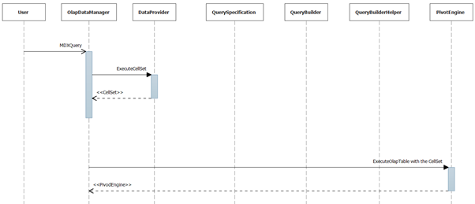

::: {style="DISPLAY: none"}
{#d2h_url_template}{#d2h_package_url style="WIDTH: 0px; DISPLAY: none; HEIGHT: 0px"}
:::

::::: {#nsbanner .d2h_main_nsbanner style="BORDER-BOTTOM: #999999 1px solid; POSITION: relative; PADDING-BOTTOM: 0px; BACKGROUND-COLOR: transparent; PADDING-LEFT: 0px; PADDING-RIGHT: 0px; DISPLAY: none; BORDER-TOP: #999999 1px solid; PADDING-TOP: 0px; LEFT: 0px"}
:::: {#TitleRow .d2h_main_titlerow style="PADDING-BOTTOM: 4px; BACKGROUND-COLOR: transparent; PADDING-LEFT: 22px; WIDTH: 100%; PADDING-RIGHT: 10px; DISPLAY: none; PADDING-TOP: 4px"}
::: {#ienav .d2h_main_ienav style="DISPLAY: none"}
{#D2HPrevious .D2HPreviousEnabled}  {#D2HNext .D2HNextEnabled}
:::
::::
:::::

:::: {#nstext .d2h_main_nstext style="PADDING-BOTTOM: 10px; BACKGROUND-COLOR: transparent; PADDING-LEFT: 22px; PADDING-RIGHT: 10px; HEIGHT: 100%; OVERFLOW: auto; PADDING-TOP: 5px" hasuserbackground="true" valign="bottom"}
::: {#d2h_breadcrumbs .d2h_breadcrumbs}
[Essential Studio User Guide Documentation](ms-xhelp:///?Id=12457748-09e3-4d74-a240-8e049cedf030){.d2h_breadcrumbsNormal}[ \> ]{.d2h_breadcrumbsLinkSeparator}[Business Intelligence Edition](ms-xhelp:///?Id=fdf33dd8-62b2-47b9-ad7b-fc50e590bca5){.d2h_breadcrumbsNormal}[ \> ]{.d2h_breadcrumbsLinkSeparator}[Essential BI Common](ms-xhelp:///?Id=51cb28d1-f201-4ea8-9963-a8afa451f64c){.d2h_breadcrumbsNormal}[ \> ]{.d2h_breadcrumbsLinkSeparator}[How-To](ms-xhelp:///?Id=f56652ff-a795-456f-ba4a-e1b615c58fdd){.d2h_breadcrumbsNormal}
:::

## Bind the MDX query to OlapDataManager {#bind-the-mdx-query-to-olapdatamanager style="tab-stops: 0pt"}

MDX query is one of the inputs accepted by the OlapDataManager to process the data in the connected data source. There are two way to pass the MDX query to OlapDataManager:

1.   Through **MdxQuery** property

2.   Through ExecuteCellSet() method argument

 

OlapDataManager will accept the MDX query in the string format through any one of this and process the data based on the query. Once the connection is established you can pass the MDX query in string format.

The following code will illustrate the passing of the MXD query as input**:**

+---------------------------------------------------------------------------------------------------------------------------------------------------------------------------------------------------------------------------------------------------------+
| []{#_MdxQuery_property}**[\[C#\]]{style="FONT-FAMILY: 'Courier New'"}**                                                                                                                                                                                 |
|                                                                                                                                                                                                                                                         |
| [OlapDataManager]{style="FONT-FAMILY: 'Courier New'; COLOR: #2b91af"}[ olapDataManager = [new]{style="COLOR: blue"} [OlapDataManager]{style="COLOR: #2b91af"}([\"DataSource=localhost; Initial Catalog=Adventure Works DW\"]{style="COLOR: #a31515"});\ |
| [string]{style="COLOR: blue"} mdxQuery = ]{style="FONT-FAMILY: 'Courier New'"}                                                                                                                                                                          |
|                                                                                                                                                                                                                                                         |
| [@\"SELECT NON EMPTY ({{Hierarchize({DrilldownLevel({]{style="FONT-FAMILY: 'Courier New'; COLOR: #a31515"}                                                                                                                                              |
|                                                                                                                                                                                                                                                         |
| [\[Customer\].\[Customer Geography\].\[All Customers\]})})} \* ]{style="FONT-FAMILY: 'Courier New'; COLOR: #a31515"}                                                                                                                                    |
|                                                                                                                                                                                                                                                         |
| [{\[MEASURES\].\[Internet Sales Amount\]}}) dimension properties]{style="FONT-FAMILY: 'Courier New'; COLOR: #a31515"}                                                                                                                                   |
|                                                                                                                                                                                                                                                         |
| [ member_type ON COLUMNS, NON EMPTY ({{Hierarchize({]{style="FONT-FAMILY: 'Courier New'; COLOR: #a31515"}                                                                                                                                               |
|                                                                                                                                                                                                                                                         |
| [DrilldownLevel({\[Date\].\[Fiscal\].\[All Periods\]})})}} ) ]{style="FONT-FAMILY: 'Courier New'; COLOR: #a31515"}                                                                                                                                      |
|                                                                                                                                                                                                                                                         |
| [dimension properties member_type ON ROWS ]{style="FONT-FAMILY: 'Courier New'; COLOR: #a31515"}                                                                                                                                                         |
|                                                                                                                                                                                                                                                         |
| [FROM \[Adventure Works\]  CELL PROPERTIES ]{style="FONT-FAMILY: 'Courier New'; COLOR: #a31515"}                                                                                                                                                        |
|                                                                                                                                                                                                                                                         |
| [VALUE, FORMAT_STRING, FORMATTED_VALUE\"]{style="FONT-FAMILY: 'Courier New'; COLOR: #a31515"}[;\                                                                                                                                                        |
| olapDataManager.MdxQuery = mdxQuery;\                                                                                                                                                                                                                   |
| olapDataManager.ExecuteCellSet();]{style="FONT-FAMILY: 'Courier New'"}                                                                                                                                                                                  |
+---------------------------------------------------------------------------------------------------------------------------------------------------------------------------------------------------------------------------------------------------------+

 

+---------------------------------------------------------------------------------------------------------------------------------------------------------------------------------------------------------------------------------------------------------------------------+
| **[\[VB\]]{style="FONT-FAMILY: 'Courier New'"}**                                                                                                                                                                                                                          |
|                                                                                                                                                                                                                                                                           |
| [      ]{style="FONT-FAMILY: 'Courier New'"}                                                                                                                                                                                                                              |
|                                                                                                                                                                                                                                                                           |
| [Dim]{style="FONT-FAMILY: 'Courier New'; COLOR: blue"}[ olapDataManager [As]{style="COLOR: blue"} OlapDataManager = [New]{style="COLOR: blue"} OlapDataManager(\"DataSource=localhost; Initial Catalog=Adventure Works DW\")]{style="FONT-FAMILY: 'Courier New'"}         |
|                                                                                                                                                                                                                                                                           |
| [Dim]{style="FONT-FAMILY: 'Courier New'; COLOR: blue"}[ mdxQuery [As]{style="COLOR: blue"} [String]{style="COLOR: blue"} = ]{style="FONT-FAMILY: 'Courier New'"}[\"SELECT NON EMPTY ({{Hierarchize({DrilldownLevel({]{style="FONT-FAMILY: 'Courier New'; COLOR: #a31515"} |
|                                                                                                                                                                                                                                                                           |
| [\[Customer\].\[Customer Geography\].\[All Customers\]})})} \* ]{style="FONT-FAMILY: 'Courier New'; COLOR: #a31515"}                                                                                                                                                      |
|                                                                                                                                                                                                                                                                           |
| [{\[MEASURES\].\[Internet Sales Amount\]}}) dimension properties]{style="FONT-FAMILY: 'Courier New'; COLOR: #a31515"}                                                                                                                                                     |
|                                                                                                                                                                                                                                                                           |
| [ member_type ON COLUMNS, NON EMPTY ({{Hierarchize({]{style="FONT-FAMILY: 'Courier New'; COLOR: #a31515"}                                                                                                                                                                 |
|                                                                                                                                                                                                                                                                           |
| [DrilldownLevel({\[Date\].\[Fiscal\].\[All Periods\]})})}} ) ]{style="FONT-FAMILY: 'Courier New'; COLOR: #a31515"}                                                                                                                                                        |
|                                                                                                                                                                                                                                                                           |
| [dimension properties member_type ON ROWS ]{style="FONT-FAMILY: 'Courier New'; COLOR: #a31515"}                                                                                                                                                                           |
|                                                                                                                                                                                                                                                                           |
| [FROM \[Adventure Works\]  CELL PROPERTIES ]{style="FONT-FAMILY: 'Courier New'; COLOR: #a31515"}                                                                                                                                                                          |
|                                                                                                                                                                                                                                                                           |
| [VALUE, FORMAT_STRING, FORMATTED_VALUE\"]{style="FONT-FAMILY: 'Courier New'; COLOR: #a31515"}[]{style="FONT-FAMILY: 'Courier New'"}                                                                                                                                       |
|                                                                                                                                                                                                                                                                           |
| [olapDataManager.MdxQuery = mdxQuery]{style="FONT-FAMILY: 'Courier New'"}                                                                                                                                                                                                 |
|                                                                                                                                                                                                                                                                           |
| [olapDataManager.ExecuteCellSet()]{style="FONT-FAMILY: 'Courier New'"}                                                                                                                                                                                                    |
+---------------------------------------------------------------------------------------------------------------------------------------------------------------------------------------------------------------------------------------------------------------------------+

 

[]{#_ExecuteCellSet}This will accept the MDX query as a string and assign it to the OlapDataManager'd mdxQuery property and invoke the data process.     

+---------------------------------------------------------------------------------------------------------------------------------------------------------------------------------------------------------------------------------------------------------+
| **[\[C#\]]{style="FONT-FAMILY: 'Courier New'"}**                                                                                                                                                                                                        |
|                                                                                                                                                                                                                                                         |
| [OlapDataManager]{style="FONT-FAMILY: 'Courier New'; COLOR: #2b91af"}[ olapDataManager = [new]{style="COLOR: blue"} [OlapDataManager]{style="COLOR: #2b91af"}([\"DataSource=localhost; Initial Catalog=Adventure Works DW\"]{style="COLOR: #a31515"});\ |
| [string]{style="COLOR: blue"} mdxQuery = ]{style="FONT-FAMILY: 'Courier New'"}                                                                                                                                                                          |
|                                                                                                                                                                                                                                                         |
| [@\"SELECT NON EMPTY ({{Hierarchize({DrilldownLevel({]{style="FONT-FAMILY: 'Courier New'; COLOR: #a31515"}                                                                                                                                              |
|                                                                                                                                                                                                                                                         |
| [\[Customer\].\[Customer Geography\].\[All Customers\]})})} \* ]{style="FONT-FAMILY: 'Courier New'; COLOR: #a31515"}                                                                                                                                    |
|                                                                                                                                                                                                                                                         |
| [{\[MEASURES\].\[Internet Sales Amount\]}}) dimension properties]{style="FONT-FAMILY: 'Courier New'; COLOR: #a31515"}                                                                                                                                   |
|                                                                                                                                                                                                                                                         |
| [ member_type ON COLUMNS, NON EMPTY ({{Hierarchize({]{style="FONT-FAMILY: 'Courier New'; COLOR: #a31515"}                                                                                                                                               |
|                                                                                                                                                                                                                                                         |
| [DrilldownLevel({\[Date\].\[Fiscal\].\[All Periods\]})})}} ) ]{style="FONT-FAMILY: 'Courier New'; COLOR: #a31515"}                                                                                                                                      |
|                                                                                                                                                                                                                                                         |
| [dimension properties member_type ON ROWS ]{style="FONT-FAMILY: 'Courier New'; COLOR: #a31515"}                                                                                                                                                         |
|                                                                                                                                                                                                                                                         |
| [FROM \[Adventure Works\]  CELL PROPERTIES ]{style="FONT-FAMILY: 'Courier New'; COLOR: #a31515"}                                                                                                                                                        |
|                                                                                                                                                                                                                                                         |
| [VALUE, FORMAT_STRING, FORMATTED_VALUE\";]{style="FONT-FAMILY: 'Courier New'; COLOR: #a31515"}[]{style="FONT-FAMILY: 'Courier New'"}                                                                                                                    |
|                                                                                                                                                                                                                                                         |
| [olapDataManager.ExecuteCellSet(mdxQuery);]{style="FONT-FAMILY: 'Courier New'"}                                                                                                                                                                         |
|                                                                                                                                                                                                                                                         |
| []{style="FONT-FAMILY: 'Courier New'"}                                                                                                                                                                                                                  |
+---------------------------------------------------------------------------------------------------------------------------------------------------------------------------------------------------------------------------------------------------------+

 

+---------------------------------------------------------------------------------------------------------------------------------------------------------------------------------------------------------------------------------------------------------------------------+
| **[\[VB\]]{style="FONT-FAMILY: 'Courier New'"}**                                                                                                                                                                                                                          |
|                                                                                                                                                                                                                                                                           |
| [       ]{style="FONT-FAMILY: 'Courier New'"}                                                                                                                                                                                                                             |
|                                                                                                                                                                                                                                                                           |
| [Dim]{style="FONT-FAMILY: 'Courier New'; COLOR: blue"}[ olapDataManager [As]{style="COLOR: blue"} OlapDataManager = [New]{style="COLOR: blue"} OlapDataManager(\"DataSource=localhost; Initial Catalog=Adventure Works DW\")]{style="FONT-FAMILY: 'Courier New'"}         |
|                                                                                                                                                                                                                                                                           |
| [Dim]{style="FONT-FAMILY: 'Courier New'; COLOR: blue"}[ mdxQuery [As]{style="COLOR: blue"} [String]{style="COLOR: blue"} = ]{style="FONT-FAMILY: 'Courier New'"}[\"SELECT NON EMPTY ({{Hierarchize({DrilldownLevel({]{style="FONT-FAMILY: 'Courier New'; COLOR: #a31515"} |
|                                                                                                                                                                                                                                                                           |
| [\[Customer\].\[Customer Geography\].\[All Customers\]})})} \* ]{style="FONT-FAMILY: 'Courier New'; COLOR: #a31515"}                                                                                                                                                      |
|                                                                                                                                                                                                                                                                           |
| [{\[MEASURES\].\[Internet Sales Amount\]}}) dimension properties]{style="FONT-FAMILY: 'Courier New'; COLOR: #a31515"}                                                                                                                                                     |
|                                                                                                                                                                                                                                                                           |
| [ member_type ON COLUMNS, NON EMPTY ({{Hierarchize({]{style="FONT-FAMILY: 'Courier New'; COLOR: #a31515"}                                                                                                                                                                 |
|                                                                                                                                                                                                                                                                           |
| [DrilldownLevel({\[Date\].\[Fiscal\].\[All Periods\]})})}} ) ]{style="FONT-FAMILY: 'Courier New'; COLOR: #a31515"}                                                                                                                                                        |
|                                                                                                                                                                                                                                                                           |
| [dimension properties member_type ON ROWS ]{style="FONT-FAMILY: 'Courier New'; COLOR: #a31515"}                                                                                                                                                                           |
|                                                                                                                                                                                                                                                                           |
| [FROM \[Adventure Works\]  CELL PROPERTIES ]{style="FONT-FAMILY: 'Courier New'; COLOR: #a31515"}                                                                                                                                                                          |
|                                                                                                                                                                                                                                                                           |
| [VALUE, FORMAT_STRING, FORMATTED_VALUE\"]{style="FONT-FAMILY: 'Courier New'; COLOR: #a31515"}[]{style="FONT-FAMILY: 'Courier New'"}                                                                                                                                       |
|                                                                                                                                                                                                                                                                           |
| [olapDataManager.ExecuteCellSet(mdxQuery)]{style="FONT-FAMILY: 'Courier New'"}                                                                                                                                                                                            |
+---------------------------------------------------------------------------------------------------------------------------------------------------------------------------------------------------------------------------------------------------------------------------+

 

 

Sequential Diagram

The following sequential diagram is matching when user gives input as MDX query:

 

{border="0"}

 

Figure 10: Olap base sequential diagram

 

[]{#related-topics}
::::
