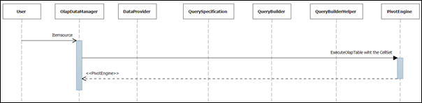

::: {style="DISPLAY: none"}
{#d2h_url_template}{#d2h_package_url style="WIDTH: 0px; DISPLAY: none; HEIGHT: 0px"}
:::

::::: {#nsbanner .d2h_main_nsbanner style="BORDER-BOTTOM: #999999 1px solid; POSITION: relative; PADDING-BOTTOM: 0px; BACKGROUND-COLOR: transparent; PADDING-LEFT: 0px; PADDING-RIGHT: 0px; DISPLAY: none; BORDER-TOP: #999999 1px solid; PADDING-TOP: 0px; LEFT: 0px"}
:::: {#TitleRow .d2h_main_titlerow style="PADDING-BOTTOM: 4px; BACKGROUND-COLOR: transparent; PADDING-LEFT: 22px; WIDTH: 100%; PADDING-RIGHT: 10px; DISPLAY: none; PADDING-TOP: 4px"}
::: {#ienav .d2h_main_ienav style="DISPLAY: none"}
{#D2HPrevious .D2HPreviousEnabled}  {#D2HNext .D2HNextEnabled}
:::
::::
:::::

:::: {#nstext .d2h_main_nstext style="PADDING-BOTTOM: 10px; BACKGROUND-COLOR: transparent; PADDING-LEFT: 22px; PADDING-RIGHT: 10px; HEIGHT: 100%; OVERFLOW: auto; PADDING-TOP: 5px" hasuserbackground="true" valign="bottom"}
::: {#d2h_breadcrumbs .d2h_breadcrumbs}
[Essential Studio User Guide Documentation](ms-xhelp:///?Id=12457748-09e3-4d74-a240-8e049cedf030){.d2h_breadcrumbsNormal}[ \> ]{.d2h_breadcrumbsLinkSeparator}[Business Intelligence Edition](ms-xhelp:///?Id=fdf33dd8-62b2-47b9-ad7b-fc50e590bca5){.d2h_breadcrumbsNormal}[ \> ]{.d2h_breadcrumbsLinkSeparator}[Essential BI Common](ms-xhelp:///?Id=51cb28d1-f201-4ea8-9963-a8afa451f64c){.d2h_breadcrumbsNormal}[ \> ]{.d2h_breadcrumbsLinkSeparator}[How-To](ms-xhelp:///?Id=f56652ff-a795-456f-ba4a-e1b615c58fdd){.d2h_breadcrumbsNormal}
:::

## Bind the Non-OLAP data to OlapDataManager {#bind-the-non-olap-data-to-olapdatamanager style="tab-stops: 0pt"}

To bind the Non-OLAP data, you should bind an item source to the OlapDataManager's item source property and give the Non-OLAP data report to process the given item source. The item source can be an Enumerable collection or an ITyped List.

The following code will illustrate the binding of the Non-OLAP data**.** Here we have used a sample Enumerable collection "ProductSalesCollection" and a sample Olap report "salesReport":

+------------------------------------------------------------------------------------------------------------------------------------------------------------------------------+
| **[\[C#\]]{style="FONT-FAMILY: 'Courier New'"}**                                                                                                                             |
|                                                                                                                                                                              |
| [ProductSalesCollection]{style="FONT-FAMILY: 'Courier New'; COLOR: #2b91af"}[ productSales = [new]{style="COLOR: blue"} [ProductSalesCollection]{style="COLOR: #2b91af"}();\ |
| olapDataManager.ItemSource = productSales;\                                                                                                                                  |
|  \                                                                                                                                                                           |
| olapDataManager.SetCurrentReport(salesReport);]{style="FONT-FAMILY: 'Courier New'"}[]{style="FONT-FAMILY: 'Courier New'"}                                                    |
+------------------------------------------------------------------------------------------------------------------------------------------------------------------------------+

 

+------------------------------------------------------------------------------------------------------------------------------------------------------------------------------------------------------------------+
| **[\[VB\]]{style="FONT-FAMILY: 'Courier New'"}**                                                                                                                                                                 |
|                                                                                                                                                                                                                  |
| **[      ]{style="FONT-FAMILY: 'Courier New'"}**                                                                                                                                                                 |
|                                                                                                                                                                                                                  |
| [Dim]{style="FONT-FAMILY: 'Courier New'; COLOR: blue"}[ productSales [As]{style="COLOR: blue"} ProductSalesCollection = [New]{style="COLOR: blue"} ProductSalesCollection()]{style="FONT-FAMILY: 'Courier New'"} |
|                                                                                                                                                                                                                  |
| [olapDataManager.ItemSource = productSales]{style="FONT-FAMILY: 'Courier New'"}                                                                                                                                  |
|                                                                                                                                                                                                                  |
| []{style="FONT-FAMILY: 'Courier New'"}                                                                                                                                                                           |
|                                                                                                                                                                                                                  |
| [olapDataManager.SetCurrentReport(salesReport)]{style="FONT-FAMILY: 'Courier New'"}                                                                                                                              |
+------------------------------------------------------------------------------------------------------------------------------------------------------------------------------------------------------------------+

 

Sequential Diagram

The following sequential diagram shows the workflow of OlapBase when the input is a Non-OLAP data:

{border="0"}

 

Figure 11: Olap base Sequential diagram

 

[]{#related-topics}
::::
