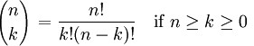

::: {style="DISPLAY: none"}
{#d2h_url_template}{#d2h_package_url style="WIDTH: 0px; DISPLAY: none; HEIGHT: 0px"}
:::

:::: {.d2h_secondary_topic style="PADDING-BOTTOM: 10pt; MARGIN: 0pt; PADDING-LEFT: 0pt; PADDING-RIGHT: 0pt; PADDING-TOP: 0pt"}
#### Binomial Coefficient {#binomial-coefficient style="tab-stops: 0pt"}

 

**Binomial Coefficient** is an utility function used in statistical calculations. This function is used to determine the possible number of combinations of \'k\' items that can  be selected from a set of \'n\' items. The binomial coefficient formula can be explicitly stated as given below.

 

{border="0"}

 

where n! denotes the factorial of n.

 

An alternative name for the binomial coefficient is choose function; the binomial coefficient of n and k is often read as \"n choose k\". Alternative notations include C(n, k), [n]{style="FONT-SIZE: 8pt"}C[k]{style="FONT-SIZE: 8pt"} (C for combination). These numbers are called binomial coefficients because they are coefficients in binomial theorem.

 

Using the formula

 

The **Binomial** method of the **UtilityFunctions** class returns the binomial coefficient for given **n** and **k** values.

 

::: {align="center"}
+-----------------------+-----------------------+-------------------------------------------------------------+
| Method Name           | Parameters            | Return Value                                                |
+-----------------------+-----------------------+-------------------------------------------------------------+
| Binomial              | 1\. The n value.      | An integer that represents the binomial coefficient  value. |
|                       |                       |                                                             |
|                       | 2\. The k value.      |                                                             |
+-----------------------+-----------------------+-------------------------------------------------------------+
:::

 

Example

 

Here is a code snippet that shows a sample usage.

 

+------------------------------------------------------------------------------------------------------------------------------------------------------+
| **[\[C#\]]{style="FONT-FAMILY: 'Courier New'; COLOR: black"}**                                                                                       |
|                                                                                                                                                      |
| [using Syncfusion.Windows.Forms.Chart.Statistics;]{style="FONT-FAMILY: 'Courier New'; COLOR: black"}                                                 |
|                                                                                                                                                      |
| [int]{style="FONT-FAMILY: 'Courier New'; COLOR: blue"}[ result = UtilityFunctions.Binomial(n, k);]{style="FONT-FAMILY: 'Courier New'; COLOR: black"} |
+------------------------------------------------------------------------------------------------------------------------------------------------------+

 

+--------------------------------------------------------------------------------------------------------------------------------------------------------------------------------------------------------------------------------------------------------------------------------------------------------------------------------------------------------------------------+
| **[\[VB.NET\]]{style="FONT-FAMILY: 'Courier New'; COLOR: black"}**                                                                                                                                                                                                                                                                                                       |
|                                                                                                                                                                                                                                                                                                                                                                          |
| [Imports Syncfusion.Windows.Forms.Chart.Statistics]{style="FONT-FAMILY: 'Courier New'; COLOR: black"}                                                                                                                                                                                                                                                                    |
|                                                                                                                                                                                                                                                                                                                                                                          |
| [Dim]{style="FONT-FAMILY: 'Courier New'; COLOR: blue"}[ ]{style="FONT-FAMILY: 'Courier New'; COLOR: black"}[int]{style="FONT-FAMILY: 'Courier New'; COLOR: blue"}[ ]{style="FONT-FAMILY: 'Courier New'; COLOR: black"}[as]{style="FONT-FAMILY: 'Courier New'; COLOR: blue"}[ result = UtilityFunctions.Binomial(n, k)]{style="FONT-FAMILY: 'Courier New'; COLOR: black"} |
+--------------------------------------------------------------------------------------------------------------------------------------------------------------------------------------------------------------------------------------------------------------------------------------------------------------------------------------------------------------------------+

 

[]{#p234} 

[]{#related-topics}
::::
