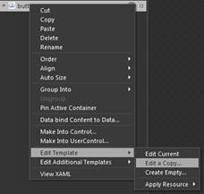
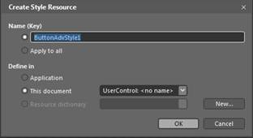
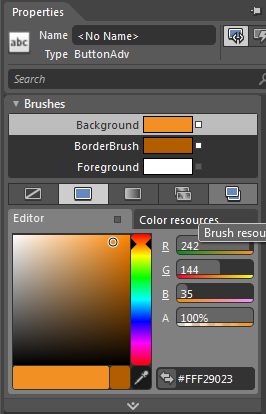
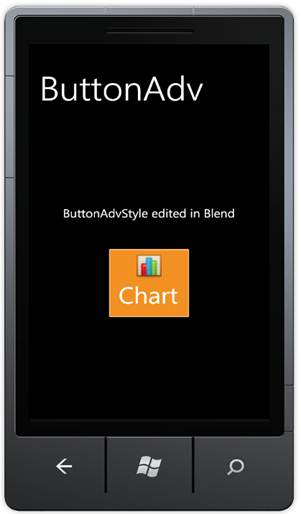

::: {style="DISPLAY: none"}
{#d2h_url_template}{#d2h_package_url style="WIDTH: 0px; DISPLAY: none; HEIGHT: 0px"}
:::

::::: {#nsbanner .d2h_main_nsbanner style="BORDER-BOTTOM: #999999 1px solid; POSITION: relative; PADDING-BOTTOM: 0px; BACKGROUND-COLOR: transparent; PADDING-LEFT: 0px; PADDING-RIGHT: 0px; DISPLAY: none; BORDER-TOP: #999999 1px solid; PADDING-TOP: 0px; LEFT: 0px"}
:::: {#TitleRow .d2h_main_titlerow style="PADDING-BOTTOM: 4px; BACKGROUND-COLOR: transparent; PADDING-LEFT: 22px; WIDTH: 100%; PADDING-RIGHT: 10px; DISPLAY: none; PADDING-TOP: 4px"}
::: {#ienav .d2h_main_ienav style="DISPLAY: none"}
{#D2HPrevious .D2HPreviousEnabled}  {#D2HNext .D2HNextEnabled}
:::
::::
:::::

:::: {#nstext .d2h_main_nstext style="PADDING-BOTTOM: 10px; BACKGROUND-COLOR: transparent; PADDING-LEFT: 22px; PADDING-RIGHT: 10px; HEIGHT: 100%; OVERFLOW: auto; PADDING-TOP: 5px" hasuserbackground="true" valign="bottom"}
::: {#d2h_breadcrumbs .d2h_breadcrumbs}
[Essential Studio User Guide Documentation](ms-xhelp:///?Id=12457748-09e3-4d74-a240-8e049cedf030){.d2h_breadcrumbsNormal}[ \> ]{.d2h_breadcrumbsLinkSeparator}[User Interface Edition](ms-xhelp:///?Id=c29296b7-531c-413b-a0ec-488ca1f7f669){.d2h_breadcrumbsNormal}[ \> ]{.d2h_breadcrumbsLinkSeparator}[Essential Windows Phone](ms-xhelp:///?Id=5ea1999c-4eff-4775-b84e-407dc825f555){.d2h_breadcrumbsNormal}[ \> ]{.d2h_breadcrumbsLinkSeparator}[Essential Tools]{.d2h_breadcrumbsContentsOnly}[ \> ]{.d2h_breadcrumbsLinkSeparator}[Tools Phone Controls](ms-xhelp:///?Id=785aeb70-aa68-45ce-9666-964f209e58fd){.d2h_breadcrumbsNormal}[ \> ]{.d2h_breadcrumbsLinkSeparator}[ButtonAdv](ms-xhelp:///?Id=8bcd5f67-b984-45f1-988c-801c4719cf8f){.d2h_breadcrumbsNormal}
:::

### Blendability {#blendability style="tab-stops: 0pt"}

The Button Controls can be easily edited using Expression Blend:

To edit the button control using Expression Blend:

1.   Open the Sample in Expression Blend.

2.   Right-click the **Button Control** and choose the **Edit Template** option as shown in the following screen shot:

[]{style="FONT-FAMILY: 'Calibri','sans-serif'"} 

{border="0"}

Figure 37: Button Control using Expression Blend

3.   A window will appear as shown in the following screenshot:

 

{border="0"}

Figure 38: Create Style Resource

6.   Click **OK** to create a new style for the Button Control.

 

All resources will be displayed in the resource pane on the right side of the Design area. These resources can be edited to create new Styles.

 

 

 

 

{border="0"}

Figure 39: Customizing the ButtonAdv Propeties through Expression Blend

 

 

The following screenshot shows the ButtonAdv Control customized through Expression Blend:

{border="0"}

Figure 40: ButtonControlAdv style edited in Blend[]{style="FONT-FAMILY: 'Calibri','sans-serif'"}

[]{style="FONT-FAMILY: 'Calibri','sans-serif'"} 

 

[]{#related-topics}
::::
