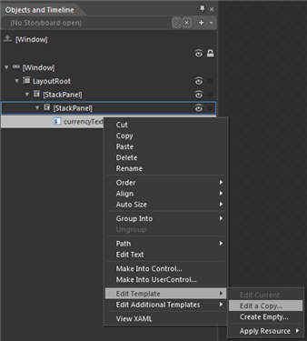
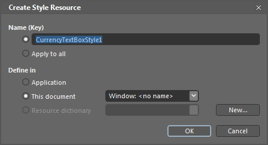
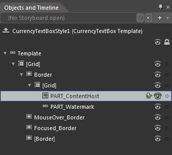
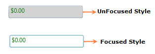

::: {style="DISPLAY: none"}
{#d2h_url_template}{#d2h_package_url style="WIDTH: 0px; DISPLAY: none; HEIGHT: 0px"}
:::

::: {.d2h_secondary_topic style="PADDING-BOTTOM: 10pt; MARGIN: 0pt; PADDING-LEFT: 0pt; PADDING-RIGHT: 0pt; PADDING-TOP: 0pt"}
#### Blendability {#blendability style="tab-stops: 0pt"}

You can edit the CurrencyTextBox Template to give a nice look and feel by using Expression Blend.

The steps to edit the CurrencyTextBox Template by using Expression Blend are as follows:

 

1.   Create a simple WPF application in Expression Blend.

2.   Drag and drop the **CurrencyTextBox** into the application from the Assets tab.

 

{border="0"}

Figure 254: Expression Blend -- Design View[]{style="FONT-FAMILY: 'Trebuchet MS','sans-serif'; COLOR: #15428b"}

3.   After creating the CurrencyTextBox, select the **CurrencyTextBox** and navigate to **Object -\> Edit Style -\> Edit a Copy**, to edit the Template of the CurrencyTextBox.

[]{style="FONT-FAMILY: 'Trebuchet MS','sans-serif'; COLOR: #15428b; FONT-SIZE: 9pt"} 

{border="0"}

Figure 255: Expression Blend -- Edit Template

[]{style="FONT-FAMILY: 'Trebuchet MS','sans-serif'; COLOR: #15428b"} 

Another way to edit the Template is as follows:

4.   In Object and Timeline, right click the **CurrencyTextBox** control and select the **Edit Template** option, as displayed below.

[]{style="FONT-FAMILY: 'Trebuchet MS','sans-serif'; COLOR: #15428b; FONT-SIZE: 9pt"} 

{border="0"}

Figure 256: Expression Blend -- Edit Template[]{style="FONT-FAMILY: 'Trebuchet MS','sans-serif'; COLOR: #15428b"}

5.   This will open a dialog (below) where you can give your style a name and define exactly where you'd like to store it.

 

{border="0"}

Figure 257: Expression Blend -- Create Style Resource[]{style="FONT-FAMILY: 'Trebuchet MS','sans-serif'; COLOR: #15428b"}

[]{style="FONT-FAMILY: 'Trebuchet MS','sans-serif'; COLOR: #15428b; FONT-SIZE: 9pt"} 

The result of these steps is an XAML, which is placed within your application. This XAML represents the default style for the CurrencyTextBox.

 

  ----------------------------------------------------------------------------------------------------------------------------------------------------------------------------------------------------------------------------------------------------------------------------------------------------------------------------------------------------------------------------------------------------------------------------------------------------------------------------------------------------------------------------------------------------------------------------------------------------------------------------------------------------------------------------------------------------------------------------------------------------------------------------------------------------------------------------------------------------------------------------------------------------------------------------------------------------------------------------------------------------------------------------------------------------------------------------------------------------------------------------------------------------------------------------------------------------------------------------------------------------------------------------
  [\<]{style="FONT-FAMILY: Consolas; COLOR: blue; FONT-SIZE: 9.5pt"}[syncfusion]{style="FONT-FAMILY: Consolas; COLOR: #a31515; FONT-SIZE: 9.5pt"}[:]{style="FONT-FAMILY: Consolas; COLOR: blue; FONT-SIZE: 9.5pt"}[CurrencyTextBox]{style="FONT-FAMILY: Consolas; COLOR: #a31515; FONT-SIZE: 9.5pt"}[ x]{style="FONT-FAMILY: Consolas; COLOR: red; FONT-SIZE: 9.5pt"}[:]{style="FONT-FAMILY: Consolas; COLOR: blue; FONT-SIZE: 9.5pt"}[Name]{style="FONT-FAMILY: Consolas; COLOR: red; FONT-SIZE: 9.5pt"}[=\"currencyTextBox\"]{style="FONT-FAMILY: Consolas; COLOR: blue; FONT-SIZE: 9.5pt"}[ Height]{style="FONT-FAMILY: Consolas; COLOR: red; FONT-SIZE: 9.5pt"}[=\"25\"]{style="FONT-FAMILY: Consolas; COLOR: blue; FONT-SIZE: 9.5pt"}[ Width]{style="FONT-FAMILY: Consolas; COLOR: red; FONT-SIZE: 9.5pt"}[=\"150\"]{style="FONT-FAMILY: Consolas; COLOR: blue; FONT-SIZE: 9.5pt"}[ Style]{style="FONT-FAMILY: Consolas; COLOR: red; FONT-SIZE: 9.5pt"}[=\"{]{style="FONT-FAMILY: Consolas; COLOR: blue; FONT-SIZE: 9.5pt"}[StaticResource]{style="FONT-FAMILY: Consolas; COLOR: #a31515; FONT-SIZE: 9.5pt"}[ CurrencyTextBoxStyle1]{style="FONT-FAMILY: Consolas; COLOR: red; FONT-SIZE: 9.5pt"}[}\"/\>]{style="FONT-FAMILY: Consolas; COLOR: blue; FONT-SIZE: 9.5pt"}
  ----------------------------------------------------------------------------------------------------------------------------------------------------------------------------------------------------------------------------------------------------------------------------------------------------------------------------------------------------------------------------------------------------------------------------------------------------------------------------------------------------------------------------------------------------------------------------------------------------------------------------------------------------------------------------------------------------------------------------------------------------------------------------------------------------------------------------------------------------------------------------------------------------------------------------------------------------------------------------------------------------------------------------------------------------------------------------------------------------------------------------------------------------------------------------------------------------------------------------------------------------------------------------

 

All template items can now be found in the Objects and Timeline window.

 

{border="0"}

Figure 258: Expression Blend -- Objects and Timeline

Now you can replace the existing Template setter and Triggers with your own creation. In the Triggers tab you can select the Trigger and customize it as you want.

 

{border="0"}

Figure 259: Triggers

[]{style="FONT-FAMILY: 'Trebuchet MS','sans-serif'; COLOR: #15428b; FONT-SIZE: 9pt"} 

Here is a simple example to customize the UnFocused state of the CurrencyTextBox:

+-------------------------------------------------------------------------------------------------------------------------------------------------------------------------------------------------------------------------------------------------------------------------------------------------------------------------------------------------------------------------------------------------------------------------------------------------------------------------------------------------------------------------------------------------------------------------------------------------------+
| [\<]{style="FONT-FAMILY: 'Courier New'; COLOR: blue"}[Trigger]{style="FONT-FAMILY: 'Courier New'; COLOR: #a31515"}[ Property]{style="FONT-FAMILY: 'Courier New'; COLOR: red"}[=\"IsFocused\"]{style="FONT-FAMILY: 'Courier New'; COLOR: blue"}[ Value]{style="FONT-FAMILY: 'Courier New'; COLOR: red"}[=\"False\"\>]{style="FONT-FAMILY: 'Courier New'; COLOR: blue"}[]{style="FONT-FAMILY: 'Courier New'"}                                                                                                                                                                                           |
|                                                                                                                                                                                                                                                                                                                                                                                                                                                                                                                                                                                                       |
| [    ]{style="FONT-FAMILY: 'Courier New'; COLOR: #a31515"}[\<]{style="FONT-FAMILY: 'Courier New'; COLOR: blue"}[Setter]{style="FONT-FAMILY: 'Courier New'; COLOR: #a31515"}[ Property]{style="FONT-FAMILY: 'Courier New'; COLOR: red"}[=\"Background\"]{style="FONT-FAMILY: 'Courier New'; COLOR: blue"}[ TargetName]{style="FONT-FAMILY: 'Courier New'; COLOR: red"}[=\"Border\"]{style="FONT-FAMILY: 'Courier New'; COLOR: blue"}[ Value]{style="FONT-FAMILY: 'Courier New'; COLOR: red"}[=\"LightGray\"/\>]{style="FONT-FAMILY: 'Courier New'; COLOR: blue"}[]{style="FONT-FAMILY: 'Courier New'"} |
|                                                                                                                                                                                                                                                                                                                                                                                                                                                                                                                                                                                                       |
| [\</]{style="FONT-FAMILY: 'Courier New'; COLOR: blue"}[Trigger]{style="FONT-FAMILY: 'Courier New'; COLOR: #a31515"}[\>]{style="FONT-FAMILY: 'Courier New'; COLOR: blue"}                                                                                                                                                                                                                                                                                                                                                                                                                              |
+-------------------------------------------------------------------------------------------------------------------------------------------------------------------------------------------------------------------------------------------------------------------------------------------------------------------------------------------------------------------------------------------------------------------------------------------------------------------------------------------------------------------------------------------------------------------------------------------------------+

 

When the control loses its focus, the Background color is set to LightGray. Similarly, you can customize every state and property in Expression Blend.

[]{style="FONT-FAMILY: 'Trebuchet MS','sans-serif'; COLOR: #15428b; FONT-SIZE: 9pt"} 

{border="0"}

Figure 260: CurrencyTextBox

 

See Also

[[Creating a CurrencyTextBox by using Expression Blend]{.UGHyperlink}](ms-xhelp:///?Id=8e825423-c9d8-4278-9f65-d727235f20bb)[]{.UGHyperlink}

[[Creating a CurrencyTextbox by using XAML]{.UGHyperlink}](ms-xhelp:///?Id=7a4bd133-0828-48b7-b08e-2b8eedbc775a)

 

[]{#related-topics}
:::
