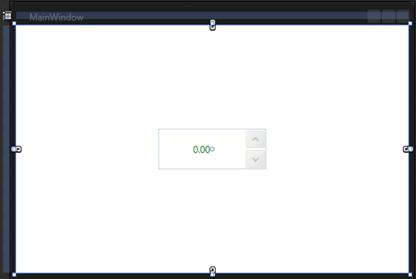
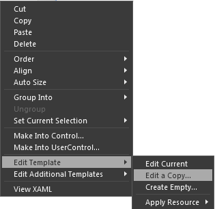
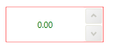

::: {style="DISPLAY: none"}
{#d2h_url_template}{#d2h_package_url style="WIDTH: 0px; DISPLAY: none; HEIGHT: 0px"}
:::

::: {.d2h_secondary_topic style="PADDING-BOTTOM: 10pt; MARGIN: 0pt; PADDING-LEFT: 0pt; PADDING-RIGHT: 0pt; PADDING-TOP: 0pt"}
#### Blendability {#blendability style="tab-stops: 0pt"}

To edit the style of the UpDown control in Expression Blend:

1.   Drag the **UpDown** control to **Design View**. The **UpDown** control appears as shown in the screen shot displayed below.

[]{style="FONT-FAMILY: 'Trebuchet MS','sans-serif'; COLOR: #15428b; FONT-SIZE: 9pt"} 

{border="0"}

Figure 1157: UpDown Control in Design View

 

2.   Right-click the **UpDown** control, select **Edit Template**, and then select **Edit a Copy**.

 

{border="0"}

Figure 1158: File Menu

After the **Edit a Copy** option is selected, the style of the UpDown control will be generated in the XAML file. You can change the Control Template or some of the brushes of the UpDown control by using the properties exposed by the UpDown control.

In the following code snippet, the BorderBrush color is changed when the IsMouseOver value changes.

+--------------------------------------------------------------------------------------------------------------------------------------------------------------------------------------------------------------------------------------------------------------------------------------------------------------------------------------------------------------------------------------------------------------------------------------------------------------------------------------------------------------------------------------------------------------------------------------------------------------------------------------------------------------------------------------------------------------+
| **[\[XAML\]]{style="FONT-FAMILY: 'Courier New'"}**                                                                                                                                                                                                                                                                                                                                                                                                                                                                                                                                                                                                                                                           |
|                                                                                                                                                                                                                                                                                                                                                                                                                                                                                                                                                                                                                                                                                                              |
| [\<]{style="FONT-FAMILY: 'Courier New'; COLOR: blue; FONT-SIZE: 9.5pt"}[Trigger]{style="FONT-FAMILY: 'Courier New'; COLOR: #a31515; FONT-SIZE: 9.5pt"}[ Property]{style="FONT-FAMILY: 'Courier New'; COLOR: red; FONT-SIZE: 9.5pt"}[=\"IsMouseOver\"]{style="FONT-FAMILY: 'Courier New'; COLOR: blue; FONT-SIZE: 9.5pt"}[ Value]{style="FONT-FAMILY: 'Courier New'; COLOR: red; FONT-SIZE: 9.5pt"}[=\"True\"\>]{style="FONT-FAMILY: 'Courier New'; COLOR: blue; FONT-SIZE: 9.5pt"}[]{style="FONT-FAMILY: 'Courier New'; FONT-SIZE: 9.5pt"}                                                                                                                                                                   |
|                                                                                                                                                                                                                                                                                                                                                                                                                                                                                                                                                                                                                                                                                                              |
| [    \<]{style="FONT-FAMILY: 'Courier New'; COLOR: blue; FONT-SIZE: 9.5pt"}[Setter]{style="FONT-FAMILY: 'Courier New'; COLOR: #a31515; FONT-SIZE: 9.5pt"}[ Property]{style="FONT-FAMILY: 'Courier New'; COLOR: red; FONT-SIZE: 9.5pt"}[=\"BorderBrush\"]{style="FONT-FAMILY: 'Courier New'; COLOR: blue; FONT-SIZE: 9.5pt"}[ TargetName]{style="FONT-FAMILY: 'Courier New'; COLOR: red; FONT-SIZE: 9.5pt"}[=\"Border\"]{style="FONT-FAMILY: 'Courier New'; COLOR: blue; FONT-SIZE: 9.5pt"}[ Value]{style="FONT-FAMILY: 'Courier New'; COLOR: red; FONT-SIZE: 9.5pt"}[=\"Red\"/\>]{style="FONT-FAMILY: 'Courier New'; COLOR: blue; FONT-SIZE: 9.5pt"}[]{style="FONT-FAMILY: 'Courier New'; FONT-SIZE: 9.5pt"} |
|                                                                                                                                                                                                                                                                                                                                                                                                                                                                                                                                                                                                                                                                                                              |
| [\</]{style="FONT-FAMILY: 'Courier New'; COLOR: blue; FONT-SIZE: 9.5pt"}[Trigger]{style="FONT-FAMILY: 'Courier New'; COLOR: #a31515; FONT-SIZE: 9.5pt"}[\>]{style="FONT-FAMILY: 'Courier New'; COLOR: blue; FONT-SIZE: 9.5pt"}[]{style="FONT-FAMILY: Consolas; COLOR: blue; FONT-SIZE: 9.5pt"}                                                                                                                                                                                                                                                                                                                                                                                                               |
+--------------------------------------------------------------------------------------------------------------------------------------------------------------------------------------------------------------------------------------------------------------------------------------------------------------------------------------------------------------------------------------------------------------------------------------------------------------------------------------------------------------------------------------------------------------------------------------------------------------------------------------------------------------------------------------------------------------+

[]{style="FONT-FAMILY: 'Calibri','sans-serif'"} 

{border="0"}

Figure 1159: BorderBrush Set to Red

[]{#related-topics}
:::
