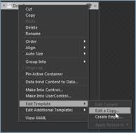
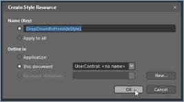
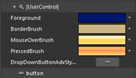

::: {style="DISPLAY: none"}
{#d2h_url_template}{#d2h_package_url style="WIDTH: 0px; DISPLAY: none; HEIGHT: 0px"}
:::

::::: {#nsbanner .d2h_main_nsbanner style="BORDER-BOTTOM: #999999 1px solid; POSITION: relative; PADDING-BOTTOM: 0px; BACKGROUND-COLOR: transparent; PADDING-LEFT: 0px; PADDING-RIGHT: 0px; DISPLAY: none; BORDER-TOP: #999999 1px solid; PADDING-TOP: 0px; LEFT: 0px"}
:::: {#TitleRow .d2h_main_titlerow style="PADDING-BOTTOM: 4px; BACKGROUND-COLOR: transparent; PADDING-LEFT: 22px; WIDTH: 100%; PADDING-RIGHT: 10px; DISPLAY: none; PADDING-TOP: 4px"}
::: {#ienav .d2h_main_ienav style="DISPLAY: none"}
{#D2HPrevious .D2HPreviousEnabled}  {#D2HNext .D2HNextEnabled}
:::
::::
:::::

:::: {#nstext .d2h_main_nstext style="PADDING-BOTTOM: 10px; BACKGROUND-COLOR: transparent; PADDING-LEFT: 22px; PADDING-RIGHT: 10px; HEIGHT: 100%; OVERFLOW: auto; PADDING-TOP: 5px" hasuserbackground="true" valign="bottom"}
::: {#d2h_breadcrumbs .d2h_breadcrumbs}
[Essential Studio User Guide Documentation](ms-xhelp:///?Id=12457748-09e3-4d74-a240-8e049cedf030){.d2h_breadcrumbsNormal}[ \> ]{.d2h_breadcrumbsLinkSeparator}[User Interface Edition](ms-xhelp:///?Id=c29296b7-531c-413b-a0ec-488ca1f7f669){.d2h_breadcrumbsNormal}[ \> ]{.d2h_breadcrumbsLinkSeparator}[Essential WPF](ms-xhelp:///?Id=7f4f82c5-151c-4262-94d0-75c4626c77bc){.d2h_breadcrumbsNormal}[ \> ]{.d2h_breadcrumbsLinkSeparator}[Essential Tools]{.d2h_breadcrumbsContentsOnly}[ \> ]{.d2h_breadcrumbsLinkSeparator}[Tools WPF Controls](ms-xhelp:///?Id=2ea58a12-9426-4a63-96b4-89eb80232c2c){.d2h_breadcrumbsNormal}[ \> ]{.d2h_breadcrumbsLinkSeparator}[DropDownButtonAdv](ms-xhelp:///?Id=3c053981-d70b-4772-bc58-f128333d1fba){.d2h_breadcrumbsNormal}
:::

### Blendability {#blendability style="tab-stops: 0pt"}

The button controls can be modified using Expression Blend.

To modify the button control:

[·      ]{style="FONT-FAMILY: Symbol"}Open Sample in the Expression Blend.

[·      ]{style="FONT-FAMILY: Symbol"}Right click on the button control and choose Edit Template option as below:

{border="0"}

Figure 472 Editing ButtonAdv Template Using Expression Blend

 

 

[·      ]{style="FONT-FAMILY: Symbol"}The Create Style Resource window will appear as shown below. Click Ok to create a new style for Button Control.

{border="0"}

Figure 473 Creating Style Resource

 

[·      ]{style="FONT-FAMILY: Symbol"}All the resources will be displayed on the resources pane on the right side of design area. These resources can be edited to create a new Style.

{border="0"}

Figure 474 Editing Resources

 

{border="0"}

Figure 475: DropDownButtonAdv style edited in Blend

[]{#related-topics}
::::
