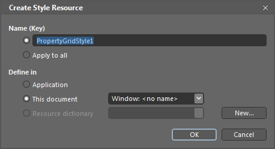
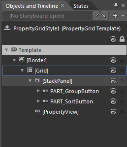
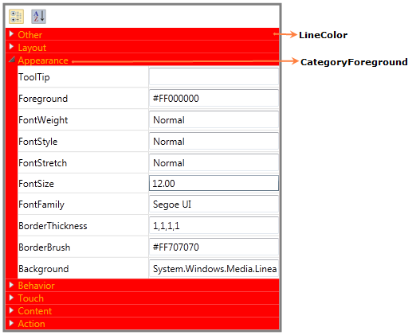

::: {style="DISPLAY: none"}
{#d2h_url_template}{#d2h_package_url style="WIDTH: 0px; DISPLAY: none; HEIGHT: 0px"}
:::

::: {.d2h_secondary_topic style="PADDING-BOTTOM: 10pt; MARGIN: 0pt; PADDING-LEFT: 0pt; PADDING-RIGHT: 0pt; PADDING-TOP: 0pt"}
##### Blendability {#blendability style="tab-stops: 0pt"}

The PropertyGrid control can easily be editable in blend. You can edit the template of the PropertyGrid control to give a good look and feel for the control using Expression Blend.

Using Blendability support in an Application

Create the PropertyGrid control using Blend. After creating the PropertyGrid control using Blend, select it and go to "Object" -\> "Edit Style" -\> "Edit a Copy" to edit the Template of the PropertyGrid control.

 

{border="0"}

Figure 824: Blend Edit Style

[]{style="FONT-FAMILY: 'Trebuchet MS','sans-serif'; COLOR: #15428b; FONT-SIZE: 9pt"} 

This will open a dialog (below) where you can give a name of your own style and define exactly where you would like to store it.

 

{border="0"}

Figure 825: Creating Style Resource

[]{style="FONT-FAMILY: 'Trebuchet MS','sans-serif'; COLOR: #15428b; FONT-SIZE: 9pt"} 

What's produced through the set of steps is quite a bit of XAML which is placed within your application. This XAML represents the default style for the PropertyGrid control.

{border="0"}

Figure 826: Blend - Object and Timeline

[]{style="FONT-FAMILY: 'Trebuchet MS','sans-serif'; COLOR: #15428b; FONT-SIZE: 9pt"} 

Now you can edit each part in the template and create custom look and feel for the control.

 

[Background and Foreground support]{style="FONT-FAMILY: 'Trebuchet MS','sans-serif'; COLOR: #15428b; FONT-SIZE: 9pt"}

You can customize the foreground and background of the PropertyGrid using the following properties,

[·      ]{style="FONT-FAMILY: Symbol"}LineColor

[·      ]{style="FONT-FAMILY: Symbol"}ViewBackground

[·      ]{style="FONT-FAMILY: Symbol"}CategoryForeground

Using Background and Foreground support in an Application

Using **LineColor**, you can set the background for category heading while grouping.Using **CategoryForeground**, you can set the foreground for category heading.

[]{style="FONT-FAMILY: 'Trebuchet MS','sans-serif'; COLOR: #15428b; FONT-SIZE: 9pt"} 

+-----------------------------------------------------------------------------------------------------------------------------------------------------------------------------------------------------------------------------------------------------------------------------------------------------------------------------------------------------------------------------------------------------------------------------------------------------------------------------------------------------------------------------------------------------------------------------------------------------------------------------------------------------------------------------------------------------------------------------------------------------------------------------------------------------------------------------------------------------------------------------------------------------------------+
| **[\[XAML\]]{style="FONT-FAMILY: 'Courier New'"}**                                                                                                                                                                                                                                                                                                                                                                                                                                                                                                                                                                                                                                                                                                                                                                                                                                                              |
|                                                                                                                                                                                                                                                                                                                                                                                                                                                                                                                                                                                                                                                                                                                                                                                                                                                                                                                 |
| [           ]{style="FONT-FAMILY: Consolas"}                                                                                                                                                                                                                                                                                                                                                                                                                                                                                                                                                                                                                                                                                                                                                                                                                                                                    |
|                                                                                                                                                                                                                                                                                                                                                                                                                                                                                                                                                                                                                                                                                                                                                                                                                                                                                                                 |
| [\<]{style="FONT-FAMILY: 'Courier New'; COLOR: blue"}[syncfusion]{style="FONT-FAMILY: 'Courier New'; COLOR: #a31515"}[:]{style="FONT-FAMILY: 'Courier New'; COLOR: blue"}[PropertyGrid]{style="FONT-FAMILY: 'Courier New'; COLOR: #a31515"}[ x]{style="FONT-FAMILY: 'Courier New'; COLOR: red"}[:]{style="FONT-FAMILY: 'Courier New'; COLOR: blue"}[Name]{style="FONT-FAMILY: 'Courier New'; COLOR: red"}[=\"propertyGrid\"]{style="FONT-FAMILY: 'Courier New'; COLOR: blue"}[ SelectedObject]{style="FONT-FAMILY: 'Courier New'; COLOR: red"}[=\"{]{style="FONT-FAMILY: 'Courier New'; COLOR: blue"}[Binding]{style="FONT-FAMILY: 'Courier New'; COLOR: #a31515"}[ ElementName]{style="FONT-FAMILY: 'Courier New'; COLOR: red"}[=Btn}\"]{style="FONT-FAMILY: 'Courier New'; COLOR: blue"}[ Margin]{style="FONT-FAMILY: 'Courier New'; COLOR: red"}[=\"50\"]{style="FONT-FAMILY: 'Courier New'; COLOR: blue"}[\ |
|                            [ Width]{style="COLOR: red"}[=\"350\"]{style="COLOR: blue"}[ BorderBrush]{style="COLOR: red"}[=\"Gray\"]{style="COLOR: blue"}[ BorderThickness]{style="COLOR: red"}[=\"3\"]{style="COLOR: blue"}[ HorizontalAlignment]{style="COLOR: red"}[=\"Center\"]{style="COLOR: blue"} \                                                                                                                                                                                                                                                                                                                                                                                                                                                                                                                                                                                                       |
|                         [ VerticalAlignment]{style="COLOR: red"}[=\"Stretch\"]{style="COLOR: blue"}[ LineColor]{style="COLOR: red"}[=\"Red\"]{style="COLOR: blue"}[ CategoryForeground]{style="COLOR: red"}[=\"Black\"\>]{style="COLOR: blue"}\                                                                                                                                                                                                                                                                                                                                                                                                                                                                                                                                                                                                                                                                 |
| [\</]{style="COLOR: blue"}[syncfusion]{style="COLOR: #a31515"}[:]{style="COLOR: blue"}[PropertyGrid]{style="COLOR: #a31515"}[\>]{style="COLOR: blue"}]{style="FONT-FAMILY: 'Courier New'"}                                                                                                                                                                                                                                                                                                                                                                                                                                                                                                                                                                                                                                                                                                                      |
|                                                                                                                                                                                                                                                                                                                                                                                                                                                                                                                                                                                                                                                                                                                                                                                                                                                                                                                 |
| []{style="FONT-FAMILY: 'Courier New'"}                                                                                                                                                                                                                                                                                                                                                                                                                                                                                                                                                                                                                                                                                                                                                                                                                                                                          |
+-----------------------------------------------------------------------------------------------------------------------------------------------------------------------------------------------------------------------------------------------------------------------------------------------------------------------------------------------------------------------------------------------------------------------------------------------------------------------------------------------------------------------------------------------------------------------------------------------------------------------------------------------------------------------------------------------------------------------------------------------------------------------------------------------------------------------------------------------------------------------------------------------------------------+

 

{border="0"}

Figure 827: PropertyGrid

 

Properties

Table 75: Grouping and SortingTable

  -------------------- ---------------------------------------------------------- -------------------- ----------- ---------------------------------------------------------------------------------------
  Property             Description                                                Type                 Data Type   Reference links
  ViewBackground       Sets the background for the PropertyGrid control.          DependencyProperty   Brush       
  LineColor            Sets the background for category heading while grouping.   DependencyProperty   Brush       []{style="FONT-FAMILY: 'Trebuchet MS','sans-serif'; COLOR: #15428b; FONT-SIZE: 9pt"} 
  CategoryForeground   Sets the foreground for category heading.                  DependencyProperty   Brush       []{style="FONT-FAMILY: 'Trebuchet MS','sans-serif'; COLOR: #15428b; FONT-SIZE: 9pt"} 
  -------------------- ---------------------------------------------------------- -------------------- ----------- ---------------------------------------------------------------------------------------

[]{style="FONT-FAMILY: 'Trebuchet MS','sans-serif'; COLOR: #15428b; FONT-SIZE: 9pt"} 

**[]{style="FONT-FAMILY: 'Trebuchet MS','sans-serif'; COLOR: #15428b; FONT-SIZE: 9pt"}** 

Sample Link

[]{style="FONT-FAMILY: 'Trebuchet MS','sans-serif'; COLOR: #15428b; FONT-SIZE: 9pt"} 

1.   Select Start -\> Programs -\> Syncfusion -\> Essential Studio x.x.xx -\> Dashboard.

2.   Select Run Locally Installed Samples in WPF Button.

3.   Now expand the PropertyGrid treeview item in the Sample Browser.

4.   Choose any one of the samples listed under it to launch.

 

[]{#related-topics}
:::
