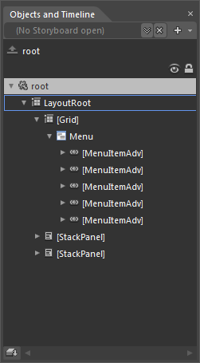
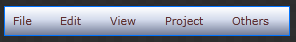
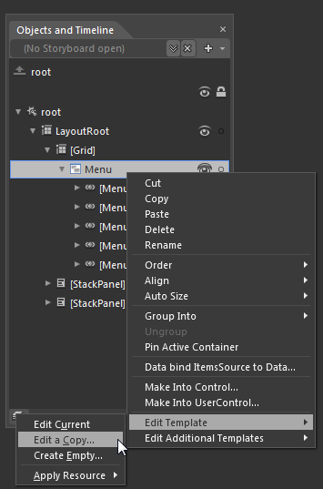
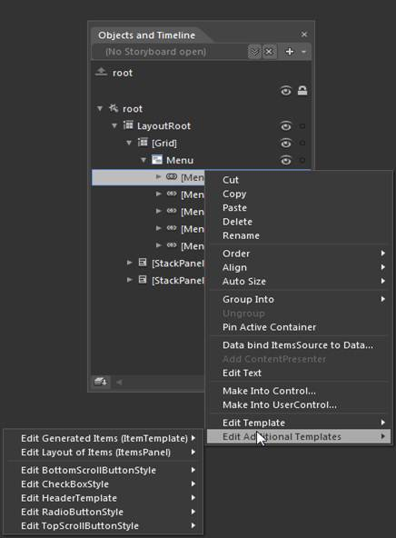
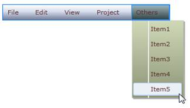

::: {style="DISPLAY: none"}
{#d2h_url_template}{#d2h_package_url style="WIDTH: 0px; DISPLAY: none; HEIGHT: 0px"}
:::

::: {.d2h_secondary_topic style="PADDING-BOTTOM: 10pt; MARGIN: 0pt; PADDING-LEFT: 0pt; PADDING-RIGHT: 0pt; PADDING-TOP: 0pt"}
#### Blendability Support {#blendability-support style="tab-stops: 0pt"}

You can customize MenuAdv and MenuItemAdv in Expression Blend. After adding MenuAdv and MenuItemAdv to the design view, you can see MenuAdv and MenuItemAdv in the Objects and Timeline window.

 

{border="0"}

Figure 732: MenuAdv and MenuItemAdv Displayed in Objects and Timeline Tap

 

**{border="0"}**

Figure 733: Expression Blend Design View

 

 

Right-click MenuAdv and in EditTemplate option select Edit a Copy and assign the key name to the resource edited. The same process can be repeated to edit the MenuItemAdv style.

{border="0"}

Figure 734: Edit the MenuAdv Template

 

**{border="0"}**

Figure 735: Assign Key Name to Resource

 

User can also customize the appearance of the TopScrollButtonStyle, BottomScrollButtonStyle, CheckBoxStyle & RadioButtonStyle using the Edit Additional Templates option by doing right click on the MenuItemAdv and selecting the respective styles from the option.

 

 

{border="0"}

Figure 736: Edit Additional Templates

 

The following screen shot shows the MenuAdv and MenuItemAdv templates edited and customized by using Expression Blend.

{border="0"}

Figure 737: MenuAdv with Custom Look

[]{#related-topics}
:::
