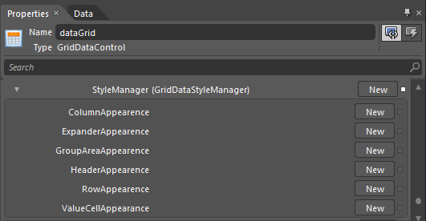
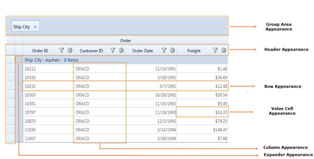
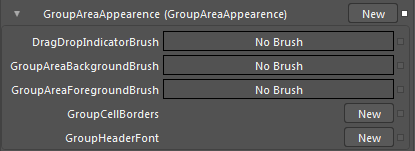
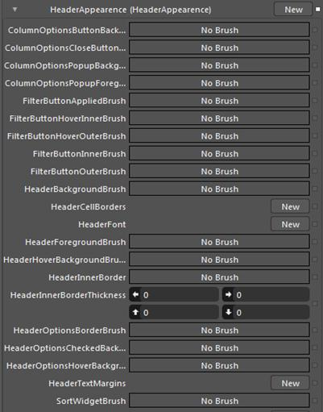
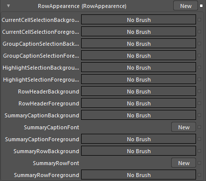
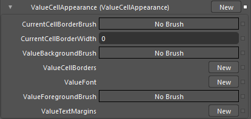
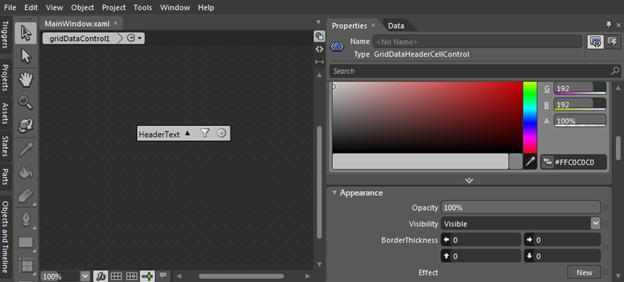

::: {style="DISPLAY: none"}
{#d2h_url_template}{#d2h_package_url style="WIDTH: 0px; DISPLAY: none; HEIGHT: 0px"}
:::

:::: {.d2h_secondary_topic style="PADDING-BOTTOM: 10pt; MARGIN: 0pt; PADDING-LEFT: 0pt; PADDING-RIGHT: 0pt; PADDING-TOP: 0pt"}
##### Blend Support {#blend-support style="tab-stops: 0pt"}

Essential GridDataControl supports the setting of its styles by XAML and supports editing styles using Microsoft Expression Blend.

Use Case Scenarios

[This feature helps in customizing GridDataControl through ]{style="COLOR: black"}Microsoft Expression Blend 3 or 4®.[]{style="COLOR: black"}

Sample Link[]{style="COLOR: #4e84c4"}

**Blend Styling Demo** sample in the sample browser is purely customized in XAML through **GridDataStyleManager** class. To access Blend Styling Demo:

                 

1.   Open Syncfusion Dashboard.

2.   Select User Interface.

3.   Select WPF drop-down list and select Run Locally Installed Samples.

4.   Select GridDataControl.

5.   In Visual styles menu select Blend styling  Demo.

[]{style="COLOR: #c00000"} 

###### 4.2.3.16.6.1        Adding Styles to an Application {#adding-styles-to-an-application style="tab-stops: 0pt"}

The appearance of the GridDataControl can be customized using Microsoft Expression Blend 3 or 4®. This can be achieved through **StyleManager** property of type **GridDataStyleManager**. The properties required to customize the appearance are defined in **GridDataStyleManager** class.

\
\
{border="0"}

Figure 224:    Blend Property Window showing StyleManager properties

 

GridDataStyleManager properties are organized under 6 groups, each representing a specific area of the GridDataControl.

[·      ]{style="FONT-FAMILY: Symbol"}Column

[·      ]{style="FONT-FAMILY: Symbol"}Expander

[·      ]{style="FONT-FAMILY: Symbol"}Group Area

[·      ]{style="FONT-FAMILY: Symbol"}Header

[·      ]{style="FONT-FAMILY: Symbol"}Row

[·      ]{style="FONT-FAMILY: Symbol"}Value Cell

{border="0"}

Figure 225:    Diagrammatic Representation Of GridDataStyleManager Groups

::: {style="BORDER-BOTTOM: windowtext 1pt solid; BORDER-LEFT: medium none; PADDING-BOTTOM: 1pt; MARGIN-TOP: 9pt; PADDING-LEFT: 0pt; PADDING-RIGHT: 0pt; MARGIN-BOTTOM: 9pt; BORDER-TOP: windowtext 1pt solid; BORDER-RIGHT: medium none; PADDING-TOP: 1pt"}
Note:

Previously, the GridDataControl appearance can be customized through the [IGridDataVisualStyle](http://help.syncfusion.com/ug_92/User%20Interface/WPF/Grid/Documents/423155skins.htm) interface. Even if a visual style is set for GridDataControl, values set in the GridDataStyleManager will override it.
:::

4.2.3.16.6.1.1     Column Appearance

In the Column Appearance, all the properties are of type **Style.** These properties affect the appearance of a whole column. The following table shows the property and its target type.

  -------------------------------- ------------------------------------------
  Property                         TargetType
  CheckBoxVisibleColumnStyle       GridDataCheckBoxVisibleColumnControl
  CurrencyEditVisibleColumnStyle   GridDataCurrencyEditVisibleColumnControl
  DatetimeVisibleColumnStyle       GridDataDateTimeVisibleColumnControl
  DoubleEditVisibleColumnStyle     GridDataDoubleEditVisibleColumnControl
  IntegerEditVisibleColumnstyle    GridDataIntegerEditVisibleColumnControl
  PercentEditVisibleColumnStyle    GridDataPercentEditVisibleColumnControl
  UpDownEditVisibleColumnStyle     GridDataUpDownEditVisibleColumnControl
  -------------------------------- ------------------------------------------

 

{border="0"}

Figure 226: Column Appearance Properties

4.2.3.16.6.1.2     Expander Appearance

In Expander Appearance group, the properties required to customize expand and collapse buttons are included. The following screenshot shows the properties defined in this group.

{border="0"}

Figure 227: Expander Appearance Properties

4.2.3.16.6.1.3     Group Area Appearance

In Group Area appearance, properties required to customize the Group Area are defined. The following screenshot shows the properties defined in this group.

{border="0"}

Figure 228: Group Area Appearance Properties

4.2.3.16.6.1.4     Header Appearance

In Header Appearance, properties required to customize the header are defined. The following screenshot shows the properties defined in this group.

{border="0"}

Figure 229: Header Appearance Properties

4.2.3.16.6.1.5     Row Appearance

In Row Appearance, properties required to customize the row are defined. The following screenshot shows the properties defined in this group.

{border="0"}

Figure 230:    Row Appearance Properties

4.2.3.16.6.1.6     Value Cell Appearance

In the Value Cell group, cells can be customized by specifying its margin, borders, etc. The following screenshot shows the properties defined in this group.

{border="0"}

Figure 231: Value Cell Appearance Properties

 

###### 4.2.3.16.6.2        Editing Additional Template and Styles {#editing-additional-template-and-styles style="tab-stops: 0pt"}

Apart from the properties mentioned above, template and style for ScrollViewer, ContextMenu, GridDataHeaderCellControl, GridDataColumnOptionPane can be customized using the following properties.

  ----------------------- ---------------------------
  Property                TargetType
  ContextMenuStyle        ContextMenu
  ScrollViewerStyle       ScrollViewer
  ColumnOptionPaneStyle   GridDataColumnOptionsPane
  HeaderStyle             GridDataHeaderCellControl
  RowStyle                GridDataRowControl
  AlternateRowstyle       GridDataRowControl
  ----------------------- ---------------------------

 

Step by step instructions for Editing Templates

1.   Open the application in Microsoft Expression Blend

2.   Right-click on the GridDataControl and from Object menu, select Edit Additional Templates -\> Edit \$PartName\$Style (e.g. HeaderStyle). 

{border="0"}

Figure 232: Editing HeaderStyle in Blend

3.   Blend creates a copy of the Template and opens the XAML. All the "Parts" that make up the selected template can be edited to make the required styling changes.

###### 4.2.3.16.6.3        RowStyle and AlternateRowStyle {#rowstyle-and-alternaterowstyle style="tab-stops: 0pt"}

RowStyle and AlternateRowStyle are FrameworkElement Styles specifies the style for alternate rows in GridDataControl. These styles support all the basic properties of controls namely Background, Foreground, FontFamily, FontSize and FontFamily.

 

**4.2.3.16.6.3.1   ** RowStyle

RowStyle can be set using XAML by overriding the style for GridDataRowControl class. This overrides the styles for each row. RowStyle supports all the basic control styles. The following sample code explains the implementation of the RowStyle.

 

+-----------------------------------------------------------------------------------------------------------------------------------------------------------------------------------------------------------------------------------------------------------------------------------------------------------------------------------------------------------------------------------------------------------------------------------------------------------------------------------------------------------------------------------------------------------------------------------------------------------------------------------------------------------------------------------------------------------------------------------------------------------------------------------------------------------------------------------------------------------------------------------------------------------------------+
| **[\[XAML\]]{style="FONT-FAMILY: 'Courier New'"}**                                                                                                                                                                                                                                                                                                                                                                                                                                                                                                                                                                                                                                                                                                                                                                                                                                                                    |
|                                                                                                                                                                                                                                                                                                                                                                                                                                                                                                                                                                                                                                                                                                                                                                                                                                                                                                                       |
| [\<]{style="FONT-FAMILY: 'Courier New'; COLOR: blue"}[Style]{style="FONT-FAMILY: 'Courier New'; COLOR: #a31515"}[ x]{style="FONT-FAMILY: 'Courier New'; COLOR: red"}[:]{style="FONT-FAMILY: 'Courier New'; COLOR: blue"}[Key]{style="FONT-FAMILY: 'Courier New'; COLOR: red"}[=\"RowStyle1\"]{style="FONT-FAMILY: 'Courier New'; COLOR: blue"}[ TargetType]{style="FONT-FAMILY: 'Courier New'; COLOR: red"}[=\"{]{style="FONT-FAMILY: 'Courier New'; COLOR: blue"}[x]{style="FONT-FAMILY: 'Courier New'; COLOR: #a31515"}[:]{style="FONT-FAMILY: 'Courier New'; COLOR: blue"}[Type]{style="FONT-FAMILY: 'Courier New'; COLOR: #a31515"}[ local]{style="FONT-FAMILY: 'Courier New'; COLOR: red"}[:]{style="FONT-FAMILY: 'Courier New'; COLOR: blue"}[GridDataRowControl]{style="FONT-FAMILY: 'Courier New'; COLOR: red"}[}\"\>]{style="FONT-FAMILY: 'Courier New'; COLOR: blue"}[]{style="FONT-FAMILY: 'Courier New'"} |
|                                                                                                                                                                                                                                                                                                                                                                                                                                                                                                                                                                                                                                                                                                                                                                                                                                                                                                                       |
| [            ]{style="FONT-FAMILY: 'Courier New'; COLOR: #a31515"}[\<]{style="FONT-FAMILY: 'Courier New'; COLOR: blue"}[Setter]{style="FONT-FAMILY: 'Courier New'; COLOR: #a31515"}[ Property]{style="FONT-FAMILY: 'Courier New'; COLOR: red"}[=\"Background\"]{style="FONT-FAMILY: 'Courier New'; COLOR: blue"}[ Value]{style="FONT-FAMILY: 'Courier New'; COLOR: red"}[=\"Cornsilk\"/\>]{style="FONT-FAMILY: 'Courier New'; COLOR: blue"}[]{style="FONT-FAMILY: 'Courier New'"}                                                                                                                                                                                                                                                                                                                                                                                                                                     |
|                                                                                                                                                                                                                                                                                                                                                                                                                                                                                                                                                                                                                                                                                                                                                                                                                                                                                                                       |
| [            ]{style="FONT-FAMILY: 'Courier New'; COLOR: #a31515"}[\<]{style="FONT-FAMILY: 'Courier New'; COLOR: blue"}[Setter]{style="FONT-FAMILY: 'Courier New'; COLOR: #a31515"}[ Property]{style="FONT-FAMILY: 'Courier New'; COLOR: red"}[=\"Foreground\"]{style="FONT-FAMILY: 'Courier New'; COLOR: blue"}[ Value]{style="FONT-FAMILY: 'Courier New'; COLOR: red"}[=\"Fuchsia\" /\>]{style="FONT-FAMILY: 'Courier New'; COLOR: blue"}[]{style="FONT-FAMILY: 'Courier New'"}                                                                                                                                                                                                                                                                                                                                                                                                                                     |
|                                                                                                                                                                                                                                                                                                                                                                                                                                                                                                                                                                                                                                                                                                                                                                                                                                                                                                                       |
| [            ]{style="FONT-FAMILY: 'Courier New'; COLOR: #a31515"}[\<]{style="FONT-FAMILY: 'Courier New'; COLOR: blue"}[Setter]{style="FONT-FAMILY: 'Courier New'; COLOR: #a31515"}[ Property]{style="FONT-FAMILY: 'Courier New'; COLOR: red"}[=\"FontFamily\"]{style="FONT-FAMILY: 'Courier New'; COLOR: blue"}[ Value]{style="FONT-FAMILY: 'Courier New'; COLOR: red"}[=\"Monotype Corsiva\"/\>]{style="FONT-FAMILY: 'Courier New'; COLOR: blue"}[]{style="FONT-FAMILY: 'Courier New'"}                                                                                                                                                                                                                                                                                                                                                                                                                             |
|                                                                                                                                                                                                                                                                                                                                                                                                                                                                                                                                                                                                                                                                                                                                                                                                                                                                                                                       |
| [            ]{style="FONT-FAMILY: 'Courier New'; COLOR: #a31515"}[\<]{style="FONT-FAMILY: 'Courier New'; COLOR: blue"}[Setter]{style="FONT-FAMILY: 'Courier New'; COLOR: #a31515"}[ Property]{style="FONT-FAMILY: 'Courier New'; COLOR: red"}[=\"FontSize\"]{style="FONT-FAMILY: 'Courier New'; COLOR: blue"}[ Value]{style="FONT-FAMILY: 'Courier New'; COLOR: red"}[=\"13\" /\>]{style="FONT-FAMILY: 'Courier New'; COLOR: blue"}[]{style="FONT-FAMILY: 'Courier New'"}                                                                                                                                                                                                                                                                                                                                                                                                                                            |
|                                                                                                                                                                                                                                                                                                                                                                                                                                                                                                                                                                                                                                                                                                                                                                                                                                                                                                                       |
| [            ]{style="FONT-FAMILY: 'Courier New'; COLOR: #a31515"}[\<]{style="FONT-FAMILY: 'Courier New'; COLOR: blue"}[Setter]{style="FONT-FAMILY: 'Courier New'; COLOR: #a31515"}[ Property]{style="FONT-FAMILY: 'Courier New'; COLOR: red"}[=\"FontStretch\"]{style="FONT-FAMILY: 'Courier New'; COLOR: blue"}[ Value]{style="FONT-FAMILY: 'Courier New'; COLOR: red"}[=\"Expanded\" /\>]{style="FONT-FAMILY: 'Courier New'; COLOR: blue"}[]{style="FONT-FAMILY: 'Courier New'"}                                                                                                                                                                                                                                                                                                                                                                                                                                   |
|                                                                                                                                                                                                                                                                                                                                                                                                                                                                                                                                                                                                                                                                                                                                                                                                                                                                                                                       |
| [            ]{style="FONT-FAMILY: 'Courier New'; COLOR: #a31515"}[\<]{style="FONT-FAMILY: 'Courier New'; COLOR: blue"}[Setter]{style="FONT-FAMILY: 'Courier New'; COLOR: #a31515"}[ Property]{style="FONT-FAMILY: 'Courier New'; COLOR: red"}[=\"FontStyle\"]{style="FONT-FAMILY: 'Courier New'; COLOR: blue"}[ Value]{style="FONT-FAMILY: 'Courier New'; COLOR: red"}[=\"Normal\"]{style="FONT-FAMILY: 'Courier New'; COLOR: blue"}[ [ /\>]{style="COLOR: blue"}]{style="FONT-FAMILY: 'Courier New'"}                                                                                                                                                                                                                                                                                                                                                                                                               |
|                                                                                                                                                                                                                                                                                                                                                                                                                                                                                                                                                                                                                                                                                                                                                                                                                                                                                                                       |
| [            ]{style="FONT-FAMILY: 'Courier New'; COLOR: #a31515"}[\<]{style="FONT-FAMILY: 'Courier New'; COLOR: blue"}[Setter]{style="FONT-FAMILY: 'Courier New'; COLOR: #a31515"}[ Property]{style="FONT-FAMILY: 'Courier New'; COLOR: red"}[=\"FontWeight\"]{style="FONT-FAMILY: 'Courier New'; COLOR: blue"}[ Value]{style="FONT-FAMILY: 'Courier New'; COLOR: red"}[=\"Normal\"]{style="FONT-FAMILY: 'Courier New'; COLOR: blue"}[ [ /\>]{style="COLOR: blue"}]{style="FONT-FAMILY: 'Courier New'"}                                                                                                                                                                                                                                                                                                                                                                                                              |
|                                                                                                                                                                                                                                                                                                                                                                                                                                                                                                                                                                                                                                                                                                                                                                                                                                                                                                                       |
| [            ]{style="FONT-FAMILY: 'Courier New'; COLOR: #a31515"}[\<]{style="FONT-FAMILY: 'Courier New'; COLOR: blue"}[Setter]{style="FONT-FAMILY: 'Courier New'; COLOR: #a31515"}[ Property]{style="FONT-FAMILY: 'Courier New'; COLOR: red"}[=\"Cursor\"]{style="FONT-FAMILY: 'Courier New'; COLOR: blue"}[ Value]{style="FONT-FAMILY: 'Courier New'; COLOR: red"}[=\"Pen\"]{style="FONT-FAMILY: 'Courier New'; COLOR: blue"}[ [ /\>]{style="COLOR: blue"}]{style="FONT-FAMILY: 'Courier New'"}                                                                                                                                                                                                                                                                                                                                                                                                                     |
|                                                                                                                                                                                                                                                                                                                                                                                                                                                                                                                                                                                                                                                                                                                                                                                                                                                                                                                       |
| [            ]{style="FONT-FAMILY: 'Courier New'; COLOR: #a31515"}[\<]{style="FONT-FAMILY: 'Courier New'; COLOR: blue"}[Setter]{style="FONT-FAMILY: 'Courier New'; COLOR: #a31515"}[ Property]{style="FONT-FAMILY: 'Courier New'; COLOR: red"}[=\"FlowDirection\"]{style="FONT-FAMILY: 'Courier New'; COLOR: blue"}[ Value]{style="FONT-FAMILY: 'Courier New'; COLOR: red"}[=\"RightToLeft\" /\>]{style="FONT-FAMILY: 'Courier New'; COLOR: blue"}[]{style="FONT-FAMILY: 'Courier New'"}                                                                                                                                                                                                                                                                                                                                                                                                                              |
|                                                                                                                                                                                                                                                                                                                                                                                                                                                                                                                                                                                                                                                                                                                                                                                                                                                                                                                       |
| [            ]{style="FONT-FAMILY: 'Courier New'; COLOR: #a31515"}[\<]{style="FONT-FAMILY: 'Courier New'; COLOR: blue"}[Setter]{style="FONT-FAMILY: 'Courier New'; COLOR: #a31515"}[ Property]{style="FONT-FAMILY: 'Courier New'; COLOR: red"}[=\"VerticalAlignment\"]{style="FONT-FAMILY: 'Courier New'; COLOR: blue"}[ Value]{style="FONT-FAMILY: 'Courier New'; COLOR: red"}[=\"Center\"]{style="FONT-FAMILY: 'Courier New'; COLOR: blue"}[ [ /\>]{style="COLOR: blue"}]{style="FONT-FAMILY: 'Courier New'"}                                                                                                                                                                                                                                                                                                                                                                                                       |
|                                                                                                                                                                                                                                                                                                                                                                                                                                                                                                                                                                                                                                                                                                                                                                                                                                                                                                                       |
| [            ]{style="FONT-FAMILY: 'Courier New'; COLOR: #a31515"}[\<]{style="FONT-FAMILY: 'Courier New'; COLOR: blue"}[Setter]{style="FONT-FAMILY: 'Courier New'; COLOR: #a31515"}[ Property]{style="FONT-FAMILY: 'Courier New'; COLOR: red"}[=\"HorizontalAlignment\"]{style="FONT-FAMILY: 'Courier New'; COLOR: blue"}[ Value]{style="FONT-FAMILY: 'Courier New'; COLOR: red"}[=\"Center\" /\>]{style="FONT-FAMILY: 'Courier New'; COLOR: blue"}[]{style="FONT-FAMILY: 'Courier New'"}                                                                                                                                                                                                                                                                                                                                                                                                                             |
|                                                                                                                                                                                                                                                                                                                                                                                                                                                                                                                                                                                                                                                                                                                                                                                                                                                                                                                       |
| [        ]{style="FONT-FAMILY: 'Courier New'; COLOR: #a31515"}[\</]{style="FONT-FAMILY: 'Courier New'; COLOR: blue"}[Style]{style="FONT-FAMILY: 'Courier New'; COLOR: #a31515"}[\>]{style="FONT-FAMILY: 'Courier New'; COLOR: blue"}[]{style="FONT-FAMILY: 'Courier New'"}                                                                                                                                                                                                                                                                                                                                                                                                                                                                                                                                                                                                                                            |
|                                                                                                                                                                                                                                                                                                                                                                                                                                                                                                                                                                                                                                                                                                                                                                                                                                                                                                                       |
| []{style="FONT-FAMILY: 'Courier New'"}                                                                                                                                                                                                                                                                                                                                                                                                                                                                                                                                                                                                                                                                                                                                                                                                                                                                                |
|                                                                                                                                                                                                                                                                                                                                                                                                                                                                                                                                                                                                                                                                                                                                                                                                                                                                                                                       |
| [\<!\--Assigning the style resource to the GridDataControl\--\>]{style="FONT-FAMILY: 'Courier New'; COLOR: green"}[]{style="FONT-FAMILY: 'Courier New'"}                                                                                                                                                                                                                                                                                                                                                                                                                                                                                                                                                                                                                                                                                                                                                              |
|                                                                                                                                                                                                                                                                                                                                                                                                                                                                                                                                                                                                                                                                                                                                                                                                                                                                                                                       |
| [       RowStyle]{style="FONT-FAMILY: 'Courier New'; COLOR: red"}[=\"{]{style="FONT-FAMILY: 'Courier New'; COLOR: blue"}[StaticResource]{style="FONT-FAMILY: 'Courier New'; COLOR: #a31515"}[ RowStyle1]{style="FONT-FAMILY: 'Courier New'; COLOR: red"}[}\"]{style="FONT-FAMILY: 'Courier New'; COLOR: blue"}                                                                                                                                                                                                                                                                                                                                                                                                                                                                                                                                                                                                        |
+-----------------------------------------------------------------------------------------------------------------------------------------------------------------------------------------------------------------------------------------------------------------------------------------------------------------------------------------------------------------------------------------------------------------------------------------------------------------------------------------------------------------------------------------------------------------------------------------------------------------------------------------------------------------------------------------------------------------------------------------------------------------------------------------------------------------------------------------------------------------------------------------------------------------------+

 

4.2.3.16.6.3.2     AlternateRowStyle

AlternateRowStyle defines the style for the GridDataRowControl element for alternate rows. If this is defined in XAML then the RowStyle and AlternateRowStyle applies for alternate elements. AlternateRowStyle supports all the basic control styles. The following sample code explains the implementation of the AlternateRowStyle.

 

+--------------------------------------------------------------------------------------------------------------------------------------------------------------------------------------------------------------------------------------------------------------------------------------------------------------------------------------------------------------------------------------------------------------------------------------------------------------------------------------------------------------------------------------------------------------------------------------------------------------------------------------------------------------------------------------------------------------------------------------------------------------------------------------------------------------------------------------------------------------------------------------------------------------------------------+
| **[\[XAML\]]{style="FONT-FAMILY: 'Courier New'"}**                                                                                                                                                                                                                                                                                                                                                                                                                                                                                                                                                                                                                                                                                                                                                                                                                                                                             |
|                                                                                                                                                                                                                                                                                                                                                                                                                                                                                                                                                                                                                                                                                                                                                                                                                                                                                                                                |
| [\<]{style="FONT-FAMILY: 'Courier New'; COLOR: blue"}[Style]{style="FONT-FAMILY: 'Courier New'; COLOR: #a31515"}[ x]{style="FONT-FAMILY: 'Courier New'; COLOR: red"}[:]{style="FONT-FAMILY: 'Courier New'; COLOR: blue"}[Key]{style="FONT-FAMILY: 'Courier New'; COLOR: red"}[=\"AlternateRowStyle1\"]{style="FONT-FAMILY: 'Courier New'; COLOR: blue"}[ TargetType]{style="FONT-FAMILY: 'Courier New'; COLOR: red"}[=\"{]{style="FONT-FAMILY: 'Courier New'; COLOR: blue"}[x]{style="FONT-FAMILY: 'Courier New'; COLOR: #a31515"}[:]{style="FONT-FAMILY: 'Courier New'; COLOR: blue"}[Type]{style="FONT-FAMILY: 'Courier New'; COLOR: #a31515"}[ local]{style="FONT-FAMILY: 'Courier New'; COLOR: red"}[:]{style="FONT-FAMILY: 'Courier New'; COLOR: blue"}[GridDataRowControl]{style="FONT-FAMILY: 'Courier New'; COLOR: red"}[}\"\>]{style="FONT-FAMILY: 'Courier New'; COLOR: blue"}[]{style="FONT-FAMILY: 'Courier New'"} |
|                                                                                                                                                                                                                                                                                                                                                                                                                                                                                                                                                                                                                                                                                                                                                                                                                                                                                                                                |
| [            ]{style="FONT-FAMILY: 'Courier New'; COLOR: #a31515"}[\<]{style="FONT-FAMILY: 'Courier New'; COLOR: blue"}[Setter]{style="FONT-FAMILY: 'Courier New'; COLOR: #a31515"}[ Property]{style="FONT-FAMILY: 'Courier New'; COLOR: red"}[=\"Background\"]{style="FONT-FAMILY: 'Courier New'; COLOR: blue"}[ Value]{style="FONT-FAMILY: 'Courier New'; COLOR: red"}[=\"Cornsilk\"/\>]{style="FONT-FAMILY: 'Courier New'; COLOR: blue"}[]{style="FONT-FAMILY: 'Courier New'"}                                                                                                                                                                                                                                                                                                                                                                                                                                              |
|                                                                                                                                                                                                                                                                                                                                                                                                                                                                                                                                                                                                                                                                                                                                                                                                                                                                                                                                |
| [            ]{style="FONT-FAMILY: 'Courier New'; COLOR: #a31515"}[\<]{style="FONT-FAMILY: 'Courier New'; COLOR: blue"}[Setter]{style="FONT-FAMILY: 'Courier New'; COLOR: #a31515"}[ Property]{style="FONT-FAMILY: 'Courier New'; COLOR: red"}[=\"Foreground\"]{style="FONT-FAMILY: 'Courier New'; COLOR: blue"}[ Value]{style="FONT-FAMILY: 'Courier New'; COLOR: red"}[=\"Fuchsia\" /\>]{style="FONT-FAMILY: 'Courier New'; COLOR: blue"}[]{style="FONT-FAMILY: 'Courier New'"}                                                                                                                                                                                                                                                                                                                                                                                                                                              |
|                                                                                                                                                                                                                                                                                                                                                                                                                                                                                                                                                                                                                                                                                                                                                                                                                                                                                                                                |
| [            ]{style="FONT-FAMILY: 'Courier New'; COLOR: #a31515"}[\<]{style="FONT-FAMILY: 'Courier New'; COLOR: blue"}[Setter]{style="FONT-FAMILY: 'Courier New'; COLOR: #a31515"}[ Property]{style="FONT-FAMILY: 'Courier New'; COLOR: red"}[=\"FontFamily\"]{style="FONT-FAMILY: 'Courier New'; COLOR: blue"}[ Value]{style="FONT-FAMILY: 'Courier New'; COLOR: red"}[=\"Monotype Corsiva\"/\>]{style="FONT-FAMILY: 'Courier New'; COLOR: blue"}[]{style="FONT-FAMILY: 'Courier New'"}                                                                                                                                                                                                                                                                                                                                                                                                                                      |
|                                                                                                                                                                                                                                                                                                                                                                                                                                                                                                                                                                                                                                                                                                                                                                                                                                                                                                                                |
| [            ]{style="FONT-FAMILY: 'Courier New'; COLOR: #a31515"}[\<]{style="FONT-FAMILY: 'Courier New'; COLOR: blue"}[Setter]{style="FONT-FAMILY: 'Courier New'; COLOR: #a31515"}[ Property]{style="FONT-FAMILY: 'Courier New'; COLOR: red"}[=\"FontSize\"]{style="FONT-FAMILY: 'Courier New'; COLOR: blue"}[ Value]{style="FONT-FAMILY: 'Courier New'; COLOR: red"}[=\"13\" /\>]{style="FONT-FAMILY: 'Courier New'; COLOR: blue"}[]{style="FONT-FAMILY: 'Courier New'"}                                                                                                                                                                                                                                                                                                                                                                                                                                                     |
|                                                                                                                                                                                                                                                                                                                                                                                                                                                                                                                                                                                                                                                                                                                                                                                                                                                                                                                                |
| [            ]{style="FONT-FAMILY: 'Courier New'; COLOR: #a31515"}[\<]{style="FONT-FAMILY: 'Courier New'; COLOR: blue"}[Setter]{style="FONT-FAMILY: 'Courier New'; COLOR: #a31515"}[ Property]{style="FONT-FAMILY: 'Courier New'; COLOR: red"}[=\"FontStretch\"]{style="FONT-FAMILY: 'Courier New'; COLOR: blue"}[ Value]{style="FONT-FAMILY: 'Courier New'; COLOR: red"}[=\"Expanded\" /\>]{style="FONT-FAMILY: 'Courier New'; COLOR: blue"}[]{style="FONT-FAMILY: 'Courier New'"}                                                                                                                                                                                                                                                                                                                                                                                                                                            |
|                                                                                                                                                                                                                                                                                                                                                                                                                                                                                                                                                                                                                                                                                                                                                                                                                                                                                                                                |
| [            ]{style="FONT-FAMILY: 'Courier New'; COLOR: #a31515"}[\<]{style="FONT-FAMILY: 'Courier New'; COLOR: blue"}[Setter]{style="FONT-FAMILY: 'Courier New'; COLOR: #a31515"}[ Property]{style="FONT-FAMILY: 'Courier New'; COLOR: red"}[=\"FontStyle\"]{style="FONT-FAMILY: 'Courier New'; COLOR: blue"}[ Value]{style="FONT-FAMILY: 'Courier New'; COLOR: red"}[=\"Normal\"]{style="FONT-FAMILY: 'Courier New'; COLOR: blue"}[ [ /\>]{style="COLOR: blue"}]{style="FONT-FAMILY: 'Courier New'"}                                                                                                                                                                                                                                                                                                                                                                                                                        |
|                                                                                                                                                                                                                                                                                                                                                                                                                                                                                                                                                                                                                                                                                                                                                                                                                                                                                                                                |
| [            ]{style="FONT-FAMILY: 'Courier New'; COLOR: #a31515"}[\<]{style="FONT-FAMILY: 'Courier New'; COLOR: blue"}[Setter]{style="FONT-FAMILY: 'Courier New'; COLOR: #a31515"}[ Property]{style="FONT-FAMILY: 'Courier New'; COLOR: red"}[=\"FontWeight\"]{style="FONT-FAMILY: 'Courier New'; COLOR: blue"}[ Value]{style="FONT-FAMILY: 'Courier New'; COLOR: red"}[=\"Normal\"]{style="FONT-FAMILY: 'Courier New'; COLOR: blue"}[ [ /\>]{style="COLOR: blue"}]{style="FONT-FAMILY: 'Courier New'"}                                                                                                                                                                                                                                                                                                                                                                                                                       |
|                                                                                                                                                                                                                                                                                                                                                                                                                                                                                                                                                                                                                                                                                                                                                                                                                                                                                                                                |
| [            ]{style="FONT-FAMILY: 'Courier New'; COLOR: #a31515"}[\<]{style="FONT-FAMILY: 'Courier New'; COLOR: blue"}[Setter]{style="FONT-FAMILY: 'Courier New'; COLOR: #a31515"}[ Property]{style="FONT-FAMILY: 'Courier New'; COLOR: red"}[=\"Cursor\"]{style="FONT-FAMILY: 'Courier New'; COLOR: blue"}[ Value]{style="FONT-FAMILY: 'Courier New'; COLOR: red"}[=\"Pen\"]{style="FONT-FAMILY: 'Courier New'; COLOR: blue"}[ [ /\>]{style="COLOR: blue"}]{style="FONT-FAMILY: 'Courier New'"}                                                                                                                                                                                                                                                                                                                                                                                                                              |
|                                                                                                                                                                                                                                                                                                                                                                                                                                                                                                                                                                                                                                                                                                                                                                                                                                                                                                                                |
| [            ]{style="FONT-FAMILY: 'Courier New'; COLOR: #a31515"}[\<]{style="FONT-FAMILY: 'Courier New'; COLOR: blue"}[Setter]{style="FONT-FAMILY: 'Courier New'; COLOR: #a31515"}[ Property]{style="FONT-FAMILY: 'Courier New'; COLOR: red"}[=\"FlowDirection\"]{style="FONT-FAMILY: 'Courier New'; COLOR: blue"}[ Value]{style="FONT-FAMILY: 'Courier New'; COLOR: red"}[=\"RightToLeft\" /\>]{style="FONT-FAMILY: 'Courier New'; COLOR: blue"}[]{style="FONT-FAMILY: 'Courier New'"}                                                                                                                                                                                                                                                                                                                                                                                                                                       |
|                                                                                                                                                                                                                                                                                                                                                                                                                                                                                                                                                                                                                                                                                                                                                                                                                                                                                                                                |
| [            ]{style="FONT-FAMILY: 'Courier New'; COLOR: #a31515"}[\<]{style="FONT-FAMILY: 'Courier New'; COLOR: blue"}[Setter]{style="FONT-FAMILY: 'Courier New'; COLOR: #a31515"}[ Property]{style="FONT-FAMILY: 'Courier New'; COLOR: red"}[=\"VerticalAlignment\"]{style="FONT-FAMILY: 'Courier New'; COLOR: blue"}[ Value]{style="FONT-FAMILY: 'Courier New'; COLOR: red"}[=\"Center\"]{style="FONT-FAMILY: 'Courier New'; COLOR: blue"}[ [ /\>]{style="COLOR: blue"}]{style="FONT-FAMILY: 'Courier New'"}                                                                                                                                                                                                                                                                                                                                                                                                                |
|                                                                                                                                                                                                                                                                                                                                                                                                                                                                                                                                                                                                                                                                                                                                                                                                                                                                                                                                |
| [            ]{style="FONT-FAMILY: 'Courier New'; COLOR: #a31515"}[\<]{style="FONT-FAMILY: 'Courier New'; COLOR: blue"}[Setter]{style="FONT-FAMILY: 'Courier New'; COLOR: #a31515"}[ Property]{style="FONT-FAMILY: 'Courier New'; COLOR: red"}[=\"HorizontalAlignment\"]{style="FONT-FAMILY: 'Courier New'; COLOR: blue"}[ Value]{style="FONT-FAMILY: 'Courier New'; COLOR: red"}[=\"Center\" /\>]{style="FONT-FAMILY: 'Courier New'; COLOR: blue"}[]{style="FONT-FAMILY: 'Courier New'"}                                                                                                                                                                                                                                                                                                                                                                                                                                      |
|                                                                                                                                                                                                                                                                                                                                                                                                                                                                                                                                                                                                                                                                                                                                                                                                                                                                                                                                |
| [        ]{style="FONT-FAMILY: 'Courier New'; COLOR: #a31515"}[\</]{style="FONT-FAMILY: 'Courier New'; COLOR: blue"}[Style]{style="FONT-FAMILY: 'Courier New'; COLOR: #a31515"}[\>]{style="FONT-FAMILY: 'Courier New'; COLOR: blue"}[]{style="FONT-FAMILY: 'Courier New'"}                                                                                                                                                                                                                                                                                                                                                                                                                                                                                                                                                                                                                                                     |
|                                                                                                                                                                                                                                                                                                                                                                                                                                                                                                                                                                                                                                                                                                                                                                                                                                                                                                                                |
| []{style="FONT-FAMILY: 'Courier New'"}                                                                                                                                                                                                                                                                                                                                                                                                                                                                                                                                                                                                                                                                                                                                                                                                                                                                                         |
|                                                                                                                                                                                                                                                                                                                                                                                                                                                                                                                                                                                                                                                                                                                                                                                                                                                                                                                                |
| [\<!\--Assigning the style resource to the GridDataControl\--\>]{style="FONT-FAMILY: 'Courier New'; COLOR: green"}[]{style="FONT-FAMILY: 'Courier New'"}                                                                                                                                                                                                                                                                                                                                                                                                                                                                                                                                                                                                                                                                                                                                                                       |
|                                                                                                                                                                                                                                                                                                                                                                                                                                                                                                                                                                                                                                                                                                                                                                                                                                                                                                                                |
| [       AlternateRowStyle]{style="FONT-FAMILY: 'Courier New'; COLOR: red"}[=\"{]{style="FONT-FAMILY: 'Courier New'; COLOR: blue"}[StaticResource]{style="FONT-FAMILY: 'Courier New'; COLOR: #a31515"}[ AlternateRowStyle1]{style="FONT-FAMILY: 'Courier New'; COLOR: red"}[}\"]{style="FONT-FAMILY: 'Courier New'; COLOR: blue"}[]{style="FONT-FAMILY: 'Courier New'"}                                                                                                                                                                                                                                                                                                                                                                                                                                                                                                                                                         |
|                                                                                                                                                                                                                                                                                                                                                                                                                                                                                                                                                                                                                                                                                                                                                                                                                                                                                                                                |
| []{style="FONT-FAMILY: 'Courier New'"}                                                                                                                                                                                                                                                                                                                                                                                                                                                                                                                                                                                                                                                                                                                                                                                                                                                                                         |
|                                                                                                                                                                                                                                                                                                                                                                                                                                                                                                                                                                                                                                                                                                                                                                                                                                                                                                                                |
|                                                                                                                                                                                                                                                                                                                                                                                                                                                                                                                                                                                                                                                                                                                                                                                                                                                                                                                                |
+--------------------------------------------------------------------------------------------------------------------------------------------------------------------------------------------------------------------------------------------------------------------------------------------------------------------------------------------------------------------------------------------------------------------------------------------------------------------------------------------------------------------------------------------------------------------------------------------------------------------------------------------------------------------------------------------------------------------------------------------------------------------------------------------------------------------------------------------------------------------------------------------------------------------------------+

 

 

[]{#related-topics}
::::
