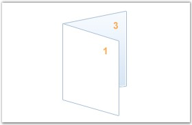

::: {style="DISPLAY: none"}
{#d2h_url_template}{#d2h_package_url style="WIDTH: 0px; DISPLAY: none; HEIGHT: 0px"}
:::

::::: {#nsbanner .d2h_main_nsbanner style="BORDER-BOTTOM: #999999 1px solid; POSITION: relative; PADDING-BOTTOM: 0px; BACKGROUND-COLOR: transparent; PADDING-LEFT: 0px; PADDING-RIGHT: 0px; DISPLAY: none; BORDER-TOP: #999999 1px solid; PADDING-TOP: 0px; LEFT: 0px"}
:::: {#TitleRow .d2h_main_titlerow style="PADDING-BOTTOM: 4px; BACKGROUND-COLOR: transparent; PADDING-LEFT: 22px; WIDTH: 100%; PADDING-RIGHT: 10px; DISPLAY: none; PADDING-TOP: 4px"}
::: {#ienav .d2h_main_ienav style="DISPLAY: none"}
{#D2HPrevious .D2HPreviousEnabled}  {#D2HNext .D2HNextEnabled}
:::
::::
:::::

:::: {#nstext .d2h_main_nstext style="PADDING-BOTTOM: 10px; BACKGROUND-COLOR: transparent; PADDING-LEFT: 22px; PADDING-RIGHT: 10px; HEIGHT: 100%; OVERFLOW: auto; PADDING-TOP: 5px" hasuserbackground="true" valign="bottom"}
::: {#d2h_breadcrumbs .d2h_breadcrumbs}
[Essential Studio User Guide Documentation](ms-xhelp:///?Id=12457748-09e3-4d74-a240-8e049cedf030){.d2h_breadcrumbsNormal}[ \> ]{.d2h_breadcrumbsLinkSeparator}[Reporting Edition](ms-xhelp:///?Id=027aa5b6-6676-4f93-ad23-c20e8c45792e){.d2h_breadcrumbsNormal}[ \> ]{.d2h_breadcrumbsLinkSeparator}[Essential Pdf](ms-xhelp:///?Id=22756092-3da5-4797-9514-dab0617c6902){.d2h_breadcrumbsNormal}[ \> ]{.d2h_breadcrumbsLinkSeparator}[Concepts and Features](ms-xhelp:///?Id=b2064337-afd6-4241-aa41-868a5489a8dd){.d2h_breadcrumbsNormal}[ \> ]{.d2h_breadcrumbsLinkSeparator}[PDF Editing](ms-xhelp:///?Id=acdc025e-645c-4f53-ab6c-d726bbf3e589){.d2h_breadcrumbsNormal}
:::

### Booklet {#booklet style="tab-stops: 0pt"}

[]{style="FONT-FAMILY: 'Trebuchet MS','sans-serif'; COLOR: #15428b; FONT-SIZE: 9pt"} 

Booklets are documents with multiple pages arranged on sheets of paper. When folded, the paper will represent the correct page order. Essential PDF provides support for creating booklets, which produces the resulting PDF document that can be printed and stapled in the center to form a booklet.

 

For example, assume that you have a 13 page document. Creating a booklet of the document will result in a PDF file with 7 pages( (page 1, null), (page2, page13), (page3, page12), \...((page7, page8).

[]{style="FONT-FAMILY: 'Trebuchet MS','sans-serif'; COLOR: #15428b; FONT-SIZE: 9pt"} 

{border="0"}

Figure 59: Pages Arranged in PDF

[]{style="FONT-FAMILY: 'Trebuchet MS','sans-serif'; COLOR: #15428b; FONT-SIZE: 9pt"} 

{border="0"}

Figure 60: Pages Arranged in Booklet Layout

[]{style="FONT-FAMILY: 'Trebuchet MS','sans-serif'; COLOR: #15428b; FONT-SIZE: 9pt"} 

{border="0"}

Figure 61: Pages Printed and Folded into New Booklet

 

**PdfBookletCreator** class is used for creating Booklets. The following code example illustrates how to create the Booklet.

 

+---------------------------------------------------------------------------------------------------------------------------------------------------------------------------------------------------------------------------------------------------+
| **[\[C#\]]{style="FONT-FAMILY: 'Courier New'"}**                                                                                                                                                                                                  |
|                                                                                                                                                                                                                                                   |
| []{style="FONT-FAMILY: 'Courier New'; COLOR: #2b91af"}                                                                                                                                                                                            |
|                                                                                                                                                                                                                                                   |
| [// Load a PDF document.]{style="FONT-FAMILY: 'Courier New'; COLOR: green"}                                                                                                                                                                       |
|                                                                                                                                                                                                                                                   |
| [PdfLoadedDocument]{style="FONT-FAMILY: 'Courier New'; COLOR: teal"}[ ldoc = [new]{style="COLOR: blue"} [PdfLoadedDocument]{style="COLOR: teal"}([\"SamplePDF.pdf\"]{style="COLOR: maroon"});]{style="FONT-FAMILY: 'Courier New'"}                |
|                                                                                                                                                                                                                                                   |
| []{style="FONT-FAMILY: 'Courier New'; COLOR: green"}                                                                                                                                                                                              |
|                                                                                                                                                                                                                                                   |
| [// Create booklet with two sides.]{style="FONT-FAMILY: 'Courier New'; COLOR: green"}                                                                                                                                                             |
|                                                                                                                                                                                                                                                   |
| [PdfDocument]{style="FONT-FAMILY: 'Courier New'; COLOR: teal"}[ doc = PdfBookletCreator.CreateBooklet(ldoc, [new]{style="COLOR: blue"} [SizeF]{style="COLOR: teal"}(500, 500), [true]{style="COLOR: blue"});]{style="FONT-FAMILY: 'Courier New'"} |
|                                                                                                                                                                                                                                                   |
| []{style="FONT-FAMILY: 'Courier New'; COLOR: green"}                                                                                                                                                                                              |
|                                                                                                                                                                                                                                                   |
| [// Save the document.]{style="FONT-FAMILY: 'Courier New'; COLOR: green"}                                                                                                                                                                         |
|                                                                                                                                                                                                                                                   |
| [doc.Save([\"Sample.pdf\"]{style="COLOR: maroon"});]{style="FONT-FAMILY: 'Courier New'"}                                                                                                                                                          |
+---------------------------------------------------------------------------------------------------------------------------------------------------------------------------------------------------------------------------------------------------+

[]{style="FONT-FAMILY: 'Trebuchet MS','sans-serif'; COLOR: #15428b; FONT-SIZE: 9pt"} 

+---------------------------------------------------------------------------------------------------------------------------------------------------------------------------------------------------------------------------------------------------------+
| **[\[VB.NET\]]{style="FONT-FAMILY: 'Courier New'"}**                                                                                                                                                                                                    |
|                                                                                                                                                                                                                                                         |
| []{style="FONT-FAMILY: 'Courier New'; COLOR: #2b91af"}                                                                                                                                                                                                  |
|                                                                                                                                                                                                                                                         |
| [\' Load a PDF document.]{style="FONT-FAMILY: 'Courier New'; COLOR: green"}                                                                                                                                                                             |
|                                                                                                                                                                                                                                                         |
| [Dim]{style="FONT-FAMILY: 'Courier New'; COLOR: blue"}[ ldoc [As]{style="COLOR: blue"} PdfLoadedDocument = [New]{style="COLOR: blue"} PdfLoadedDocument([\"SamplePDF.pdf]{style="COLOR: maroon"})]{style="FONT-FAMILY: 'Courier New'"}                  |
|                                                                                                                                                                                                                                                         |
| []{style="FONT-FAMILY: 'Courier New'; COLOR: green"}                                                                                                                                                                                                    |
|                                                                                                                                                                                                                                                         |
| [\' Create booklet with two sides.]{style="FONT-FAMILY: 'Courier New'; COLOR: green"}                                                                                                                                                                   |
|                                                                                                                                                                                                                                                         |
| [Dim]{style="FONT-FAMILY: 'Courier New'; COLOR: blue"}[ doc [As]{style="COLOR: blue"} PdfDocument = PdfBookletCreator.CreateBooklet(ldoc, [New]{style="COLOR: blue"} SizeF(500, 500), [True]{style="COLOR: blue"})]{style="FONT-FAMILY: 'Courier New'"} |
|                                                                                                                                                                                                                                                         |
| []{style="FONT-FAMILY: 'Courier New'; COLOR: green"}                                                                                                                                                                                                    |
|                                                                                                                                                                                                                                                         |
| [\' Save the document.]{style="FONT-FAMILY: 'Courier New'; COLOR: green"}                                                                                                                                                                               |
|                                                                                                                                                                                                                                                         |
| [doc.Save([\"Sample.pdf\"]{style="COLOR: maroon"})]{style="FONT-FAMILY: 'Courier New'"}                                                                                                                                                                 |
+---------------------------------------------------------------------------------------------------------------------------------------------------------------------------------------------------------------------------------------------------------+

 

The following code example illustrates the overloads of the **CreateBooklet** method.

 

+------------------------------------------------------------------------------------------------------------------+
| **[\[C#\]]{style="FONT-FAMILY: 'Courier New'"}**                                                                 |
|                                                                                                                  |
| []{style="FONT-FAMILY: 'Courier New'; COLOR: black"}                                                             |
|                                                                                                                  |
| [CreateBooklet(PdfLoadedDocument, SizeF)]{style="FONT-FAMILY: 'Courier New'; COLOR: black"}                      |
|                                                                                                                  |
| [CreateBooklet(PdfLoadedDocument, SizeF, Boolean)]{style="FONT-FAMILY: 'Courier New'; COLOR: black"}             |
|                                                                                                                  |
| [CreateBooklet(String, String, SizeF)]{style="FONT-FAMILY: 'Courier New'; COLOR: black"}                         |
|                                                                                                                  |
| [CreateBooklet(PdfLoadedDocument, SizeF, Boolean, PdfMargins)]{style="FONT-FAMILY: 'Courier New'; COLOR: black"} |
|                                                                                                                  |
| [CreateBooklet(String, String, SizeF, Boolean)]{style="FONT-FAMILY: 'Courier New'; COLOR: black"}                |
+------------------------------------------------------------------------------------------------------------------+

 

You can also apply margins to the booklets at the time of creating the booklet by using one of the preceding overloads.

 

The following code example illustrates how to create a booklet with the following overload: CreateBooklet(PdfLoadedDocument, SizeF, Boolean, PdfMargins).

 

+----------------------------------------------------------------------------------------------------------------------------------------------------------------------------------------------------------------------------------------------------------------------------------+
| **[\[C#\]]{style="FONT-FAMILY: 'Courier New'"}**                                                                                                                                                                                                                                 |
|                                                                                                                                                                                                                                                                                  |
| []{style="FONT-FAMILY: 'Courier New'; COLOR: #2b91af"}                                                                                                                                                                                                                           |
|                                                                                                                                                                                                                                                                                  |
| [// Load a PDF document.]{style="FONT-FAMILY: 'Courier New'; COLOR: green"}                                                                                                                                                                                                      |
|                                                                                                                                                                                                                                                                                  |
| [PdfLoadedDocument]{style="FONT-FAMILY: 'Courier New'; COLOR: teal"}[ ldoc = [new]{style="COLOR: blue"} [PdfLoadedDocument]{style="COLOR: teal"}([\"SamplePDF.pdf\"]{style="COLOR: maroon"});]{style="FONT-FAMILY: 'Courier New'"}                                               |
|                                                                                                                                                                                                                                                                                  |
| []{style="FONT-FAMILY: 'Courier New'; COLOR: green"}                                                                                                                                                                                                                             |
|                                                                                                                                                                                                                                                                                  |
| [// Specify the margin.]{style="FONT-FAMILY: 'Courier New'; COLOR: green"}                                                                                                                                                                                                       |
|                                                                                                                                                                                                                                                                                  |
| [PdfMargins]{style="FONT-FAMILY: 'Courier New'; COLOR: teal"}[ margin = new [PdfMargins]{style="COLOR: teal"}();]{style="FONT-FAMILY: 'Courier New'"}                                                                                                                            |
|                                                                                                                                                                                                                                                                                  |
| [margin.All = 10;]{style="FONT-FAMILY: 'Courier New'"}                                                                                                                                                                                                                           |
|                                                                                                                                                                                                                                                                                  |
| []{style="FONT-FAMILY: 'Courier New'; COLOR: green"}                                                                                                                                                                                                                             |
|                                                                                                                                                                                                                                                                                  |
| [// Create booklet with two sides.]{style="FONT-FAMILY: 'Courier New'; COLOR: green"}                                                                                                                                                                                            |
|                                                                                                                                                                                                                                                                                  |
| [PdfDocument]{style="FONT-FAMILY: 'Courier New'; COLOR: teal"}[ doc = PdfBookletCreator.CreateBooklet(ldoc, [new]{style="COLOR: blue"} [SizeF]{style="COLOR: teal"}(500, 500), [true]{style="COLOR: blue"},[ ]{style="COLOR: blue"}margin);]{style="FONT-FAMILY: 'Courier New'"} |
|                                                                                                                                                                                                                                                                                  |
| []{style="FONT-FAMILY: 'Courier New'; COLOR: green"}                                                                                                                                                                                                                             |
|                                                                                                                                                                                                                                                                                  |
| [// Save the document.]{style="FONT-FAMILY: 'Courier New'; COLOR: green"}                                                                                                                                                                                                        |
|                                                                                                                                                                                                                                                                                  |
| [doc.Save([\"Sample.pdf\"]{style="COLOR: maroon"});]{style="FONT-FAMILY: 'Courier New'"}                                                                                                                                                                                         |
+----------------------------------------------------------------------------------------------------------------------------------------------------------------------------------------------------------------------------------------------------------------------------------+

[]{style="FONT-FAMILY: 'Trebuchet MS','sans-serif'; COLOR: #15428b; FONT-SIZE: 9pt"} 

+----------------------------------------------------------------------------------------------------------------------------------------------------------------------------------------------------------------------------------------------------------------------------------------+
| **[\[VB.NET\]]{style="FONT-FAMILY: 'Courier New'"}**                                                                                                                                                                                                                                   |
|                                                                                                                                                                                                                                                                                        |
| []{style="FONT-FAMILY: 'Courier New'; COLOR: #2b91af"}                                                                                                                                                                                                                                 |
|                                                                                                                                                                                                                                                                                        |
| [\' Load a PDF document.]{style="FONT-FAMILY: 'Courier New'; COLOR: green"}                                                                                                                                                                                                            |
|                                                                                                                                                                                                                                                                                        |
| [Dim]{style="FONT-FAMILY: 'Courier New'; COLOR: blue"}[ ldoc [As]{style="COLOR: blue"} PdfLoadedDocument = [New]{style="COLOR: blue"} PdfLoadedDocument([\"SamplePDF.pdf]{style="COLOR: maroon"})]{style="FONT-FAMILY: 'Courier New'"}                                                 |
|                                                                                                                                                                                                                                                                                        |
| []{style="FONT-FAMILY: 'Courier New'; COLOR: green"}                                                                                                                                                                                                                                   |
|                                                                                                                                                                                                                                                                                        |
| [\' Specify the margin.]{style="FONT-FAMILY: 'Courier New'; COLOR: green"}                                                                                                                                                                                                             |
|                                                                                                                                                                                                                                                                                        |
| [Dim]{style="FONT-FAMILY: 'Courier New'; COLOR: blue"}[ margin [As]{style="COLOR: blue"} PdfMargins = [New]{style="COLOR: blue"} PdfMargins()]{style="FONT-FAMILY: 'Courier New'"}                                                                                                     |
|                                                                                                                                                                                                                                                                                        |
| [margin.All = 10]{style="FONT-FAMILY: 'Courier New'"}                                                                                                                                                                                                                                  |
|                                                                                                                                                                                                                                                                                        |
| []{style="FONT-FAMILY: 'Courier New'; COLOR: green"}                                                                                                                                                                                                                                   |
|                                                                                                                                                                                                                                                                                        |
| [\' Create booklet with two sides.]{style="FONT-FAMILY: 'Courier New'; COLOR: green"}                                                                                                                                                                                                  |
|                                                                                                                                                                                                                                                                                        |
| [Dim]{style="FONT-FAMILY: 'Courier New'; COLOR: blue"}[ doc [As]{style="COLOR: blue"} PdfDocument = PdfBookletCreator.CreateBooklet(ldoc, [New]{style="COLOR: blue"} SizeF(500, 500), [True]{style="COLOR: blue"},[ ]{style="COLOR: blue"}margin)]{style="FONT-FAMILY: 'Courier New'"} |
|                                                                                                                                                                                                                                                                                        |
| []{style="FONT-FAMILY: 'Courier New'; COLOR: green"}                                                                                                                                                                                                                                   |
|                                                                                                                                                                                                                                                                                        |
| [\' Save the document.]{style="FONT-FAMILY: 'Courier New'; COLOR: green"}                                                                                                                                                                                                              |
|                                                                                                                                                                                                                                                                                        |
| [doc.Save([\"Sample.pdf\"]{style="COLOR: maroon"})]{style="FONT-FAMILY: 'Courier New'"}                                                                                                                                                                                                |
+----------------------------------------------------------------------------------------------------------------------------------------------------------------------------------------------------------------------------------------------------------------------------------------+

 

[]{#related-topics}
::::
