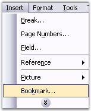
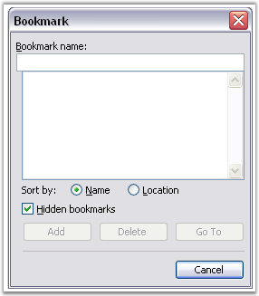

::: {style="DISPLAY: none"}
{#d2h_url_template}{#d2h_package_url style="WIDTH: 0px; DISPLAY: none; HEIGHT: 0px"}
:::

::::::: {.d2h_secondary_topic style="PADDING-BOTTOM: 10pt; MARGIN: 0pt; PADDING-LEFT: 0pt; PADDING-RIGHT: 0pt; PADDING-TOP: 0pt"}
#### Bookmark {#bookmark style="tab-stops: 0pt"}

 

[]{#p55}A bookmark identifies a location or selection of text that you name, and identifies them for future reference. For example, you might use a bookmark to identify the text that you want to revise later. Instead of scrolling through the document to locate the text, you can access it by using the **Bookmark** dialog box.

 

The following steps illustrate how to add a bookmark in the Word.

 

1.   Select a text or item that you want to assign as the bookmark.

2.   Open the **Insert** menu and click **Bookmark**. This will open the **Bookmark** dialog box.

 

 

{border="0"}

Figure 56: Insert Menu

 

{border="0"}

Figure 57: Bookmark Dialog Box

 

 

3.   Type the name of the bookmark.

4.   Click **Add** button.

 

::: {style="BORDER-BOTTOM: windowtext 1pt solid; BORDER-LEFT: medium none; PADDING-BOTTOM: 1pt; MARGIN-TOP: 9pt; PADDING-LEFT: 0pt; PADDING-RIGHT: 0pt; MARGIN-BOTTOM: 9pt; BORDER-TOP: windowtext 1pt solid; BORDER-RIGHT: medium none; PADDING-TOP: 1pt"}
Note: Bookmark names must begin with letter and can contain numbers. You cannot include spaces in a bookmark name. However, you can use the underscore character to separate words.
:::

 

DocIO gives you a simple mechanism of adding bookmarks to a document, and managing the bookmarks in the document. Every Word document contains a collection of bookmarks. This collection is accessible through the **Bookmarks** property of  the Word document. This collection contains objects of the Bookmark type, and enables you to find and delete bookmarks.

 

You can find a bookmark in the Bookmarks Collection, by specifying its name, by using the **FindByName** procedure. You can also remove a bookmark from the Bookmarks Collection, by specifying its index, by using the **RemoveAt** procedure, or remove a specified bookmark by using the **Remove** procedure.

 

Every DocIO bookmark consists of the **Bookmark Start** and **Bookmark End**. A **BookmarkStart** class represents a part of a bookmark which identifies the start of a specific bookmark. A **BookmarkEnd** class represents a part of a bookmark which identifies the end of a specific bookmark. BookmarkStart and BookmarkEnd have a common property, **Name**. This property defines the name of the DocIO bookmark.

 

**Class Hierarchy:**

 

ParagraphItem

            \|

            WBookmarkStart

 

ParagraphItem

            \|

            WBookmarkEnd

 

BookmarkStart Public Constructor

 

::: {align="center"}
  ----------------------------------------------------- ----------------------------------------------------------
  Name                                                  Description
  BookmarkStart.BookmarkStart (IWordDocument, string)   Initializes a new instance of the BookmarkStart class.  
  ----------------------------------------------------- ----------------------------------------------------------
:::

 

BookmarkEnd Public Constructor

 

::: {align="center"}
  ----------------------------------------------- ------------------------------------------------------
  Name                                            Description
  WTextFormField.WTextFormField (IWordDocument)   Initializes a new instance of the BookmarkEnd class.
  ----------------------------------------------- ------------------------------------------------------
:::

 

Public Properties

 

::: {align="center"}
  ---------------- --------------------------------
  Name             Description
  EntityType       Gets the type of the entity.  
  Name             Gets or sets bookmark name.  
  OwnerParagraph   Gets owner paragraph.
  ---------------- --------------------------------
:::

 

DocIO provides support to navigate between bookmarks. For details, see [BookmarkNavigator.]()

 

***Note***:***[ ]{style="COLOR: black; FONT-SIZE: 8pt"}***Modification of bookmarks in the Bookmarks Collection causes document corruption.

 

The following example illustrates how to use bookmarks.

 

+--------------------------------------------------------------------------------------------------------------------------------------------------------------------------------+
| **[\[C#\]]{style="FONT-FAMILY: 'Courier New'; COLOR: black"}**                                                                                                                 |
|                                                                                                                                                                                |
| []{style="COLOR: black"}                                                                                                                                                       |
|                                                                                                                                                                                |
| [IWordDocument]{style="FONT-FAMILY: 'Courier New'; COLOR: teal"}[ doc = [new]{style="COLOR: blue"} [WordDocument]{style="COLOR: teal"}();]{style="FONT-FAMILY: 'Courier New'"} |
|                                                                                                                                                                                |
| [IWSection]{style="FONT-FAMILY: 'Courier New'; COLOR: teal"}[ section = doc.AddSection();]{style="FONT-FAMILY: 'Courier New'"}                                                 |
|                                                                                                                                                                                |
| [IWParagraph]{style="FONT-FAMILY: 'Courier New'; COLOR: teal"}[ paragraph = section.AddParagraph();]{style="FONT-FAMILY: 'Courier New'"}                                       |
|                                                                                                                                                                                |
| [paragraph.AppendText([\"Book with one \"]{style="COLOR: maroon"});]{style="FONT-FAMILY: 'Courier New'"}                                                                       |
|                                                                                                                                                                                |
| [paragraph.AppendBookmarkStart([\"one_word\"]{style="COLOR: maroon"});]{style="FONT-FAMILY: 'Courier New'"}                                                                    |
|                                                                                                                                                                                |
| [paragraph.AppendText([\"word\"]{style="COLOR: maroon"});]{style="FONT-FAMILY: 'Courier New'"}                                                                                 |
|                                                                                                                                                                                |
| [paragraph.AppendBookmarkEnd([\"one_word\"]{style="COLOR: maroon"});]{style="FONT-FAMILY: 'Courier New'"}                                                                      |
|                                                                                                                                                                                |
| [paragraph.AppendText([\" selected\"]{style="COLOR: maroon"});]{style="FONT-FAMILY: 'Courier New'"}                                                                            |
|                                                                                                                                                                                |
| []{style="FONT-FAMILY: 'Courier New'"}                                                                                                                                         |
|                                                                                                                                                                                |
| [section.AddParagraph();]{style="FONT-FAMILY: 'Courier New'"}                                                                                                                  |
|                                                                                                                                                                                |
| [paragraph = section.AddParagraph();]{style="FONT-FAMILY: 'Courier New'"}                                                                                                      |
|                                                                                                                                                                                |
| [paragraph.AppendBookmarkStart([\"beginning_paragraph\"]{style="COLOR: maroon"});]{style="FONT-FAMILY: 'Courier New'"}                                                         |
|                                                                                                                                                                                |
| [paragraph.AppendText([\"Beginning of the paragraph selected\"]{style="COLOR: maroon"});]{style="FONT-FAMILY: 'Courier New'"}                                                  |
|                                                                                                                                                                                |
| []{style="FONT-FAMILY: 'Courier New'"}                                                                                                                                         |
|                                                                                                                                                                                |
| [section.AddParagraph();]{style="FONT-FAMILY: 'Courier New'"}                                                                                                                  |
|                                                                                                                                                                                |
| [paragraph = section.AddParagraph();]{style="FONT-FAMILY: 'Courier New'"}                                                                                                      |
|                                                                                                                                                                                |
| [paragraph.AppendBookmarkStart([\"bigger_bookmark\"]{style="COLOR: maroon"});]{style="FONT-FAMILY: 'Courier New'"}                                                             |
|                                                                                                                                                                                |
| [paragraph.AppendText([\"Smaller bookmark \"]{style="COLOR: maroon"});]{style="FONT-FAMILY: 'Courier New'"}                                                                    |
|                                                                                                                                                                                |
| [paragraph.AppendBookmarkStart([\"smaller_bookmark\"]{style="COLOR: maroon"});]{style="FONT-FAMILY: 'Courier New'"}                                                            |
|                                                                                                                                                                                |
| [paragraph.AppendText([\"is inside \"]{style="COLOR: maroon"});]{style="FONT-FAMILY: 'Courier New'"}                                                                           |
|                                                                                                                                                                                |
| [paragraph.AppendBookmarkEnd([\"smaller_bookmark\"]{style="COLOR: maroon"});]{style="FONT-FAMILY: 'Courier New'"}                                                              |
|                                                                                                                                                                                |
| [paragraph.AppendText([\"of the bigger bookmark\"]{style="COLOR: maroon"});]{style="FONT-FAMILY: 'Courier New'"}                                                               |
|                                                                                                                                                                                |
| [paragraph.AppendBookmarkEnd([\"bigger_bookmark\"]{style="COLOR: maroon"});]{style="FONT-FAMILY: 'Courier New'"}                                                               |
|                                                                                                                                                                                |
| []{style="FONT-FAMILY: 'Courier New'"}                                                                                                                                         |
|                                                                                                                                                                                |
| [paragraph = section.AddParagraph();]{style="FONT-FAMILY: 'Courier New'"}                                                                                                      |
|                                                                                                                                                                                |
| [paragraph.AppendBookmarkStart([\"multi_paragraph\"]{style="COLOR: maroon"});]{style="FONT-FAMILY: 'Courier New'"}                                                             |
|                                                                                                                                                                                |
| [paragraph.AppendText([\"Bookmark starts here and ends in the next paragraph\"]{style="COLOR: maroon"});]{style="FONT-FAMILY: 'Courier New'"}                                  |
|                                                                                                                                                                                |
| []{style="FONT-FAMILY: 'Courier New'"}                                                                                                                                         |
|                                                                                                                                                                                |
| [paragraph = section.AddParagraph();]{style="FONT-FAMILY: 'Courier New'"}                                                                                                      |
|                                                                                                                                                                                |
| [paragraph.AppendText([\"This \"]{style="COLOR: maroon"});]{style="FONT-FAMILY: 'Courier New'"}                                                                                |
|                                                                                                                                                                                |
| [paragraph.AppendBookmarkStart([\"overlapped bookmark\"]{style="COLOR: maroon"});]{style="FONT-FAMILY: 'Courier New'"}                                                         |
|                                                                                                                                                                                |
| [paragraph.AppendText([\"bookmark over\"]{style="COLOR: maroon"});]{style="FONT-FAMILY: 'Courier New'"}                                                                        |
|                                                                                                                                                                                |
| [paragraph.AppendBookmarkEnd([\"multi_paragraph\"]{style="COLOR: maroon"});]{style="FONT-FAMILY: 'Courier New'"}                                                               |
|                                                                                                                                                                                |
| [paragraph.AppendText([\"laps \"]{style="COLOR: maroon"});]{style="FONT-FAMILY: 'Courier New'"}                                                                                |
|                                                                                                                                                                                |
| [paragraph.AppendBookmarkEnd([\"overlapped bookmark\"]{style="COLOR: maroon"});]{style="FONT-FAMILY: 'Courier New'"}                                                           |
|                                                                                                                                                                                |
| [paragraph.AppendText([\"with previous one\"]{style="COLOR: maroon"});]{style="FONT-FAMILY: 'Courier New'"}                                                                    |
|                                                                                                                                                                                |
| []{style="FONT-FAMILY: 'Courier New'"}                                                                                                                                         |
|                                                                                                                                                                                |
| [doc.Save([\"Bookmarks.doc\"]{style="COLOR: maroon"});]{style="FONT-FAMILY: 'Courier New'"}                                                                                    |
+--------------------------------------------------------------------------------------------------------------------------------------------------------------------------------+

 

+--------------------------------------------------------------------------------------------------------------------------------------------------------------------------------------+
| **[\[VB.NET\]]{style="FONT-FAMILY: 'Courier New'; COLOR: black"}**                                                                                                                   |
|                                                                                                                                                                                      |
| []{style="COLOR: black"}                                                                                                                                                             |
|                                                                                                                                                                                      |
| [Dim]{style="FONT-FAMILY: 'Courier New'; COLOR: blue"}[ doc [As]{style="COLOR: blue"} IWordDocument = [New]{style="COLOR: blue"} WordDocument()]{style="FONT-FAMILY: 'Courier New'"} |
|                                                                                                                                                                                      |
| [Dim]{style="FONT-FAMILY: 'Courier New'; COLOR: blue"}[ section [As]{style="COLOR: blue"} IWSection = doc.AddSection()]{style="FONT-FAMILY: 'Courier New'"}                          |
|                                                                                                                                                                                      |
| [Dim]{style="FONT-FAMILY: 'Courier New'; COLOR: blue"}[ paragraph [As]{style="COLOR: blue"} IWParagraph = section.AddParagraph()]{style="FONT-FAMILY: 'Courier New'"}                |
|                                                                                                                                                                                      |
| [paragraph.AppendText([\"Book with one \"]{style="COLOR: maroon"})]{style="FONT-FAMILY: 'Courier New'"}                                                                              |
|                                                                                                                                                                                      |
| [paragraph.AppendBookmarkStart([\"one_word\"]{style="COLOR: maroon"})]{style="FONT-FAMILY: 'Courier New'"}                                                                           |
|                                                                                                                                                                                      |
| [paragraph.AppendText([\"word\"]{style="COLOR: maroon"})]{style="FONT-FAMILY: 'Courier New'"}                                                                                        |
|                                                                                                                                                                                      |
| [paragraph.AppendBookmarkEnd([\"one_word\"]{style="COLOR: maroon"})]{style="FONT-FAMILY: 'Courier New'"}                                                                             |
|                                                                                                                                                                                      |
| [paragraph.AppendText([\" selected\"]{style="COLOR: maroon"})]{style="FONT-FAMILY: 'Courier New'"}                                                                                   |
|                                                                                                                                                                                      |
| []{style="FONT-FAMILY: 'Courier New'"}                                                                                                                                               |
|                                                                                                                                                                                      |
| [section.AddParagraph()]{style="FONT-FAMILY: 'Courier New'"}                                                                                                                         |
|                                                                                                                                                                                      |
| [paragraph = section.AddParagraph()]{style="FONT-FAMILY: 'Courier New'"}                                                                                                             |
|                                                                                                                                                                                      |
| [paragraph.AppendBookmarkStart([\"beginning_paragraph\"]{style="COLOR: maroon"})]{style="FONT-FAMILY: 'Courier New'"}                                                                |
|                                                                                                                                                                                      |
| [paragraph.AppendText([\"Beginning of the paragraph selected\"]{style="COLOR: maroon"})]{style="FONT-FAMILY: 'Courier New'"}                                                         |
|                                                                                                                                                                                      |
| []{style="FONT-FAMILY: 'Courier New'"}                                                                                                                                               |
|                                                                                                                                                                                      |
| [section.AddParagraph()]{style="FONT-FAMILY: 'Courier New'"}                                                                                                                         |
|                                                                                                                                                                                      |
| [paragraph = section.AddParagraph()]{style="FONT-FAMILY: 'Courier New'"}                                                                                                             |
|                                                                                                                                                                                      |
| [paragraph.AppendBookmarkStart([\"bigger_bookmark\"]{style="COLOR: maroon"})]{style="FONT-FAMILY: 'Courier New'"}                                                                    |
|                                                                                                                                                                                      |
| [paragraph.AppendText([\"Smaller bookmark \"]{style="COLOR: maroon"})]{style="FONT-FAMILY: 'Courier New'"}                                                                           |
|                                                                                                                                                                                      |
| [paragraph.AppendBookmarkStart([\"smaller_bookmark\"]{style="COLOR: maroon"})]{style="FONT-FAMILY: 'Courier New'"}                                                                   |
|                                                                                                                                                                                      |
| [paragraph.AppendText([\"is inside \"]{style="COLOR: maroon"})]{style="FONT-FAMILY: 'Courier New'"}                                                                                  |
|                                                                                                                                                                                      |
| [paragraph.AppendBookmarkEnd([\"smaller_bookmark\"]{style="COLOR: maroon"})]{style="FONT-FAMILY: 'Courier New'"}                                                                     |
|                                                                                                                                                                                      |
| [paragraph.AppendText([\"of the bigger bookmark\"]{style="COLOR: maroon"})]{style="FONT-FAMILY: 'Courier New'"}                                                                      |
|                                                                                                                                                                                      |
| [paragraph.AppendBookmarkEnd([\"bigger_bookmark\"]{style="COLOR: maroon"})]{style="FONT-FAMILY: 'Courier New'"}                                                                      |
|                                                                                                                                                                                      |
| []{style="FONT-FAMILY: 'Courier New'"}                                                                                                                                               |
|                                                                                                                                                                                      |
| [paragraph = section.AddParagraph()]{style="FONT-FAMILY: 'Courier New'"}                                                                                                             |
|                                                                                                                                                                                      |
| [paragraph.AppendBookmarkStart([\"multi_paragraph\"]{style="COLOR: maroon"})]{style="FONT-FAMILY: 'Courier New'"}                                                                    |
|                                                                                                                                                                                      |
| [paragraph.AppendText([\"Bookmark starts here and ends in the next paragraph\"]{style="COLOR: maroon"})]{style="FONT-FAMILY: 'Courier New'"}                                         |
|                                                                                                                                                                                      |
| []{style="FONT-FAMILY: 'Courier New'"}                                                                                                                                               |
|                                                                                                                                                                                      |
| [paragraph = section.AddParagraph()]{style="FONT-FAMILY: 'Courier New'"}                                                                                                             |
|                                                                                                                                                                                      |
| [paragraph.AppendText([\"This \"]{style="COLOR: maroon"})]{style="FONT-FAMILY: 'Courier New'"}                                                                                       |
|                                                                                                                                                                                      |
| [paragraph.AppendBookmarkStart([\"overlapped bookmark\"]{style="COLOR: maroon"})]{style="FONT-FAMILY: 'Courier New'"}                                                                |
|                                                                                                                                                                                      |
| [paragraph.AppendText([\"bookmark over\"]{style="COLOR: maroon"})]{style="FONT-FAMILY: 'Courier New'"}                                                                               |
|                                                                                                                                                                                      |
| [paragraph.AppendBookmarkEnd([\"multi_paragraph\"]{style="COLOR: maroon"})]{style="FONT-FAMILY: 'Courier New'"}                                                                      |
|                                                                                                                                                                                      |
| [paragraph.AppendText([\"laps \"]{style="COLOR: maroon"})]{style="FONT-FAMILY: 'Courier New'"}                                                                                       |
|                                                                                                                                                                                      |
| [paragraph.AppendBookmarkEnd([\"overlapped bookmark\"]{style="COLOR: maroon"})]{style="FONT-FAMILY: 'Courier New'"}                                                                  |
|                                                                                                                                                                                      |
| [paragraph.AppendText([\"with previous one\"]{style="COLOR: maroon"})]{style="FONT-FAMILY: 'Courier New'"}                                                                           |
|                                                                                                                                                                                      |
| []{style="FONT-FAMILY: 'Courier New'"}                                                                                                                                               |
|                                                                                                                                                                                      |
| [doc.Save([\"Bookmarks.doc\"]{style="COLOR: maroon"})]{style="FONT-FAMILY: 'Courier New'"}                                                                                           |
+--------------------------------------------------------------------------------------------------------------------------------------------------------------------------------------+

[]{#_Bookmark_Navigator} 

More:

[ ]{#related-topics}

[{border="0" align="absMiddle"}Bookmark Navigator](ms-xhelp:///?Id=bc08b6c9-37fd-43c1-991b-d5b3b652608c){style="TEXT-DECORATION: none"}
:::::::
