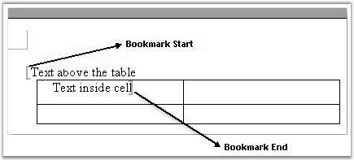
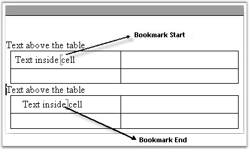
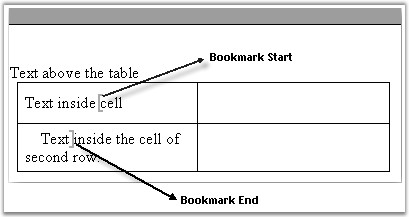
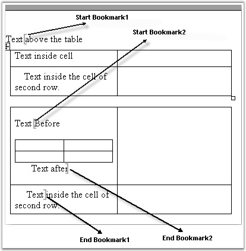

::: {style="DISPLAY: none"}
{#d2h_url_template}{#d2h_package_url style="WIDTH: 0px; DISPLAY: none; HEIGHT: 0px"}
:::

::::::: {.d2h_secondary_topic style="PADDING-BOTTOM: 10pt; MARGIN: 0pt; PADDING-LEFT: 0pt; PADDING-RIGHT: 0pt; PADDING-TOP: 0pt"}
##### Bookmark Navigator {#bookmark-navigator style="tab-stops: 0pt"}

 

**BookmarkNavigator** is used for navigation between bookmarks in the Word document.

 

[·      ]{style="FONT-FAMILY: Symbol"}You can navigate to a bookmark by using the **MoveToBookmark** method. There are two overloads for this method.

 

[o  ]{style="FONT-FAMILY: 'Courier New'"}**MoveToBookmark(string bookmarkName, bool isStart, bool isAfter)**, which moves to the bookmark with the specified name

[o  ]{style="FONT-FAMILY: 'Courier New'"}The **isStart** parameter defines whether to move to the bookmark start or bookmark end and the **isAfter** parameter defines whether to set virtual \"cursor\" after or before the bookmark start or end.

[o  ]{style="FONT-FAMILY: 'Courier New'"}**MoveToBookmark(string bookmarkName)**, which moves to the bookmark start with the specified name, and sets the \"cursor\" before the bookmark start.

 

[·      ]{style="FONT-FAMILY: Symbol"}You can insert text between bookmark start and bookmark end by using the **InsertText** method.

[·      ]{style="FONT-FAMILY: Symbol"}You can insert a table between the bookmark start and bookmark end by using the **InsertTable** method.

[·      ]{style="FONT-FAMILY: Symbol"}You can insert a paragraph between the bookmark start and bookmark end by using the **InsertParagraph** method.

[·      ]{style="FONT-FAMILY: Symbol"}You can insert the text body part between the bookmark start and bookmark end by using the **InsertTextBodyPart** method.

[·      ]{style="FONT-FAMILY: Symbol"}You can insert paragraph items between the bookmark start and bookmark end by using the **InsertParagraphItem** method.

[·      ]{style="FONT-FAMILY: Symbol"}You can delete content between the bookmark start and bookmark end by using the **DeleteBookmarkContent** method.

[·      ]{style="FONT-FAMILY: Symbol"}You can replace content between the bookmark start and bookmark end by using the **ReplaceBookmarkContent** method.

[·      ]{style="FONT-FAMILY: Symbol"}You can get the content between the bookmark start and bookmark end by using the **GetBookmarkContent** method.

 

The following are the restrictions on the GetBookmarkContent method.

 

Case 1: The bookmark start is positioned in the text and bookmark end is positioned inside the table or vice versa.

 

{border="0"}

Figure 58: GetBookmarkContent method - Restriction 1

 

 

Case 2: The bookmark start and bookmark end are positioned inside different tables.

 

{border="0"}

Figure 59: GetBookmarkContent method - Restriction 2

 

Case 3: The bookmark start and bookmark end are positioned inside different cells.

 

{border="0"}

Figure 60: GetBookmarkContent method - Restriction 3

 

 

The following exception is raised by the **GetBookmarkContent** method for all the preceding cases: \"Bookmark Start and Bookmark End located inside different contents\".

 

{border="0"}

Figure 61: GetBookmarkContent method - Restriction 4

::: {style="BORDER-BOTTOM: windowtext 1pt solid; BORDER-LEFT: medium none; PADDING-BOTTOM: 1pt; MARGIN-TOP: 9pt; PADDING-LEFT: 0pt; PADDING-RIGHT: 0pt; MARGIN-BOTTOM: 9pt; BORDER-TOP: windowtext 1pt solid; BORDER-RIGHT: medium none; PADDING-TOP: 1pt"}
 

{border="0"}Note: GetBookmarkContent method works fine for tables, if they are located between the bookmark start and bookmark end.
:::

 

Public Constructor

 

::: {align="center"}
  ----------------------------------------------------- ------------------------------------------------------------
  Name                                                  Description
  BookmarkNavigator.BookmarkNavigator (IWordDocument)   Initializes a new instance of the BookmarkNavigator class.
  ----------------------------------------------------- ------------------------------------------------------------
:::

 

Public Properties

 

::: {align="center"}
  ----------------- ---------------------------------------------------------
  Name              Description
  CurrentBookmark   Gets the current bookmark.  
  Document          Gets or sets Document that this object is attached to. 
  ----------------- ---------------------------------------------------------
:::

 

Public Methods

 

::: {align="center"}
  ------------------------ ---------------------------------------------------
  Name                     Description
  DeleteBookmarkContent    Deletes the bookmark content.
  GetBookmarkContent       Gets the bookmark content2.  
  InsertParagraphItem      Inserts the paragraph item to current position.  
  InsertTable              Inserts the table.  
  InsertText               Inserts the text.
  MoveToBookmark           Moves to bookmark.
  ReplaceBookmarkContent   Replaces bookmark content.
  InsertParagraph          Inserts the paragraph.
  InsertTextBodyPart       Inserts the body part of the text.
  ------------------------ ---------------------------------------------------
:::

 

The following example illustrates how to use the BookmarkNavigator class.

 

+---------------------------------------------------------------------------------------------------------------------------------------------------------------------------------------------------------------------------------------------------------------------------------------+
| **[\[C#\]]{style="FONT-FAMILY: 'Courier New'; COLOR: black"}**                                                                                                                                                                                                                        |
|                                                                                                                                                                                                                                                                                       |
| []{style="FONT-FAMILY: 'Courier New'; COLOR: black"}                                                                                                                                                                                                                                  |
|                                                                                                                                                                                                                                                                                       |
| [IWordDocument]{style="FONT-FAMILY: 'Courier New'; COLOR: teal"}[ doc = [new]{style="COLOR: blue"} [WordDocument]{style="COLOR: teal"}( [Path]{style="COLOR: teal"} + [\"BookmarkNavigator.doc\"]{style="COLOR: maroon"} );]{style="FONT-FAMILY: 'Courier New'"}                      |
|                                                                                                                                                                                                                                                                                       |
| []{style="FONT-FAMILY: 'Courier New'"}                                                                                                                                                                                                                                                |
|                                                                                                                                                                                                                                                                                       |
| [BookmarksNavigator]{style="FONT-FAMILY: 'Courier New'; COLOR: teal"}[ bn = [new]{style="COLOR: blue"} [BookmarksNavigator]{style="COLOR: teal"}( doc );]{style="FONT-FAMILY: 'Courier New'"}                                                                                         |
|                                                                                                                                                                                                                                                                                       |
| [bn.MoveToBookmark( [\"bm_bodypart\"]{style="COLOR: maroon"} );]{style="FONT-FAMILY: 'Courier New'"}                                                                                                                                                                                  |
|                                                                                                                                                                                                                                                                                       |
| [TextBodyPart]{style="FONT-FAMILY: 'Courier New'; COLOR: teal"}[ part = bn.GetBookmarkContent();]{style="FONT-FAMILY: 'Courier New'"}                                                                                                                                                 |
|                                                                                                                                                                                                                                                                                       |
| [bn.MoveToBookmark( [\"bm_empty\"]{style="COLOR: maroon"} );]{style="FONT-FAMILY: 'Courier New'"}                                                                                                                                                                                     |
|                                                                                                                                                                                                                                                                                       |
| [bn.ReplaceBookmarkContent( part );]{style="FONT-FAMILY: 'Courier New'"}                                                                                                                                                                                                              |
|                                                                                                                                                                                                                                                                                       |
| [TextSelection]{style="FONT-FAMILY: 'Courier New'; COLOR: teal"}[ sel =(doc [as]{style="COLOR: blue"} [WordDocument]{style="COLOR: teal"}).Find( [\"11\"]{style="COLOR: maroon"} , [false]{style="COLOR: blue"}, [false]{style="COLOR: blue"} );]{style="FONT-FAMILY: 'Courier New'"} |
+---------------------------------------------------------------------------------------------------------------------------------------------------------------------------------------------------------------------------------------------------------------------------------------+

 

+---------------------------------------------------------------------------------------------------------------------------------------------------------------------------------------------------------------------------------------------------------------------------------------------------------------------------------------------------------------------------------------------------------------+
| **[\[VB.NET\]]{style="FONT-FAMILY: 'Courier New'; COLOR: black"}**                                                                                                                                                                                                                                                                                                                                            |
|                                                                                                                                                                                                                                                                                                                                                                                                               |
| []{style="FONT-FAMILY: 'Courier New'; COLOR: black"}                                                                                                                                                                                                                                                                                                                                                          |
|                                                                                                                                                                                                                                                                                                                                                                                                               |
| [Dim]{style="FONT-FAMILY: 'Courier New'; COLOR: blue"}[ doc [As]{style="COLOR: blue"} IWordDocument = [New]{style="COLOR: blue"} WordDocument(Path & [\"BookmarkNavigator.doc\"]{style="COLOR: maroon"})]{style="FONT-FAMILY: 'Courier New'"}                                                                                                                                                                 |
|                                                                                                                                                                                                                                                                                                                                                                                                               |
| []{style="FONT-FAMILY: 'Courier New'"}                                                                                                                                                                                                                                                                                                                                                                        |
|                                                                                                                                                                                                                                                                                                                                                                                                               |
| [Dim]{style="FONT-FAMILY: 'Courier New'; COLOR: blue"}[ bn [As]{style="COLOR: blue"} BookmarksNavigator = [New]{style="COLOR: blue"} BookmarksNavigator(doc)]{style="FONT-FAMILY: 'Courier New'"}                                                                                                                                                                                                             |
|                                                                                                                                                                                                                                                                                                                                                                                                               |
| [bn.MoveToBookmark([\"bm_bodypart\"]{style="COLOR: maroon"})]{style="FONT-FAMILY: 'Courier New'"}                                                                                                                                                                                                                                                                                                             |
|                                                                                                                                                                                                                                                                                                                                                                                                               |
| [Dim]{style="FONT-FAMILY: 'Courier New'; COLOR: blue"}[ part [As]{style="COLOR: blue"} TextBodyPart = bn.GetBookmarkContent()]{style="FONT-FAMILY: 'Courier New'"}                                                                                                                                                                                                                                            |
|                                                                                                                                                                                                                                                                                                                                                                                                               |
| [bn.MoveToBookmark([\"bm_empty\"]{style="COLOR: maroon"})]{style="FONT-FAMILY: 'Courier New'"}                                                                                                                                                                                                                                                                                                                |
|                                                                                                                                                                                                                                                                                                                                                                                                               |
| [bn.ReplaceBookmarkContent(part)]{style="FONT-FAMILY: 'Courier New'"}                                                                                                                                                                                                                                                                                                                                         |
|                                                                                                                                                                                                                                                                                                                                                                                                               |
| [Dim]{style="FONT-FAMILY: 'Courier New'; COLOR: blue"}[ sel [As]{style="COLOR: blue"} TextSelection = ([CType]{style="COLOR: blue"}(IIf([TypeOf]{style="COLOR: blue"} doc [Is]{style="COLOR: blue"} WordDocument, doc, [Nothing]{style="COLOR: blue"}), WordDocument)).Find([\"11\"]{style="COLOR: maroon"}, [False]{style="COLOR: blue"}, [False]{style="COLOR: blue"})]{style="FONT-FAMILY: 'Courier New'"} |
+---------------------------------------------------------------------------------------------------------------------------------------------------------------------------------------------------------------------------------------------------------------------------------------------------------------------------------------------------------------------------------------------------------------+

 

You can also preserve the formatting in the template (target) document while inserting or replacing the bookmark with a string, by deleting the content of the bookmark without deleting its format. The following code illustrates this.

 

+-----------------------------------------------------------------------------------------------------------------------------------------------------------------------------------------------------------------------------------------------------------------------------------------------------------------------------------------------------------------------------------------------------------------------------------------+
| **[\[C#\]]{style="FONT-FAMILY: 'Courier New'"}**                                                                                                                                                                                                                                                                                                                                                                                        |
|                                                                                                                                                                                                                                                                                                                                                                                                                                         |
| []{style="FONT-FAMILY: 'Courier New'"}                                                                                                                                                                                                                                                                                                                                                                                                  |
|                                                                                                                                                                                                                                                                                                                                                                                                                                         |
| [// Move to the Essential_DocIO bookmark.]{style="FONT-FAMILY: 'Courier New'; COLOR: green"}                                                                                                                                                                                                                                                                                                                                            |
|                                                                                                                                                                                                                                                                                                                                                                                                                                         |
| [bk.MoveToBookmark([\"Essential_DocIO\"]{style="COLOR: maroon"});]{style="FONT-FAMILY: 'Courier New'"}                                                                                                                                                                                                                                                                                                                                  |
|                                                                                                                                                                                                                                                                                                                                                                                                                                         |
| []{style="FONT-FAMILY: 'Courier New'"}                                                                                                                                                                                                                                                                                                                                                                                                  |
|                                                                                                                                                                                                                                                                                                                                                                                                                                         |
| [// Delete bookmark content without deleting the format in the target document.]{style="FONT-FAMILY: 'Courier New'; COLOR: green"}                                                                                                                                                                                                                                                                                                      |
|                                                                                                                                                                                                                                                                                                                                                                                                                                         |
| [bk.DeleteBookmarkContent([false]{style="COLOR: blue"});]{style="FONT-FAMILY: 'Courier New'"}                                                                                                                                                                                                                                                                                                                                           |
|                                                                                                                                                                                                                                                                                                                                                                                                                                         |
| []{style="FONT-FAMILY: 'Courier New'"}                                                                                                                                                                                                                                                                                                                                                                                                  |
|                                                                                                                                                                                                                                                                                                                                                                                                                                         |
| [// Insert Text]{style="FONT-FAMILY: 'Courier New'; COLOR: green"}                                                                                                                                                                                                                                                                                                                                                                      |
|                                                                                                                                                                                                                                                                                                                                                                                                                                         |
| [bk.InsertText([\"Essential XlsIO is a Non UI component that can be used in both ASP.NET and windows forms applications. The usage is common for both environments except for the part where the created spreadsheet is saved to disk or stream in the case of a windows forms application and streamed to the client browser in the case of asp.net applications.\"]{style="COLOR: maroon"});    ]{style="FONT-FAMILY: 'Courier New'"} |
+-----------------------------------------------------------------------------------------------------------------------------------------------------------------------------------------------------------------------------------------------------------------------------------------------------------------------------------------------------------------------------------------------------------------------------------------+

 

+-----------------------------------------------------------------------------------------------------------------------------------------------------------------------------------------------------------------------------------------------------------------------------------------------------------------------------------------------------------------------------------------------------------------------------------------+
| **[\[VB.NET\]]{style="FONT-FAMILY: 'Courier New'"}**                                                                                                                                                                                                                                                                                                                                                                                    |
|                                                                                                                                                                                                                                                                                                                                                                                                                                         |
| []{style="FONT-FAMILY: 'Courier New'"}                                                                                                                                                                                                                                                                                                                                                                                                  |
|                                                                                                                                                                                                                                                                                                                                                                                                                                         |
| [\' Move to the Essential_DocIO bookmark.]{style="FONT-FAMILY: 'Courier New'; COLOR: green"}                                                                                                                                                                                                                                                                                                                                            |
|                                                                                                                                                                                                                                                                                                                                                                                                                                         |
| [bk.MoveToBookmark([\"Essential_DocIO\"]{style="COLOR: maroon"})]{style="FONT-FAMILY: 'Courier New'"}                                                                                                                                                                                                                                                                                                                                   |
|                                                                                                                                                                                                                                                                                                                                                                                                                                         |
| []{style="FONT-FAMILY: 'Courier New'"}                                                                                                                                                                                                                                                                                                                                                                                                  |
|                                                                                                                                                                                                                                                                                                                                                                                                                                         |
| [\' Delete bookmark content without deleting the format in the target document.]{style="FONT-FAMILY: 'Courier New'; COLOR: green"}                                                                                                                                                                                                                                                                                                      |
|                                                                                                                                                                                                                                                                                                                                                                                                                                         |
| [bk.DeleteBookmarkContent([false]{style="COLOR: blue"})]{style="FONT-FAMILY: 'Courier New'"}                                                                                                                                                                                                                                                                                                                                            |
|                                                                                                                                                                                                                                                                                                                                                                                                                                         |
| []{style="FONT-FAMILY: 'Courier New'"}                                                                                                                                                                                                                                                                                                                                                                                                  |
|                                                                                                                                                                                                                                                                                                                                                                                                                                         |
| [\' Insert text.]{style="FONT-FAMILY: 'Courier New'; COLOR: green"}                                                                                                                                                                                                                                                                                                                                                                     |
|                                                                                                                                                                                                                                                                                                                                                                                                                                         |
| [bk.InsertText([\"Essential XlsIO is a Non UI component that can be used in both ASP.NET and windows forms applications. The usage is common for both environments except for the part where the created spreadsheet is saved to disk or stream in the case of a windows forms application and streamed to the client browser in the case of asp.net applications.\"]{style="COLOR: maroon"})     ]{style="FONT-FAMILY: 'Courier New'"} |
+-----------------------------------------------------------------------------------------------------------------------------------------------------------------------------------------------------------------------------------------------------------------------------------------------------------------------------------------------------------------------------------------------------------------------------------------+

[]{#related-topics}
:::::::
