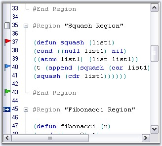

::: {style="DISPLAY: none"}
{#d2h_url_template}{#d2h_package_url style="WIDTH: 0px; DISPLAY: none; HEIGHT: 0px"}
:::

::::: {#nsbanner .d2h_main_nsbanner style="BORDER-BOTTOM: #999999 1px solid; POSITION: relative; PADDING-BOTTOM: 0px; BACKGROUND-COLOR: transparent; PADDING-LEFT: 0px; PADDING-RIGHT: 0px; DISPLAY: none; BORDER-TOP: #999999 1px solid; PADDING-TOP: 0px; LEFT: 0px"}
:::: {#TitleRow .d2h_main_titlerow style="PADDING-BOTTOM: 4px; BACKGROUND-COLOR: transparent; PADDING-LEFT: 22px; WIDTH: 100%; PADDING-RIGHT: 10px; DISPLAY: none; PADDING-TOP: 4px"}
::: {#ienav .d2h_main_ienav style="DISPLAY: none"}
{#D2HPrevious .D2HPreviousEnabled}  {#D2HNext .D2HNextEnabled}
:::
::::
:::::

:::::::::: {#nstext .d2h_main_nstext style="PADDING-BOTTOM: 10px; BACKGROUND-COLOR: transparent; PADDING-LEFT: 22px; PADDING-RIGHT: 10px; HEIGHT: 100%; OVERFLOW: auto; PADDING-TOP: 5px" hasuserbackground="true" valign="bottom"}
::: {#d2h_breadcrumbs .d2h_breadcrumbs}
[Essential Studio User Guide Documentation](ms-xhelp:///?Id=12457748-09e3-4d74-a240-8e049cedf030){.d2h_breadcrumbsNormal}[ \> ]{.d2h_breadcrumbsLinkSeparator}[User Interface Edition](ms-xhelp:///?Id=c29296b7-531c-413b-a0ec-488ca1f7f669){.d2h_breadcrumbsNormal}[ \> ]{.d2h_breadcrumbsLinkSeparator}[Essential Windows](ms-xhelp:///?Id=e60759d8-47a4-4570-9d7a-16a68d63f2ea){.d2h_breadcrumbsNormal}[ \> ]{.d2h_breadcrumbsLinkSeparator}[Essential Edit]{.d2h_breadcrumbsContentsOnly}[ \> ]{.d2h_breadcrumbsLinkSeparator}[Concepts And Features](ms-xhelp:///?Id=7c39cee6-8434-4711-a18e-efaba8ac85c0){.d2h_breadcrumbsNormal}[ \> ]{.d2h_breadcrumbsLinkSeparator}[Text Visualization](ms-xhelp:///?Id=03937960-0195-4ded-b842-e48212f822d3){.d2h_breadcrumbsNormal}
:::

### Bookmarks and Custom Indicators {#bookmarks-and-custom-indicators style="tab-stops: 0pt"}

 

Essential Edit enables users to locate a section or a line of a document by using the Bookmarks and Custom Indicators feature like in Visual Studio. This provides quick access to any part of the contents of the Edit Control.

 

The Edit Control allows any number of custom images or bookmarks to be added to a document.

 

::: {style="BORDER-BOTTOM: windowtext 1pt solid; BORDER-LEFT: medium none; PADDING-BOTTOM: 1pt; MARGIN-TOP: 9pt; PADDING-LEFT: 0pt; PADDING-RIGHT: 0pt; MARGIN-BOTTOM: 9pt; BORDER-TOP: windowtext 1pt solid; BORDER-RIGHT: medium none; PADDING-TOP: 1pt"}
{border="0"}Note: At any given point of time, each line can have only one indicator or bookmark associated with it.
:::

 

**Displaying Bookmarks**

[]{style="FONT-FAMILY: 'Verdana','sans-serif'; COLOR: #4a5c8c; FONT-SIZE: 8pt"} 

The Edit Control provides an indicator margin for the purpose of displaying the custom indicators or bookmarks. This can be enabled by using the **ShowIndicatorMargin** property, as shown below.

 

::: {align="center"}
  ----------------------- -----------------------------------------------------------------------------------------
  Edit Control Property   Description
  ShowIndicatorMargin     Gets / sets value indicating whether bookmarks and indicator margins should be visible.
  MarkerAreaWidth         Gets / sets width of marker area.
  ----------------------- -----------------------------------------------------------------------------------------
:::

[]{style="FONT-FAMILY: 'Trebuchet MS','sans-serif'; COLOR: #15428b; FONT-SIZE: 9pt"} 

+---------------------------------------------------------------------------------------------------------------------------------------------------------------+
| **[\[C#\]]{style="FONT-FAMILY: 'Courier New'; COLOR: black"}**                                                                                                |
|                                                                                                                                                               |
| []{style="FONT-FAMILY: 'Courier New'; COLOR: black"}                                                                                                          |
|                                                                                                                                                               |
| [// Displays the Indicator margin.]{style="FONT-FAMILY: 'Courier New'; COLOR: green"}                                                                         |
|                                                                                                                                                               |
| [this]{style="FONT-FAMILY: 'Courier New'; COLOR: blue"}[.editControl1.ShowIndicatorMargin = [true]{style="COLOR: blue"};]{style="FONT-FAMILY: 'Courier New'"} |
|                                                                                                                                                               |
| []{style="FONT-FAMILY: 'Courier New'"}                                                                                                                        |
|                                                                                                                                                               |
| [// Sets the width of the Indicator margin.]{style="FONT-FAMILY: 'Courier New'; COLOR: green"}                                                                |
|                                                                                                                                                               |
| [this]{style="FONT-FAMILY: 'Courier New'; COLOR: blue"}[.editControl1.MarkerAreaWidth = 20;]{style="FONT-FAMILY: 'Courier New'"}                              |
+---------------------------------------------------------------------------------------------------------------------------------------------------------------+

[]{style="FONT-FAMILY: 'Trebuchet MS','sans-serif'; COLOR: #15428b; FONT-SIZE: 9pt"} 

+------------------------------------------------------------------------------------------------------------------------------------------------------------+
| **[\[VB.NET\]]{style="FONT-FAMILY: 'Courier New'; COLOR: black"}**                                                                                         |
|                                                                                                                                                            |
| []{style="FONT-FAMILY: 'Courier New'; COLOR: black"}                                                                                                       |
|                                                                                                                                                            |
| [\' Displays the Indicator margin.]{style="FONT-FAMILY: 'Courier New'; COLOR: green"}                                                                      |
|                                                                                                                                                            |
| [Me]{style="FONT-FAMILY: 'Courier New'; COLOR: blue"}[.editControl1.ShowIndicatorMargin = [True]{style="COLOR: blue"}]{style="FONT-FAMILY: 'Courier New'"} |
|                                                                                                                                                            |
| []{style="FONT-FAMILY: 'Courier New'; COLOR: blue"}                                                                                                        |
|                                                                                                                                                            |
| [\' Sets the width of the Indicator margin.]{style="FONT-FAMILY: 'Courier New'; COLOR: green"}                                                             |
|                                                                                                                                                            |
| [Me]{style="FONT-FAMILY: 'Courier New'; COLOR: blue"}[.editControl1.MarkerAreaWidth = 20]{style="FONT-FAMILY: 'Courier New'"}                              |
+------------------------------------------------------------------------------------------------------------------------------------------------------------+

 

**Customizing Bookmarks**

 

You can either display the default bookmark image (like in Visual Studio.NET) or display custom images as indicators. This can be done by making use of the following methods of the Edit Control.

 

::: {align="center"}
  --------------------- -----------------------------------------
  Edit Control Method   Description
  BookmarkToggle        Sets bookmark to the current line.
  BookmarkAdd           Sets bookmark at the specified line.
  BookmarkRemove        Removes bookmark at the specified line.
  BookmarkGet           Gets bookmark at the specified line.
  BookmarkNext          Goes to the next bookmark.
  BookmarkPrevious      Goes to the previous bookmark.
  BookmarkClear         Clears all the bookmarks.
  --------------------- -----------------------------------------
:::

[]{style="FONT-FAMILY: 'Trebuchet MS','sans-serif'; COLOR: #15428b; FONT-SIZE: 9pt"} 

+--------------------------------------------------------------------------------------------------------------------------------------------------------------------------------------------------------------+
| **[\[C#\]]{style="FONT-FAMILY: 'Courier New'; COLOR: black"}**                                                                                                                                               |
|                                                                                                                                                                                                              |
| []{style="FONT-FAMILY: 'Courier New'; COLOR: black"}                                                                                                                                                         |
|                                                                                                                                                                                                              |
| [// Sets bookmark at the specified line.]{style="FONT-FAMILY: 'Courier New'; COLOR: green"}                                                                                                                  |
|                                                                                                                                                                                                              |
| [this]{style="FONT-FAMILY: 'Courier New'; COLOR: blue"}[.editControl1.BookmarkAdd([this]{style="COLOR: blue"}.editControl1.CurrentLine);]{style="FONT-FAMILY: 'Courier New'"}                                |
|                                                                                                                                                                                                              |
| []{style="FONT-FAMILY: 'Courier New'"}                                                                                                                                                                       |
|                                                                                                                                                                                                              |
| [// Removes bookmark at the specified line.]{style="FONT-FAMILY: 'Courier New'; COLOR: green"}                                                                                                               |
|                                                                                                                                                                                                              |
| [this]{style="FONT-FAMILY: 'Courier New'; COLOR: blue"}[.editControl1.BookmarkRemove([this]{style="COLOR: blue"}.editControl1.CurrentLine);]{style="FONT-FAMILY: 'Courier New'"}                             |
|                                                                                                                                                                                                              |
| []{style="FONT-FAMILY: 'Courier New'"}                                                                                                                                                                       |
|                                                                                                                                                                                                              |
| [this]{style="FONT-FAMILY: 'Courier New'; COLOR: blue"}[.editControl1.BookmarkRemove([this]{style="COLOR: blue"}.editControl1.CurrentLine);]{style="FONT-FAMILY: 'Courier New'"}                             |
|                                                                                                                                                                                                              |
| []{style="FONT-FAMILY: 'Courier New'"}                                                                                                                                                                       |
|                                                                                                                                                                                                              |
| [// Draw the bookmark with custom look and feel specified in the BrushInfo object.]{style="FONT-FAMILY: 'Courier New'; COLOR: green"}                                                                        |
|                                                                                                                                                                                                              |
| [BrushInfo brushInfo = [new]{style="COLOR: blue"} BrushInfo(GradientStyle.ForwardDiagonal, [Color]{style="COLOR: teal"}.IndianRed, [Color]{style="COLOR: teal"}.Ivory);]{style="FONT-FAMILY: 'Courier New'"} |
|                                                                                                                                                                                                              |
| [this]{style="FONT-FAMILY: 'Courier New'; COLOR: blue"}[.editControl1.BookmarkAdd([this]{style="COLOR: blue"}.editControl1.CurrentLine, brushInfo);]{style="FONT-FAMILY: 'Courier New'"}                     |
|                                                                                                                                                                                                              |
| []{style="FONT-FAMILY: 'Courier New'"}                                                                                                                                                                       |
|                                                                                                                                                                                                              |
| [// Get the Bookmark object of the current line.]{style="FONT-FAMILY: 'Courier New'; COLOR: green"}                                                                                                          |
|                                                                                                                                                                                                              |
| [IBookmark bookmark = [this]{style="COLOR: blue"}.editControl1.BookmarkGet([this]{style="COLOR: blue"}.editControl1.CurrentLine);]{style="FONT-FAMILY: 'Courier New'"}                                       |
+--------------------------------------------------------------------------------------------------------------------------------------------------------------------------------------------------------------+

[]{style="FONT-FAMILY: 'Trebuchet MS','sans-serif'; COLOR: #15428b; FONT-SIZE: 9pt"} 

+----------------------------------------------------------------------------------------------------------------------------------------------------------------------------------------------------------------------------------------------------+
| **[\[VB.NET\]]{style="FONT-FAMILY: 'Courier New'; COLOR: black"}**                                                                                                                                                                                 |
|                                                                                                                                                                                                                                                    |
| []{style="FONT-FAMILY: 'Courier New'; COLOR: black"}                                                                                                                                                                                               |
|                                                                                                                                                                                                                                                    |
| [\' Sets bookmark at the specified line.]{style="FONT-FAMILY: 'Courier New'; COLOR: green"}                                                                                                                                                        |
|                                                                                                                                                                                                                                                    |
| [Me]{style="FONT-FAMILY: 'Courier New'; COLOR: blue"}[.editControl1.BookmarkAdd([Me]{style="COLOR: blue"}.editControl1.CurrentLine)]{style="FONT-FAMILY: 'Courier New'"}                                                                           |
|                                                                                                                                                                                                                                                    |
| []{style="FONT-FAMILY: 'Courier New'"}                                                                                                                                                                                                             |
|                                                                                                                                                                                                                                                    |
| [\' Removes bookmark at the specified line.]{style="FONT-FAMILY: 'Courier New'; COLOR: green"}                                                                                                                                                     |
|                                                                                                                                                                                                                                                    |
| [Me.editControl1.BookmarkRemove(Me.editControl1.CurrentLine)]{style="FONT-FAMILY: 'Courier New'"}                                                                                                                                                  |
|                                                                                                                                                                                                                                                    |
| []{style="FONT-FAMILY: 'Courier New'"}                                                                                                                                                                                                             |
|                                                                                                                                                                                                                                                    |
| [\' Draw the bookmark with custom look and feel specified in the BrushInfo object.]{style="FONT-FAMILY: 'Courier New'; COLOR: green"}                                                                                                              |
|                                                                                                                                                                                                                                                    |
| [Dim ]{style="FONT-FAMILY: 'Courier New'; COLOR: blue"}[brushInfo [As]{style="COLOR: blue"} BrushInfo = [new]{style="COLOR: blue"} BrushInfo(GradientStyle.ForwardDiagonal, Color.IndianRed, Color.Ivory)]{style="FONT-FAMILY: 'Courier New'"}     |
|                                                                                                                                                                                                                                                    |
| [Me]{style="FONT-FAMILY: 'Courier New'; COLOR: blue"}[.editControl1.BookmarkAdd([Me]{style="COLOR: blue"}.editControl1.CurrentLine, brushInfo)]{style="FONT-FAMILY: 'Courier New'"}                                                                |
|                                                                                                                                                                                                                                                    |
| []{style="FONT-FAMILY: 'Courier New'"}                                                                                                                                                                                                             |
|                                                                                                                                                                                                                                                    |
| [\' Get the Bookmark object of the current line.]{style="FONT-FAMILY: 'Courier New'; COLOR: green"}                                                                                                                                                |
|                                                                                                                                                                                                                                                    |
| [Dim]{style="FONT-FAMILY: 'Courier New'; COLOR: blue"}[ bookmark [As]{style="COLOR: blue"} IBookmark = [Me]{style="COLOR: blue"}.EditControl1.BookmarkGet([Me]{style="COLOR: blue"}.EditControl1.CurrentLine)]{style="FONT-FAMILY: 'Courier New'"} |
+----------------------------------------------------------------------------------------------------------------------------------------------------------------------------------------------------------------------------------------------------+

 

**Setting Bookmarks**

[]{style="FONT-FAMILY: 'Verdana','sans-serif'; COLOR: #4a5c8c; FONT-SIZE: 8pt"} 

Bookmarks can be set and removed by using the below given methods.

 

::: {align="center"}
  ---------------------- ----------------------------------------------------
  Edit Control Method    Description
  SetCustomBookmark      Sets custom bookmark for the desired line.
  RemoveCustomBookmark   Removes the custom bookmark from the desired line.
  ---------------------- ----------------------------------------------------
:::

[]{style="FONT-FAMILY: 'Trebuchet MS','sans-serif'; COLOR: #15428b; FONT-SIZE: 9pt"} 

::: {style="BORDER-BOTTOM: windowtext 1pt solid; BORDER-LEFT: medium none; PADDING-BOTTOM: 1pt; MARGIN-TOP: 9pt; PADDING-LEFT: 0pt; PADDING-RIGHT: 0pt; MARGIN-BOTTOM: 9pt; BORDER-TOP: windowtext 1pt solid; BORDER-RIGHT: medium none; PADDING-TOP: 1pt"}
{border="0"}Note: To clear the bookmarks set by using the SetCustomBookmark method, you must use the BookmarkClear method with its bool argument set as True.
:::

[]{style="FONT-FAMILY: 'Trebuchet MS','sans-serif'; COLOR: #15428b; FONT-SIZE: 9pt"} 

The bookmarks set by using the SetCustomBookmark method, do not respond to the **BookmarkNext** and **BookmarkPrevious** methods automatically. In order to enable this, you have to set the **UseInBookmarkSearch** property of the custom bookmark to **True**.

[]{style="FONT-FAMILY: 'Trebuchet MS','sans-serif'; COLOR: #15428b; FONT-SIZE: 9pt"} 

+--------------------------------------------------------------------------------------------------------------------------------------------------------------------------------------------------------------------------------------------------------------------------------------------------+
| **[\[C#\]]{style="FONT-FAMILY: 'Courier New'; COLOR: black"}**                                                                                                                                                                                                                                   |
|                                                                                                                                                                                                                                                                                                  |
| []{style="FONT-FAMILY: 'Courier New'; COLOR: black"}                                                                                                                                                                                                                                             |
|                                                                                                                                                                                                                                                                                                  |
| [// Sets custom bookmarks and enables it to respond to BookmarkNext and BookmarkPrevious methods.]{style="FONT-FAMILY: 'Courier New'; COLOR: green"}                                                                                                                                             |
|                                                                                                                                                                                                                                                                                                  |
| [ICustomBookmark customBookmark = [this]{style="COLOR: blue"}.editControl1.SetCustomBookmark([this]{style="COLOR: blue"}.editControl1.CurrentLine, [new]{style="COLOR: blue"} BookmarkPaintEventHandler(CustomBookmarkPainter));]{style="FONT-FAMILY: 'Courier New'"}                            |
|                                                                                                                                                                                                                                                                                                  |
| [customBookmark.UseInBookmarkSearch = [true]{style="COLOR: blue"};]{style="FONT-FAMILY: 'Courier New'"}                                                                                                                                                                                          |
|                                                                                                                                                                                                                                                                                                  |
| []{style="FONT-FAMILY: 'Courier New'; COLOR: green"}                                                                                                                                                                                                                                             |
|                                                                                                                                                                                                                                                                                                  |
| [// Removes the bookmark of the current line.]{style="FONT-FAMILY: 'Courier New'; COLOR: green"}                                                                                                                                                                                                 |
|                                                                                                                                                                                                                                                                                                  |
| [ICustomBookmark]{style="FONT-FAMILY: 'Courier New'; COLOR: teal"}[ customBookmark = [this]{style="COLOR: blue"}.editControl1.RemoveCustomBookmark([this]{style="COLOR: blue"}.editControl1.CurrentLine, BookmarkPaintEventHandler(CustomBookmarkPainter));]{style="FONT-FAMILY: 'Courier New'"} |
+--------------------------------------------------------------------------------------------------------------------------------------------------------------------------------------------------------------------------------------------------------------------------------------------------+

[]{style="FONT-FAMILY: 'Trebuchet MS','sans-serif'; COLOR: #15428b; FONT-SIZE: 9pt"} 

+---------------------------------------------------------------------------------------------------------------------------------------------------------------------------------------------------------------------------------------------------------------------------------------------------------------------------------------------------+
| **[\[VB.NET\]]{style="FONT-FAMILY: 'Courier New'; COLOR: black"}**                                                                                                                                                                                                                                                                                |
|                                                                                                                                                                                                                                                                                                                                                   |
| []{style="FONT-FAMILY: 'Courier New'; COLOR: black"}                                                                                                                                                                                                                                                                                              |
|                                                                                                                                                                                                                                                                                                                                                   |
| [\' Sets custom bookmarks and enables it to respond to BookmarkNext and BookmarkPrevious methods.]{style="FONT-FAMILY: 'Courier New'; COLOR: green"}                                                                                                                                                                                              |
|                                                                                                                                                                                                                                                                                                                                                   |
| [Dim]{style="FONT-FAMILY: 'Courier New'; COLOR: blue"}[ customBookmark [As]{style="COLOR: blue"} ICustomBookmark = [Me]{style="COLOR: blue"}.editControl1.SetCustomBookmark([Me]{style="COLOR: blue"}.editControl1.CurrentLine, [New]{style="COLOR: blue"} BookmarkPaintEventHandler(CustomBookmarkPainter))]{style="FONT-FAMILY: 'Courier New'"} |
|                                                                                                                                                                                                                                                                                                                                                   |
| [customBookmark.UseInBookmarkSearch = [True]{style="COLOR: blue"}]{style="FONT-FAMILY: 'Courier New'"}                                                                                                                                                                                                                                            |
|                                                                                                                                                                                                                                                                                                                                                   |
| []{style="FONT-FAMILY: 'Courier New'; COLOR: blue"}                                                                                                                                                                                                                                                                                               |
|                                                                                                                                                                                                                                                                                                                                                   |
| [\' Removes the bookmark of the current line.]{style="FONT-FAMILY: 'Courier New'; COLOR: green"}                                                                                                                                                                                                                                                  |
|                                                                                                                                                                                                                                                                                                                                                   |
| [Dim]{style="FONT-FAMILY: 'Courier New'; COLOR: blue"}[ customBookmark [As]{style="COLOR: blue"} ICustomBookmark = [Me]{style="COLOR: blue"}.editControl1.RemoveCustomBookmark([Me]{style="COLOR: blue"}.editControl1.CurrentLine, BookmarkPaintEventHandler(CustomBookmarkPainter))]{style="FONT-FAMILY: 'Courier New'"}                         |
+---------------------------------------------------------------------------------------------------------------------------------------------------------------------------------------------------------------------------------------------------------------------------------------------------------------------------------------------------+

 

Setting Tooltips for Bookmarks

[]{style="COLOR: #4a5c8c; FONT-SIZE: 8pt"} 

Tooltips can be set for bookmarks and customized by using the below given properties.

[]{style="COLOR: #4a5c8c; FONT-SIZE: 8pt"} 

::: {align="center"}
  -------------------------------- ----------------------------------------------------------
  Edit Control Property            Description
  ShowBookmarkTooltip              Specifies whether the tooltip of the bookmark is shown.
  BookmarkTooltipBackgroundBrush   Gets / sets brush for bookmark tooltip background.
  BookmarkTooltipBorderColor       Specifies the color of the bookmark tooltip form border.
  -------------------------------- ----------------------------------------------------------
:::

 

+----------------------------------------------------------------------------------------------------------------------------------------------------------------------------------------------------------------------------------------------------------------------------------------------------------------------------------------------------------------------------------------------------------------+
| **[\[C#\]]{style="FONT-FAMILY: 'Courier New'; COLOR: black"}**                                                                                                                                                                                                                                                                                                                                                 |
|                                                                                                                                                                                                                                                                                                                                                                                                                |
| []{style="FONT-FAMILY: 'Courier New'; COLOR: black"}                                                                                                                                                                                                                                                                                                                                                           |
|                                                                                                                                                                                                                                                                                                                                                                                                                |
| [// Shows the tooltip of the bookmark.]{style="FONT-FAMILY: 'Courier New'; COLOR: green"}                                                                                                                                                                                                                                                                                                                      |
|                                                                                                                                                                                                                                                                                                                                                                                                                |
| [this]{style="FONT-FAMILY: 'Courier New'; COLOR: blue"}[.editControl1.ShowBookmarkTooltip = [true]{style="COLOR: blue"};]{style="FONT-FAMILY: 'Courier New'"}                                                                                                                                                                                                                                                  |
|                                                                                                                                                                                                                                                                                                                                                                                                                |
| []{style="FONT-FAMILY: 'Courier New'"}                                                                                                                                                                                                                                                                                                                                                                         |
|                                                                                                                                                                                                                                                                                                                                                                                                                |
| [// Gets or sets brush for bookmark tooltip background.]{style="FONT-FAMILY: 'Courier New'; COLOR: green"}                                                                                                                                                                                                                                                                                                     |
|                                                                                                                                                                                                                                                                                                                                                                                                                |
| [this]{style="FONT-FAMILY: 'Courier New'; COLOR: blue"}[.editControl1.BookmarkTooltipBackgroundBrush = [new]{style="COLOR: blue"} Syncfusion.Drawing.[BrushInfo]{style="COLOR: teal"}(Syncfusion.Drawing.[PatternStyle]{style="COLOR: teal"}.Percent05, System.Drawing.[SystemColors]{style="COLOR: teal"}.WindowText, System.Drawing.[Color]{style="COLOR: teal"}.Gold);]{style="FONT-FAMILY: 'Courier New'"} |
|                                                                                                                                                                                                                                                                                                                                                                                                                |
| []{style="FONT-FAMILY: 'Courier New'"}                                                                                                                                                                                                                                                                                                                                                                         |
|                                                                                                                                                                                                                                                                                                                                                                                                                |
| [// Specify the color of the bookmark tooltip form border.]{style="FONT-FAMILY: 'Courier New'; COLOR: green"}                                                                                                                                                                                                                                                                                                  |
|                                                                                                                                                                                                                                                                                                                                                                                                                |
| [this]{style="FONT-FAMILY: 'Courier New'; COLOR: blue"}[.editControl1.BookmarkTooltipBorderColor = System.Drawing.[Color]{style="COLOR: teal"}.Crimson;]{style="FONT-FAMILY: 'Courier New'"}                                                                                                                                                                                                                   |
+----------------------------------------------------------------------------------------------------------------------------------------------------------------------------------------------------------------------------------------------------------------------------------------------------------------------------------------------------------------------------------------------------------------+

[]{style="FONT-FAMILY: 'Trebuchet MS','sans-serif'; COLOR: #15428b; FONT-SIZE: 9pt"} 

+-----------------------------------------------------------------------------------------------------------------------------------------------------------------------------------------------------------------------------------------------------------------------------------------------------------------+
| **[\[VB.NET\]]{style="FONT-FAMILY: 'Courier New'; COLOR: black"}**                                                                                                                                                                                                                                              |
|                                                                                                                                                                                                                                                                                                                 |
| []{style="FONT-FAMILY: 'Courier New'; COLOR: black"}                                                                                                                                                                                                                                                            |
|                                                                                                                                                                                                                                                                                                                 |
| [\' Shows the tooltip of the bookmark.]{style="FONT-FAMILY: 'Courier New'; COLOR: green"}                                                                                                                                                                                                                       |
|                                                                                                                                                                                                                                                                                                                 |
| [Me]{style="FONT-FAMILY: 'Courier New'; COLOR: blue"}[.editControl1.ShowBookmarkTooltip = [True]{style="COLOR: blue"}]{style="FONT-FAMILY: 'Courier New'"}                                                                                                                                                      |
|                                                                                                                                                                                                                                                                                                                 |
| []{style="FONT-FAMILY: 'Courier New'; COLOR: blue"}                                                                                                                                                                                                                                                             |
|                                                                                                                                                                                                                                                                                                                 |
| [\' Gets or sets brush for bookmark tooltip background.]{style="FONT-FAMILY: 'Courier New'; COLOR: green"}                                                                                                                                                                                                      |
|                                                                                                                                                                                                                                                                                                                 |
| [Me]{style="FONT-FAMILY: 'Courier New'; COLOR: blue"}[.editControl1.BookmarkTooltipBackgroundBrush = [New]{style="COLOR: blue"} Syncfusion.Drawing.BrushInfo(Syncfusion.Drawing.PatternStyle.Percent05, System.Drawing.SystemColors.WindowText, System.Drawing.Color.Gold)]{style="FONT-FAMILY: 'Courier New'"} |
|                                                                                                                                                                                                                                                                                                                 |
| []{style="FONT-FAMILY: 'Courier New'"}                                                                                                                                                                                                                                                                          |
|                                                                                                                                                                                                                                                                                                                 |
| [\' Specify the color of the bookmark tooltip form border.]{style="FONT-FAMILY: 'Courier New'; COLOR: green"}                                                                                                                                                                                                   |
|                                                                                                                                                                                                                                                                                                                 |
| [Me]{style="FONT-FAMILY: 'Courier New'; COLOR: blue"}[.editControl1.BookmarkTooltipBorderColor = System.Drawing.Color.Crimson]{style="FONT-FAMILY: 'Courier New'"}                                                                                                                                              |
+-----------------------------------------------------------------------------------------------------------------------------------------------------------------------------------------------------------------------------------------------------------------------------------------------------------------+

[]{style="FONT-FAMILY: 'Trebuchet MS','sans-serif'; COLOR: #15428b; FONT-SIZE: 9pt"} 

{border="0"}

Figure 24: Edit Control with Custom Bookmarks

 

A sample which illustrates the above features is available in the below sample installation path.

 

..\\My Documents\\Syncfusion\\EssentialStudio***\\Version Number***\\Windows\\Edit.Windows\\Samples\\2.0\\Text Navigation\\CustomBookmarksDemo

 

[]{#p43} 

[]{#related-topics}
::::::::::
