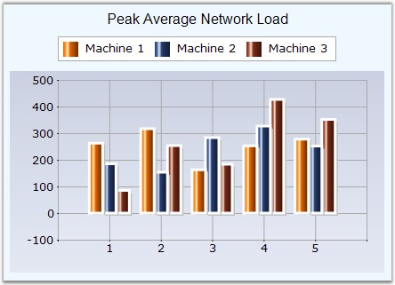
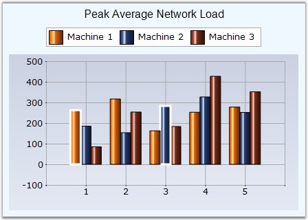

::: {style="DISPLAY: none"}
{#d2h_url_template}{#d2h_package_url style="WIDTH: 0px; DISPLAY: none; HEIGHT: 0px"}
:::

:::: {.d2h_secondary_topic style="PADDING-BOTTOM: 10pt; MARGIN: 0pt; PADDING-LEFT: 0pt; PADDING-RIGHT: 0pt; PADDING-TOP: 0pt"}
#### Border {#border style="tab-stops: 0pt"}

 

The user can also set the Border color and Border style for the chart series.

 

::: {align="center"}
+-------------------------------------+--------------------------------------------------------------------------------------------------------------------------------------------------------------------------------------------------------------+
| Details                                                                                                                                                                                                                                            |
+-------------------------------------+--------------------------------------------------------------------------------------------------------------------------------------------------------------------------------------------------------------+
| **Possible Values**                 | Any Color, Width, Style for the Borders                                                                                                                                                                      |
+-------------------------------------+--------------------------------------------------------------------------------------------------------------------------------------------------------------------------------------------------------------+
| **Default Value    **               | [·      ]{style="FONT-FAMILY: Symbol"}**Color**  - Black                                                                                                                                                     |
|                                     |                                                                                                                                                                                                              |
|                                     | [·      ]{style="FONT-FAMILY: Symbol"}**Width value** - 1                                                                                                                                                    |
|                                     |                                                                                                                                                                                                              |
|                                     | [·      ]{style="FONT-FAMILY: Symbol"}**DashStyle** - Solid                                                                                                                                                  |
+-------------------------------------+--------------------------------------------------------------------------------------------------------------------------------------------------------------------------------------------------------------+
| **2D / 3D Limitations**             | No                                                                                                                                                                                                           |
+-------------------------------------+--------------------------------------------------------------------------------------------------------------------------------------------------------------------------------------------------------------+
| **Applies to Chart Element**        | All series and points                                                                                                                                                                                        |
+-------------------------------------+--------------------------------------------------------------------------------------------------------------------------------------------------------------------------------------------------------------+
| **Applies to Chart Types**          | Pyramid, Funnel, Area, Bar, Bubble, Column Chart, Candle Chart, Renko chart, Three Line Break Chart, Box and Whisker Chart, Gantt Chart, Histogram Chart, Tornado Chart, Polar and Radar Chart and Pie Chart |
+-------------------------------------+--------------------------------------------------------------------------------------------------------------------------------------------------------------------------------------------------------------+
:::

 

The line type can be configured using the **ChartSeries.Style.Border** property as in the following example.

 

+-------------------------------------------------------------------------------------------------------------------------------------------------------------------------------------------------------------------------------------------+
| **[\[C#\]                    ]{style="FONT-FAMILY: 'Courier New'; COLOR: black"}**                                                                                                                                                        |
|                                                                                                                                                                                                                                           |
| **[]{style="FONT-FAMILY: 'Courier New'; COLOR: black"}**                                                                                                                                                                                  |
|                                                                                                                                                                                                                                           |
| [// Set the border style required for the column chart.]{style="FONT-FAMILY: 'Courier New'; COLOR: green"}                                                                                                                                |
|                                                                                                                                                                                                                                           |
| [series.Style.Border.Width = 3;]{style="FONT-FAMILY: 'Courier New'; COLOR: black"}                                                                                                                                                        |
|                                                                                                                                                                                                                                           |
| [series.Style.Border.Color = ]{style="FONT-FAMILY: 'Courier New'; COLOR: black"}[Color]{style="FONT-FAMILY: 'Courier New'; COLOR: teal"}[.]{style="FONT-FAMILY: 'Courier New'; COLOR: black"}[White;]{style="FONT-FAMILY: 'Courier New'"} |
|                                                                                                                                                                                                                                           |
| []{style="FONT-FAMILY: 'Courier New'"}                                                                                                                                                                                                    |
|                                                                                                                                                                                                                                           |
| [// Set the Series style]{style="FONT-FAMILY: 'Courier New'; COLOR: green"}                                                                                                                                                               |
|                                                                                                                                                                                                                                           |
| [series.Style.DisplayShadow = [true]{style="COLOR: blue"};]{style="FONT-FAMILY: 'Courier New'"}                                                                                                                                           |
|                                                                                                                                                                                                                                           |
| [series.Style.ShadowInterior = [new]{style="COLOR: blue"} Syncfusion.Drawing.[BrushInfo]{style="COLOR: teal"}([Color]{style="COLOR: teal"}.White);]{style="FONT-FAMILY: 'Courier New'"}                                                   |
|                                                                                                                                                                                                                                           |
| [series.Style.ShadowOffset = [new]{style="COLOR: blue"} [Size]{style="COLOR: teal"}(3, 3);]{style="FONT-FAMILY: 'Courier New'"}                                                                                                           |
+-------------------------------------------------------------------------------------------------------------------------------------------------------------------------------------------------------------------------------------------+

 

+--------------------------------------------------------------------------------------------------------------------------------------------------------------------------------------------------------------------------------------------------------------------------------------------------------------------------------------------------------------------------------------------------------------------------------------------------------------------------------------------------------------------+
| **[\[VB.NET\]]{style="FONT-FAMILY: 'Courier New'; COLOR: black"}**                                                                                                                                                                                                                                                                                                                                                                                                                                                 |
|                                                                                                                                                                                                                                                                                                                                                                                                                                                                                                                    |
| **[]{style="FONT-FAMILY: 'Courier New'; COLOR: black"}**                                                                                                                                                                                                                                                                                                                                                                                                                                                           |
|                                                                                                                                                                                                                                                                                                                                                                                                                                                                                                                    |
| [\' Set the border style required for the column chart.]{style="FONT-FAMILY: 'Courier New'; COLOR: green"}                                                                                                                                                                                                                                                                                                                                                                                                         |
|                                                                                                                                                                                                                                                                                                                                                                                                                                                                                                                    |
| [series.Style.Border.Width = 3]{style="FONT-FAMILY: 'Courier New'; COLOR: black"}                                                                                                                                                                                                                                                                                                                                                                                                                                  |
|                                                                                                                                                                                                                                                                                                                                                                                                                                                                                                                    |
| [series.Style.Border.Color = ]{style="FONT-FAMILY: 'Courier New'; COLOR: black"}[Color]{style="FONT-FAMILY: 'Courier New'; COLOR: teal"}[.]{style="FONT-FAMILY: 'Courier New'; COLOR: black"}[White]{style="FONT-FAMILY: 'Courier New'"}                                                                                                                                                                                                                                                                           |
|                                                                                                                                                                                                                                                                                                                                                                                                                                                                                                                    |
| []{style="FONT-FAMILY: 'Courier New'"}                                                                                                                                                                                                                                                                                                                                                                                                                                                                             |
|                                                                                                                                                                                                                                                                                                                                                                                                                                                                                                                    |
| [\' Set the Series style]{style="FONT-FAMILY: 'Courier New'; COLOR: green"}                                                                                                                                                                                                                                                                                                                                                                                                                                        |
|                                                                                                                                                                                                                                                                                                                                                                                                                                                                                                                    |
| [series.Style.DisplayShadow = True]{style="FONT-FAMILY: 'Courier New'; COLOR: black"}                                                                                                                                                                                                                                                                                                                                                                                                                              |
|                                                                                                                                                                                                                                                                                                                                                                                                                                                                                                                    |
| [series.Style.ShadowInterior = ]{style="FONT-FAMILY: 'Courier New'; COLOR: black"}[New]{style="FONT-FAMILY: 'Courier New'; COLOR: teal"}[ Syncfusion.Drawing.]{style="FONT-FAMILY: 'Courier New'; COLOR: black"}[BrushInfo]{style="FONT-FAMILY: 'Courier New'; COLOR: teal"}[(]{style="FONT-FAMILY: 'Courier New'; COLOR: black"}[Color]{style="FONT-FAMILY: 'Courier New'; COLOR: teal"}[.]{style="FONT-FAMILY: 'Courier New'; COLOR: black"}[White[)]{style="COLOR: black"}]{style="FONT-FAMILY: 'Courier New'"} |
|                                                                                                                                                                                                                                                                                                                                                                                                                                                                                                                    |
| [series.Style.ShadowOffset = ]{style="FONT-FAMILY: 'Courier New'; COLOR: black"}[New]{style="FONT-FAMILY: 'Courier New'; COLOR: teal"}[ Size(3, 3)]{style="FONT-FAMILY: 'Courier New'; COLOR: black"}                                                                                                                                                                                                                                                                                                              |
+--------------------------------------------------------------------------------------------------------------------------------------------------------------------------------------------------------------------------------------------------------------------------------------------------------------------------------------------------------------------------------------------------------------------------------------------------------------------------------------------------------------------+

[]{style="COLOR: red; FONT-SIZE: 8pt"} 

{border="0"}

 

Figure 97**[: Border Lined Column Chart]{style="FONT-STYLE: normal"}**

 

To apply this on specific data points:

[]{style="FONT-FAMILY: 'Courier New'; COLOR: red"} 

+--------------------------------------------------------------------------------------------------------------+
| **[\[C#\]                    ]{style="FONT-FAMILY: 'Courier New'; COLOR: black"}**                           |
|                                                                                                              |
| **[]{style="FONT-FAMILY: 'Courier New'; COLOR: black"}**                                                     |
|                                                                                                              |
| [//Sets border for the 1st point in 1st series]{style="FONT-FAMILY: 'Courier New'; COLOR: green"}            |
|                                                                                                              |
| [series1.Styles\[0\].Border.Width = 3;]{style="FONT-FAMILY: 'Courier New'"}                                  |
|                                                                                                              |
| [series1.Styles\[0\].Border.Color = [Color]{style="COLOR: teal"}.White;]{style="FONT-FAMILY: 'Courier New'"} |
|                                                                                                              |
| []{style="FONT-FAMILY: 'Courier New'"}                                                                       |
|                                                                                                              |
| [//Sets border for the 3rd point in 2nd series]{style="FONT-FAMILY: 'Courier New'; COLOR: green"}            |
|                                                                                                              |
| [series2.Styles\[2\].Border.Width = 3;]{style="FONT-FAMILY: 'Courier New'"}                                  |
|                                                                                                              |
| [series2.Styles\[2\].Border.Color = [Color]{style="COLOR: teal"}.White;]{style="FONT-FAMILY: 'Courier New'"} |
+--------------------------------------------------------------------------------------------------------------+

 

+---------------------------------------------------------------------------------------------------+
| **[\[VB.NET\]]{style="FONT-FAMILY: 'Courier New'; COLOR: black"}**                                |
|                                                                                                   |
| **[]{style="FONT-FAMILY: 'Courier New'; COLOR: black"}**                                          |
|                                                                                                   |
| [\'Sets border for the 1st point in 1st series]{style="FONT-FAMILY: 'Courier New'; COLOR: green"} |
|                                                                                                   |
| [series1.Styles(0).Border.Width = 3]{style="FONT-FAMILY: 'Courier New'"}                          |
|                                                                                                   |
| [series1.Styles(0).Border.Color = Color.White]{style="FONT-FAMILY: 'Courier New'"}                |
|                                                                                                   |
| []{style="FONT-FAMILY: 'Courier New'"}                                                            |
|                                                                                                   |
| [\'Sets border for the 3rd point in 2nd series]{style="FONT-FAMILY: 'Courier New'; COLOR: green"} |
|                                                                                                   |
| [series2.Styles(2).Border.Width = 3]{style="FONT-FAMILY: 'Courier New'"}                          |
|                                                                                                   |
| [series2.Styles(2).Border.Color = Color.White]{style="FONT-FAMILY: 'Courier New'"}                |
+---------------------------------------------------------------------------------------------------+

[]{style="COLOR: black; FONT-SIZE: 8pt"} 

{border="0"}

 

Figure 98: Individual Data Points with White Border

 

See Also

 

[Pyramid Chart]{.UGHyperlink}, [Funnel Chart]{.UGHyperlink}, [Area Charts]{.UGHyperlink}, [BarCharts]{.UGHyperlink}, [Bubble Chart]{.UGHyperlink}, [Column Chart]{.UGHyperlink},[ ]{style="COLOR: black"}[Candle Chart]{.UGHyperlink}, [Renko chart]{.UGHyperlink}, [Three Line Break Chart]{.UGHyperlink}, [Box and Whisker Chart]{.UGHyperlink}, [Gantt Chart]{.UGHyperlink}[,]{.UGHyperlink} [Histogram Chart]{.UGHyperlink}, [Tornado Chart]{.UGHyperlink}, [Polar and Radar Chart]{.UGHyperlink}, [Pie Chart]{.UGHyperlink}[]{style="COLOR: black"}

 

[]{#p79} 

[]{#related-topics}
::::
