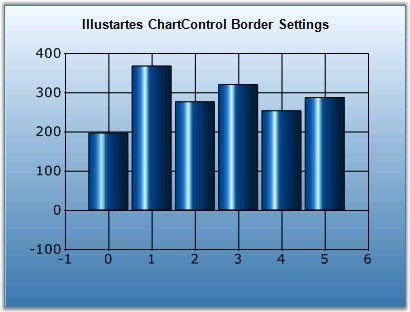
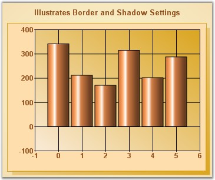

::: {style="DISPLAY: none"}
{#d2h_url_template}{#d2h_package_url style="WIDTH: 0px; DISPLAY: none; HEIGHT: 0px"}
:::

::::: {#nsbanner .d2h_main_nsbanner style="BORDER-BOTTOM: #999999 1px solid; POSITION: relative; PADDING-BOTTOM: 0px; BACKGROUND-COLOR: transparent; PADDING-LEFT: 0px; PADDING-RIGHT: 0px; DISPLAY: none; BORDER-TOP: #999999 1px solid; PADDING-TOP: 0px; LEFT: 0px"}
:::: {#TitleRow .d2h_main_titlerow style="PADDING-BOTTOM: 4px; BACKGROUND-COLOR: transparent; PADDING-LEFT: 22px; WIDTH: 100%; PADDING-RIGHT: 10px; DISPLAY: none; PADDING-TOP: 4px"}
::: {#ienav .d2h_main_ienav style="DISPLAY: none"}
{#D2HPrevious .D2HPreviousEnabled}  {#D2HNext .D2HNextEnabled}
:::
::::
:::::

::::::::: {#nstext .d2h_main_nstext style="PADDING-BOTTOM: 10px; BACKGROUND-COLOR: transparent; PADDING-LEFT: 22px; PADDING-RIGHT: 10px; HEIGHT: 100%; OVERFLOW: auto; PADDING-TOP: 5px" hasuserbackground="true" valign="bottom"}
::: {#d2h_breadcrumbs .d2h_breadcrumbs}
[Essential Studio User Guide Documentation](ms-xhelp:///?Id=12457748-09e3-4d74-a240-8e049cedf030){.d2h_breadcrumbsNormal}[ \> ]{.d2h_breadcrumbsLinkSeparator}[User Interface Edition](ms-xhelp:///?Id=c29296b7-531c-413b-a0ec-488ca1f7f669){.d2h_breadcrumbsNormal}[ \> ]{.d2h_breadcrumbsLinkSeparator}[Essential ASP.NET](ms-xhelp:///?Id=25c35330-c127-4dad-9a92-ed79dc7261a6){.d2h_breadcrumbsNormal}[ \> ]{.d2h_breadcrumbsLinkSeparator}[Essential Chart]{.d2h_breadcrumbsContentsOnly}[ \> ]{.d2h_breadcrumbsLinkSeparator}[Concepts and Features](ms-xhelp:///?Id=100687ce-82f2-4424-9d16-0949ea76cf15){.d2h_breadcrumbsNormal}[ \> ]{.d2h_breadcrumbsLinkSeparator}[Chart Appearance](ms-xhelp:///?Id=ffd49f03-f677-452a-81e4-aa2f18f1b9a0){.d2h_breadcrumbsNormal}
:::

### Border and Margins {#border-and-margins style="tab-stops: 0pt"}

**[]{style="FONT-FAMILY: 'Trebuchet MS','sans-serif'; FONT-SIZE: 9pt"}** 

Chart Area Border

**[]{style="FONT-FAMILY: 'Trebuchet MS','sans-serif'"}** 

Borders of the chart area can be customized using the below border properties.

[]{style="FONT-FAMILY: 'Trebuchet MS','sans-serif'; FONT-SIZE: 9pt"} 

::: {align="center"}
  ---------------------- ------------------------------------------------------------------------------------------------------------------------------------------
  ChartArea Properties   Description
  BorderColor            Indicates the border color of the chart area.
  BorderStyle            Indicates the border style.
  BorderWidth            Specifies the width of the border.
  **BorderAppearance**    
  BaseColor              Gets or sets the color of the base.
  FrameThickness         Gets or sets the frame thickness. This property setting will be effective, when SkinStyle is **Frame**.
  Interior               Sets the interior color of the border. This property settings will be effective when SkinStyle is **Sunken**, **Etched** and **Raised**.
  SkinStyle              Specifies the border skin style.
  ---------------------- ------------------------------------------------------------------------------------------------------------------------------------------
:::

[]{style="FONT-FAMILY: 'Trebuchet MS','sans-serif'; FONT-SIZE: 9pt"} 

+-----------------------------------------------------------------------------------------------------------------------------------------------------------------------------------------------------------------------------------------------------------------------+
| **[\[C#\]]{style="FONT-FAMILY: 'Courier New'; COLOR: black"}**                                                                                                                                                                                                        |
|                                                                                                                                                                                                                                                                       |
| **[]{style="FONT-FAMILY: 'Courier New'; COLOR: black"}**                                                                                                                                                                                                              |
|                                                                                                                                                                                                                                                                       |
| [this]{style="FONT-FAMILY: 'Courier New'; COLOR: blue"}[.ChartWebControl1.ChartArea.BorderColor = System.Drawing.[Color]{style="COLOR: teal"}.Goldenrod;]{style="FONT-FAMILY: 'Courier New'"}                                                                         |
|                                                                                                                                                                                                                                                                       |
| [this]{style="FONT-FAMILY: 'Courier New'; COLOR: blue"}[.ChartWebControl1.ChartArea.BorderStyle = System.Windows.Forms.[BorderStyle]{style="COLOR: black"}.FixedSingle;]{style="FONT-FAMILY: 'Courier New'"}                                                          |
|                                                                                                                                                                                                                                                                       |
| [this]{style="FONT-FAMILY: 'Courier New'; COLOR: blue"}[.ChartWebControl1.ChartArea.BorderWidth = 1;]{style="FONT-FAMILY: 'Courier New'"}                                                                                                                             |
|                                                                                                                                                                                                                                                                       |
| []{style="FONT-FAMILY: 'Courier New'"}                                                                                                                                                                                                                                |
|                                                                                                                                                                                                                                                                       |
| [this]{style="FONT-FAMILY: 'Courier New'; COLOR: blue"}[.ChartWebControl1.BorderAppearance.BaseColor = System.Drawing.[Color]{style="COLOR: teal"}.DarkGray;]{style="FONT-FAMILY: 'Courier New'"}                                                                     |
|                                                                                                                                                                                                                                                                       |
| [//This property setting will be effective, when SkinStyle is \'Frame\'.]{style="FONT-FAMILY: 'Courier New'; COLOR: green"}                                                                                                                                           |
|                                                                                                                                                                                                                                                                       |
| [this]{style="FONT-FAMILY: 'Courier New'; COLOR: blue"}[.ChartWebControl1.BorderAppearance.FrameThickness = [new]{style="COLOR: blue"} Syncfusion.Windows.Forms.Chart.[ChartThickness]{style="COLOR: teal"}(15F, 30F, 15F, 18F);]{style="FONT-FAMILY: 'Courier New'"} |
|                                                                                                                                                                                                                                                                       |
| [//This interior property settings will be effective when SkinStyle is Sunken, Etched and Raised.]{style="FONT-FAMILY: 'Courier New'; COLOR: green"}                                                                                                                  |
|                                                                                                                                                                                                                                                                       |
| [this]{style="FONT-FAMILY: 'Courier New'; COLOR: blue"}[.ChartWebControl1.BorderAppearance.Interior.ForeColor = System.Drawing.[Color]{style="COLOR: teal"}.Maroon;]{style="FONT-FAMILY: 'Courier New'"}                                                              |
|                                                                                                                                                                                                                                                                       |
| [this]{style="FONT-FAMILY: 'Courier New'; COLOR: blue"}[.ChartWebControl1.BorderAppearance.SkinStyle = Syncfusion.Windows.Forms.Chart.[ChartBorderSkinStyle]{style="COLOR: teal"}.Raised;]{style="FONT-FAMILY: 'Courier New'"}                                        |
+-----------------------------------------------------------------------------------------------------------------------------------------------------------------------------------------------------------------------------------------------------------------------+

[]{style="FONT-FAMILY: 'Trebuchet MS','sans-serif'; FONT-SIZE: 9pt"} 

+----------------------------------------------------------------------------------------------------------------------------------------------------------------------------------------------------------------------------------------------+
| **[\[VB.NET\]]{style="FONT-FAMILY: 'Courier New'; COLOR: black"}**                                                                                                                                                                           |
|                                                                                                                                                                                                                                              |
| **[]{style="FONT-FAMILY: 'Courier New'; COLOR: black"}**                                                                                                                                                                                     |
|                                                                                                                                                                                                                                              |
| [Me]{style="FONT-FAMILY: 'Courier New'; COLOR: blue"}[.ChartWebControl1.ChartArea.BorderColor = System.Drawing.[Color]{style="COLOR: teal"}.Goldenrod]{style="FONT-FAMILY: 'Courier New'"}                                                   |
|                                                                                                                                                                                                                                              |
| [Me]{style="FONT-FAMILY: 'Courier New'; COLOR: blue"}[.ChartWebControl1.ChartArea.BorderStyle = System.Windows.Forms.BorderStyle.FixedSingle]{style="FONT-FAMILY: 'Courier New'"}                                                            |
|                                                                                                                                                                                                                                              |
| [Me]{style="FONT-FAMILY: 'Courier New'; COLOR: blue"}[.ChartWebControl1.ChartArea.BorderWidth = 1]{style="FONT-FAMILY: 'Courier New'"}                                                                                                       |
|                                                                                                                                                                                                                                              |
| []{style="FONT-FAMILY: 'Courier New'"}                                                                                                                                                                                                       |
|                                                                                                                                                                                                                                              |
| [Me]{style="FONT-FAMILY: 'Courier New'; COLOR: blue"}[.ChartWebControl1.BorderAppearance.BaseColor = System.Drawing.Color.DarkGray ]{style="FONT-FAMILY: 'Courier New'"}                                                                     |
|                                                                                                                                                                                                                                              |
| [\'This property setting will be effective, when SkinStyle is \'Frame\'. ]{style="FONT-FAMILY: 'Courier New'; COLOR: green"}                                                                                                                 |
|                                                                                                                                                                                                                                              |
| [Me]{style="FONT-FAMILY: 'Courier New'; COLOR: blue"}[.ChartWebControl1.BorderAppearance.FrameThickness = [New]{style="COLOR: blue"} Syncfusion.Windows.Forms.Chart.ChartThickness(15F, 30F, 15F, 18F) ]{style="FONT-FAMILY: 'Courier New'"} |
|                                                                                                                                                                                                                                              |
| [\'This interior property settings will be effective when SkinStyle is Sunken, Etched and Raised. ]{style="FONT-FAMILY: 'Courier New'; COLOR: green"}                                                                                        |
|                                                                                                                                                                                                                                              |
| [Me]{style="FONT-FAMILY: 'Courier New'; COLOR: blue"}[.ChartWebControl1.BorderAppearance.Interior.ForeColor = System.Drawing.Color.Maroon ]{style="FONT-FAMILY: 'Courier New'"}                                                              |
|                                                                                                                                                                                                                                              |
| [Me]{style="FONT-FAMILY: 'Courier New'; COLOR: blue"}[.ChartWebControl1.BorderAppearance.SkinStyle = Syncfusion.Windows.Forms.Chart.ChartBorderSkinStyle.Raised ]{style="FONT-FAMILY: 'Courier New'"}                                        |
+----------------------------------------------------------------------------------------------------------------------------------------------------------------------------------------------------------------------------------------------+

[]{style="FONT-FAMILY: 'Trebuchet MS','sans-serif'; FONT-SIZE: 9pt"} 

{border="0"}

**[]{style="FONT-FAMILY: 'Trebuchet MS','sans-serif'; FONT-SIZE: 9pt"}** 

Figure 299: Chart with BorderStyle = \"Double\", BorderWidth = \"1px\", BorderColor = \"SteelBlue\"

[]{style="FONT-FAMILY: 'Trebuchet MS','sans-serif'; FONT-SIZE: 9pt"} 

Chart Area Shadow

**[]{style="FONT-FAMILY: 'Trebuchet MS','sans-serif'"}** 

The chart area can also be rendered with a shadow. Turn this feature on, by enabling the **ChartAreaShadow** property.

**[]{style="FONT-FAMILY: 'Trebuchet MS','sans-serif'"}** 

::: {align="center"}
  -------------------------- --------------------------------------------
  Chart Control Properties   Description
  ChartAreaShadow            Indicates whether chart area has a shadow.
  ShadowColor                Specifies the color of the shadow.
  ShadowWidth                Specifies the width of the shadow.
  -------------------------- --------------------------------------------
:::

**[\
\
]{style="FONT-FAMILY: 'Trebuchet MS','sans-serif'"}**

+--------------------------------------------------------------------------------------------------------------------------------------------------------------------------------------------------------------------------------------------------------------------------------------------------------------------------------------------------------------------------------------------------------+
| **[\[C#\]]{style="FONT-FAMILY: 'Courier New'; COLOR: black"}**                                                                                                                                                                                                                                                                                                                                         |
|                                                                                                                                                                                                                                                                                                                                                                                                        |
| **[]{style="FONT-FAMILY: 'Courier New'; COLOR: black"}**                                                                                                                                                                                                                                                                                                                                               |
|                                                                                                                                                                                                                                                                                                                                                                                                        |
| [this]{style="FONT-FAMILY: 'Courier New'; COLOR: blue"}[.ChartWebControl1.ChartAreaShadow = [true]{style="COLOR: blue"};]{style="FONT-FAMILY: 'Courier New'"}                                                                                                                                                                                                                                          |
|                                                                                                                                                                                                                                                                                                                                                                                                        |
| [this]{style="FONT-FAMILY: 'Courier New'; COLOR: blue"}[.ChartWebControl1.ShadowColor = [new]{style="COLOR: blue"} Syncfusion.Drawing.[BrushInfo]{style="COLOR: teal"}(Syncfusion.Drawing.[GradientStyle]{style="COLOR: teal"}.ForwardDiagonal, System.Drawing.[Color]{style="COLOR: teal"}.AntiqueWhite, System.Drawing.[Color]{style="COLOR: teal"}.Goldenrod);]{style="FONT-FAMILY: 'Courier New'"} |
|                                                                                                                                                                                                                                                                                                                                                                                                        |
| [this]{style="FONT-FAMILY: 'Courier New'; COLOR: blue"}[.ChartWebControl1.ShadowWidth = 7;]{style="FONT-FAMILY: 'Courier New'"}                                                                                                                                                                                                                                                                        |
+--------------------------------------------------------------------------------------------------------------------------------------------------------------------------------------------------------------------------------------------------------------------------------------------------------------------------------------------------------------------------------------------------------+

[]{style="FONT-FAMILY: 'Trebuchet MS','sans-serif'; FONT-SIZE: 9pt"} 

+------------------------------------------------------------------------------------------------------------------------------------------------------------------------------------------------------------------------------------------------------------------------------------------------------------------------------------------------------------------------------+
| **[\[VB.NET\]]{style="FONT-FAMILY: 'Courier New'; COLOR: black"}**                                                                                                                                                                                                                                                                                                           |
|                                                                                                                                                                                                                                                                                                                                                                              |
| **[]{style="FONT-FAMILY: 'Courier New'; COLOR: black"}**                                                                                                                                                                                                                                                                                                                     |
|                                                                                                                                                                                                                                                                                                                                                                              |
| [Me]{style="FONT-FAMILY: 'Courier New'; COLOR: blue"}[.ChartWebControl1.ChartAreaShadow = [True]{style="COLOR: blue"}]{style="FONT-FAMILY: 'Courier New'"}                                                                                                                                                                                                                   |
|                                                                                                                                                                                                                                                                                                                                                                              |
| [Me]{style="FONT-FAMILY: 'Courier New'; COLOR: blue"}[.ChartWebControl1.ShadowColor = [New]{style="COLOR: blue"} Syncfusion.Drawing.BrushInfo(Syncfusion.Drawing.[GradientStyle]{style="COLOR: teal"}.ForwardDiagonal, System.Drawing.[Color]{style="COLOR: teal"}.AntiqueWhite, System.Drawing.[Color]{style="COLOR: teal"}.Goldenrod)]{style="FONT-FAMILY: 'Courier New'"} |
|                                                                                                                                                                                                                                                                                                                                                                              |
| [Me]{style="FONT-FAMILY: 'Courier New'; COLOR: blue"}[.ChartWebControl1.ShadowWidth = 7]{style="FONT-FAMILY: 'Courier New'"}                                                                                                                                                                                                                                                 |
+------------------------------------------------------------------------------------------------------------------------------------------------------------------------------------------------------------------------------------------------------------------------------------------------------------------------------------------------------------------------------+

[]{style="COLOR: red; FONT-SIZE: 8pt"} 

{border="0"}

***[]{style="FONT-FAMILY: 'Trebuchet MS','sans-serif'; FONT-SIZE: 9pt"}*** 

Figure 300: Chart Area Shadow Settings

**[]{style="FONT-FAMILY: 'Trebuchet MS','sans-serif'"}** 

Chart Area Margins

**[]{style="FONT-FAMILY: 'Trebuchet MS','sans-serif'"}** 

Margin for the chart area can be controlled using **ChartAreaMargins** property. It indicates the margin that will be deduced from Chart Area\'s representation rectangle.

[]{style="FONT-FAMILY: 'Trebuchet MS','sans-serif'; FONT-SIZE: 9pt"} 

::: {align="center"}
+-----------------------------------+---------------------------------------------------------------------------------------+
| Chart Control Properties          | Description                                                                           |
+-----------------------------------+---------------------------------------------------------------------------------------+
| ChartAreaMargins                  | Specifies the amount of pixels between the chart area border and the chart plot area. |
|                                   |                                                                                       |
|                                   |                                                                                       |
|                                   |                                                                                       |
|                                   | Default is **{10, 10, 10, 10}**.                                                      |
+-----------------------------------+---------------------------------------------------------------------------------------+
:::

[]{style="FONT-FAMILY: 'Trebuchet MS','sans-serif'; FONT-SIZE: 9pt"} 

+--------------------------------------------------------------------------------------------------------------------------------------------------------------------------------------------------------------------------------------------------+
| **[\[C#\]]{style="FONT-FAMILY: 'Courier New'; COLOR: black"}**                                                                                                                                                                                   |
|                                                                                                                                                                                                                                                  |
| **[]{style="FONT-FAMILY: 'Courier New'; COLOR: black"}**                                                                                                                                                                                         |
|                                                                                                                                                                                                                                                  |
| [this]{style="FONT-FAMILY: 'Courier New'; COLOR: blue"}[.ChartWebControl1.ChartAreaMargins = [new]{style="COLOR: blue"} Syncfusion.Windows.Forms.Chart.[ChartMargins]{style="COLOR: teal"}(10, 10, 10, 20);]{style="FONT-FAMILY: 'Courier New'"} |
+--------------------------------------------------------------------------------------------------------------------------------------------------------------------------------------------------------------------------------------------------+

[]{style="FONT-FAMILY: 'Trebuchet MS','sans-serif'; FONT-SIZE: 9pt"} 

+------------------------------------------------------------------------------------------------------------------------------------------------------------------------------------------------------------------------+
| **[\[VB.NET\]]{style="FONT-FAMILY: 'Courier New'; COLOR: black"}**                                                                                                                                                     |
|                                                                                                                                                                                                                        |
| **[]{style="FONT-FAMILY: 'Courier New'; COLOR: black"}**                                                                                                                                                               |
|                                                                                                                                                                                                                        |
| [Me]{style="FONT-FAMILY: 'Courier New'; COLOR: blue"}[.ChartWebControl1.ChartAreaMargins = [New]{style="COLOR: blue"} Syncfusion.Windows.Forms.Chart.ChartMargins(10, 10, 10, 20)]{style="FONT-FAMILY: 'Courier New'"} |
+------------------------------------------------------------------------------------------------------------------------------------------------------------------------------------------------------------------------+

**[]{style="FONT-FAMILY: 'Trebuchet MS','sans-serif'; FONT-SIZE: 9pt"}** 

ChartPlot Area Margins

**[]{style="FONT-FAMILY: 'Trebuchet MS','sans-serif'; FONT-SIZE: 9pt"}** 

The margins for ChartPlotArea is specified in **ChartPlotAreaMargins** property.

[]{style="FONT-FAMILY: 'Trebuchet MS','sans-serif'; FONT-SIZE: 9pt"} 

::: {align="center"}
+-----------------------------------+-----------------------------------------------------------------------------------------------------------------------------------------------------------------------------------------------------------+
| ChartControl Properties           | Description                                                                                                                                                                                               |
+-----------------------------------+-----------------------------------------------------------------------------------------------------------------------------------------------------------------------------------------------------------+
| ChartPlotAreaMargins              | Indicates the margin of the axis labels. This  margin is supported for left, Top, Right and Bottom side of the chart. This property works only if **EdgeLabelsDrawingMode** property is set to **Shift**. |
|                                   |                                                                                                                                                                                                           |
|                                   |                                                                                                                                                                                                           |
|                                   |                                                                                                                                                                                                           |
|                                   | Default is **{10, 10, 10, 10}**.                                                                                                                                                                          |
+-----------------------------------+-----------------------------------------------------------------------------------------------------------------------------------------------------------------------------------------------------------+
| AdjustPlotAreaMargins             | Gets / sets the mode of drawing the edge labels. Default is **AutoSet**.                                                                                                                                  |
+-----------------------------------+-----------------------------------------------------------------------------------------------------------------------------------------------------------------------------------------------------------+
| EdgeLabelsDrawingMode             | Gets or sets the edge labels drawing mode.                                                                                                                                                                |
+-----------------------------------+-----------------------------------------------------------------------------------------------------------------------------------------------------------------------------------------------------------+
:::

**[]{style="FONT-FAMILY: 'Trebuchet MS','sans-serif'"}** 

+-------------------------------------------------------------------------------------------------------------------------------------------------------------------------------------------------------------------------------------------------+
| **[\[C#\]]{style="FONT-FAMILY: 'Courier New'; COLOR: black"}**                                                                                                                                                                                  |
|                                                                                                                                                                                                                                                 |
| **[]{style="FONT-FAMILY: 'Courier New'; COLOR: black"}**                                                                                                                                                                                        |
|                                                                                                                                                                                                                                                 |
| [this]{style="FONT-FAMILY: 'Courier New'; COLOR: blue"}[.ChartWebControl1.PrimaryYAxis.EdgeLabelsDrawingMode = Syncfusion.Windows.Forms.Chart.[ChartAxisEdgeLabelsDrawingMode]{style="COLOR: teal"}.Shift;]{style="FONT-FAMILY: 'Courier New'"} |
|                                                                                                                                                                                                                                                 |
| [this]{style="FONT-FAMILY: 'Courier New'; COLOR: blue"}[.ChartWebControl1.ChartArea.AdjustPlotAreaMargins = Syncfusion.Windows.Forms.Chart.[ChartSetMode]{style="COLOR: teal"}.UserSet;]{style="FONT-FAMILY: 'Courier New'"}                    |
|                                                                                                                                                                                                                                                 |
| [this]{style="FONT-FAMILY: 'Courier New'; COLOR: blue"}[.ChartWebControl1.ChartArea.ChartPlotAreaMargins.Left = 200;]{style="FONT-FAMILY: 'Courier New'"}                                                                                       |
+-------------------------------------------------------------------------------------------------------------------------------------------------------------------------------------------------------------------------------------------------+

[]{style="FONT-FAMILY: 'Trebuchet MS','sans-serif'; FONT-SIZE: 9pt"} 

+-----------------------------------------------------------------------------------------------------------------------------------------------------------------------------------------------------------------------------------------------+
| **[\[VB.NET\]]{style="FONT-FAMILY: 'Courier New'; COLOR: black"}**                                                                                                                                                                            |
|                                                                                                                                                                                                                                               |
| **[]{style="FONT-FAMILY: 'Courier New'; COLOR: black"}**                                                                                                                                                                                      |
|                                                                                                                                                                                                                                               |
| [Me]{style="FONT-FAMILY: 'Courier New'; COLOR: blue"}[.ChartWebControl1.PrimaryYAxis.EdgeLabelsDrawingMode = Syncfusion.Windows.Forms.Chart.[ChartAxisEdgeLabelsDrawingMode]{style="COLOR: black"}.Shift]{style="FONT-FAMILY: 'Courier New'"} |
|                                                                                                                                                                                                                                               |
| [Me]{style="FONT-FAMILY: 'Courier New'; COLOR: blue"}[.ChartWebControl1.ChartArea.AdjustPlotAreaMargins = Syncfusion.Windows.Forms.Chart.[ChartSetMode]{style="COLOR: black"}.UserSet]{style="FONT-FAMILY: 'Courier New'"}                    |
|                                                                                                                                                                                                                                               |
| [Me]{style="FONT-FAMILY: 'Courier New'; COLOR: blue"}[.ChartWebControl1.ChartArea.ChartPlotAreaMargins.Left = 200]{style="FONT-FAMILY: 'Courier New'"}                                                                                        |
+-----------------------------------------------------------------------------------------------------------------------------------------------------------------------------------------------------------------------------------------------+

**[]{style="FONT-FAMILY: 'Trebuchet MS','sans-serif'; FONT-SIZE: 9pt"}** 

Spacing between elements

**[]{style="FONT-FAMILY: 'Trebuchet MS','sans-serif'; FONT-SIZE: 9pt"}** 

The spacing between elements in the chart is specified using the **ElementsSpacing** property. For example, the space between the chart right border and legend right border if **LegendPosition** is set to **Right**.

[]{style="FONT-FAMILY: 'Trebuchet MS','sans-serif'; FONT-SIZE: 9pt"} 

::: {align="center"}
+-----------------------------------+-----------------------------------------------------------------------------+
|                                   |                                                                             |
|                                   |                                                                             |
| Chart Control Properties          | Description                                                                 |
+-----------------------------------+-----------------------------------------------------------------------------+
|                                   |                                                                             |
|                                   |                                                                             |
| ElementsSpacing                   | Specifies the spacing between the elements in the chart. Default is **20**. |
+-----------------------------------+-----------------------------------------------------------------------------+
:::

[]{#p208} 

[]{#related-topics}
:::::::::
