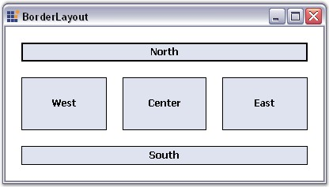

::: {style="DISPLAY: none"}
{#d2h_url_template}{#d2h_package_url style="WIDTH: 0px; DISPLAY: none; HEIGHT: 0px"}
:::

:::: {.d2h_secondary_topic style="PADDING-BOTTOM: 10pt; MARGIN: 0pt; PADDING-LEFT: 0pt; PADDING-RIGHT: 0pt; PADDING-TOP: 0pt"}
#### BorderLayout {#borderlayout style="tab-stops: 0pt"}

[]{style="COLOR: #15428b"} 

**BorderLayout** is a Layout Manager which allows the user to arrange and layout the Child controls along the borders and at the center, just like the .NET framework\'s built-in docking support.

[]{style="COLOR: #15428b"} 

{border="0"}

[]{style="COLOR: #15428b"} 

Figure 656: Buttons aligned along the Borders using BorderLayout

[]{style="COLOR: #15428b"} 

::: {style="BORDER-BOTTOM: windowtext 1pt solid; BORDER-LEFT: medium none; PADDING-BOTTOM: 1pt; MARGIN-TOP: 9pt; PADDING-LEFT: 0pt; PADDING-RIGHT: 0pt; MARGIN-BOTTOM: 9pt; BORDER-TOP: windowtext 1pt solid; BORDER-RIGHT: medium none; PADDING-TOP: 1pt"}
{border="0"} Note: BorderLayout does not arrange the Child components automatically like the other Layout Managers.
:::

[]{style="COLOR: #15428b"} 

A sample which demonstrates the BorderLayout is available in the below sample installation path.

 

..My Documents\\Syncfusion\\EssentialStudio\\Version Number\\Windows\\Tools.Windows\\Samples\\2.0\\Layout Manager Package\\LayoutManagers

 

See Also

[]{style="COLOR: black"} 

[Creating a Simple Layout]{.UGHyperlink}[, ]{.UGHyperlink}

More:

[ ]{#related-topics}

[{border="0" align="absMiddle"}Configuring BorderLayout](ms-xhelp:///?Id=02f58441-2b7c-4b1a-9a0b-518c28e79467){style="TEXT-DECORATION: none"}

[{border="0" align="absMiddle"}Configuring Child Controls](ms-xhelp:///?Id=6cc79436-3bd4-4969-906d-c7fade40f987){style="TEXT-DECORATION: none"}
::::
