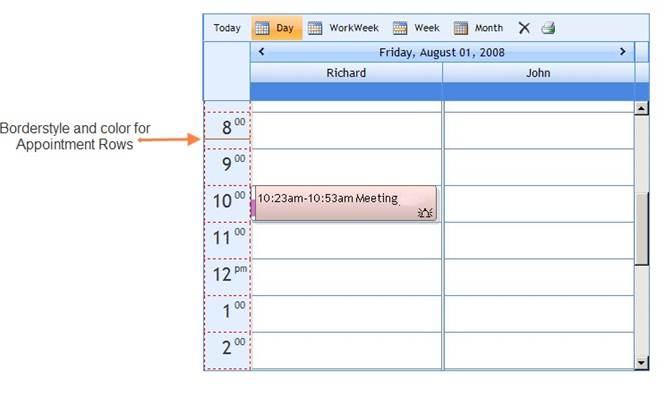

::: {style="DISPLAY: none"}
{#d2h_url_template}{#d2h_package_url style="WIDTH: 0px; DISPLAY: none; HEIGHT: 0px"}
:::

:::: {.d2h_secondary_topic style="PADDING-BOTTOM: 10pt; MARGIN: 0pt; PADDING-LEFT: 0pt; PADDING-RIGHT: 0pt; PADDING-TOP: 0pt"}
#### Border Settings {#border-settings style="tab-stops: 0pt"}

[]{style="FONT-FAMILY: 'Trebuchet MS','sans-serif'; COLOR: #15428b; FONT-SIZE: 9pt"} 

This section discusses the border settings available for an appointment row.

[]{style="FONT-FAMILY: 'Trebuchet MS','sans-serif'; COLOR: #15428b; FONT-SIZE: 9pt"} 

Border Style and Color

[]{style="FONT-FAMILY: 'Trebuchet MS','sans-serif'; COLOR: #15428b; FONT-SIZE: 9pt"} 

The border style and color for an appointment row can be set by using the below given properties.

[]{style="FONT-FAMILY: 'Trebuchet MS','sans-serif'; COLOR: #15428b; FONT-SIZE: 9pt"} 

::: {align="center"}
+-----------------------------------+---------------------------------------------------------------------------------------+
|                                   |                                                                                       |
|                                   |                                                                                       |
| Schedule Property                 | Description                                                                           |
+-----------------------------------+---------------------------------------------------------------------------------------+
|                                   |                                                                                       |
|                                   |                                                                                       |
| AppointmentRowBorderStyle         | Specifies the border style of appointments rows. The options included are as follows: |
|                                   |                                                                                       |
|                                   | [·      ]{style="FONT-FAMILY: Symbol"}NotSet                                          |
|                                   |                                                                                       |
|                                   | [·      ]{style="FONT-FAMILY: Symbol"}None                                            |
|                                   |                                                                                       |
|                                   | [·      ]{style="FONT-FAMILY: Symbol"}Dotted                                          |
|                                   |                                                                                       |
|                                   | [·      ]{style="FONT-FAMILY: Symbol"}Dashed                                          |
|                                   |                                                                                       |
|                                   | [·      ]{style="FONT-FAMILY: Symbol"}Solid                                           |
|                                   |                                                                                       |
|                                   | [·      ]{style="FONT-FAMILY: Symbol"}Double                                          |
|                                   |                                                                                       |
|                                   | [·      ]{style="FONT-FAMILY: Symbol"}Groove                                          |
|                                   |                                                                                       |
|                                   | [·      ]{style="FONT-FAMILY: Symbol"}Ridge                                           |
|                                   |                                                                                       |
|                                   | [·      ]{style="FONT-FAMILY: Symbol"}Inset                                           |
|                                   |                                                                                       |
|                                   | [·      ]{style="FONT-FAMILY: Symbol"}Outset                                          |
+-----------------------------------+---------------------------------------------------------------------------------------+
|                                   |                                                                                       |
|                                   |                                                                                       |
| AppointmentRowBorderColor         | Specifies the border color of appointments rows.                                      |
+-----------------------------------+---------------------------------------------------------------------------------------+
:::

[]{style="FONT-FAMILY: 'Trebuchet MS','sans-serif'; COLOR: #15428b; FONT-SIZE: 9pt"} 

+------------------------------------------------------------------------------------------------------------------------------------------------------------------------------------------------------------------------------------------------------------------------------------------------------------------------------------------------------------------------------------------------------------------------------------------------------------------------------------------------------------------------------------------------------------------------------+
| **[\[ASPX\]]{style="FONT-FAMILY: 'Courier New'"}**                                                                                                                                                                                                                                                                                                                                                                                                                                                                                                                           |
|                                                                                                                                                                                                                                                                                                                                                                                                                                                                                                                                                                              |
| []{style="FONT-FAMILY: 'Courier New'"}                                                                                                                                                                                                                                                                                                                                                                                                                                                                                                                                       |
|                                                                                                                                                                                                                                                                                                                                                                                                                                                                                                                                                                              |
| [\<]{style="FONT-FAMILY: 'Courier New'; COLOR: blue"}[Syncfusion]{style="FONT-FAMILY: 'Courier New'; COLOR: #a31515"}[:]{style="FONT-FAMILY: 'Courier New'; COLOR: blue"}[schedule]{style="FONT-FAMILY: 'Courier New'; COLOR: #a31515"}[ [id]{style="COLOR: red"}[=\"Schedule1\"]{style="COLOR: blue"} [runat]{style="COLOR: red"}[=\"server\"]{style="COLOR: blue"} [AppointmentRowBorderColor]{style="COLOR: red"}[=\"Red\"]{style="COLOR: blue"} [AppointmentRowBorderStyle]{style="COLOR: red"}[=\"Dashed\"\>]{style="COLOR: blue"}]{style="FONT-FAMILY: 'Courier New'"} |
|                                                                                                                                                                                                                                                                                                                                                                                                                                                                                                                                                                              |
| [\</]{style="FONT-FAMILY: 'Courier New'; COLOR: blue"}[Syncfusion]{style="FONT-FAMILY: 'Courier New'; COLOR: #a31515"}[:]{style="FONT-FAMILY: 'Courier New'; COLOR: blue"}[schedule]{style="FONT-FAMILY: 'Courier New'; COLOR: #a31515"}[\>]{style="FONT-FAMILY: 'Courier New'; COLOR: blue"}                                                                                                                                                                                                                                                                                |
+------------------------------------------------------------------------------------------------------------------------------------------------------------------------------------------------------------------------------------------------------------------------------------------------------------------------------------------------------------------------------------------------------------------------------------------------------------------------------------------------------------------------------------------------------------------------------+

[]{style="FONT-FAMILY: 'Trebuchet MS','sans-serif'; COLOR: #15428b; FONT-SIZE: 9pt"} 

+--------------------------------------------------------------------------------------------------------------------------------------+
| **[\[C#\]]{style="FONT-FAMILY: 'Courier New'"}**                                                                                     |
|                                                                                                                                      |
| []{style="FONT-FAMILY: 'Courier New'"}                                                                                               |
|                                                                                                                                      |
| [Schedule1.AppointmentRowBorderStyle = [BorderStyle]{style="COLOR: #2b91af"}.Dashed;]{style="FONT-FAMILY: 'Courier New'"}            |
|                                                                                                                                      |
| [Schedule1.AppointmentRowBorderColor = System.Drawing.[Color]{style="COLOR: #2b91af"}.DeepPink;]{style="FONT-FAMILY: 'Courier New'"} |
+--------------------------------------------------------------------------------------------------------------------------------------+

[]{style="FONT-FAMILY: 'Trebuchet MS','sans-serif'; COLOR: #15428b; FONT-SIZE: 9pt"} 

+----------------------------------------------------------------------------------------------------------------------------------------------------------------------+
| **[\[VB\]]{style="FONT-FAMILY: 'Courier New'"}**                                                                                                                     |
|                                                                                                                                                                      |
| []{style="FONT-FAMILY: 'Courier New'"}                                                                                                                               |
|                                                                                                                                                                      |
| [Private]{style="FONT-FAMILY: 'Courier New'; COLOR: blue"}[ Schedule1.AppointmentRowBorderStyle = BorderStyle.Dashed]{style="FONT-FAMILY: 'Courier New'"}            |
|                                                                                                                                                                      |
| [Private]{style="FONT-FAMILY: 'Courier New'; COLOR: blue"}[ Schedule1.AppointmentRowBorderColor = System.Drawing.Color.DeepPink]{style="FONT-FAMILY: 'Courier New'"} |
+----------------------------------------------------------------------------------------------------------------------------------------------------------------------+

[]{style="FONT-FAMILY: 'Trebuchet MS','sans-serif'; COLOR: #15428b; FONT-SIZE: 9pt"} 

{border="0"}[]{style="FONT-SIZE: 12pt"}

Figure 60[]{style="FONT-SIZE: 12pt"}

[]{#related-topics}
::::
