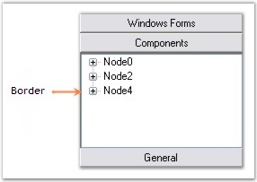
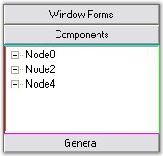

::: {style="DISPLAY: none"}
{#d2h_url_template}{#d2h_package_url style="WIDTH: 0px; DISPLAY: none; HEIGHT: 0px"}
:::

::::: {.d2h_secondary_topic style="PADDING-BOTTOM: 10pt; MARGIN: 0pt; PADDING-LEFT: 0pt; PADDING-RIGHT: 0pt; PADDING-TOP: 0pt"}
##### Border Settings {#border-settings style="tab-stops: 0pt"}

**[]{style="COLOR: #15428b"}** 

GroupBar Settings

[]{style="COLOR: #15428b"} 

The border style of the GroupBar can be set using the below given property.

[]{style="COLOR: #15428b"} 

::: {align="center"}
  ------------------- -------------------------------------------------------
  GroupBar Property   Description
  BorderStyle         Gets / sets the border style of the GroupBar control.
  ------------------- -------------------------------------------------------
:::

[]{style="COLOR: #15428b"} 

+----------------------------------------------------------------------------------------------------------------------------------------------------------------------------------------+
| **[\[C#\]]{style="FONT-FAMILY: 'Courier New'; COLOR: black"}**                                                                                                                         |
|                                                                                                                                                                                        |
| []{style="FONT-FAMILY: 'Courier New'; COLOR: black"}                                                                                                                                   |
|                                                                                                                                                                                        |
| [this]{style="FONT-FAMILY: 'Courier New'; COLOR: blue"}[.groupBar1.BorderStyle = System.Windows.Forms.[BorderStyle]{style="COLOR: teal"}.Fixed3D;]{style="FONT-FAMILY: 'Courier New'"} |
+----------------------------------------------------------------------------------------------------------------------------------------------------------------------------------------+

[]{style="COLOR: #4a5c8c; FONT-SIZE: 8pt"} 

+---------------------------------------------------------------------------------------------------------------------------------------------------------------------------------------------------------+
| **[\[VB.NET\]]{style="FONT-FAMILY: 'Courier New'; COLOR: black"}**                                                                                                                                      |
|                                                                                                                                                                                                         |
| []{style="FONT-FAMILY: 'Courier New'; COLOR: black"}                                                                                                                                                    |
|                                                                                                                                                                                                         |
| [Me]{style="FONT-FAMILY: 'Courier New'; COLOR: blue"}**[.]{style="COLOR: black"}**[groupBar1.BorderStyle = System.Windows.Forms.BorderStyle.Fixed3D ]{style="FONT-FAMILY: 'Courier New'; COLOR: black"} |
+---------------------------------------------------------------------------------------------------------------------------------------------------------------------------------------------------------+

[]{style="COLOR: #15428b"} 

{border="0"}[]{style="FONT-FAMILY: 'Calibri','sans-serif'; FONT-SIZE: 11pt"}

 

Figure 880: Border is drawn with BorderStyle = \"Fixed3D\"

[]{style="COLOR: #15428b"} 

GroupBar Item Client Area Border Settings

[]{style="COLOR: #4a5c8c; FONT-SIZE: 8pt"} 

The border of the GroupBar Item client area can be set and customized using the following properties.

[]{style="COLOR: #15428b"} 

::: {align="center"}
  -------------------- -----------------------------------------------------------------------------------------------------------------------------
  GroupBar Property    Description
  DrawClientBorder     Specifies whether a border is drawn around the GroupBar\'s client window.
  ClientBorderColors   Specifies the value which determines whether the border for the client area of the GroupBar control should be drawn or not.
  -------------------- -----------------------------------------------------------------------------------------------------------------------------
:::

[]{style="COLOR: #15428b"} 

+------------------------------------------------------------------------------------------------------------------------------------------------------------------------------------------------------------------------------------------------------------------------------------------------------------------------+
| **[\[C#\]]{style="FONT-FAMILY: 'Courier New'; COLOR: black"}**                                                                                                                                                                                                                                                         |
|                                                                                                                                                                                                                                                                                                                        |
| []{style="FONT-FAMILY: 'Courier New'; COLOR: black"}                                                                                                                                                                                                                                                                   |
|                                                                                                                                                                                                                                                                                                                        |
| [this]{style="FONT-FAMILY: 'Courier New'; COLOR: blue"}[.groupBar1.DrawClientBorder = [true]{style="COLOR: blue"};]{style="FONT-FAMILY: 'Courier New'"}                                                                                                                                                                |
|                                                                                                                                                                                                                                                                                                                        |
| [this]{style="FONT-FAMILY: 'Courier New'; COLOR: blue"}[.groupBarItem2.ClientBorderColors = [new]{style="COLOR: blue"} Syncfusion.Windows.Forms.Tools.BorderColors(System.Drawing.Color.Red, System.Drawing.Color.Aqua, System.Drawing.Color.Lime, System.Drawing.Color.Magenta);]{style="FONT-FAMILY: 'Courier New'"} |
+------------------------------------------------------------------------------------------------------------------------------------------------------------------------------------------------------------------------------------------------------------------------------------------------------------------------+

[]{style="COLOR: #4a5c8c; FONT-SIZE: 8pt"} 

+---------------------------------------------------------------------------------------------------------------------------------------------------------------------------------------------------------------------------------------------------------------------------------------------------------------------+
| **[\[VB.NET\]]{style="FONT-FAMILY: 'Courier New'; COLOR: black"}**                                                                                                                                                                                                                                                  |
|                                                                                                                                                                                                                                                                                                                     |
| []{style="FONT-FAMILY: 'Courier New'; COLOR: black"}                                                                                                                                                                                                                                                                |
|                                                                                                                                                                                                                                                                                                                     |
| [Me]{style="FONT-FAMILY: 'Courier New'; COLOR: blue"}[.groupBar1.DrawClientBorder = [True]{style="COLOR: blue"}]{style="FONT-FAMILY: 'Courier New'"}                                                                                                                                                                |
|                                                                                                                                                                                                                                                                                                                     |
| [Me]{style="FONT-FAMILY: 'Courier New'; COLOR: blue"}[.groupBarItem2.ClientBorderColors = [New]{style="COLOR: blue"} Syncfusion.Windows.Forms.Tools.BorderColors(System.Drawing.Color.Red, System.Drawing.Color.Aqua, System.Drawing.Color.Lime, System.Drawing.Color.Magenta)]{style="FONT-FAMILY: 'Courier New'"} |
+---------------------------------------------------------------------------------------------------------------------------------------------------------------------------------------------------------------------------------------------------------------------------------------------------------------------+

[]{style="COLOR: #15428b"} 

{border="0"}[]{style="FONT-FAMILY: 'Calibri','sans-serif'; FONT-SIZE: 11pt"}

 

Figure 881:GroupBar with ClientBorderColors = \"Red, Aqua, Lime, Magenta\"

 

 

 

[]{#p612} 

 

[]{#related-topics}
:::::
