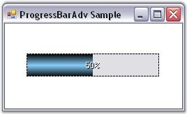

::: {style="DISPLAY: none"}
{#d2h_url_template}{#d2h_package_url style="WIDTH: 0px; DISPLAY: none; HEIGHT: 0px"}
:::

:::: {.d2h_secondary_topic style="PADDING-BOTTOM: 10pt; MARGIN: 0pt; PADDING-LEFT: 0pt; PADDING-RIGHT: 0pt; PADDING-TOP: 0pt"}
##### Border Settings {#border-settings style="MARGIN-LEFT: 18pt; tab-stops: 18.0pt"}

[]{style="COLOR: #15428b"} 

This section discusses the border settings of the ProgressBarAdv control.

[]{style="COLOR: #15428b"} 

::: {align="center"}
+-----------------------------------+---------------------------------------------------------------------------------------------------+
| ProgressBarAdv Property           | Description                                                                                       |
+-----------------------------------+---------------------------------------------------------------------------------------------------+
| Border3DStyle                     | Determines the style of the 3D border. It includes the following options.                         |
|                                   |                                                                                                   |
|                                   |                                                                                                   |
|                                   |                                                                                                   |
|                                   | [·      ]{style="FONT-FAMILY: Symbol"}*RaisedOuter,*                                              |
|                                   |                                                                                                   |
|                                   | [·      ]{style="FONT-FAMILY: Symbol"}*SunkenOuter,*                                              |
|                                   |                                                                                                   |
|                                   | [·      ]{style="FONT-FAMILY: Symbol"}*RaisedInner,*                                              |
|                                   |                                                                                                   |
|                                   | [·      ]{style="FONT-FAMILY: Symbol"}*Raised,*                                                   |
|                                   |                                                                                                   |
|                                   | [·      ]{style="FONT-FAMILY: Symbol"}*Etched,*                                                   |
|                                   |                                                                                                   |
|                                   | [·      ]{style="FONT-FAMILY: Symbol"}*SunkenInner,*                                              |
|                                   |                                                                                                   |
|                                   | [·      ]{style="FONT-FAMILY: Symbol"}*Bump,*                                                     |
|                                   |                                                                                                   |
|                                   | [·      ]{style="FONT-FAMILY: Symbol"}*Sunken,*                                                   |
|                                   |                                                                                                   |
|                                   | [·      ]{style="FONT-FAMILY: Symbol"}*Adjust and*                                                |
|                                   |                                                                                                   |
|                                   | [·      ]{style="FONT-FAMILY: Symbol"}*Flat.*                                                     |
+-----------------------------------+---------------------------------------------------------------------------------------------------+
| BorderColor                       | Indicates the color of the border.                                                                |
|                                   |                                                                                                   |
|                                   |                                                                                                   |
|                                   |                                                                                                   |
|                                   | This will be applied to the control only when the BorderStyle property is set to \'FixedSingle\'. |
+-----------------------------------+---------------------------------------------------------------------------------------------------+
| BorderSingle                      | Determines the style of the 2D border. The options included are as follows.                       |
|                                   |                                                                                                   |
|                                   |                                                                                                   |
|                                   |                                                                                                   |
|                                   | [·      ]{style="FONT-FAMILY: Symbol"}Dashed,                                                     |
|                                   |                                                                                                   |
|                                   | [·      ]{style="FONT-FAMILY: Symbol"}Dotted,                                                     |
|                                   |                                                                                                   |
|                                   | [·      ]{style="FONT-FAMILY: Symbol"}Solid,                                                      |
|                                   |                                                                                                   |
|                                   | [·      ]{style="FONT-FAMILY: Symbol"}Inset,                                                      |
|                                   |                                                                                                   |
|                                   | [·      ]{style="FONT-FAMILY: Symbol"}Outset and                                                  |
|                                   |                                                                                                   |
|                                   | [·      ]{style="FONT-FAMILY: Symbol"}None.                                                       |
+-----------------------------------+---------------------------------------------------------------------------------------------------+
| BorderStyle                       | Determines the style of the border. It includes the following options.                            |
|                                   |                                                                                                   |
|                                   |                                                                                                   |
|                                   |                                                                                                   |
|                                   | [·      ]{style="FONT-FAMILY: Symbol"}FixedSingle,                                                |
|                                   |                                                                                                   |
|                                   | [·      ]{style="FONT-FAMILY: Symbol"}Fixed3D and                                                 |
|                                   |                                                                                                   |
|                                   | [·      ]{style="FONT-FAMILY: Symbol"}None.                                                       |
+-----------------------------------+---------------------------------------------------------------------------------------------------+
:::

[]{style="COLOR: #15428b"} 

+------------------------------------------------------------------------------------------------------------------------------------------------------------------------------------------------------+
| **[\[C#\]]{style="FONT-FAMILY: 'Courier New'; COLOR: black"}**                                                                                                                                       |
|                                                                                                                                                                                                      |
| []{style="FONT-FAMILY: 'Courier New'; COLOR: green"}                                                                                                                                                 |
|                                                                                                                                                                                                      |
| [this]{style="FONT-FAMILY: 'Courier New'; COLOR: blue"}[.progressBarAdv1.Border3DStyle = System.Windows.Forms.[Border3DStyle]{style="COLOR: teal"}.RaisedOuter;]{style="FONT-FAMILY: 'Courier New'"} |
|                                                                                                                                                                                                      |
| [this]{style="FONT-FAMILY: 'Courier New'; COLOR: blue"}[.progressBarAdv1.BorderColor = System.Drawing.[Color]{style="COLOR: teal"}.Black;]{style="FONT-FAMILY: 'Courier New'"}                       |
|                                                                                                                                                                                                      |
| [this]{style="FONT-FAMILY: 'Courier New'; COLOR: blue"}[.progressBarAdv1.BorderSingle = System.Windows.Forms.[ButtonBorderStyle]{style="COLOR: teal"}.Dashed;]{style="FONT-FAMILY: 'Courier New'"}   |
|                                                                                                                                                                                                      |
| [this]{style="FONT-FAMILY: 'Courier New'; COLOR: blue"}[.progressBarAdv1.BorderStyle = System.Windows.Forms.[BorderStyle]{style="COLOR: teal"}.FixedSingle;]{style="FONT-FAMILY: 'Courier New'"}     |
+------------------------------------------------------------------------------------------------------------------------------------------------------------------------------------------------------+

[]{style="COLOR: #15428b"} 

+-----------------------------------------------------------------------------------------------------------------------------------------------------------------------------+
| **[\[VB.NET\]]{style="FONT-FAMILY: 'Courier New'; COLOR: black"}**                                                                                                          |
|                                                                                                                                                                             |
| []{style="FONT-FAMILY: 'Courier New'; COLOR: green"}                                                                                                                        |
|                                                                                                                                                                             |
| [Me]{style="FONT-FAMILY: 'Courier New'; COLOR: blue"}[.progressBarAdv1.Border3DStyle = System.Windows.Forms.Border3DStyle.RaisedOuter ]{style="FONT-FAMILY: 'Courier New'"} |
|                                                                                                                                                                             |
| [Me]{style="FONT-FAMILY: 'Courier New'; COLOR: blue"}[.progressBarAdv1.BorderColor = System.Drawing.Color.Black ]{style="FONT-FAMILY: 'Courier New'"}                       |
|                                                                                                                                                                             |
| [Me]{style="FONT-FAMILY: 'Courier New'; COLOR: blue"}[.progressBarAdv1.BorderSingle = System.Windows.Forms.ButtonBorderStyle.Dashed ]{style="FONT-FAMILY: 'Courier New'"}   |
|                                                                                                                                                                             |
| [Me]{style="FONT-FAMILY: 'Courier New'; COLOR: blue"}[.progressBarAdv1.BorderStyle = System.Windows.Forms.BorderStyle.FixedSingle ]{style="FONT-FAMILY: 'Courier New'"}     |
+-----------------------------------------------------------------------------------------------------------------------------------------------------------------------------+

[]{style="COLOR: #15428b"} 

{border="0"}

[]{style="COLOR: #15428b"} 

Figure 974: Border Settings of ProgressBarAdv

 

 

 

[]{#p718} 

[]{#related-topics}
::::
