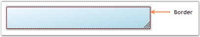

::: {style="DISPLAY: none"}
{#d2h_url_template}{#d2h_package_url style="WIDTH: 0px; DISPLAY: none; HEIGHT: 0px"}
:::

:::::: {.d2h_secondary_topic style="PADDING-BOTTOM: 10pt; MARGIN: 0pt; PADDING-LEFT: 0pt; PADDING-RIGHT: 0pt; PADDING-TOP: 0pt"}
##### Border Settings {#border-settings style="MARGIN-LEFT: 18pt; tab-stops: 18.0pt"}

[]{style="COLOR: #15428b"} 

This section illustrates the border settings available for the StatusBarAdv control.

 

The border settings for the StatusBarAdv control can be set through the properties listed below.

[]{style="COLOR: #15428b"} 

::: {align="center"}
+-----------------------------------+-----------------------------------------------------------------------------------------+
| StatusBarAdv Property             | Description                                                                             |
+-----------------------------------+-----------------------------------------------------------------------------------------+
| Border3DStyle                     | Indicates the style of the 3D border. The options included are as follows.              |
|                                   |                                                                                         |
|                                   |                                                                                         |
|                                   |                                                                                         |
|                                   | [·      ]{style="FONT-FAMILY: Symbol"}RaisedOuter,                                      |
|                                   |                                                                                         |
|                                   | [·      ]{style="FONT-FAMILY: Symbol"}SunkenOuter,                                      |
|                                   |                                                                                         |
|                                   | [·      ]{style="FONT-FAMILY: Symbol"}RaisedInner,                                      |
|                                   |                                                                                         |
|                                   | [·      ]{style="FONT-FAMILY: Symbol"}SunkenInner,                                      |
|                                   |                                                                                         |
|                                   | [·      ]{style="FONT-FAMILY: Symbol"}Raised,                                           |
|                                   |                                                                                         |
|                                   | [·      ]{style="FONT-FAMILY: Symbol"}Etched,                                           |
|                                   |                                                                                         |
|                                   | [·      ]{style="FONT-FAMILY: Symbol"}Bump,                                             |
|                                   |                                                                                         |
|                                   | [·      ]{style="FONT-FAMILY: Symbol"}Sunken,                                           |
|                                   |                                                                                         |
|                                   | [·      ]{style="FONT-FAMILY: Symbol"}Adjust and                                        |
|                                   |                                                                                         |
|                                   | [·      ]{style="FONT-FAMILY: Symbol"}Flat.                                             |
+-----------------------------------+-----------------------------------------------------------------------------------------+
| BorderColor                       | Indicates the color of the 2D border.                                                   |
+-----------------------------------+-----------------------------------------------------------------------------------------+
| BorderSingle                      | Indicates the 2D border style. The options included are as follows.                     |
|                                   |                                                                                         |
|                                   |                                                                                         |
|                                   |                                                                                         |
|                                   | [·      ]{style="FONT-FAMILY: Symbol"}Dotted,                                           |
|                                   |                                                                                         |
|                                   | [·      ]{style="FONT-FAMILY: Symbol"}Dashed,                                           |
|                                   |                                                                                         |
|                                   | [·      ]{style="FONT-FAMILY: Symbol"}Solid,                                            |
|                                   |                                                                                         |
|                                   | [·      ]{style="FONT-FAMILY: Symbol"}Inset,                                            |
|                                   |                                                                                         |
|                                   | [·      ]{style="FONT-FAMILY: Symbol"}Outset and                                        |
|                                   |                                                                                         |
|                                   | [·      ]{style="FONT-FAMILY: Symbol"}None.                                             |
|                                   |                                                                                         |
|                                   |                                                                                         |
|                                   |                                                                                         |
|                                   | The BorderStyle property should be set to \'FixedSingle\'.                              |
+-----------------------------------+-----------------------------------------------------------------------------------------+
| BorderSides                       | Indicates the border sides of the control. The options included are given below.        |
|                                   |                                                                                         |
|                                   |                                                                                         |
|                                   |                                                                                         |
|                                   | [·      ]{style="FONT-FAMILY: Symbol"}Left,                                             |
|                                   |                                                                                         |
|                                   | [·      ]{style="FONT-FAMILY: Symbol"}Top,                                              |
|                                   |                                                                                         |
|                                   | [·      ]{style="FONT-FAMILY: Symbol"}Right,                                            |
|                                   |                                                                                         |
|                                   | [·      ]{style="FONT-FAMILY: Symbol"}Bottom,                                           |
|                                   |                                                                                         |
|                                   | [·      ]{style="FONT-FAMILY: Symbol"}Middle and                                        |
|                                   |                                                                                         |
|                                   | [·      ]{style="FONT-FAMILY: Symbol"}All.                                              |
+-----------------------------------+-----------------------------------------------------------------------------------------+
| BorderStyle                       | Indicates whether the panel should have a border. The options included are given below. |
|                                   |                                                                                         |
|                                   |                                                                                         |
|                                   |                                                                                         |
|                                   | [·      ]{style="FONT-FAMILY: Symbol"}FixedSingle,                                      |
|                                   |                                                                                         |
|                                   | [·      ]{style="FONT-FAMILY: Symbol"}Fixed3D and                                       |
|                                   |                                                                                         |
|                                   | [·      ]{style="FONT-FAMILY: Symbol"}None.                                             |
+-----------------------------------+-----------------------------------------------------------------------------------------+
:::

[]{style="COLOR: #15428b"} 

::: {style="BORDER-BOTTOM: windowtext 1pt solid; BORDER-LEFT: medium none; PADDING-BOTTOM: 1pt; MARGIN: 9pt 0pt 9pt 18pt; PADDING-LEFT: 0pt; PADDING-RIGHT: 0pt; BORDER-TOP: windowtext 1pt solid; BORDER-RIGHT: medium none; PADDING-TOP: 1pt"}
{border="0"} Note:[ ]{style="FONT-SIZE: 8pt"}The BorderColor and BorderSingle properties will have effect only when the BorderStyle property is set to \'FixedSingle\'.
:::

[]{style="COLOR: #15428b"} 

+----------------------------------------------------------------------------------------------------------------------------------------------------------------------------------------------------+
| **[\[C#\]]{style="FONT-FAMILY: 'Courier New'; COLOR: black"}**                                                                                                                                     |
|                                                                                                                                                                                                    |
| []{style="FONT-FAMILY: 'Courier New'; COLOR: black"}                                                                                                                                               |
|                                                                                                                                                                                                    |
| [this]{style="FONT-FAMILY: 'Courier New'; COLOR: blue"}[.statusBarAdv1.Border3DStyle = System.Windows.Forms.[Border3DStyle]{style="COLOR: teal"}.RaisedInner;]{style="FONT-FAMILY: 'Courier New'"} |
|                                                                                                                                                                                                    |
| [this]{style="FONT-FAMILY: 'Courier New'; COLOR: blue"}[.statusBarAdv1.BorderColor = System.Drawing.[Color]{style="COLOR: teal"}.DarkRed;]{style="FONT-FAMILY: 'Courier New'"}                     |
|                                                                                                                                                                                                    |
| [this]{style="FONT-FAMILY: 'Courier New'; COLOR: blue"}[.statusBarAdv1.BorderSingle = System.Windows.Forms.[ButtonBorderStyle]{style="COLOR: teal"}.Dashed;]{style="FONT-FAMILY: 'Courier New'"}   |
|                                                                                                                                                                                                    |
| [this]{style="FONT-FAMILY: 'Courier New'; COLOR: blue"}[.statusBarAdv1.BorderStyle = System.Windows.Forms.[BorderStyle]{style="COLOR: teal"}.FixedSingle;]{style="FONT-FAMILY: 'Courier New'"}     |
|                                                                                                                                                                                                    |
| [this]{style="FONT-FAMILY: 'Courier New'; COLOR: blue"}[.statusBarAdv1.BorderSides = System.Windows.Forms.[Border3DSide]{style="COLOR: teal"}.All;]{style="FONT-FAMILY: 'Courier New'"}            |
+----------------------------------------------------------------------------------------------------------------------------------------------------------------------------------------------------+

[]{style="COLOR: #15428b"} 

+--------------------------------------------------------------------------------------------------------------------------------------------------------------------------+
| **[\[VB.NET\]]{style="FONT-FAMILY: 'Courier New'; COLOR: black"}**                                                                                                       |
|                                                                                                                                                                          |
| []{style="FONT-FAMILY: 'Courier New'; COLOR: black"}                                                                                                                     |
|                                                                                                                                                                          |
| [Me]{style="FONT-FAMILY: 'Courier New'; COLOR: blue"}[.statusBarAdv1.Border3DStyle = System.Windows.Forms.Border3DStyle.RaisedInner]{style="FONT-FAMILY: 'Courier New'"} |
|                                                                                                                                                                          |
| [Me]{style="FONT-FAMILY: 'Courier New'; COLOR: blue"}[.statusBarAdv1.BorderColor = System.Drawing.Color.DarkRed]{style="FONT-FAMILY: 'Courier New'"}                     |
|                                                                                                                                                                          |
| [Me]{style="FONT-FAMILY: 'Courier New'; COLOR: blue"}[.statusBarAdv1.BorderSingle = System.Windows.Forms.ButtonBorderStyle.Dashed]{style="FONT-FAMILY: 'Courier New'"}   |
|                                                                                                                                                                          |
| [Me]{style="FONT-FAMILY: 'Courier New'; COLOR: blue"}[.statusBarAdv1.BorderStyle = System.Windows.Forms.BorderStyle.FixedSingle]{style="FONT-FAMILY: 'Courier New'"}     |
|                                                                                                                                                                          |
| [Me]{style="FONT-FAMILY: 'Courier New'; COLOR: blue"}[.statusBarAdv1.BorderSides = System.Windows.Forms.Border3DSide.All]{style="FONT-FAMILY: 'Courier New'"}            |
+--------------------------------------------------------------------------------------------------------------------------------------------------------------------------+

[]{style="COLOR: #4a5c8c; FONT-SIZE: 8pt"} 

[{border="0"}]{style="COLOR: #4a5c8c; FONT-SIZE: 8pt"}[]{style="COLOR: #4a5c8c; FONT-SIZE: 8pt"}

[]{style="COLOR: #15428b"} 

Figure 1011: StatusBarAdv Control with Border Set

[]{style="COLOR: #15428b"} 

::: {style="BORDER-BOTTOM: windowtext 1pt solid; BORDER-LEFT: medium none; PADDING-BOTTOM: 1pt; MARGIN: 9pt 0pt 9pt 18pt; PADDING-LEFT: 0pt; PADDING-RIGHT: 0pt; BORDER-TOP: windowtext 1pt solid; BORDER-RIGHT: medium none; PADDING-TOP: 1pt"}
{border="0"} Note: The[ ]{style="COLOR: black; FONT-SIZE: 8pt"}border of the StatusBarAdvPanels can also be set to enhance the look and feel of the panels. See [Border Settings]{style="COLOR: black"} topic under StatusBarAdvPanel.
:::

 

 

 

 

[]{#related-topics}
::::::
