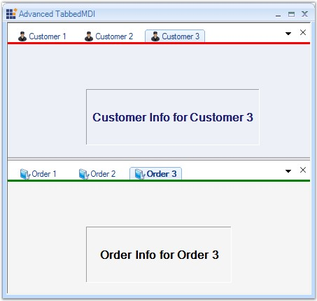
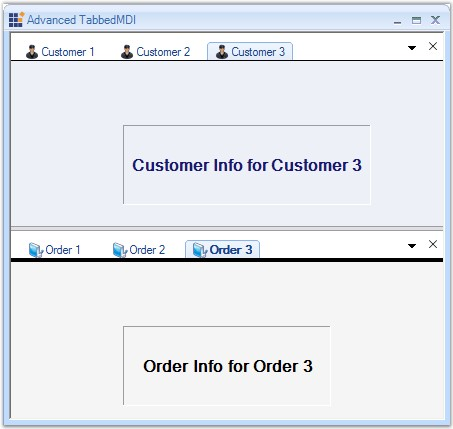

::: {style="DISPLAY: none"}
{#d2h_url_template}{#d2h_package_url style="WIDTH: 0px; DISPLAY: none; HEIGHT: 0px"}
:::

::: {.d2h_secondary_topic style="PADDING-BOTTOM: 10pt; MARGIN: 0pt; PADDING-LEFT: 0pt; PADDING-RIGHT: 0pt; PADDING-TOP: 0pt"}
##### Border Settings {#border-settings style="MARGIN-LEFT: 18pt; tab-stops: 18.0pt"}

**[]{style="COLOR: #15428b"}** 

Border Color

[]{style="COLOR: #485e8c; FONT-SIZE: 8pt"} 

To set the Border Color of the borders that appear under the MDI tabs, we can use the **BottomBorderColor** property of TabGroupHosts.

[]{style="COLOR: #15428b"} 

+-----------------------------------------------------------------------------------------------------------------------------------+
| **[\[C#\]]{style="FONT-FAMILY: 'Courier New'; COLOR: black"}**                                                                    |
|                                                                                                                                   |
| []{style="FONT-FAMILY: 'Courier New'; COLOR: black"}                                                                              |
|                                                                                                                                   |
| [tabbedMDIManager.TabGroupHosts\[0\].BottomBorderColor=[Color]{style="COLOR: teal"}.Red;]{style="FONT-FAMILY: 'Courier New'"}     |
|                                                                                                                                   |
| [tabbedMDIManager.TabGroupHosts\[1\].BottomBorderColor = [Color]{style="COLOR: teal"}.Green;]{style="FONT-FAMILY: 'Courier New'"} |
+-----------------------------------------------------------------------------------------------------------------------------------+

[]{style="COLOR: #15428b"} 

+---------------------------------------------------------------------------------------------------------+
| **[\[VB\]]{style="FONT-FAMILY: 'Courier New'; COLOR: black"}**                                          |
|                                                                                                         |
| []{style="FONT-FAMILY: 'Courier New'; COLOR: black"}                                                    |
|                                                                                                         |
| [tabbedMDIManager.TabGroupHosts(0).BottomBorderColor=Color.Red]{style="FONT-FAMILY: 'Courier New'"}     |
|                                                                                                         |
| [tabbedMDIManager.TabGroupHosts(1).BottomBorderColor = Color.Green]{style="FONT-FAMILY: 'Courier New'"} |
+---------------------------------------------------------------------------------------------------------+

[]{style="COLOR: #15428b"} 

{border="0"}

[]{style="COLOR: #15428b"} 

Figure 1093: Tab Groups with different Border Colors

[]{style="COLOR: #15428b"} 

Border Height

[]{style="COLOR: #485e8c; FONT-SIZE: 8pt"} 

To set the Border Height of the borders, we can use the **BottomBorderHeight** property of TabGroupHosts.

[]{style="COLOR: #15428b"} 

+-----------------------------------------------------------------------------------------------------------------------------------+
| **[\[C#\]]{style="FONT-FAMILY: 'Courier New'; COLOR: black"}**                                                                    |
|                                                                                                                                   |
| []{style="FONT-FAMILY: 'Courier New'; COLOR: green"}                                                                              |
|                                                                                                                                   |
| [// To set the Border Height.   ]{style="FONT-FAMILY: 'Courier New'; COLOR: green"}                                               |
|                                                                                                                                   |
| [tabbedMDIManager.TabGroupHosts\[0\].BottomBorderHeight = 0;]{style="FONT-FAMILY: 'Courier New'"}                                 |
|                                                                                                                                   |
| [tabbedMDIManager.TabGroupHosts\[1\].BottomBorderHeight = 3;]{style="FONT-FAMILY: 'Courier New'"}                                 |
|                                                                                                                                   |
| [// To set the Border Color.]{style="FONT-FAMILY: 'Courier New'; COLOR: green"}                                                   |
|                                                                                                                                   |
| [tabbedMDIManager.TabGroupHosts\[0\].BottomBorderColor = [Color]{style="COLOR: teal"}.Black;]{style="FONT-FAMILY: 'Courier New'"} |
|                                                                                                                                   |
| [tabbedMDIManager.TabGroupHosts\[1\].BottomBorderColor = [Color]{style="COLOR: teal"}.Black;]{style="FONT-FAMILY: 'Courier New'"} |
+-----------------------------------------------------------------------------------------------------------------------------------+

[]{style="COLOR: #15428b"} 

+---------------------------------------------------------------------------------------------------------------------------------------------------+
| **[\[VB\]]{style="FONT-FAMILY: 'Courier New'; COLOR: black"}**                                                                                    |
|                                                                                                                                                   |
| []{style="FONT-FAMILY: 'Courier New'; COLOR: black"}                                                                                              |
|                                                                                                                                                   |
| [\'To set the Border Height.]{style="FONT-FAMILY: 'Courier New'; COLOR: green"}                                                                   |
|                                                                                                                                                   |
| [tabbedMDIManager.TabGroupHosts(0).BottomBorderHeight = 0]{style="FONT-FAMILY: 'Courier New'"}                                                    |
|                                                                                                                                                   |
| [tabbedMDIManager.TabGroupHosts(1).BottomBorderHeight = 3]{style="FONT-FAMILY: 'Courier New'"}                                                    |
|                                                                                                                                                   |
| [\'To set the Border Color.]{style="FONT-FAMILY: 'Courier New'; COLOR: green"}                                                                    |
|                                                                                                                                                   |
| [tabbedMDIManager.TabGroupHosts(0).BottomBorderColor = Color.Black]{style="FONT-FAMILY: 'Courier New'"}                                           |
|                                                                                                                                                   |
| [tabbedMDIManager.TabGroupHosts(1).BottomBorderColor = Color.Black]{style="FONT-FAMILY: 'Courier New'"}[    ]{style="FONT-FAMILY: 'Courier New'"} |
+---------------------------------------------------------------------------------------------------------------------------------------------------+

[]{style="COLOR: #15428b"} 

{border="0"}

[]{style="COLOR: #15428b"} 

Figure 1094: Tab Groups with different Border Heights

 

A sample which illustrates this feature is available in the below sample installation location.

 

***\...\\My Documents\\Syncfusion\\EssentialStudio\\Version Number\\Windows\\Tools.Windows\\Samples\\2.0\\Tabbed MDI Package\\AdvancedTabbedMDI***

 

 

 

[]{#p914} 

[]{#related-topics}
:::
