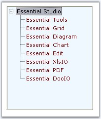
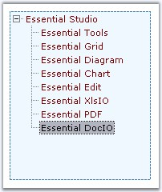

::: {style="DISPLAY: none"}
{#d2h_url_template}{#d2h_package_url style="WIDTH: 0px; DISPLAY: none; HEIGHT: 0px"}
:::

:::::: {.d2h_secondary_topic style="PADDING-BOTTOM: 10pt; MARGIN: 0pt; PADDING-LEFT: 0pt; PADDING-RIGHT: 0pt; PADDING-TOP: 0pt"}
##### Border Settings {#border-settings style="MARGIN-LEFT: 18pt; tab-stops: 18.0pt"}

[]{style="COLOR: #15428b"} 

3D Border for TreeView

[]{style="COLOR: #15428b"} 

The following properties sets 3D border for the treeview.

[]{style="COLOR: #15428b"} 

::: {align="center"}
+-----------------------------------+--------------------------------------------------------------------------+
| TreeViewAdv Property              | Description                                                              |
+-----------------------------------+--------------------------------------------------------------------------+
| BorderStyle                       | Sets the border style for the Treeview control.                          |
|                                   |                                                                          |
|                                   |                                                                          |
|                                   |                                                                          |
|                                   | [·      ]{style="FONT-FAMILY: Symbol"}*FixedSingle* - a normal border,   |
|                                   |                                                                          |
|                                   | [·      ]{style="FONT-FAMILY: Symbol"}*Fixed3D* - 3D appearance.         |
+-----------------------------------+--------------------------------------------------------------------------+
| Border3DStyle                     | Indicates the style of the 3D border when BorderStyle is set to Fixed3D. |
|                                   |                                                                          |
|                                   |                                                                          |
|                                   |                                                                          |
|                                   | [·      ]{style="FONT-FAMILY: Symbol"}RaisedOuter\                       |
|                                   | SunkenOuter                                                              |
|                                   |                                                                          |
|                                   | [·      ]{style="FONT-FAMILY: Symbol"}RaisedInner                        |
|                                   |                                                                          |
|                                   | [·      ]{style="FONT-FAMILY: Symbol"}SunkenInner                        |
|                                   |                                                                          |
|                                   | [·      ]{style="FONT-FAMILY: Symbol"}Raised                             |
|                                   |                                                                          |
|                                   | [·      ]{style="FONT-FAMILY: Symbol"}Etched                             |
|                                   |                                                                          |
|                                   | [·      ]{style="FONT-FAMILY: Symbol"}Bump                               |
|                                   |                                                                          |
|                                   | [·      ]{style="FONT-FAMILY: Symbol"}Sunken (Default)                   |
|                                   |                                                                          |
|                                   | [·      ]{style="FONT-FAMILY: Symbol"}Adjust                             |
|                                   |                                                                          |
|                                   | [·      ]{style="FONT-FAMILY: Symbol"}Flat                               |
+-----------------------------------+--------------------------------------------------------------------------+
:::

[]{style="COLOR: #15428b"} 

{border="0"}

[]{style="COLOR: #15428b"} 

Figure 1150: BorderStyle = \"Fixed3D\"; Border3DStyle = \"Bump\"

[]{style="COLOR: #15428b"} 

2D Border for TreeView

[]{style="COLOR: #15428b"} 

The following properties let you set customized 2D border.

[]{style="COLOR: #15428b"} 

::: {style="BORDER-BOTTOM: windowtext 1pt solid; BORDER-LEFT: medium none; PADDING-BOTTOM: 1pt; MARGIN: 9pt 0pt 9pt 18pt; PADDING-LEFT: 0pt; PADDING-RIGHT: 0pt; BORDER-TOP: windowtext 1pt solid; BORDER-RIGHT: medium none; PADDING-TOP: 1pt"}
{border="0"} Note: The settings will effect only when TreeViewAdv.BorderStyle property is set to FixedSingle.
:::

[]{style="COLOR: #15428b"} 

::: {align="center"}
+-----------------------------------+-------------------------------------------------------------------+
| TreeViewAdv Property              | Description                                                       |
+-----------------------------------+-------------------------------------------------------------------+
| BorderColor                       | Indicates the color of the 2D border.                             |
+-----------------------------------+-------------------------------------------------------------------+
| BorderSides                       | Specifies the sides of the control to which border should be set. |
+-----------------------------------+-------------------------------------------------------------------+
| BorderSingle                      | Indicates the 2D border style. The options are,                   |
|                                   |                                                                   |
|                                   |                                                                   |
|                                   |                                                                   |
|                                   | [·      ]{style="FONT-FAMILY: Symbol"}Solid (Default),            |
|                                   |                                                                   |
|                                   | [·      ]{style="FONT-FAMILY: Symbol"}Dotted,                     |
|                                   |                                                                   |
|                                   | [·      ]{style="FONT-FAMILY: Symbol"}Dashed,                     |
|                                   |                                                                   |
|                                   | [·      ]{style="FONT-FAMILY: Symbol"}Inset,                      |
|                                   |                                                                   |
|                                   | [·      ]{style="FONT-FAMILY: Symbol"}Outset,                     |
|                                   |                                                                   |
|                                   | [·      ]{style="FONT-FAMILY: Symbol"}None.                       |
+-----------------------------------+-------------------------------------------------------------------+
:::

[]{style="COLOR: #15428b"} 

+-------------------------------------------------------------------------------------------------------------------------------------------------------------------------------------------------+
| **[\[C#\]]{style="FONT-FAMILY: 'Courier New'; COLOR: black"}**                                                                                                                                  |
|                                                                                                                                                                                                 |
| **[]{style="FONT-FAMILY: 'Courier New'; COLOR: black"}**                                                                                                                                        |
|                                                                                                                                                                                                 |
| [this]{style="FONT-FAMILY: 'Courier New'; COLOR: blue"}[.treeViewAdv1.BorderColor = System.Drawing.[Color]{style="COLOR: teal"}.SteelBlue;]{style="FONT-FAMILY: 'Courier New'"}                 |
|                                                                                                                                                                                                 |
| [this]{style="FONT-FAMILY: 'Courier New'; COLOR: blue"}[.treeViewAdv1.BorderSingle = System.Windows.Forms.[ButtonBorderStyle]{style="COLOR: teal"}.Dashed;]{style="FONT-FAMILY: 'Courier New'"} |
|                                                                                                                                                                                                 |
| [this]{style="FONT-FAMILY: 'Courier New'; COLOR: blue"}[.treeViewAdv1.BorderStyle = System.Windows.Forms.[BorderStyle]{style="COLOR: teal"}.FixedSingle;]{style="FONT-FAMILY: 'Courier New'"}   |
+-------------------------------------------------------------------------------------------------------------------------------------------------------------------------------------------------+

[]{#p984}[]{style="COLOR: #15428b"} 

+----------------------------------------------------------------------------------------------------------------------------------------------------------------------------------------------------------------------------------+
| **[\[VB.NET\]]{style="FONT-FAMILY: 'Courier New'; COLOR: black"}**                                                                                                                                                               |
|                                                                                                                                                                                                                                  |
| []{style="FONT-FAMILY: 'Courier New'; COLOR: black"}                                                                                                                                                                             |
|                                                                                                                                                                                                                                  |
| [Me]{style="FONT-FAMILY: 'Courier New'; COLOR: blue"}[.treeViewAdv1.BorderColor = System.Drawing.[Color]{style="COLOR: teal"}.SteelBlue]{style="FONT-FAMILY: 'Courier New'"}                                                     |
|                                                                                                                                                                                                                                  |
| [Me]{style="FONT-FAMILY: 'Courier New'; COLOR: blue"}[.treeViewAdv1.BorderSingle = System.Windows.Forms.[ButtonBorderStyle]{style="COLOR: teal"}.Dashed]{style="FONT-FAMILY: 'Courier New'"}                                     |
|                                                                                                                                                                                                                                  |
| [Me]{style="FONT-FAMILY: 'Courier New'; COLOR: blue"}[.treeViewAdv1.BorderStyle = System.Windows.Forms.[BorderStyle]{style="COLOR: teal"}.FixedSingle]{style="FONT-FAMILY: 'Courier New'"}[]{style="FONT-FAMILY: 'Courier New'"} |
+----------------------------------------------------------------------------------------------------------------------------------------------------------------------------------------------------------------------------------+

[]{style="COLOR: #15428b"} 

{border="0"}

[]{style="COLOR: #15428b"} 

Figure 1151: BorderStyle = \"FixedSingle\"; BorderSingle = \"Dashed\"; BorderColor = \"SteelBlue\"

[]{#related-topics}
::::::
