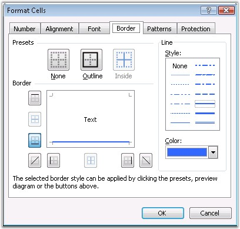
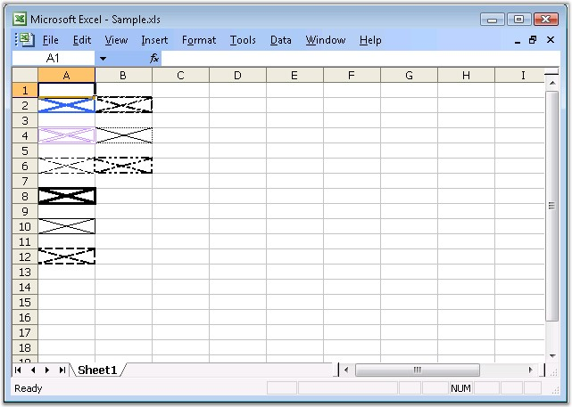

::: {style="DISPLAY: none"}
{#d2h_url_template}{#d2h_package_url style="WIDTH: 0px; DISPLAY: none; HEIGHT: 0px"}
:::

::: {.d2h_secondary_topic style="PADDING-BOTTOM: 10pt; MARGIN: 0pt; PADDING-LEFT: 0pt; PADDING-RIGHT: 0pt; PADDING-TOP: 0pt"}
#### Border Settings {#border-settings style="tab-stops: 0pt"}

 

Microsoft Excel provides a default appearance for a cell background. For example, it surrounds the cell with a gray border and a white background. You can control this default appearance through the **Formatting** toolbar or the **Border** tab in the **Format Cells** dialog box.

 

{border="0"}

Figure 40: Format cells Dialog of MS Excel - Border tab**[]{style="FONT-FAMILY: 'Trebuchet MS','sans-serif'; BACKGROUND: red; COLOR: white"}**

[]{style="FONT-FAMILY: 'Trebuchet MS','sans-serif'; COLOR: #15428b; FONT-SIZE: 9pt"} 

[]{style="FONT-FAMILY: 'Trebuchet MS','sans-serif'; COLOR: #15428b; FONT-SIZE: 9pt"} 

Border Settings in XlsIO

 

XlsIO provides support to insert and format borders through the **IBorder** interface. The following code example illustrates how this can be done.

 

+------------------------------------------------------------------------------------------------------------------------------------------------------------------------------------------------------------------------------+
| **[\[C#\]]{style="FONT-FAMILY: 'Courier New'"}**                                                                                                                                                                             |
|                                                                                                                                                                                                                              |
| **[]{style="FONT-FAMILY: 'Courier New'"}**                                                                                                                                                                                   |
|                                                                                                                                                                                                                              |
| [// The first worksheet object in the Worksheets collection is accessed.]{style="FONT-FAMILY: 'Courier New'; COLOR: green"}                                                                                                  |
|                                                                                                                                                                                                                              |
| [IWorksheet]{style="FONT-FAMILY: 'Courier New'; COLOR: #2b91af"}[ sheet = workbook.Worksheets\[0\];]{style="FONT-FAMILY: 'Courier New'"}                                                                                     |
|                                                                                                                                                                                                                              |
| []{style="FONT-FAMILY: 'Courier New'"}                                                                                                                                                                                       |
|                                                                                                                                                                                                                              |
| [// Setting Border Line Styles.]{style="FONT-FAMILY: 'Courier New'; COLOR: green"}                                                                                                                                           |
|                                                                                                                                                                                                                              |
| [sheet.Range\[[\"A2\"]{style="COLOR: #a31515"}\].CellStyle.Borders.LineStyle = [ExcelLineStyle]{style="COLOR: #2b91af"}.Medium;]{style="FONT-FAMILY: 'Courier New'"}                                                         |
|                                                                                                                                                                                                                              |
| [sheet.Range\[[\"A4\"]{style="COLOR: #a31515"}\].CellStyle.Borders.LineStyle = [ExcelLineStyle]{style="COLOR: #2b91af"}.Double;]{style="FONT-FAMILY: 'Courier New'"}                                                         |
|                                                                                                                                                                                                                              |
| [sheet.Range\[[\"A6\"]{style="COLOR: #a31515"}\].CellStyle.Borders.LineStyle = [ExcelLineStyle]{style="COLOR: #2b91af"}.Dash_dot;]{style="FONT-FAMILY: 'Courier New'"}                                                       |
|                                                                                                                                                                                                                              |
| [sheet.Range\[[\"A8\"]{style="COLOR: #a31515"}\].CellStyle.Borders.LineStyle = [ExcelLineStyle]{style="COLOR: #2b91af"}.Thick;]{style="FONT-FAMILY: 'Courier New'"}                                                          |
|                                                                                                                                                                                                                              |
| [sheet.Range\[[\"A10\"]{style="COLOR: #a31515"}\].CellStyle.Borders.LineStyle = [ExcelLineStyle]{style="COLOR: #2b91af"}.Thin;]{style="FONT-FAMILY: 'Courier New'"}                                                          |
|                                                                                                                                                                                                                              |
| [sheet.Range\[[\"A12\"]{style="COLOR: #a31515"}\].CellStyle.Borders.LineStyle = [ExcelLineStyle]{style="COLOR: #2b91af"}.Medium_dashed;]{style="FONT-FAMILY: 'Courier New'"}                                                 |
|                                                                                                                                                                                                                              |
| [sheet.Range\[[\"B2\"]{style="COLOR: #a31515"}\].CellStyle.Borders.LineStyle = [ExcelLineStyle]{style="COLOR: #2b91af"}.Slanted_dash_dot;]{style="FONT-FAMILY: 'Courier New'"}                                               |
|                                                                                                                                                                                                                              |
| [sheet.Range\[[\"B4\"]{style="COLOR: #a31515"}\].CellStyle.Borders.LineStyle = [ExcelLineStyle]{style="COLOR: #2b91af"}.Hair;]{style="FONT-FAMILY: 'Courier New'"}                                                           |
|                                                                                                                                                                                                                              |
| [sheet.Range\[[\"B6\"]{style="COLOR: #a31515"}\].CellStyle.Borders.LineStyle = [ExcelLineStyle]{style="COLOR: #2b91af"}.Medium_dash_dot_dot;]{style="FONT-FAMILY: 'Courier New'"}                                            |
|                                                                                                                                                                                                                              |
| []{style="FONT-FAMILY: 'Courier New'"}                                                                                                                                                                                       |
|                                                                                                                                                                                                                              |
| [// Setting the Border Color for Cell \"A2\".]{style="FONT-FAMILY: 'Courier New'; COLOR: green"}                                                                                                                             |
|                                                                                                                                                                                                                              |
| [sheet.Range\[[\"A2\"]{style="COLOR: #a31515"}\].CellStyle.Borders\[[ExcelBordersIndex]{style="COLOR: #2b91af"}.DiagonalDown\].Color = [ExcelKnownColors]{style="COLOR: #2b91af"}.Blue;]{style="FONT-FAMILY: 'Courier New'"} |
|                                                                                                                                                                                                                              |
| [sheet.Range\[[\"A2\"]{style="COLOR: #a31515"}\].CellStyle.Borders\[[ExcelBordersIndex]{style="COLOR: #2b91af"}.DiagonalUp\].Color = [ExcelKnownColors]{style="COLOR: #2b91af"}.Blue;]{style="FONT-FAMILY: 'Courier New'"}   |
|                                                                                                                                                                                                                              |
| [sheet.Range\[[\"A2\"]{style="COLOR: #a31515"}\].CellStyle.Borders\[[ExcelBordersIndex]{style="COLOR: #2b91af"}.EdgeBottom\].Color = [ExcelKnownColors]{style="COLOR: #2b91af"}.Blue;]{style="FONT-FAMILY: 'Courier New'"}   |
|                                                                                                                                                                                                                              |
| [sheet.Range\[[\"A2\"]{style="COLOR: #a31515"}\].CellStyle.Borders\[[ExcelBordersIndex]{style="COLOR: #2b91af"}.EdgeLeft\].Color = [ExcelKnownColors]{style="COLOR: #2b91af"}.Blue;]{style="FONT-FAMILY: 'Courier New'"}     |
|                                                                                                                                                                                                                              |
| [sheet.Range\[[\"A2\"]{style="COLOR: #a31515"}\].CellStyle.Borders\[[ExcelBordersIndex]{style="COLOR: #2b91af"}.EdgeRight\].Color = [ExcelKnownColors]{style="COLOR: #2b91af"}.Blue;]{style="FONT-FAMILY: 'Courier New'"}    |
|                                                                                                                                                                                                                              |
| [sheet.Range\[[\"A2\"]{style="COLOR: #a31515"}\].CellStyle.Borders\[[ExcelBordersIndex]{style="COLOR: #2b91af"}.EdgeTop\].Color = [ExcelKnownColors]{style="COLOR: #2b91af"}.Blue;]{style="FONT-FAMILY: 'Courier New'"}      |
+------------------------------------------------------------------------------------------------------------------------------------------------------------------------------------------------------------------------------+

[]{style="FONT-FAMILY: 'Trebuchet MS','sans-serif'; COLOR: #15428b; FONT-SIZE: 9pt"} 

+--------------------------------------------------------------------------------------------------------------------------------------------------------------------+
| **[\[VB.NET\]]{style="FONT-FAMILY: 'Courier New'"}**                                                                                                               |
|                                                                                                                                                                    |
| **[]{style="FONT-FAMILY: 'Courier New'"}**                                                                                                                         |
|                                                                                                                                                                    |
| [\' The first worksheet object in the worksheets collection is accessed.]{style="FONT-FAMILY: 'Courier New'; COLOR: green"}                                        |
|                                                                                                                                                                    |
| [Dim]{style="FONT-FAMILY: 'Courier New'; COLOR: blue"}[ sheet [As]{style="COLOR: blue"} IWorksheet = workbook.Worksheets(0)]{style="FONT-FAMILY: 'Courier New'"}   |
|                                                                                                                                                                    |
| []{style="FONT-FAMILY: 'Courier New'"}                                                                                                                             |
|                                                                                                                                                                    |
| [\' Setting Border Line Styles.]{style="FONT-FAMILY: 'Courier New'; COLOR: green"}                                                                                 |
|                                                                                                                                                                    |
| [sheet.Range([\"A2\"]{style="COLOR: maroon"}).CellStyle.Borders.LineStyle = ExcelLineStyle.Medium]{style="FONT-FAMILY: 'Courier New'"}                             |
|                                                                                                                                                                    |
| [sheet.Range([\"A4\"]{style="COLOR: maroon"}).CellStyle.Borders.LineStyle = ExcelLineStyle.Double]{style="FONT-FAMILY: 'Courier New'"}                             |
|                                                                                                                                                                    |
| [sheet.Range([\"A6\"]{style="COLOR: maroon"}).CellStyle.Borders.LineStyle = ExcelLineStyle.Dash_dot]{style="FONT-FAMILY: 'Courier New'"}                           |
|                                                                                                                                                                    |
| [sheet.Range([\"A8\"]{style="COLOR: maroon"}).CellStyle.Borders.LineStyle = ExcelLineStyle.Thick]{style="FONT-FAMILY: 'Courier New'"}                              |
|                                                                                                                                                                    |
| [sheet.Range([\"A10\"]{style="COLOR: maroon"}).CellStyle.Borders.LineStyle = ExcelLineStyle.Thin]{style="FONT-FAMILY: 'Courier New'"}                              |
|                                                                                                                                                                    |
| [sheet.Range([\"A12\"]{style="COLOR: maroon"}).CellStyle.Borders.LineStyle = ExcelLineStyle.Medium_dashed]{style="FONT-FAMILY: 'Courier New'"}                     |
|                                                                                                                                                                    |
| [sheet.Range([\"B2\"]{style="COLOR: maroon"}).CellStyle.Borders.LineStyle = ExcelLineStyle.Slanted_dash_dot]{style="FONT-FAMILY: 'Courier New'"}                   |
|                                                                                                                                                                    |
| [sheet.Range([\"B4\"]{style="COLOR: maroon"}).CellStyle.Borders.LineStyle = ExcelLineStyle.Hair]{style="FONT-FAMILY: 'Courier New'"}                               |
|                                                                                                                                                                    |
| [sheet.Range([\"B6\"]{style="COLOR: maroon"}).CellStyle.Borders.LineStyle = ExcelLineStyle.Medium_dash_dot_dot]{style="FONT-FAMILY: 'Courier New'"}                |
|                                                                                                                                                                    |
| []{style="FONT-FAMILY: 'Courier New'"}                                                                                                                             |
|                                                                                                                                                                    |
| [\' Setting the Border Color for Cell \"A2\".]{style="FONT-FAMILY: 'Courier New'; COLOR: green"}                                                                   |
|                                                                                                                                                                    |
| [sheet.Range([\"A2\"]{style="COLOR: maroon"}).CellStyle.Borders(ExcelBordersIndex.DiagonalDown).Color = ExcelKnownColors.Blue]{style="FONT-FAMILY: 'Courier New'"} |
|                                                                                                                                                                    |
| [sheet.Range([\"A2\"]{style="COLOR: maroon"}).CellStyle.Borders(ExcelBordersIndex.DiagonalUp).Color = ExcelKnownColors.Blue]{style="FONT-FAMILY: 'Courier New'"}   |
|                                                                                                                                                                    |
| [sheet.Range([\"A2\"]{style="COLOR: maroon"}).CellStyle.Borders(ExcelBordersIndex.EdgeBottom).Color = ExcelKnownColors.Blue]{style="FONT-FAMILY: 'Courier New'"}   |
|                                                                                                                                                                    |
| [sheet.Range([\"A2\"]{style="COLOR: maroon"}).CellStyle.Borders(ExcelBordersIndex.EdgeLeft).Color = ExcelKnownColors.Blue]{style="FONT-FAMILY: 'Courier New'"}     |
|                                                                                                                                                                    |
| [sheet.Range([\"A2\"]{style="COLOR: maroon"}).CellStyle.Borders(ExcelBordersIndex.EdgeRight).Color = ExcelKnownColors.Blue]{style="FONT-FAMILY: 'Courier New'"}    |
|                                                                                                                                                                    |
| [sheet.Range([\"A2\"]{style="COLOR: maroon"}).CellStyle.Borders(ExcelBordersIndex.EdgeTop).Color = ExcelKnownColors.Blue]{style="FONT-FAMILY: 'Courier New'"}      |
+--------------------------------------------------------------------------------------------------------------------------------------------------------------------+

[]{style="FONT-FAMILY: 'Trebuchet MS','sans-serif'; COLOR: #15428b; FONT-SIZE: 9pt"} 

{border="0"}

Figure 41: XlsIO with Border Settings[]{style="FONT-FAMILY: 'Trebuchet MS','sans-serif'; COLOR: #15428b"}

**[]{style="FONT-FAMILY: 'Trebuchet MS','sans-serif'; COLOR: #15428b; FONT-SIZE: 9pt"}** 

 

You can also set the borders for a range as follows.

 

+----------------------------------------------------------------------------------------------------------------------------------------------------------------------------------------------------------------------------------------+
| **[\[C#\]]{style="FONT-FAMILY: 'Courier New'"}**                                                                                                                                                                                       |
|                                                                                                                                                                                                                                        |
| **[]{style="FONT-FAMILY: 'Courier New'"}**                                                                                                                                                                                             |
|                                                                                                                                                                                                                                        |
| [sheet.Range\[\"C2\"\].BorderAround();]{style="FONT-FAMILY: 'Courier New'; COLOR: black"}                                                                                                                                              |
|                                                                                                                                                                                                                                        |
| [sheet.Range\[\"C4\"\].BorderInside]{style="FONT-FAMILY: 'Courier New'; COLOR: black"}[([ExcelLineStyle]{style="COLOR: teal"}.Dash_dot,[Color]{style="COLOR: teal"}.Red)[;]{style="COLOR: black"}]{style="FONT-FAMILY: 'Courier New'"} |
+----------------------------------------------------------------------------------------------------------------------------------------------------------------------------------------------------------------------------------------+

[]{style="FONT-FAMILY: 'Trebuchet MS','sans-serif'; COLOR: #15428b; FONT-SIZE: 9pt"} 

+-------------------------------------------------------------------------------------------------------------------------------------------------------------------------------------------------------------+
| **[\[VB.NET\]]{style="FONT-FAMILY: 'Courier New'"}**                                                                                                                                                        |
|                                                                                                                                                                                                             |
| **[]{style="FONT-FAMILY: 'Courier New'"}**                                                                                                                                                                  |
|                                                                                                                                                                                                             |
| [sheet.Range(\"C2\").BorderAround()]{style="FONT-FAMILY: 'Courier New'; COLOR: black"}                                                                                                                      |
|                                                                                                                                                                                                             |
| [sheet.Range(\"C4\").BorderInside]{style="FONT-FAMILY: 'Courier New'; COLOR: black"}[([ExcelLineStyle]{style="COLOR: teal"}.Dash_dot,[Color]{style="COLOR: teal"}.Red)]{style="FONT-FAMILY: 'Courier New'"} |
+-------------------------------------------------------------------------------------------------------------------------------------------------------------------------------------------------------------+

 

[]{#p42}**[]{style="FONT-FAMILY: 'Segoe UI','sans-serif'; COLOR: black"}** 

[]{#related-topics}
:::
