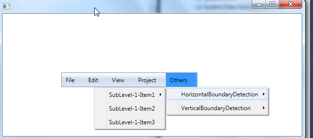
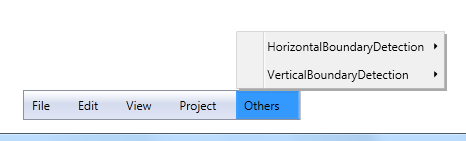
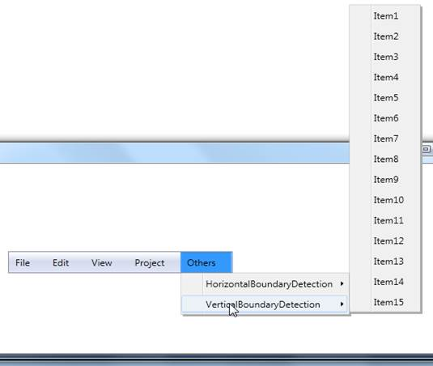

::: {style="DISPLAY: none"}
{#d2h_url_template}{#d2h_package_url style="WIDTH: 0px; DISPLAY: none; HEIGHT: 0px"}
:::

::: {.d2h_secondary_topic style="PADDING-BOTTOM: 10pt; MARGIN: 0pt; PADDING-LEFT: 0pt; PADDING-RIGHT: 0pt; PADDING-TOP: 0pt"}
#### Boundary Detection {#boundary-detection style="tab-stops: 0pt"}

MenuItemAdv detects the boundaries and opens its submenu in the opposite direction, when the submenu crosses the boundary in both horizontal and vertical directions. In the case of Vertical direction, if the MenuItemAdv which opens the submenu is not the item of MenuAdv the submenu will only adjust its position and it will not open in opposite direction.

                                                   

{border="0"}

Figure 728: Boundary Detection - Horizontal

 

{border="0"}

Figure 729: Boundary Detection - Vertical

**{border="0"}**

Figure 730: Boundary Detection - Vertical (In Case of Submenu)

 

Use Case Scenarios

MenuAdv will be very useful when the number of submenu item levels are more and the opening of the submenu crosses the boundary, this feature allows the submenu be always visible by adjusting its position.

**[]{style="FONT-FAMILY: 'Trebuchet MS','sans-serif'; COLOR: #15428b; FONT-SIZE: 9pt"}** 

Sample Link

WPF Sample Browser-\> Tools -\> MenuAdv -\> MenuAdv Demo

 

 

[]{#related-topics}
:::
