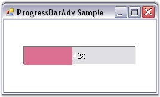

::: {style="DISPLAY: none"}
{#d2h_url_template}{#d2h_package_url style="WIDTH: 0px; DISPLAY: none; HEIGHT: 0px"}
:::

::::: {.d2h_secondary_topic style="PADDING-BOTTOM: 10pt; MARGIN: 0pt; PADDING-LEFT: 0pt; PADDING-RIGHT: 0pt; PADDING-TOP: 0pt"}
##### Boundary Value Settings {#boundary-value-settings style="MARGIN-LEFT: 18pt; tab-stops: 18.0pt"}

[]{style="COLOR: #15428b"} 

The ProgressBarAdv during it\'s progressive operation indicates a minimum value and a maximum value for the process.

 

It provides the below properties to set the boundary values for the control and also the interval for the progression.

[]{style="COLOR: #15428b"} 

::: {align="center"}
  ------------------------- ---------------------------------------------------------------------------------------------------------------------------------------
  ProgressBarAdv Property   Description
  Minimum                   Determines the lower bound of the range of the ProgressBarAdv.
  Maximum                   Determines the higher bound of the range of the ProgressBarAdv.
  Value                     The current value between the minimum and maximum values.
  Step                      Determines the amount to increment or decrement the value of the ProgressBarAdv when the Increment() or Decrement() method is called.
  ------------------------- ---------------------------------------------------------------------------------------------------------------------------------------
:::

[]{style="COLOR: #15428b"} 

Create a ProgressBarAdv and set the below properties to see the changes.

[]{style="COLOR: #15428b"} 

+------------------------------------------------------------------------------------------------------------------------------+
| **[\[C#\]]{style="FONT-FAMILY: 'Courier New'; COLOR: black"}**                                                               |
|                                                                                                                              |
| []{style="FONT-FAMILY: 'Courier New'; COLOR: black"}                                                                         |
|                                                                                                                              |
| [this]{style="FONT-FAMILY: 'Courier New'; COLOR: blue"}[.progressBarAdv1.Maximum = 200;]{style="FONT-FAMILY: 'Courier New'"} |
|                                                                                                                              |
| [this]{style="FONT-FAMILY: 'Courier New'; COLOR: blue"}[.progressBarAdv1.Minimum = 25;]{style="FONT-FAMILY: 'Courier New'"}  |
|                                                                                                                              |
| [this]{style="FONT-FAMILY: 'Courier New'; COLOR: blue"}[.progressBarAdv1.Step = 50;]{style="FONT-FAMILY: 'Courier New'"}     |
|                                                                                                                              |
| [this]{style="FONT-FAMILY: 'Courier New'; COLOR: blue"}[.progressBarAdv1.Value = 100;]{style="FONT-FAMILY: 'Courier New'"}   |
+------------------------------------------------------------------------------------------------------------------------------+

[]{style="COLOR: #15428b"} 

+---------------------------------------------------------------------------------------------------------------------------+
| **[\[VB.NET\]]{style="FONT-FAMILY: 'Courier New'; COLOR: black"}**                                                        |
|                                                                                                                           |
| []{style="FONT-FAMILY: 'Courier New'; COLOR: black"}                                                                      |
|                                                                                                                           |
| [Me]{style="FONT-FAMILY: 'Courier New'; COLOR: blue"}[.progressBarAdv1.Maximum = 200]{style="FONT-FAMILY: 'Courier New'"} |
|                                                                                                                           |
| [Me]{style="FONT-FAMILY: 'Courier New'; COLOR: blue"}[.progressBarAdv1.Minimum = 25]{style="FONT-FAMILY: 'Courier New'"}  |
|                                                                                                                           |
| [Me]{style="FONT-FAMILY: 'Courier New'; COLOR: blue"}[.progressBarAdv1.Step = 50]{style="FONT-FAMILY: 'Courier New'"}     |
|                                                                                                                           |
| [Me]{style="FONT-FAMILY: 'Courier New'; COLOR: blue"}[.progressBarAdv1.Value = 100]{style="FONT-FAMILY: 'Courier New'"}   |
+---------------------------------------------------------------------------------------------------------------------------+

[]{style="COLOR: #15428b"} 

{border="0"}

**[]{style="COLOR: #15428b"}** 

Figure 973: ProgressBarAdv with Boundary Values Set

**[]{style="COLOR: black; FONT-SIZE: 8pt"}** 

The methods associated with the above properties are given below.

[]{style="COLOR: #15428b"} 

::: {align="center"}
  ----------- ---------------------------------------------------------------
  Methods     Description
  Increment   Increments the Value property associated with the Step value.
  Decrement   Decrements the Value property associated with the Step value.
  ----------- ---------------------------------------------------------------
:::

 

 

 

[]{#p717} 

[]{#related-topics}
:::::
