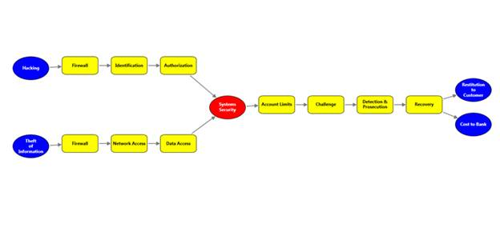

::: {style="DISPLAY: none"}
{#d2h_url_template}{#d2h_package_url style="WIDTH: 0px; DISPLAY: none; HEIGHT: 0px"}
:::

::::: {#nsbanner .d2h_main_nsbanner style="BORDER-BOTTOM: #999999 1px solid; POSITION: relative; PADDING-BOTTOM: 0px; BACKGROUND-COLOR: transparent; PADDING-LEFT: 0px; PADDING-RIGHT: 0px; DISPLAY: none; BORDER-TOP: #999999 1px solid; PADDING-TOP: 0px; LEFT: 0px"}
:::: {#TitleRow .d2h_main_titlerow style="PADDING-BOTTOM: 4px; BACKGROUND-COLOR: transparent; PADDING-LEFT: 22px; WIDTH: 100%; PADDING-RIGHT: 10px; DISPLAY: none; PADDING-TOP: 4px"}
::: {#ienav .d2h_main_ienav style="DISPLAY: none"}
{#D2HPrevious .D2HPreviousEnabled}  {#D2HNext .D2HNextEnabled}
:::
::::
:::::

::::: {#nstext .d2h_main_nstext style="PADDING-BOTTOM: 10px; BACKGROUND-COLOR: transparent; PADDING-LEFT: 22px; PADDING-RIGHT: 10px; HEIGHT: 100%; OVERFLOW: auto; PADDING-TOP: 5px" hasuserbackground="true" valign="bottom"}
::: {#d2h_breadcrumbs .d2h_breadcrumbs}
[Essential Studio User Guide Documentation](ms-xhelp:///?Id=12457748-09e3-4d74-a240-8e049cedf030){.d2h_breadcrumbsNormal}[ \> ]{.d2h_breadcrumbsLinkSeparator}[User Interface Edition](ms-xhelp:///?Id=c29296b7-531c-413b-a0ec-488ca1f7f669){.d2h_breadcrumbsNormal}[ \> ]{.d2h_breadcrumbsLinkSeparator}[Essential Silverlight](ms-xhelp:///?Id=66221bd1-ba2e-43c2-94a7-618f50e01d24){.d2h_breadcrumbsNormal}[ \> ]{.d2h_breadcrumbsLinkSeparator}[Essential Diagram]{.d2h_breadcrumbsContentsOnly}[ \> ]{.d2h_breadcrumbsLinkSeparator}[Getting Started](ms-xhelp:///?Id=77f772a1-15ea-48e9-bd56-21bc587bb944){.d2h_breadcrumbsNormal}[ \> ]{.d2h_breadcrumbsLinkSeparator}[Automatic Layout](ms-xhelp:///?Id=157e81f4-0183-435f-92c0-e47d89cb7257){.d2h_breadcrumbsNormal}
:::

### BowTie Layout {#bowtie-layout style="tab-stops: 0pt"}

The BowTie Diagram is a graphical representation of the risk assessment process. This can be used for assessing all type of risks.

 

Properties

 

Table 1: Property Table

::: {align="center"}
  ------------------------ ----------------------------------------------------------------------------------------------------- ------------------------------ ------------------------- ---------------------------------------------
  Property                 Description                                                                                           Type                           Data Type                 Reference links []{style="FONT-SIZE: 11pt"}
  VerticalSpacing          Gets or sets the Vertical spacing between the nodes.                                                  CLR Property                   Double                    NA[]{style="FONT-SIZE: 11pt"}
  HorizontalSpacing        Gets or sets the Horizontal spacing between the nodes.                                                CLR Property                   Double                    NA[]{style="FONT-SIZE: 11pt"}
  SpaceBetweenSubTrees     Gets or sets the space between the sub trees.                                                         CLR Property                   Double                    NA[]{style="FONT-SIZE: 11pt"}
  Bounds                   Gets or sets the bounds value which specifies the position of the root node in case of tree layout.   CLR Property                   Thickness                 NA[]{style="FONT-SIZE: 11pt"}
  BowtieSubTreePlacement   Gets or sets a value from the BowtieSubTreePlacement.                                                 Attached Dependency property    BowtieSubTreePlacement   NA[]{style="FONT-SIZE: 11pt"}
  ------------------------ ----------------------------------------------------------------------------------------------------- ------------------------------ ------------------------- ---------------------------------------------
:::

[]{style="FONT-FAMILY: 'Calibri','sans-serif'; FONT-SIZE: 11pt"} 

The following code illustrates how to generate the BowTie layout:

1.   The LayoutType should be set to **BowtieLayout** in **DiagramModel** class.

 

+-------------------------------------------------------------------------------------------------------------------------------------------------------------------------------------------------------------------------------------------------------------------------------------------------------------------------------------------------------------------------------------------------------------------------------------------------------------------------------------------------------------------------------------------------------------------------------------------------------------------------------------------------------------------------------------------------------------------------------------------------------------------------------------------------------------------------------------------------------------------------------------------+
| **[\[XAML\]]{style="FONT-FAMILY: 'Courier New'"}**                                                                                                                                                                                                                                                                                                                                                                                                                                                                                                                                                                                                                                                                                                                                                                                                                                        |
|                                                                                                                                                                                                                                                                                                                                                                                                                                                                                                                                                                                                                                                                                                                                                                                                                                                                                           |
| [           ]{style="FONT-FAMILY: Consolas; COLOR: #2b91af; FONT-SIZE: 9.5pt"}[\<!\--Diagram Control\--\>]{style="FONT-FAMILY: Consolas; COLOR: green; FONT-SIZE: 9.5pt"}[       ]{style="FONT-FAMILY: Consolas; COLOR: #a31515; FONT-SIZE: 9.5pt"}[]{style="FONT-FAMILY: Consolas; FONT-SIZE: 9.5pt"}                                                                                                                                                                                                                                                                                                                                                                                                                                                                                                                                                                                    |
|                                                                                                                                                                                                                                                                                                                                                                                                                                                                                                                                                                                                                                                                                                                                                                                                                                                                                           |
| [        ]{style="FONT-FAMILY: Consolas; COLOR: #a31515; FONT-SIZE: 9.5pt"}[\<]{style="FONT-FAMILY: Consolas; COLOR: blue; FONT-SIZE: 9.5pt"}[syncfusion]{style="FONT-FAMILY: Consolas; COLOR: #a31515; FONT-SIZE: 9.5pt"}[:]{style="FONT-FAMILY: Consolas; COLOR: blue; FONT-SIZE: 9.5pt"}[DiagramControl]{style="FONT-FAMILY: Consolas; COLOR: #a31515; FONT-SIZE: 9.5pt"}[ [ Name]{style="COLOR: red"}[=\"diagramControl\"]{style="COLOR: blue"}[ Grid.Row]{style="COLOR: red"}[=\"1\"\>]{style="COLOR: blue"}[            ]{style="COLOR: #a31515"}]{style="FONT-FAMILY: Consolas; FONT-SIZE: 9.5pt"}                                                                                                                                                                                                                                                                                 |
|                                                                                                                                                                                                                                                                                                                                                                                                                                                                                                                                                                                                                                                                                                                                                                                                                                                                                           |
| [            ]{style="FONT-FAMILY: Consolas; COLOR: #a31515; FONT-SIZE: 9.5pt"}[\<]{style="FONT-FAMILY: Consolas; COLOR: blue; FONT-SIZE: 9.5pt"}[syncfusion]{style="FONT-FAMILY: Consolas; COLOR: #a31515; FONT-SIZE: 9.5pt"}[:]{style="FONT-FAMILY: Consolas; COLOR: blue; FONT-SIZE: 9.5pt"}[DiagramControl.Model]{style="FONT-FAMILY: Consolas; COLOR: #a31515; FONT-SIZE: 9.5pt"}[\>]{style="FONT-FAMILY: Consolas; COLOR: blue; FONT-SIZE: 9.5pt"}[]{style="FONT-FAMILY: Consolas; FONT-SIZE: 9.5pt"}                                                                                                                                                                                                                                                                                                                                                                               |
|                                                                                                                                                                                                                                                                                                                                                                                                                                                                                                                                                                                                                                                                                                                                                                                                                                                                                           |
| [                ]{style="FONT-FAMILY: Consolas; COLOR: #a31515; FONT-SIZE: 9.5pt"}[\<]{style="FONT-FAMILY: Consolas; COLOR: blue; FONT-SIZE: 9.5pt"}[syncfusion]{style="FONT-FAMILY: Consolas; COLOR: #a31515; FONT-SIZE: 9.5pt"}[:]{style="FONT-FAMILY: Consolas; COLOR: blue; FONT-SIZE: 9.5pt"}[DiagramModel]{style="FONT-FAMILY: Consolas; COLOR: #a31515; FONT-SIZE: 9.5pt"}[ x]{style="FONT-FAMILY: Consolas; COLOR: red; FONT-SIZE: 9.5pt"}[:]{style="FONT-FAMILY: Consolas; COLOR: blue; FONT-SIZE: 9.5pt"}[Name]{style="FONT-FAMILY: Consolas; COLOR: red; FONT-SIZE: 9.5pt"}[=\"diagramModel\"]{style="FONT-FAMILY: Consolas; COLOR: blue; FONT-SIZE: 9.5pt"}[ LayoutType]{style="FONT-FAMILY: Consolas; COLOR: red; FONT-SIZE: 9.5pt"}[=\"BowtieLayout\"/\>]{style="FONT-FAMILY: Consolas; COLOR: blue; FONT-SIZE: 9.5pt"}[]{style="FONT-FAMILY: Consolas; FONT-SIZE: 9.5pt"} |
|                                                                                                                                                                                                                                                                                                                                                                                                                                                                                                                                                                                                                                                                                                                                                                                                                                                                                           |
| [            ]{style="FONT-FAMILY: Consolas; COLOR: #a31515; FONT-SIZE: 9.5pt"}[\</]{style="FONT-FAMILY: Consolas; COLOR: blue; FONT-SIZE: 9.5pt"}[syncfusion]{style="FONT-FAMILY: Consolas; COLOR: #a31515; FONT-SIZE: 9.5pt"}[:]{style="FONT-FAMILY: Consolas; COLOR: blue; FONT-SIZE: 9.5pt"}[DiagramControl.Model]{style="FONT-FAMILY: Consolas; COLOR: #a31515; FONT-SIZE: 9.5pt"}[\>]{style="FONT-FAMILY: Consolas; COLOR: blue; FONT-SIZE: 9.5pt"}[            ]{style="FONT-FAMILY: Consolas; COLOR: #a31515; FONT-SIZE: 9.5pt"}[]{style="FONT-FAMILY: Consolas; FONT-SIZE: 9.5pt"}                                                                                                                                                                                                                                                                                               |
|                                                                                                                                                                                                                                                                                                                                                                                                                                                                                                                                                                                                                                                                                                                                                                                                                                                                                           |
| [            ]{style="FONT-FAMILY: Consolas; COLOR: #a31515; FONT-SIZE: 9.5pt"}[\<]{style="FONT-FAMILY: Consolas; COLOR: blue; FONT-SIZE: 9.5pt"}[syncfusion]{style="FONT-FAMILY: Consolas; COLOR: #a31515; FONT-SIZE: 9.5pt"}[:]{style="FONT-FAMILY: Consolas; COLOR: blue; FONT-SIZE: 9.5pt"}[DiagramControl.View]{style="FONT-FAMILY: Consolas; COLOR: #a31515; FONT-SIZE: 9.5pt"}[\>]{style="FONT-FAMILY: Consolas; COLOR: blue; FONT-SIZE: 9.5pt"}[]{style="FONT-FAMILY: Consolas; FONT-SIZE: 9.5pt"}                                                                                                                                                                                                                                                                                                                                                                                |
|                                                                                                                                                                                                                                                                                                                                                                                                                                                                                                                                                                                                                                                                                                                                                                                                                                                                                           |
| [                ]{style="FONT-FAMILY: Consolas; COLOR: #a31515; FONT-SIZE: 9.5pt"}[\<]{style="FONT-FAMILY: Consolas; COLOR: blue; FONT-SIZE: 9.5pt"}[syncfusion]{style="FONT-FAMILY: Consolas; COLOR: #a31515; FONT-SIZE: 9.5pt"}[:]{style="FONT-FAMILY: Consolas; COLOR: blue; FONT-SIZE: 9.5pt"}[DiagramView]{style="FONT-FAMILY: Consolas; COLOR: #a31515; FONT-SIZE: 9.5pt"}[ Name]{style="FONT-FAMILY: Consolas; COLOR: red; FONT-SIZE: 9.5pt"}[=\"diagramView\"]{style="FONT-FAMILY: Consolas; COLOR: blue; FONT-SIZE: 9.5pt"}[ Bounds]{style="FONT-FAMILY: Consolas; COLOR: red; FONT-SIZE: 9.5pt"}[=\"0, 0, 1400, 700\"/\>]{style="FONT-FAMILY: Consolas; COLOR: blue; FONT-SIZE: 9.5pt"}[]{style="FONT-FAMILY: Consolas; FONT-SIZE: 9.5pt"}                                                                                                                                     |
|                                                                                                                                                                                                                                                                                                                                                                                                                                                                                                                                                                                                                                                                                                                                                                                                                                                                                           |
| [            ]{style="FONT-FAMILY: Consolas; COLOR: #a31515; FONT-SIZE: 9.5pt"}[\</]{style="FONT-FAMILY: Consolas; COLOR: blue; FONT-SIZE: 9.5pt"}[syncfusion]{style="FONT-FAMILY: Consolas; COLOR: #a31515; FONT-SIZE: 9.5pt"}[:]{style="FONT-FAMILY: Consolas; COLOR: blue; FONT-SIZE: 9.5pt"}[DiagramControl.View]{style="FONT-FAMILY: Consolas; COLOR: #a31515; FONT-SIZE: 9.5pt"}[\>]{style="FONT-FAMILY: Consolas; COLOR: blue; FONT-SIZE: 9.5pt"}[]{style="FONT-FAMILY: Consolas; FONT-SIZE: 9.5pt"}                                                                                                                                                                                                                                                                                                                                                                               |
|                                                                                                                                                                                                                                                                                                                                                                                                                                                                                                                                                                                                                                                                                                                                                                                                                                                                                           |
| [        ]{style="FONT-FAMILY: Consolas; COLOR: #a31515; FONT-SIZE: 9.5pt"}[\</]{style="FONT-FAMILY: Consolas; COLOR: blue; FONT-SIZE: 9.5pt"}[syncfusion]{style="FONT-FAMILY: Consolas; COLOR: #a31515; FONT-SIZE: 9.5pt"}[:]{style="FONT-FAMILY: Consolas; COLOR: blue; FONT-SIZE: 9.5pt"}[DiagramControl]{style="FONT-FAMILY: Consolas; COLOR: #a31515; FONT-SIZE: 9.5pt"}[\>]{style="FONT-FAMILY: Consolas; COLOR: blue; FONT-SIZE: 9.5pt"}                                                                                                                                                                                                                                                                                                                                                                                                                                           |
|                                                                                                                                                                                                                                                                                                                                                                                                                                                                                                                                                                                                                                                                                                                                                                                                                                                                                           |
| []{style="FONT-FAMILY: 'Courier New'"}                                                                                                                                                                                                                                                                                                                                                                                                                                                                                                                                                                                                                                                                                                                                                                                                                                                    |
+-------------------------------------------------------------------------------------------------------------------------------------------------------------------------------------------------------------------------------------------------------------------------------------------------------------------------------------------------------------------------------------------------------------------------------------------------------------------------------------------------------------------------------------------------------------------------------------------------------------------------------------------------------------------------------------------------------------------------------------------------------------------------------------------------------------------------------------------------------------------------------------------+

[]{style="FONT-FAMILY: Consolas; FONT-SIZE: 9.5pt"} 

2.   Then, the nodes are defined and the connections are made.[]{style="FONT-FAMILY: Consolas; FONT-SIZE: 9.5pt"}

[]{style="FONT-FAMILY: 'Calibri','sans-serif'; FONT-SIZE: 11pt"} 

+--------------------------------------------------------------------------------------------------------------------------------------------------------------------------------------------------------------------------------------------------------------------------------------------------------------------------------------------------------------------------------------------------------------------------------------------------------------------------+
| **[\[C#\]]{style="FONT-FAMILY: 'Courier New'"}**                                                                                                                                                                                                                                                                                                                                                                                                                         |
|                                                                                                                                                                                                                                                                                                                                                                                                                                                                          |
| [            //Tree spacing properties.]{style="FONT-FAMILY: Consolas; COLOR: green; FONT-SIZE: 9.5pt"}[]{style="FONT-FAMILY: Consolas; FONT-SIZE: 9.5pt"}                                                                                                                                                                                                                                                                                                               |
|                                                                                                                                                                                                                                                                                                                                                                                                                                                                          |
| [            diagramModel.VerticalSpacing = 30;]{style="FONT-FAMILY: Consolas; FONT-SIZE: 9.5pt"}                                                                                                                                                                                                                                                                                                                                                                        |
|                                                                                                                                                                                                                                                                                                                                                                                                                                                                          |
| [            diagramModel.HorizontalSpacing = 30;]{style="FONT-FAMILY: Consolas; FONT-SIZE: 9.5pt"}                                                                                                                                                                                                                                                                                                                                                                      |
|                                                                                                                                                                                                                                                                                                                                                                                                                                                                          |
| [            diagramModel.SpaceBetweenSubTrees = 150;]{style="FONT-FAMILY: Consolas; FONT-SIZE: 9.5pt"}                                                                                                                                                                                                                                                                                                                                                                  |
|                                                                                                                                                                                                                                                                                                                                                                                                                                                                          |
| []{style="FONT-FAMILY: Consolas; FONT-SIZE: 9.5pt"}                                                                                                                                                                                                                                                                                                                                                                                                                      |
|                                                                                                                                                                                                                                                                                                                                                                                                                                                                          |
| [            [//Defines the nodes and adds it to the model.]{style="COLOR: green"}]{style="FONT-FAMILY: Consolas; FONT-SIZE: 9.5pt"}                                                                                                                                                                                                                                                                                                                                     |
|                                                                                                                                                                                                                                                                                                                                                                                                                                                                          |
| [            [Node]{style="COLOR: #2b91af"} Root = AddNode([\"R\"]{style="COLOR: #a31515"}, [\"Systems Security\"]{style="COLOR: #a31515"}, [Colors]{style="COLOR: #2b91af"}.Red, [Colors]{style="COLOR: #2b91af"}.Black, 4, [Shapes]{style="COLOR: #2b91af"}.Ellipse);]{style="FONT-FAMILY: Consolas; FONT-SIZE: 9.5pt"}                                                                                                                                                |
|                                                                                                                                                                                                                                                                                                                                                                                                                                                                          |
| [            [this]{style="COLOR: blue"}.diagramModel.LayoutRoot = Root;]{style="FONT-FAMILY: Consolas; FONT-SIZE: 9.5pt"}                                                                                                                                                                                                                                                                                                                                               |
|                                                                                                                                                                                                                                                                                                                                                                                                                                                                          |
| [            diagramModel.LayoutType = [LayoutType]{style="COLOR: #2b91af"}.BowtieLayout;           ]{style="FONT-FAMILY: Consolas; FONT-SIZE: 9.5pt"}                                                                                                                                                                                                                                                                                                                   |
|                                                                                                                                                                                                                                                                                                                                                                                                                                                                          |
| []{style="FONT-FAMILY: Consolas; FONT-SIZE: 9.5pt"}                                                                                                                                                                                                                                                                                                                                                                                                                      |
|                                                                                                                                                                                                                                                                                                                                                                                                                                                                          |
| [            [//creating the Left Tree.]{style="COLOR: green"}]{style="FONT-FAMILY: Consolas; FONT-SIZE: 9.5pt"}                                                                                                                                                                                                                                                                                                                                                         |
|                                                                                                                                                                                                                                                                                                                                                                                                                                                                          |
| [            createLeftNodes(Root, [BowtieSubTreePlacement]{style="COLOR: #2b91af"}.Left);]{style="FONT-FAMILY: Consolas; FONT-SIZE: 9.5pt"}                                                                                                                                                                                                                                                                                                                             |
|                                                                                                                                                                                                                                                                                                                                                                                                                                                                          |
| []{style="FONT-FAMILY: Consolas; FONT-SIZE: 9.5pt"}                                                                                                                                                                                                                                                                                                                                                                                                                      |
|                                                                                                                                                                                                                                                                                                                                                                                                                                                                          |
| [            [//creating the Right Tree.]{style="COLOR: green"}]{style="FONT-FAMILY: Consolas; FONT-SIZE: 9.5pt"}                                                                                                                                                                                                                                                                                                                                                        |
|                                                                                                                                                                                                                                                                                                                                                                                                                                                                          |
| [            createRightNodes(Root, [BowtieSubTreePlacement]{style="COLOR: #2b91af"}.Right);]{style="FONT-FAMILY: Consolas; FONT-SIZE: 9.5pt"}                                                                                                                                                                                                                                                                                                                           |
|                                                                                                                                                                                                                                                                                                                                                                                                                                                                          |
| [            ]{style="FONT-FAMILY: Consolas; FONT-SIZE: 9.5pt"}                                                                                                                                                                                                                                                                                                                                                                                                          |
|                                                                                                                                                                                                                                                                                                                                                                                                                                                                          |
| [            [//setting the Root Node.]{style="COLOR: green"}]{style="FONT-FAMILY: Consolas; FONT-SIZE: 9.5pt"}                                                                                                                                                                                                                                                                                                                                                          |
|                                                                                                                                                                                                                                                                                                                                                                                                                                                                          |
| [            [this]{style="COLOR: blue"}.diagramModel.LayoutRoot = Root;]{style="FONT-FAMILY: Consolas; FONT-SIZE: 9.5pt"}                                                                                                                                                                                                                                                                                                                                               |
|                                                                                                                                                                                                                                                                                                                                                                                                                                                                          |
| []{style="FONT-FAMILY: Consolas; FONT-SIZE: 9.5pt"}                                                                                                                                                                                                                                                                                                                                                                                                                      |
|                                                                                                                                                                                                                                                                                                                                                                                                                                                                          |
| []{style="FONT-FAMILY: Consolas; COLOR: blue; FONT-SIZE: 9.5pt"}                                                                                                                                                                                                                                                                                                                                                                                                         |
|                                                                                                                                                                                                                                                                                                                                                                                                                                                                          |
| [//Defines the nodes. ]{style="FONT-FAMILY: Consolas; COLOR: green; FONT-SIZE: 9.5pt"}[]{style="FONT-FAMILY: Consolas; FONT-SIZE: 9.5pt"}                                                                                                                                                                                                                                                                                                                                |
|                                                                                                                                                                                                                                                                                                                                                                                                                                                                          |
| [        [public]{style="COLOR: blue"} [void]{style="COLOR: blue"} createLeftNodes([Node]{style="COLOR: #2b91af"} Root, [BowtieSubTreePlacement]{style="COLOR: #2b91af"} place)]{style="FONT-FAMILY: Consolas; FONT-SIZE: 9.5pt"}                                                                                                                                                                                                                                        |
|                                                                                                                                                                                                                                                                                                                                                                                                                                                                          |
| [        {]{style="FONT-FAMILY: Consolas; FONT-SIZE: 9.5pt"}                                                                                                                                                                                                                                                                                                                                                                                                             |
|                                                                                                                                                                                                                                                                                                                                                                                                                                                                          |
| [            [//Defining the nodes.]{style="COLOR: green"}]{style="FONT-FAMILY: Consolas; FONT-SIZE: 9.5pt"}                                                                                                                                                                                                                                                                                                                                                             |
|                                                                                                                                                                                                                                                                                                                                                                                                                                                                          |
| [            [Node]{style="COLOR: #2b91af"} n1 = AddNode([\"n1\"]{style="COLOR: #a31515"}, [\"Hacking\"]{style="COLOR: #a31515"}, [Colors]{style="COLOR: #2b91af"}.Blue, [Colors]{style="COLOR: #2b91af"}.Black, 1, [Shapes]{style="COLOR: #2b91af"}.Ellipse);]{style="FONT-FAMILY: Consolas; FONT-SIZE: 9.5pt"}                                                                                                                                                         |
|                                                                                                                                                                                                                                                                                                                                                                                                                                                                          |
| [            [Node]{style="COLOR: #2b91af"} n2 = AddNode([\"n2\"]{style="COLOR: #a31515"}, [\"Firewall\"]{style="COLOR: #a31515"}, [Colors]{style="COLOR: #2b91af"}.Yellow, [Colors]{style="COLOR: #2b91af"}.Black, 1, [Shapes]{style="COLOR: #2b91af"}.RoundedRectangle);]{style="FONT-FAMILY: Consolas; FONT-SIZE: 9.5pt"}                                                                                                                                             |
|                                                                                                                                                                                                                                                                                                                                                                                                                                                                          |
| [            [Node]{style="COLOR: #2b91af"} n3 = AddNode([\"n3\"]{style="COLOR: #a31515"}, [\"Identification\"]{style="COLOR: #a31515"}, [Colors]{style="COLOR: #2b91af"}.Yellow, [Colors]{style="COLOR: #2b91af"}.Black, 1, [Shapes]{style="COLOR: #2b91af"}.RoundedRectangle);]{style="FONT-FAMILY: Consolas; FONT-SIZE: 9.5pt"}                                                                                                                                       |
|                                                                                                                                                                                                                                                                                                                                                                                                                                                                          |
| [            [Node]{style="COLOR: #2b91af"} n4 = AddNode([\"n4\"]{style="COLOR: #a31515"}, [\"Authorization\"]{style="COLOR: #a31515"}, [Colors]{style="COLOR: #2b91af"}.Yellow, [Colors]{style="COLOR: #2b91af"}.Black, 2, [Shapes]{style="COLOR: #2b91af"}.RoundedRectangle);]{style="FONT-FAMILY: Consolas; FONT-SIZE: 9.5pt"}                                                                                                                                        |
|                                                                                                                                                                                                                                                                                                                                                                                                                                                                          |
| []{style="FONT-FAMILY: Consolas; FONT-SIZE: 9.5pt"}                                                                                                                                                                                                                                                                                                                                                                                                                      |
|                                                                                                                                                                                                                                                                                                                                                                                                                                                                          |
| [            [Node]{style="COLOR: #2b91af"} n5 = AddNode([\"n5\"]{style="COLOR: #a31515"}, [\"Theft\"]{style="COLOR: #a31515"} + [\"\\n\"]{style="COLOR: #a31515"} + [\"of\"]{style="COLOR: #a31515"} + [\"\\n\"]{style="COLOR: #a31515"} + [\"Information\"]{style="COLOR: #a31515"}, [Colors]{style="COLOR: #2b91af"}.Blue, [Colors]{style="COLOR: #2b91af"}.Black, 3, [Shapes]{style="COLOR: #2b91af"}.Ellipse);]{style="FONT-FAMILY: Consolas; FONT-SIZE: 9.5pt"}    |
|                                                                                                                                                                                                                                                                                                                                                                                                                                                                          |
| [            [Node]{style="COLOR: #2b91af"} n6 = AddNode([\"n6\"]{style="COLOR: #a31515"}, [\"Firewall\"]{style="COLOR: #a31515"}, [Colors]{style="COLOR: #2b91af"}.Yellow, [Colors]{style="COLOR: #2b91af"}.Black, 3, [Shapes]{style="COLOR: #2b91af"}.RoundedRectangle);]{style="FONT-FAMILY: Consolas; FONT-SIZE: 9.5pt"}                                                                                                                                             |
|                                                                                                                                                                                                                                                                                                                                                                                                                                                                          |
| [            [Node]{style="COLOR: #2b91af"} n7 = AddNode([\"n7\"]{style="COLOR: #a31515"}, [\"Network Access\"]{style="COLOR: #a31515"}, [Colors]{style="COLOR: #2b91af"}.Yellow, [Colors]{style="COLOR: #2b91af"}.Black, 2, [Shapes]{style="COLOR: #2b91af"}.RoundedRectangle);]{style="FONT-FAMILY: Consolas; FONT-SIZE: 9.5pt"}                                                                                                                                       |
|                                                                                                                                                                                                                                                                                                                                                                                                                                                                          |
| [            [Node]{style="COLOR: #2b91af"} n8 = AddNode([\"n8\"]{style="COLOR: #a31515"}, [\"Data Access\"]{style="COLOR: #a31515"}, [Colors]{style="COLOR: #2b91af"}.Yellow, [Colors]{style="COLOR: #2b91af"}.Black, 2, [Shapes]{style="COLOR: #2b91af"}.RoundedRectangle);]{style="FONT-FAMILY: Consolas; FONT-SIZE: 9.5pt"}                                                                                                                                          |
|                                                                                                                                                                                                                                                                                                                                                                                                                                                                          |
| []{style="FONT-FAMILY: Consolas; FONT-SIZE: 9.5pt"}                                                                                                                                                                                                                                                                                                                                                                                                                      |
|                                                                                                                                                                                                                                                                                                                                                                                                                                                                          |
| [            [DiagramControl]{style="COLOR: #2b91af"}.SetBowtieSubTreePlacement(n4, place);]{style="FONT-FAMILY: Consolas; FONT-SIZE: 9.5pt"}                                                                                                                                                                                                                                                                                                                            |
|                                                                                                                                                                                                                                                                                                                                                                                                                                                                          |
| [            [DiagramControl]{style="COLOR: #2b91af"}.SetBowtieSubTreePlacement(n8, place);]{style="FONT-FAMILY: Consolas; FONT-SIZE: 9.5pt"}                                                                                                                                                                                                                                                                                                                            |
|                                                                                                                                                                                                                                                                                                                                                                                                                                                                          |
| []{style="FONT-FAMILY: Consolas; FONT-SIZE: 9.5pt"}                                                                                                                                                                                                                                                                                                                                                                                                                      |
|                                                                                                                                                                                                                                                                                                                                                                                                                                                                          |
| [            [//Creating connections between the nodes.]{style="COLOR: green"}]{style="FONT-FAMILY: Consolas; FONT-SIZE: 9.5pt"}                                                                                                                                                                                                                                                                                                                                         |
|                                                                                                                                                                                                                                                                                                                                                                                                                                                                          |
| [            Connect(n1, n2);]{style="FONT-FAMILY: Consolas; FONT-SIZE: 9.5pt"}                                                                                                                                                                                                                                                                                                                                                                                          |
|                                                                                                                                                                                                                                                                                                                                                                                                                                                                          |
| [            Connect(n2, n3);]{style="FONT-FAMILY: Consolas; FONT-SIZE: 9.5pt"}                                                                                                                                                                                                                                                                                                                                                                                          |
|                                                                                                                                                                                                                                                                                                                                                                                                                                                                          |
| [            Connect(n3, n4);]{style="FONT-FAMILY: Consolas; FONT-SIZE: 9.5pt"}                                                                                                                                                                                                                                                                                                                                                                                          |
|                                                                                                                                                                                                                                                                                                                                                                                                                                                                          |
| [            Connect(n4, Root);]{style="FONT-FAMILY: Consolas; FONT-SIZE: 9.5pt"}                                                                                                                                                                                                                                                                                                                                                                                        |
|                                                                                                                                                                                                                                                                                                                                                                                                                                                                          |
| [            ]{style="FONT-FAMILY: Consolas; FONT-SIZE: 9.5pt"}                                                                                                                                                                                                                                                                                                                                                                                                          |
|                                                                                                                                                                                                                                                                                                                                                                                                                                                                          |
| [            Connect(n5, n6);]{style="FONT-FAMILY: Consolas; FONT-SIZE: 9.5pt"}                                                                                                                                                                                                                                                                                                                                                                                          |
|                                                                                                                                                                                                                                                                                                                                                                                                                                                                          |
| [            Connect(n6, n7);]{style="FONT-FAMILY: Consolas; FONT-SIZE: 9.5pt"}                                                                                                                                                                                                                                                                                                                                                                                          |
|                                                                                                                                                                                                                                                                                                                                                                                                                                                                          |
| [            Connect(n7, n8);]{style="FONT-FAMILY: Consolas; FONT-SIZE: 9.5pt"}                                                                                                                                                                                                                                                                                                                                                                                          |
|                                                                                                                                                                                                                                                                                                                                                                                                                                                                          |
| [            Connect(n8, Root);]{style="FONT-FAMILY: Consolas; FONT-SIZE: 9.5pt"}                                                                                                                                                                                                                                                                                                                                                                                        |
|                                                                                                                                                                                                                                                                                                                                                                                                                                                                          |
| [        }]{style="FONT-FAMILY: Consolas; FONT-SIZE: 9.5pt"}                                                                                                                                                                                                                                                                                                                                                                                                             |
|                                                                                                                                                                                                                                                                                                                                                                                                                                                                          |
| []{style="FONT-FAMILY: Consolas; FONT-SIZE: 9.5pt"}                                                                                                                                                                                                                                                                                                                                                                                                                      |
|                                                                                                                                                                                                                                                                                                                                                                                                                                                                          |
| [        [//Defines the nodes. ]{style="COLOR: green"}]{style="FONT-FAMILY: Consolas; FONT-SIZE: 9.5pt"}                                                                                                                                                                                                                                                                                                                                                                 |
|                                                                                                                                                                                                                                                                                                                                                                                                                                                                          |
| [        [public]{style="COLOR: blue"} [void]{style="COLOR: blue"} createRightNodes([Node]{style="COLOR: #2b91af"} Root, [BowtieSubTreePlacement]{style="COLOR: #2b91af"} place)]{style="FONT-FAMILY: Consolas; FONT-SIZE: 9.5pt"}                                                                                                                                                                                                                                       |
|                                                                                                                                                                                                                                                                                                                                                                                                                                                                          |
| [        {]{style="FONT-FAMILY: Consolas; FONT-SIZE: 9.5pt"}                                                                                                                                                                                                                                                                                                                                                                                                             |
|                                                                                                                                                                                                                                                                                                                                                                                                                                                                          |
| [            [//Defining the nodes.            ]{style="COLOR: green"}]{style="FONT-FAMILY: Consolas; FONT-SIZE: 9.5pt"}                                                                                                                                                                                                                                                                                                                                                 |
|                                                                                                                                                                                                                                                                                                                                                                                                                                                                          |
| [            [Node]{style="COLOR: #2b91af"} n1 = AddNode([\"n1\"]{style="COLOR: #a31515"}, [\"Account Limits\"]{style="COLOR: #a31515"}, [Colors]{style="COLOR: #2b91af"}.Yellow, [Colors]{style="COLOR: #2b91af"}.Black, 1, [Shapes]{style="COLOR: #2b91af"}.RoundedRectangle);]{style="FONT-FAMILY: Consolas; FONT-SIZE: 9.5pt"}                                                                                                                                       |
|                                                                                                                                                                                                                                                                                                                                                                                                                                                                          |
| [            [Node]{style="COLOR: #2b91af"} n2 = AddNode([\"n2\"]{style="COLOR: #a31515"}, [\"Challenge\"]{style="COLOR: #a31515"}, [Colors]{style="COLOR: #2b91af"}.Yellow, [Colors]{style="COLOR: #2b91af"}.Black, 1, [Shapes]{style="COLOR: #2b91af"}.RoundedRectangle);]{style="FONT-FAMILY: Consolas; FONT-SIZE: 9.5pt"}                                                                                                                                            |
|                                                                                                                                                                                                                                                                                                                                                                                                                                                                          |
| [            [Node]{style="COLOR: #2b91af"} n3 = AddNode([\"n3\"]{style="COLOR: #a31515"}, [\"Detection & Prosecution\"]{style="COLOR: #a31515"}, [Colors]{style="COLOR: #2b91af"}.Yellow, [Colors]{style="COLOR: #2b91af"}.Black, 2, [Shapes]{style="COLOR: #2b91af"}.RoundedRectangle);            ]{style="FONT-FAMILY: Consolas; FONT-SIZE: 9.5pt"}                                                                                                                  |
|                                                                                                                                                                                                                                                                                                                                                                                                                                                                          |
| [            [Node]{style="COLOR: #2b91af"} n4 = AddNode([\"n4\"]{style="COLOR: #a31515"}, [\"Recovery\"]{style="COLOR: #a31515"}, [Colors]{style="COLOR: #2b91af"}.Yellow, [Colors]{style="COLOR: #2b91af"}.Black, 3, [Shapes]{style="COLOR: #2b91af"}.RoundedRectangle);]{style="FONT-FAMILY: Consolas; FONT-SIZE: 9.5pt"}                                                                                                                                             |
|                                                                                                                                                                                                                                                                                                                                                                                                                                                                          |
| [            [Node]{style="COLOR: #2b91af"} n5 = AddNode([\"n5\"]{style="COLOR: #a31515"}, [\"Restitution\"]{style="COLOR: #a31515"} + [\"\\n\"]{style="COLOR: #a31515"} + [\"to\"]{style="COLOR: #a31515"} + [\"\\n\"]{style="COLOR: #a31515"} + [\"Customer\"]{style="COLOR: #a31515"}, [Colors]{style="COLOR: #2b91af"}.Blue, [Colors]{style="COLOR: #2b91af"}.Black, 3, [Shapes]{style="COLOR: #2b91af"}.Ellipse);]{style="FONT-FAMILY: Consolas; FONT-SIZE: 9.5pt"} |
|                                                                                                                                                                                                                                                                                                                                                                                                                                                                          |
| [            [Node]{style="COLOR: #2b91af"} n6 = AddNode([\"n6\"]{style="COLOR: #a31515"}, [\"Cost to Bank\"]{style="COLOR: #a31515"}, [Colors]{style="COLOR: #2b91af"}.Blue, [Colors]{style="COLOR: #2b91af"}.Black, 3, [Shapes]{style="COLOR: #2b91af"}.Ellipse);]{style="FONT-FAMILY: Consolas; FONT-SIZE: 9.5pt"}                                                                                                                                                    |
|                                                                                                                                                                                                                                                                                                                                                                                                                                                                          |
| []{style="FONT-FAMILY: Consolas; FONT-SIZE: 9.5pt"}                                                                                                                                                                                                                                                                                                                                                                                                                      |
|                                                                                                                                                                                                                                                                                                                                                                                                                                                                          |
| [            [DiagramControl]{style="COLOR: #2b91af"}.SetBowtieSubTreePlacement(n1, place);]{style="FONT-FAMILY: Consolas; FONT-SIZE: 9.5pt"}                                                                                                                                                                                                                                                                                                                            |
|                                                                                                                                                                                                                                                                                                                                                                                                                                                                          |
| []{style="FONT-FAMILY: Consolas; FONT-SIZE: 9.5pt"}                                                                                                                                                                                                                                                                                                                                                                                                                      |
|                                                                                                                                                                                                                                                                                                                                                                                                                                                                          |
| [            [//Creating connections between the nodes.]{style="COLOR: green"}]{style="FONT-FAMILY: Consolas; FONT-SIZE: 9.5pt"}                                                                                                                                                                                                                                                                                                                                         |
|                                                                                                                                                                                                                                                                                                                                                                                                                                                                          |
| [            Connect(Root, n1);]{style="FONT-FAMILY: Consolas; FONT-SIZE: 9.5pt"}                                                                                                                                                                                                                                                                                                                                                                                        |
|                                                                                                                                                                                                                                                                                                                                                                                                                                                                          |
| [            Connect(n1, n2);]{style="FONT-FAMILY: Consolas; FONT-SIZE: 9.5pt"}                                                                                                                                                                                                                                                                                                                                                                                          |
|                                                                                                                                                                                                                                                                                                                                                                                                                                                                          |
| [            Connect(n2, n3);]{style="FONT-FAMILY: Consolas; FONT-SIZE: 9.5pt"}                                                                                                                                                                                                                                                                                                                                                                                          |
|                                                                                                                                                                                                                                                                                                                                                                                                                                                                          |
| [            Connect(n3, n4);]{style="FONT-FAMILY: Consolas; FONT-SIZE: 9.5pt"}                                                                                                                                                                                                                                                                                                                                                                                          |
|                                                                                                                                                                                                                                                                                                                                                                                                                                                                          |
| [            Connect(n4, n5);]{style="FONT-FAMILY: Consolas; FONT-SIZE: 9.5pt"}                                                                                                                                                                                                                                                                                                                                                                                          |
|                                                                                                                                                                                                                                                                                                                                                                                                                                                                          |
| [            Connect(n4, n6);]{style="FONT-FAMILY: Consolas; FONT-SIZE: 9.5pt"}                                                                                                                                                                                                                                                                                                                                                                                          |
|                                                                                                                                                                                                                                                                                                                                                                                                                                                                          |
| [        }]{style="FONT-FAMILY: Consolas; FONT-SIZE: 9.5pt"}                                                                                                                                                                                                                                                                                                                                                                                                             |
|                                                                                                                                                                                                                                                                                                                                                                                                                                                                          |
| []{style="FONT-FAMILY: 'Courier New'"}                                                                                                                                                                                                                                                                                                                                                                                                                                   |
+--------------------------------------------------------------------------------------------------------------------------------------------------------------------------------------------------------------------------------------------------------------------------------------------------------------------------------------------------------------------------------------------------------------------------------------------------------------------------+

[]{style="FONT-FAMILY: 'Calibri','sans-serif'; FONT-SIZE: 11pt"} 

+------------------------------------------------------------------------------------------------------------------------------------------------------------------------------------------------------------------------------------------------------------------------------------+
| **[\[VB\]]{style="FONT-FAMILY: 'Courier New'"}**                                                                                                                                                                                                                                   |
|                                                                                                                                                                                                                                                                                    |
| [          ]{style="FONT-FAMILY: 'Courier New'; COLOR: #2b91af; FONT-SIZE: 9.5pt"}[              [\'Tree spacing properties.]{style="COLOR: green"}]{style="FONT-FAMILY: 'Courier New'"}                                                                                           |
|                                                                                                                                                                                                                                                                                    |
| [                  diagramModel.VerticalSpacing = 30]{style="FONT-FAMILY: 'Courier New'"}                                                                                                                                                                                          |
|                                                                                                                                                                                                                                                                                    |
| [                  diagramModel.HorizontalSpacing = 30]{style="FONT-FAMILY: 'Courier New'"}                                                                                                                                                                                        |
|                                                                                                                                                                                                                                                                                    |
| [                  diagramModel.SpaceBetweenSubTrees = 150]{style="FONT-FAMILY: 'Courier New'"}                                                                                                                                                                                    |
|                                                                                                                                                                                                                                                                                    |
| []{style="FONT-FAMILY: 'Courier New'"}                                                                                                                                                                                                                                             |
|                                                                                                                                                                                                                                                                                    |
| [                  [\'Defines the nodes and adds it to the model.]{style="COLOR: green"}]{style="FONT-FAMILY: 'Courier New'"}                                                                                                                                                      |
|                                                                                                                                                                                                                                                                                    |
| [                  [Dim]{style="COLOR: blue"} Root [As]{style="COLOR: blue"} Node = AddNode(\"R\", \"Systems Security\", Colors.Red, Colors.Black, 4, Shapes.Ellipse)]{style="FONT-FAMILY: 'Courier New'"}                                                                         |
|                                                                                                                                                                                                                                                                                    |
| [                  [Me]{style="COLOR: blue"}.diagramModel.LayoutRoot = Root]{style="FONT-FAMILY: 'Courier New'"}                                                                                                                                                                   |
|                                                                                                                                                                                                                                                                                    |
| [                  diagramModel.LayoutType = LayoutType.BowtieLayout]{style="FONT-FAMILY: 'Courier New'"}                                                                                                                                                                          |
|                                                                                                                                                                                                                                                                                    |
| []{style="FONT-FAMILY: 'Courier New'"}                                                                                                                                                                                                                                             |
|                                                                                                                                                                                                                                                                                    |
| [                  [\'creating the Left Tree.]{style="COLOR: green"}]{style="FONT-FAMILY: 'Courier New'"}                                                                                                                                                                          |
|                                                                                                                                                                                                                                                                                    |
| [                  createLeftNodes(Root, BowtieSubTreePlacement.Left)]{style="FONT-FAMILY: 'Courier New'"}                                                                                                                                                                         |
|                                                                                                                                                                                                                                                                                    |
| []{style="FONT-FAMILY: 'Courier New'"}                                                                                                                                                                                                                                             |
|                                                                                                                                                                                                                                                                                    |
| [                  [\'creating the Right Tree.]{style="COLOR: green"}]{style="FONT-FAMILY: 'Courier New'"}                                                                                                                                                                         |
|                                                                                                                                                                                                                                                                                    |
| [                  createRightNodes(Root, BowtieSubTreePlacement.Right)]{style="FONT-FAMILY: 'Courier New'"}                                                                                                                                                                       |
|                                                                                                                                                                                                                                                                                    |
| []{style="FONT-FAMILY: 'Courier New'"}                                                                                                                                                                                                                                             |
|                                                                                                                                                                                                                                                                                    |
| [                  [\'setting the Root Node.]{style="COLOR: green"}]{style="FONT-FAMILY: 'Courier New'"}                                                                                                                                                                           |
|                                                                                                                                                                                                                                                                                    |
| [                  [Me]{style="COLOR: blue"}.diagramModel.LayoutRoot = Root]{style="FONT-FAMILY: 'Courier New'"}                                                                                                                                                                   |
|                                                                                                                                                                                                                                                                                    |
| []{style="FONT-FAMILY: 'Courier New'"}                                                                                                                                                                                                                                             |
|                                                                                                                                                                                                                                                                                    |
| []{style="FONT-FAMILY: 'Courier New'"}                                                                                                                                                                                                                                             |
|                                                                                                                                                                                                                                                                                    |
| [\'Defines the nodes. ]{style="FONT-FAMILY: 'Courier New'; COLOR: green"}[]{style="FONT-FAMILY: 'Courier New'"}                                                                                                                                                                    |
|                                                                                                                                                                                                                                                                                    |
| [            [Public]{style="COLOR: blue"} [Sub]{style="COLOR: blue"} createLeftNodes([ByVal]{style="COLOR: blue"} Root [As]{style="COLOR: blue"} Node, [ByVal]{style="COLOR: blue"} place [As]{style="COLOR: blue"} BowtieSubTreePlacement)]{style="FONT-FAMILY: 'Courier New'"}  |
|                                                                                                                                                                                                                                                                                    |
| [                  [\'Defining the nodes.]{style="COLOR: green"}]{style="FONT-FAMILY: 'Courier New'"}                                                                                                                                                                              |
|                                                                                                                                                                                                                                                                                    |
| [                  [Dim]{style="COLOR: blue"} n1 [As]{style="COLOR: blue"} Node = AddNode(\"n1\", \"Hacking\", Colors.Blue, Colors.Black, 1, Shapes.Ellipse)]{style="FONT-FAMILY: 'Courier New'"}                                                                                  |
|                                                                                                                                                                                                                                                                                    |
| [                  [Dim]{style="COLOR: blue"} n2 [As]{style="COLOR: blue"} Node = AddNode(\"n2\", \"Firewall\", Colors.Yellow, Colors.Black, 1, Shapes.RoundedRectangle)]{style="FONT-FAMILY: 'Courier New'"}                                                                      |
|                                                                                                                                                                                                                                                                                    |
| [                  [Dim]{style="COLOR: blue"} n3 [As]{style="COLOR: blue"} Node = AddNode(\"n3\", \"Identification\", Colors.Yellow, Colors.Black, 1, Shapes.RoundedRectangle)]{style="FONT-FAMILY: 'Courier New'"}                                                                |
|                                                                                                                                                                                                                                                                                    |
| [                  [Dim]{style="COLOR: blue"} n4 [As]{style="COLOR: blue"} Node = AddNode(\"n4\", \"Authorization\", Colors.Yellow, Colors.Black, 2, Shapes.RoundedRectangle)]{style="FONT-FAMILY: 'Courier New'"}                                                                 |
|                                                                                                                                                                                                                                                                                    |
| []{style="FONT-FAMILY: 'Courier New'"}                                                                                                                                                                                                                                             |
|                                                                                                                                                                                                                                                                                    |
| [                  [Dim]{style="COLOR: blue"} n5 [As]{style="COLOR: blue"} Node = AddNode(\"n5\", \"Theft\" & Constants.vbLf & \"of\" & Constants.vbLf & \"Information\", Colors.Blue, Colors.Black, 3, Shapes.Ellipse)]{style="FONT-FAMILY: 'Courier New'"}                       |
|                                                                                                                                                                                                                                                                                    |
| [                  [Dim]{style="COLOR: blue"} n6 [As]{style="COLOR: blue"} Node = AddNode(\"n6\", \"Firewall\", Colors.Yellow, Colors.Black, 3, Shapes.RoundedRectangle)]{style="FONT-FAMILY: 'Courier New'"}                                                                      |
|                                                                                                                                                                                                                                                                                    |
| [                  [Dim]{style="COLOR: blue"} n7 [As]{style="COLOR: blue"} Node = AddNode(\"n7\", \"Network Access\", Colors.Yellow, Colors.Black, 2, Shapes.RoundedRectangle)]{style="FONT-FAMILY: 'Courier New'"}                                                                |
|                                                                                                                                                                                                                                                                                    |
| [                  [Dim]{style="COLOR: blue"} n8 [As]{style="COLOR: blue"} Node = AddNode(\"n8\", \"Data Access\", Colors.Yellow, Colors.Black, 2, Shapes.RoundedRectangle)]{style="FONT-FAMILY: 'Courier New'"}                                                                   |
|                                                                                                                                                                                                                                                                                    |
| []{style="FONT-FAMILY: 'Courier New'"}                                                                                                                                                                                                                                             |
|                                                                                                                                                                                                                                                                                    |
| [                  DiagramControl.SetBowtieSubTreePlacement(n4, place)]{style="FONT-FAMILY: 'Courier New'"}                                                                                                                                                                        |
|                                                                                                                                                                                                                                                                                    |
| [                  DiagramControl.SetBowtieSubTreePlacement(n8, place)]{style="FONT-FAMILY: 'Courier New'"}                                                                                                                                                                        |
|                                                                                                                                                                                                                                                                                    |
| []{style="FONT-FAMILY: 'Courier New'"}                                                                                                                                                                                                                                             |
|                                                                                                                                                                                                                                                                                    |
| [                  [\'Creating connections between the nodes.]{style="COLOR: green"}]{style="FONT-FAMILY: 'Courier New'"}                                                                                                                                                          |
|                                                                                                                                                                                                                                                                                    |
| [                  Connect(n1, n2)]{style="FONT-FAMILY: 'Courier New'"}                                                                                                                                                                                                            |
|                                                                                                                                                                                                                                                                                    |
| [                  Connect(n2, n3)]{style="FONT-FAMILY: 'Courier New'"}                                                                                                                                                                                                            |
|                                                                                                                                                                                                                                                                                    |
| [                  Connect(n3, n4)]{style="FONT-FAMILY: 'Courier New'"}                                                                                                                                                                                                            |
|                                                                                                                                                                                                                                                                                    |
| [                  Connect(n4, Root)]{style="FONT-FAMILY: 'Courier New'"}                                                                                                                                                                                                          |
|                                                                                                                                                                                                                                                                                    |
| []{style="FONT-FAMILY: 'Courier New'"}                                                                                                                                                                                                                                             |
|                                                                                                                                                                                                                                                                                    |
| [                  Connect(n5, n6)]{style="FONT-FAMILY: 'Courier New'"}                                                                                                                                                                                                            |
|                                                                                                                                                                                                                                                                                    |
| [                  Connect(n6, n7)]{style="FONT-FAMILY: 'Courier New'"}                                                                                                                                                                                                            |
|                                                                                                                                                                                                                                                                                    |
| [                  Connect(n7, n8)]{style="FONT-FAMILY: 'Courier New'"}                                                                                                                                                                                                            |
|                                                                                                                                                                                                                                                                                    |
| [                  Connect(n8, Root)]{style="FONT-FAMILY: 'Courier New'"}                                                                                                                                                                                                          |
|                                                                                                                                                                                                                                                                                    |
| [            [End]{style="COLOR: blue"} [Sub]{style="COLOR: blue"}]{style="FONT-FAMILY: 'Courier New'"}                                                                                                                                                                            |
|                                                                                                                                                                                                                                                                                    |
| []{style="FONT-FAMILY: 'Courier New'"}                                                                                                                                                                                                                                             |
|                                                                                                                                                                                                                                                                                    |
| [            [\'Defines the nodes. ]{style="COLOR: green"}]{style="FONT-FAMILY: 'Courier New'"}                                                                                                                                                                                    |
|                                                                                                                                                                                                                                                                                    |
| [            [Public]{style="COLOR: blue"} [Sub]{style="COLOR: blue"} createRightNodes([ByVal]{style="COLOR: blue"} Root [As]{style="COLOR: blue"} Node, [ByVal]{style="COLOR: blue"} place [As]{style="COLOR: blue"} BowtieSubTreePlacement)]{style="FONT-FAMILY: 'Courier New'"} |
|                                                                                                                                                                                                                                                                                    |
| [                  [\'Defining the nodes.            ]{style="COLOR: green"}]{style="FONT-FAMILY: 'Courier New'"}                                                                                                                                                                  |
|                                                                                                                                                                                                                                                                                    |
| [                  [Dim]{style="COLOR: blue"} n1 [As]{style="COLOR: blue"} Node = AddNode(\"n1\", \"Account Limits\", Colors.Yellow, Colors.Black, 1, Shapes.RoundedRectangle)]{style="FONT-FAMILY: 'Courier New'"}                                                                |
|                                                                                                                                                                                                                                                                                    |
| [                  [Dim]{style="COLOR: blue"} n2 [As]{style="COLOR: blue"} Node = AddNode(\"n2\", \"Challenge\", Colors.Yellow, Colors.Black, 1, Shapes.RoundedRectangle)]{style="FONT-FAMILY: 'Courier New'"}                                                                     |
|                                                                                                                                                                                                                                                                                    |
| [                  [Dim]{style="COLOR: blue"} n3 [As]{style="COLOR: blue"} Node = AddNode(\"n3\", \"Detection & Prosecution\", Colors.Yellow, Colors.Black, 2, Shapes.RoundedRectangle)]{style="FONT-FAMILY: 'Courier New'"}                                                       |
|                                                                                                                                                                                                                                                                                    |
| [                  [Dim]{style="COLOR: blue"} n4 [As]{style="COLOR: blue"} Node = AddNode(\"n4\", \"Recovery\", Colors.Yellow, Colors.Black, 3, Shapes.RoundedRectangle)]{style="FONT-FAMILY: 'Courier New'"}                                                                      |
|                                                                                                                                                                                                                                                                                    |
| [                  [Dim]{style="COLOR: blue"} n5 [As]{style="COLOR: blue"} Node = AddNode(\"n5\", \"Restitution\" & Constants.vbLf & \"to\" & Constants.vbLf & \"Customer\", Colors.Blue, Colors.Black, 3, Shapes.Ellipse)]{style="FONT-FAMILY: 'Courier New'"}                    |
|                                                                                                                                                                                                                                                                                    |
| [                  [Dim]{style="COLOR: blue"} n6 [As]{style="COLOR: blue"} Node = AddNode(\"n6\", \"Cost to Bank\", Colors.Blue, Colors.Black, 3, Shapes.Ellipse)]{style="FONT-FAMILY: 'Courier New'"}                                                                             |
|                                                                                                                                                                                                                                                                                    |
| []{style="FONT-FAMILY: 'Courier New'"}                                                                                                                                                                                                                                             |
|                                                                                                                                                                                                                                                                                    |
| [                  DiagramControl.SetBowtieSubTreePlacement(n1, place)]{style="FONT-FAMILY: 'Courier New'"}                                                                                                                                                                        |
|                                                                                                                                                                                                                                                                                    |
| []{style="FONT-FAMILY: 'Courier New'"}                                                                                                                                                                                                                                             |
|                                                                                                                                                                                                                                                                                    |
| [                  [\'Creating connections between the nodes.]{style="COLOR: green"}]{style="FONT-FAMILY: 'Courier New'"}                                                                                                                                                          |
|                                                                                                                                                                                                                                                                                    |
| [                  Connect(Root, n1)]{style="FONT-FAMILY: 'Courier New'"}                                                                                                                                                                                                          |
|                                                                                                                                                                                                                                                                                    |
| [                  Connect(n1, n2)]{style="FONT-FAMILY: 'Courier New'"}                                                                                                                                                                                                            |
|                                                                                                                                                                                                                                                                                    |
| [                  Connect(n2, n3)]{style="FONT-FAMILY: 'Courier New'"}                                                                                                                                                                                                            |
|                                                                                                                                                                                                                                                                                    |
| [                  Connect(n3, n4)]{style="FONT-FAMILY: 'Courier New'"}                                                                                                                                                                                                            |
|                                                                                                                                                                                                                                                                                    |
| [                  Connect(n4, n5)]{style="FONT-FAMILY: 'Courier New'"}                                                                                                                                                                                                            |
|                                                                                                                                                                                                                                                                                    |
| [                  Connect(n4, n6)]{style="FONT-FAMILY: 'Courier New'"}                                                                                                                                                                                                            |
|                                                                                                                                                                                                                                                                                    |
| [            [End]{style="COLOR: blue"} [Sub]{style="COLOR: blue"}]{style="FONT-FAMILY: 'Courier New'"}                                                                                                                                                                            |
|                                                                                                                                                                                                                                                                                    |
| []{style="FONT-FAMILY: 'Courier New'"}                                                                                                                                                                                                                                             |
+------------------------------------------------------------------------------------------------------------------------------------------------------------------------------------------------------------------------------------------------------------------------------------+

[]{style="FONT-FAMILY: 'Calibri','sans-serif'; FONT-SIZE: 11pt"} 

{border="0"}

Figure 22: BowTie Layout

 

Layout Spacing

 

Spacing between the nodes with respect to different levels and siblings are adjustable. This will be helpful to adjust the distance between nodes, so that it will meet many business needs. As this is a general topic for all layouts, detailed explanation about this can be found in [[Layout Spacing]{.UGHyperlink}](http://help.syncfusion.com/ug_92/User%20Interface/Silverlight/Diagram/Documents/451layoutspacing.htm) under DiagramModel.

**\
Refresh Layout**

 

When there are changes in the content of the page\-- such as adding new nodes and connectors to the layout, the page has to be refreshed to get the content aligned again. Only then it will give space for new contents. Refresh the layout as given in the following code example:

 

 

 

+----------------------------------------------------------------------------------------------------------------------------------------------------------------------------------------------------------------+
| **[\[C#\]]{style="FONT-FAMILY: 'Courier New'; COLOR: black"}**                                                                                                                                                 |
|                                                                                                                                                                                                                |
|                                                                                                                                                                                                                |
|                                                                                                                                                                                                                |
| [BowtieLayout]{style="FONT-FAMILY: 'Courier New'; COLOR: #2b91af"}[ tree = [new]{style="COLOR: blue"} [BowtieLayout]{style="COLOR: #2b91af"} (diagramModel, diagramView);]{style="FONT-FAMILY: 'Courier New'"} |
|                                                                                                                                                                                                                |
| [tree.RefreshLayout();]{style="FONT-FAMILY: 'Courier New'"}                                                                                                                                                    |
+----------------------------------------------------------------------------------------------------------------------------------------------------------------------------------------------------------------+

 

+---------------------------------------------------------------------------------------------------------------------------------------------------------------------------------------------------------------------------+
| **[\[VB\]]{style="FONT-FAMILY: 'Courier New'; COLOR: black"}**                                                                                                                                                            |
|                                                                                                                                                                                                                           |
|                                                                                                                                                                                                                           |
|                                                                                                                                                                                                                           |
| [Dim]{style="FONT-FAMILY: 'Courier New'; COLOR: blue"}[ tree [As]{style="COLOR: blue"} [New]{style="COLOR: blue"} [BowtieLayout]{style="COLOR: #2b91af"} (diagramModel, diagramView)]{style="FONT-FAMILY: 'Courier New'"} |
|                                                                                                                                                                                                                           |
| [tree.RefreshLayout()]{style="FONT-FAMILY: 'Courier New'"}                                                                                                                                                                |
+---------------------------------------------------------------------------------------------------------------------------------------------------------------------------------------------------------------------------+

[]{style="FONT-FAMILY: 'Calibri','sans-serif'; FONT-SIZE: 11pt"} 

[]{#related-topics}
:::::
