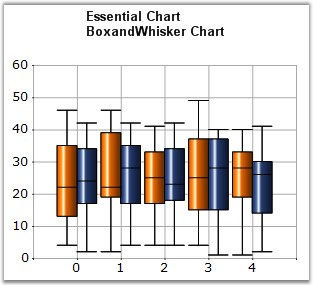

::: {style="DISPLAY: none"}
{#d2h_url_template}{#d2h_package_url style="WIDTH: 0px; DISPLAY: none; HEIGHT: 0px"}
:::

::::: {.d2h_secondary_topic style="PADDING-BOTTOM: 10pt; MARGIN: 0pt; PADDING-LEFT: 0pt; PADDING-RIGHT: 0pt; PADDING-TOP: 0pt"}
#### Box And Whisker Chart {#box-and-whisker-chart style="tab-stops: 0pt"}

 

In 1977, John Tukey published an efficient method for displaying a five-number data summary. The graph is called a Box and Whisker plot (also known as BoxPlot) and summarizes the following statistical measures.

 

[·      ]{style="FONT-FAMILY: Symbol"}median

[·      ]{style="FONT-FAMILY: Symbol"}upper and lower quartiles (75 percentile to 25 percentile)

[·      ]{style="FONT-FAMILY: Symbol"}minimum and maximum data values

 

The following is an example of a Box and Whisker plot.

 

{border="0"}

 

Figure 80: BoxAndWhisker Chart

 

The Box and Whisker plot is interpreted as follows.

 

[·      ]{style="FONT-FAMILY: Symbol"}The box itself contains the middle 50% of the data. The upper edge (hinge) of the box indicates the 75th percentile of the data set and the lower hinge indicates the 25th percentile. The range of the middle two quartiles is known as the inter-quartile range.

[·      ]{style="FONT-FAMILY: Symbol"}The line in the box indicates the median value of the data.

[·      ]{style="FONT-FAMILY: Symbol"}Box and Whisker chart has two modes, Normal mode and Percentile mode.

[·      ]{style="FONT-FAMILY: Symbol"}In Normal Mode, if the median line within the box is not equi-distant from the hinges, then the data is skewed. The ends of the vertical lines or \"whiskers\" indicate the minimum and maximum data values, unless outliers are present, in which case the whiskers extend to a maximum of 1.5 times the inter-quartile range.

[·      ]{style="FONT-FAMILY: Symbol"}In Percentile Mode: \[Set **Series1.ConfigItems.BoxAndWhiskerItem.PercentileMode** property to ***true***\], the ends of the vertical lines or \"whiskers\" will be decided by the Series1.ConfigItems.BoxAndWhiskerItem.Percentile property value. For example, if the \'Percentile\' value is 0.15, then the minimum value will be the 15th percentile of the overall data set and the maximum value will be 85th percentile of the overall data set.

::: {style="BORDER-BOTTOM: windowtext 1pt solid; BORDER-LEFT: medium none; PADDING-BOTTOM: 1pt; MARGIN-TOP: 9pt; PADDING-LEFT: 0pt; PADDING-RIGHT: 0pt; MARGIN-BOTTOM: 9pt; BORDER-TOP: windowtext 1pt solid; BORDER-RIGHT: medium none; PADDING-TOP: 1pt"}
Note:

1\. The percentile value should lie between 0.0 to 0.25.

2\. It is not possible to set upper Percentile value. It is calculated automatically based on the Percentile value.

     For Ex:

          Percentile = 0.15

          Upper Percentile = 1 - Percentile = 0.85.

In Normal mode, Outliers are present in which case the whiskers extend to a maximum of 1.5 times the inter-quartile range. But in Percentile mode, Outliers will be calculated based on the Percentile value.

     For example:

          Percentile = 0.15

Outliers are present in which case the whiskers extend to minimum and maximum of 15th and 85th percentile of overall data set, respectively. If \'Percentile\' value is Zero, then, there is no outliers in the Chart.

3\. The width of the Outliers can be adjusted by using this \'Series1.ConfigItems.BoxAndWhiskerItem.OutLierWidth\' property. If it is zero, the width of the outlier will be calculated based on the data points range.
:::

 

 

Chart Details

 

::: {align="center"}
+----------------------------------+--------------------------------------------------------------+
| Details                                                                                         |
+----------------------------------+--------------------------------------------------------------+
| **Number of Y values per point** | 5 (minimum, lower quartile, median, upper quartile, maximum) |
+----------------------------------+--------------------------------------------------------------+
| **Number of Series         **    | One or more                                                  |
+----------------------------------+--------------------------------------------------------------+
| **Cannot be Combined with   **   | Pie, Bar, Polar, Radar                                       |
+----------------------------------+--------------------------------------------------------------+
:::

 

Box and Whisker series can be added to the chart using the following code.

 

+---------------------------------------------------------------------------------------------------------------------------------------------------------------------+
| **[\[C#\]]{style="FONT-FAMILY: 'Courier New'; COLOR: black"}**                                                                                                      |
|                                                                                                                                                                     |
| []{style="COLOR: black; FONT-SIZE: 12pt"}                                                                                                                           |
|                                                                                                                                                                     |
| [// Create chart series and add data points into it.]{style="FONT-FAMILY: 'Courier New'; COLOR: green"}                                                             |
|                                                                                                                                                                     |
| [ChartSeries series1 = [this]{style="COLOR: blue"}.chartControl1.Model.NewSeries(\"Series 1\",ChartSeriesType.BoxAndWhisker );]{style="FONT-FAMILY: 'Courier New'"} |
|                                                                                                                                                                     |
| [series1.Points.Add(1, 5, 8 ,12, 15, 18);]{style="FONT-FAMILY: 'Courier New'"}                                                                                      |
|                                                                                                                                                                     |
| [series1.Points.Add(2, 4, 6, 10, 12, 14);]{style="FONT-FAMILY: 'Courier New'"}                                                                                      |
|                                                                                                                                                                     |
| [series1.Points.Add(3, 2, 4, 7, 14, 18);]{style="FONT-FAMILY: 'Courier New'"}                                                                                       |
|                                                                                                                                                                     |
| [                        ]{style="FONT-FAMILY: 'Courier New'"}                                                                                                      |
|                                                                                                                                                                     |
| [ChartSeries series2 = [this]{style="COLOR: blue"}.chartControl1.Model.NewSeries(\"Series 2\",ChartSeriesType.BoxAndWhisker );]{style="FONT-FAMILY: 'Courier New'"} |
|                                                                                                                                                                     |
| [series2.Points.Add(1, 6, 9, 15, 18, 20);]{style="FONT-FAMILY: 'Courier New'"}                                                                                      |
|                                                                                                                                                                     |
| [series2.Points.Add(2, 7, 9, 13, 15, 16);]{style="FONT-FAMILY: 'Courier New'"}                                                                                      |
|                                                                                                                                                                     |
| [series2.Points.Add(3, 6, 8, 10, 15, 19);]{style="FONT-FAMILY: 'Courier New'"}                                                                                      |
|                                                                                                                                                                     |
| []{style="FONT-FAMILY: 'Courier New'"}                                                                                                                              |
|                                                                                                                                                                     |
| [// Add the series to the chart series collection.]{style="FONT-FAMILY: 'Courier New'; COLOR: green"}                                                               |
|                                                                                                                                                                     |
| [this]{style="FONT-FAMILY: 'Courier New'; COLOR: blue"}[.chartControl1.Series.Add(series1);]{style="FONT-FAMILY: 'Courier New'"}                                    |
|                                                                                                                                                                     |
| [this]{style="FONT-FAMILY: 'Courier New'; COLOR: blue"}[.chartControl1.Series.Add(series2);]{style="FONT-FAMILY: 'Courier New'"}                                    |
+---------------------------------------------------------------------------------------------------------------------------------------------------------------------+

 

+--------------------------------------------------------------------------------------------------------------------------------------------------------------------------------------------------------------------------------------------------+
| **[\[VB.NET\]]{style="FONT-FAMILY: 'Courier New'; COLOR: black"}**                                                                                                                                                                               |
|                                                                                                                                                                                                                                                  |
| []{style="COLOR: black; FONT-SIZE: 12pt"}                                                                                                                                                                                                        |
|                                                                                                                                                                                                                                                  |
| [\' Create chart series and add data points into it.]{style="FONT-FAMILY: 'Courier New'; COLOR: green"}                                                                                                                                          |
|                                                                                                                                                                                                                                                  |
| [Dim]{style="FONT-FAMILY: 'Courier New'; COLOR: blue"}[ series1 [As]{style="COLOR: blue"} ChartSeries = [Me]{style="COLOR: blue"}.chartControl1.Model.NewSeries(\"Series 1\",ChartSeriesType.BoxAndWhisker)]{style="FONT-FAMILY: 'Courier New'"} |
|                                                                                                                                                                                                                                                  |
| [series1.Points.Add(1, 5, 8 ,12, 15, 18)]{style="FONT-FAMILY: 'Courier New'"}                                                                                                                                                                    |
|                                                                                                                                                                                                                                                  |
| [series1.Points.Add(2, 4, 6, 10, 12, 14)]{style="FONT-FAMILY: 'Courier New'"}                                                                                                                                                                    |
|                                                                                                                                                                                                                                                  |
| [series1.Points.Add(3, 2, 4, 7, 14, 18)]{style="FONT-FAMILY: 'Courier New'"}                                                                                                                                                                     |
|                                                                                                                                                                                                                                                  |
| []{style="FONT-FAMILY: 'Courier New'; COLOR: blue"}                                                                                                                                                                                              |
|                                                                                                                                                                                                                                                  |
| [Dim]{style="FONT-FAMILY: 'Courier New'; COLOR: blue"}[ series2 [As]{style="COLOR: blue"} ChartSeries = [Me]{style="COLOR: blue"}.chartControl1.Model.NewSeries(\"Series 2\",ChartSeriesType.BoxAndWhisker)]{style="FONT-FAMILY: 'Courier New'"} |
|                                                                                                                                                                                                                                                  |
| [series2.Points.Add(1, 6, 9, 15, 18, 20)]{style="FONT-FAMILY: 'Courier New'"}                                                                                                                                                                    |
|                                                                                                                                                                                                                                                  |
| [series2.Points.Add(2, 7, 9, 13, 15, 16)]{style="FONT-FAMILY: 'Courier New'"}                                                                                                                                                                    |
|                                                                                                                                                                                                                                                  |
| [series2.Points.Add(3, 6, 8, 10, 15, 19)]{style="FONT-FAMILY: 'Courier New'"}                                                                                                                                                                    |
|                                                                                                                                                                                                                                                  |
| []{style="FONT-FAMILY: 'Courier New'"}                                                                                                                                                                                                           |
|                                                                                                                                                                                                                                                  |
| [\' Add the series to the chart series collection.]{style="FONT-FAMILY: 'Courier New'; COLOR: green"}                                                                                                                                            |
|                                                                                                                                                                                                                                                  |
| [Me]{style="FONT-FAMILY: 'Courier New'; COLOR: blue"}[.chartControl1.Series.Add(series1)]{style="FONT-FAMILY: 'Courier New'"}                                                                                                                    |
|                                                                                                                                                                                                                                                  |
| [Me]{style="FONT-FAMILY: 'Courier New'; COLOR: blue"}[.chartControl1.Series.Add(series2)]{style="FONT-FAMILY: 'Courier New'"}                                                                                                                    |
+--------------------------------------------------------------------------------------------------------------------------------------------------------------------------------------------------------------------------------------------------+

 

+---------------------------------------------------------------------------------------------------------------------------------------------------------------------------------------------------------------------------------------------------------------------------------------------------------------------------------------------+
|                                                                                                                                                                                                                                                                                                                                             |
|                                                                                                                                                                                                                                                                                                                                             |
| Customization Options                                                                                                                                                                                                                                                                                                                       |
+---------------------------------------------------------------------------------------------------------------------------------------------------------------------------------------------------------------------------------------------------------------------------------------------------------------------------------------------+
| Border[, ]{style="COLOR: blue"}ColumnDrawMode, DisplayShadow, DisplayText, ElementBorders, HighlightInterior, ImageIndex, Images, LightAngle, LightColor, PhongAlpha, Rotate, Spacing, Spacing Between Series, ShadingMode, ShadowInterior, ShadowOffset, FancyToolTip, Font, Interior, LegendItem, Name, PointsToolTipFormat, SmartLabels, |
|                                                                                                                                                                                                                                                                                                                                             |
| Summary, Text, TextColor, TextFormat, TextOffset, TextOrientation, Visible                                                                                                                                                                                                                                                                  |
+---------------------------------------------------------------------------------------------------------------------------------------------------------------------------------------------------------------------------------------------------------------------------------------------------------------------------------------------+

 

[]{#p66} 

 

[]{#related-topics}
:::::
