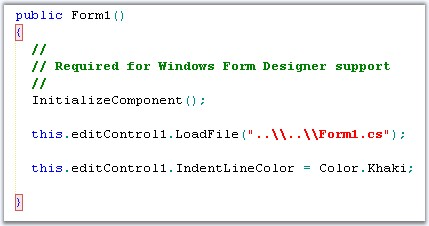
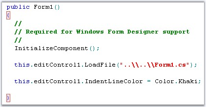
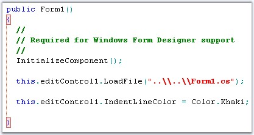

::: {style="DISPLAY: none"}
{#d2h_url_template}{#d2h_package_url style="WIDTH: 0px; DISPLAY: none; HEIGHT: 0px"}
:::

::::::: {.d2h_secondary_topic style="PADDING-BOTTOM: 10pt; MARGIN: 0pt; PADDING-LEFT: 0pt; PADDING-RIGHT: 0pt; PADDING-TOP: 0pt"}
#### Bracket Highlighting and Indentation Guidelines {#bracket-highlighting-and-indentation-guidelines style="tab-stops: 0pt"}

 

Edit Control has one of the most powerful and intelligent Bracket Highlighting and Indentation Guideline features. Edit Control is also capable of supporting language domains that have multiple languages, such as HTML or XML. Moreover, for each language, different brackets can be defined for highlighting. In C#, curly braces can be highlighted, while in HTML or XML, angled braces (for tags) can be highlighted.

 

Consider the following example.

 

+---------------------------------------------------------------------------------------------------------------------------------------------------------------------------+
| **[\[C#\]]{style="FONT-FAMILY: 'Courier New'; COLOR: black"}**                                                                                                            |
|                                                                                                                                                                           |
| []{style="FONT-FAMILY: 'Courier New'; COLOR: black"}                                                                                                                      |
|                                                                                                                                                                           |
| [public void]{style="FONT-FAMILY: 'Courier New'; COLOR: blue"}[ Test()]{style="FONT-FAMILY: 'Courier New'; COLOR: black"}                                                 |
|                                                                                                                                                                           |
| [{]{style="FONT-FAMILY: 'Courier New'; COLOR: black"}                                                                                                                     |
|                                                                                                                                                                           |
| [   ]{style="FONT-FAMILY: 'Courier New'; COLOR: black"}[string]{style="FONT-FAMILY: 'Courier New'; COLOR: blue"}[ str;]{style="FONT-FAMILY: 'Courier New'; COLOR: black"} |
|                                                                                                                                                                           |
| [   str = \"{\";]{style="FONT-FAMILY: 'Courier New'; COLOR: black"}                                                                                                       |
|                                                                                                                                                                           |
| [}]{style="FONT-FAMILY: 'Courier New'; COLOR: black"}                                                                                                                     |
+---------------------------------------------------------------------------------------------------------------------------------------------------------------------------+

 

If the cursor is positioned on the end curly brace, most editors will match to the open curly brace in the string. On the contrary, Edit Control matches to the open curly brace for the method.

 

The Bracket Highlighting and Indentation Guidelines functionalities are supported using the following APIs in the Edit Control.

 

[·      ]{style="FONT-FAMILY: Symbol"}ShowIndentationGuidelines

[·      ]{style="FONT-FAMILY: Symbol"}HideIndentationGuidelines

[·      ]{style="FONT-FAMILY: Symbol"}ShowIndentGuideline

[·      ]{style="FONT-FAMILY: Symbol"}IndentLineColor

[·      ]{style="FONT-FAMILY: Symbol"}IndentBlockHighlightingColor

[·      ]{style="FONT-FAMILY: Symbol"}IndentationBlockBackgroundBrush

[·      ]{style="FONT-FAMILY: Symbol"}IndentationBlockBorderColor

[·      ]{style="FONT-FAMILY: Symbol"}IndentationBlockBorderStyle

[·      ]{style="FONT-FAMILY: Symbol"}JumpToIndentBlockStart

[·      ]{style="FONT-FAMILY: Symbol"}JumpToIndentBlockEnd

[·      ]{style="FONT-FAMILY: Symbol"}OnlyHighlightMatchingBraces

 

The preceding APIs are explained below in detail.

 

The indentation guidelines are vertical lines that connect the matching brackets. This feature enhances the readability of code.

 

::: {align="center"}
  --------------------------- ------------------------------------------------------------------------------
  Edit Control Property       Description
  ShowIndentationGuidelines   Gets / sets value indicating whether indentation guidelines should be shown.
  --------------------------- ------------------------------------------------------------------------------
:::

 

The indentation guidelines can be turned on by setting the **ShowIndentationGuidelines** property to **True**. It can be turned off either by setting this property to **False**, or by invoking the **HideIndentGuideline** method.

 

Also, the indent guideline for the current region can be set by using the **ShowIndentGuideline** method.

 

::: {align="center"}
  --------------------- ------------------------------------------------------------
  Edit Control Method   Description
  HideIndentGuideline   Hides indentation guideline.
  ShowIndentGuideline   If possible, shows indent guideline of the current region.
  --------------------- ------------------------------------------------------------
:::

[]{style="FONT-FAMILY: 'Trebuchet MS','sans-serif'; COLOR: #15428b; FONT-SIZE: 9pt"} 

+---------------------------------------------------------------------------------------------------------------------------------------------------------------------+
| **[\[C#\]]{style="FONT-FAMILY: 'Courier New'; COLOR: black"}**                                                                                                      |
|                                                                                                                                                                     |
| []{style="FONT-FAMILY: 'Courier New'; COLOR: black"}                                                                                                                |
|                                                                                                                                                                     |
| [// Indentation Guidelines are displayed.]{style="FONT-FAMILY: 'Courier New'; COLOR: green"}                                                                        |
|                                                                                                                                                                     |
| [this]{style="FONT-FAMILY: 'Courier New'; COLOR: blue"}[.editControl1.ShowIndentationGuidelines = [true]{style="COLOR: blue"};]{style="FONT-FAMILY: 'Courier New'"} |
|                                                                                                                                                                     |
| []{style="FONT-FAMILY: 'Courier New'"}                                                                                                                              |
|                                                                                                                                                                     |
| [// Hide Indentation Guideline.]{style="FONT-FAMILY: 'Courier New'; COLOR: green"}                                                                                  |
|                                                                                                                                                                     |
| [this]{style="FONT-FAMILY: 'Courier New'; COLOR: blue"}[.editControl1.HideIndentGuideline();]{style="FONT-FAMILY: 'Courier New'"}                                   |
|                                                                                                                                                                     |
| []{style="FONT-FAMILY: 'Courier New'"}                                                                                                                              |
|                                                                                                                                                                     |
| [// Show Indentation Guideline.]{style="FONT-FAMILY: 'Courier New'; COLOR: green"}                                                                                  |
|                                                                                                                                                                     |
| [this]{style="FONT-FAMILY: 'Courier New'; COLOR: blue"}[.editControl1.ShowIndentGuideline();]{style="FONT-FAMILY: 'Courier New'"}                                   |
+---------------------------------------------------------------------------------------------------------------------------------------------------------------------+

[]{style="FONT-FAMILY: 'Trebuchet MS','sans-serif'; COLOR: #15428b; FONT-SIZE: 9pt"} 

+------------------------------------------------------------------------------------------------------------------------------------------------------------------+
| **[\[VB.NET\]]{style="FONT-FAMILY: 'Courier New'; COLOR: black"}**                                                                                               |
|                                                                                                                                                                  |
| []{style="FONT-FAMILY: 'Courier New'; COLOR: black"}                                                                                                             |
|                                                                                                                                                                  |
| [\' Indentation Guidelines are displayed.]{style="FONT-FAMILY: 'Courier New'; COLOR: green"}                                                                     |
|                                                                                                                                                                  |
| [Me]{style="FONT-FAMILY: 'Courier New'; COLOR: blue"}[.editControl1.ShowIndentationGuidelines = [True]{style="COLOR: blue"}]{style="FONT-FAMILY: 'Courier New'"} |
|                                                                                                                                                                  |
| []{style="FONT-FAMILY: 'Courier New'; COLOR: blue"}                                                                                                              |
|                                                                                                                                                                  |
| [\' Hide Indentation Guideline.]{style="FONT-FAMILY: 'Courier New'; COLOR: green"}                                                                               |
|                                                                                                                                                                  |
| [Me]{style="FONT-FAMILY: 'Courier New'; COLOR: blue"}[.editControl1.HideIndentGuideline()]{style="FONT-FAMILY: 'Courier New'"}                                   |
|                                                                                                                                                                  |
| []{style="FONT-FAMILY: 'Courier New'; COLOR: green"}                                                                                                             |
|                                                                                                                                                                  |
| [\' Show Indentation Guideline.]{style="FONT-FAMILY: 'Courier New'; COLOR: green"}                                                                               |
|                                                                                                                                                                  |
| [Me]{style="FONT-FAMILY: 'Courier New'; COLOR: blue"}[.editControl1.ShowIndentGuideline()]{style="FONT-FAMILY: 'Courier New'"}                                   |
+------------------------------------------------------------------------------------------------------------------------------------------------------------------+

 

**Bracket Highlighting**

 

The bracket highlighting feature can be turned on by enabling the **ShowIndentationGuidelines** and **OnlyHighlightMatchingBraces** properties. Setting the **OnlyHighlightMatchingBraces** property to **True**, enables bracket highlighting whereas the indentation guidelines are not displayed.

 

{border="0"}

Figure 26: Bracket Highlighting with Indentation Guidelines

[]{style="FONT-FAMILY: 'Trebuchet MS','sans-serif'; COLOR: #15428b; FONT-SIZE: 9pt"} 

{border="0"}

Figure 27: Bracket Highlighting without Indentation Guidelines

 

Customizing the Appearance

 

It is possible to specify custom colors for the indentation guidelines and bracket highlighting blocks by using the below given properties.

 

::: {align="center"}
  --------------------------------- --------------------------------------------------------------
  Edit Control Property             Description
  IndentLineColor                   Specifies color of the indent line.
  IndentBlockHighlightingColor      Specifies color of the indent block start and end.
  IndentationBlockBackgroundBrush   Gets / sets brush for indentation block background.
  IndentationBlockBorderColor       Specifies color of indentation block border line.
  IndentationBlockBorderStyle       Specifies style of indentation block border line.
  ShowIndentationBlockBorders       Specifies whether indentation block borders should be drawn.
  --------------------------------- --------------------------------------------------------------
:::

[]{style="FONT-FAMILY: 'Trebuchet MS','sans-serif'; COLOR: #15428b; FONT-SIZE: 9pt"} 

+--------------------------------------------------------------------------------------------------------------------------------------------------------------------------------------------------------------------------------------------------------------------------------------------------------------------------------------------------------------------------------------------------------------------+
| **[\[C#\]]{style="FONT-FAMILY: 'Courier New'; COLOR: black"}**                                                                                                                                                                                                                                                                                                                                                     |
|                                                                                                                                                                                                                                                                                                                                                                                                                    |
| []{style="FONT-FAMILY: 'Courier New'; COLOR: black"}                                                                                                                                                                                                                                                                                                                                                               |
|                                                                                                                                                                                                                                                                                                                                                                                                                    |
| [this]{style="FONT-FAMILY: 'Courier New'; COLOR: blue"}[.editControl1.IndentLineColor = [Color]{style="COLOR: teal"}.OrangeRed;]{style="FONT-FAMILY: 'Courier New'"}                                                                                                                                                                                                                                               |
|                                                                                                                                                                                                                                                                                                                                                                                                                    |
| [this]{style="FONT-FAMILY: 'Courier New'; COLOR: blue"}[.editControl1.IndentBlockHighlightingColor = [Color]{style="COLOR: teal"}.IndianRed;]{style="FONT-FAMILY: 'Courier New'"}                                                                                                                                                                                                                                  |
|                                                                                                                                                                                                                                                                                                                                                                                                                    |
| [this]{style="FONT-FAMILY: 'Courier New'; COLOR: blue"}[.editControl1.IndentationBlockBackgroundBrush = [new]{style="COLOR: blue"} Syncfusion.Drawing.[BrushInfo]{style="COLOR: teal"}(Syncfusion.Drawing.[GradientStyle]{style="COLOR: teal"}.BackwardDiagonal, System.Drawing.[SystemColors]{style="COLOR: teal"}.Info, System.Drawing.[Color]{style="COLOR: teal"}.Khaki);]{style="FONT-FAMILY: 'Courier New'"} |
|                                                                                                                                                                                                                                                                                                                                                                                                                    |
| [this]{style="FONT-FAMILY: 'Courier New'; COLOR: blue"}[.editControl1.IndentationBlockBorderColor = System.Drawing.[Color]{style="COLOR: teal"}.Crimson;]{style="FONT-FAMILY: 'Courier New'"}                                                                                                                                                                                                                      |
|                                                                                                                                                                                                                                                                                                                                                                                                                    |
| [this]{style="FONT-FAMILY: 'Courier New'; COLOR: blue"}[.editControl1.IndentationBlockBorderStyle = Syncfusion.Windows.Forms.Edit.Enums.[FrameBorderStyle]{style="COLOR: teal"}.DashDot;]{style="FONT-FAMILY: 'Courier New'"}                                                                                                                                                                                      |
|                                                                                                                                                                                                                                                                                                                                                                                                                    |
| [this]{style="FONT-FAMILY: 'Courier New'; COLOR: blue"}[.editControl1.ShowIndentationBlockBorders = [true]{style="COLOR: blue"};]{style="FONT-FAMILY: 'Courier New'"}                                                                                                                                                                                                                                              |
+--------------------------------------------------------------------------------------------------------------------------------------------------------------------------------------------------------------------------------------------------------------------------------------------------------------------------------------------------------------------------------------------------------------------+

[]{style="FONT-FAMILY: 'Trebuchet MS','sans-serif'; COLOR: #15428b; FONT-SIZE: 9pt"} 

+---------------------------------------------------------------------------------------------------------------------------------------------------------------------------------------------------------------------------------------------------------------------------------------------------------------------+
| **[\[VB.NET\]]{style="FONT-FAMILY: 'Courier New'; COLOR: black"}**                                                                                                                                                                                                                                                  |
|                                                                                                                                                                                                                                                                                                                     |
| []{style="FONT-FAMILY: 'Courier New'; COLOR: black"}                                                                                                                                                                                                                                                                |
|                                                                                                                                                                                                                                                                                                                     |
| [Me]{style="FONT-FAMILY: 'Courier New'; COLOR: blue"}[.editControl1.IndentLineColor = Color.OrangeRed]{style="FONT-FAMILY: 'Courier New'"}                                                                                                                                                                          |
|                                                                                                                                                                                                                                                                                                                     |
| [Me]{style="FONT-FAMILY: 'Courier New'; COLOR: blue"}[.editControl1.IndentBlockHighlightingColor = Color.IndianRed]{style="FONT-FAMILY: 'Courier New'"}                                                                                                                                                             |
|                                                                                                                                                                                                                                                                                                                     |
| [Me]{style="FONT-FAMILY: 'Courier New'; COLOR: blue"}[.editControl1.IndentationBlockBackgroundBrush = [New]{style="COLOR: blue"} Syncfusion.Drawing.BrushInfo(Syncfusion.Drawing.GradientStyle.BackwardDiagonal, System.Drawing.SystemColors.Info, System.Drawing.Color.Khaki)]{style="FONT-FAMILY: 'Courier New'"} |
|                                                                                                                                                                                                                                                                                                                     |
| [Me]{style="FONT-FAMILY: 'Courier New'; COLOR: blue"}[.editControl1.IndentationBlockBorderColor = System.Drawing.Color.Crimson]{style="FONT-FAMILY: 'Courier New'"}                                                                                                                                                 |
|                                                                                                                                                                                                                                                                                                                     |
| [Me]{style="FONT-FAMILY: 'Courier New'; COLOR: blue"}[.editControl1.IndentationBlockBorderStyle = Syncfusion.Windows.Forms.Edit.Enums.FrameBorderStyle.DashDot]{style="FONT-FAMILY: 'Courier New'"}                                                                                                                 |
|                                                                                                                                                                                                                                                                                                                     |
| [Me]{style="FONT-FAMILY: 'Courier New'; COLOR: blue"}[.editControl1.ShowIndentationBlockBorders = [True]{style="COLOR: blue"}]{style="FONT-FAMILY: 'Courier New'"}                                                                                                                                                  |
+---------------------------------------------------------------------------------------------------------------------------------------------------------------------------------------------------------------------------------------------------------------------------------------------------------------------+

[]{style="FONT-FAMILY: 'Trebuchet MS','sans-serif'; COLOR: #15428b; FONT-SIZE: 9pt"} 

{border="0"}

Figure 28: IndentLineColor = \"OrangeRed\"; IndentBlockHighlightingColor = \"IndianRed\"

 

Positioning

 

It is also possible to position the caret at the beginning or end of the indentation block by using the **JumpToIndentBlockStart** and **JumpToIndentBlockEnd** methods respectively.

[]{style="FONT-FAMILY: 'Trebuchet MS','sans-serif'; COLOR: #15428b; FONT-SIZE: 9pt"} 

::: {align="center"}
  ------------------------ ----------------------------------
  Edit Control Method      Description
  JumpToIndentBlockStart   Jumps to the start of the block.
  JumpToIndentBlockEnd     Jumps to the end of the block.
  ------------------------ ----------------------------------
:::

 

Refer to the Indentation Guidelines Demo sample for more information in this regard.

 

***..\\My Documents\\Syncfusion\\EssentialStudio\\Version Number\\Windows\\Edit.Windows\\Samples\\2.0\\Text Navigation\\IndentationGuidelinesDemo***

 

[]{#p47} 

[]{#related-topics}
:::::::
