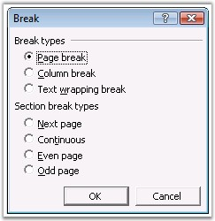

::: {style="DISPLAY: none"}
{#d2h_url_template}{#d2h_package_url style="WIDTH: 0px; DISPLAY: none; HEIGHT: 0px"}
:::

:::::: {.d2h_secondary_topic style="PADDING-BOTTOM: 10pt; MARGIN: 0pt; PADDING-LEFT: 0pt; PADDING-RIGHT: 0pt; PADDING-TOP: 0pt"}
#### Break {#break style="tab-stops: 0pt"}

 

**Break** class represents a break in the Word document. To insert a break, open the **Insert** menu and click **Break** in Microsoft Word.

 

{border="0"}

Figure 68: Break Dialog Box

 

You can use the **AppendBreak** function of WParagraph to insert a break by using DocIO. **BreakType** property specifies the type of the break. The following are the types of breaks supported by the Break class.

 

[·      ]{style="FONT-FAMILY: Symbol"}PageBreak

[·      ]{style="FONT-FAMILY: Symbol"}ColumnBreak

[·      ]{style="FONT-FAMILY: Symbol"}LineBreak

 

::: {style="BORDER-BOTTOM: windowtext 1pt solid; BORDER-LEFT: medium none; PADDING-BOTTOM: 1pt; MARGIN-TOP: 9pt; PADDING-LEFT: 0pt; PADDING-RIGHT: 0pt; MARGIN-BOTTOM: 9pt; BORDER-TOP: windowtext 1pt solid; BORDER-RIGHT: medium none; PADDING-TOP: 1pt"}
{border="0"}Note: Now, direct support is provided to insert section breaks. Section breaks are inserted by calling the method InsertSectionBreak.
:::

 

Class Hierarchy

 

ParagraphItem

            \|

            WSymbol

 

Public Constructors

 

::: {align="center"}
  ---------------------------------------- --------------------------------------------------
  Name                                     Description
  Break.Break (IWordDocument)              Initializes a new instance of the Break class.  
  Break.Break (IWordDocument, BreakType)   Initializes a new instance of the Break class.  
  ---------------------------------------- --------------------------------------------------
:::

 

Public Properties

 

::: {align="center"}
  ------------ -------------------------------
  **Name**     **Description**
  BreakType    Gets the type of the break.  
  EntityType   Gets the type of the entity.
  ------------ -------------------------------
:::

 

The following example illustrates how to use the Break class.

 

+--------------------------------------------------------------------------------------------------------------------------------------------------------------------------------+
| **[\[C#\]]{style="FONT-FAMILY: 'Courier New'; COLOR: black"}**                                                                                                                 |
|                                                                                                                                                                                |
| []{style="COLOR: black"}                                                                                                                                                       |
|                                                                                                                                                                                |
| [IWordDocument]{style="FONT-FAMILY: 'Courier New'; COLOR: teal"}[ doc = [new]{style="COLOR: blue"} [WordDocument]{style="COLOR: teal"}();]{style="FONT-FAMILY: 'Courier New'"} |
|                                                                                                                                                                                |
| [IWSection]{style="FONT-FAMILY: 'Courier New'; COLOR: teal"}[ section = doc.AddSection();]{style="FONT-FAMILY: 'Courier New'"}                                                 |
|                                                                                                                                                                                |
| [IWParagraph]{style="FONT-FAMILY: 'Courier New'; COLOR: teal"}[ para = section.AddParagraph();]{style="FONT-FAMILY: 'Courier New'"}                                            |
|                                                                                                                                                                                |
| []{style="FONT-FAMILY: 'Courier New'"}                                                                                                                                         |
|                                                                                                                                                                                |
| [para.AppendText([\"Before line break\"]{style="COLOR: maroon"});]{style="FONT-FAMILY: 'Courier New'"}                                                                         |
|                                                                                                                                                                                |
| [para.AppendBreak([BreakType]{style="COLOR: teal"}.LineBreak);]{style="FONT-FAMILY: 'Courier New'"}                                                                            |
|                                                                                                                                                                                |
| [para.AppendText([\"After line break\"]{style="COLOR: maroon"});]{style="FONT-FAMILY: 'Courier New'"}                                                                          |
|                                                                                                                                                                                |
| []{style="FONT-FAMILY: 'Courier New'"}                                                                                                                                         |
|                                                                                                                                                                                |
| [IWParagraph]{style="FONT-FAMILY: 'Courier New'; COLOR: teal"}[ pageBreakPara = section.AddParagraph();]{style="FONT-FAMILY: 'Courier New'"}                                   |
|                                                                                                                                                                                |
| [pageBreakPara.AppendText([\"Before page break\"]{style="COLOR: maroon"});]{style="FONT-FAMILY: 'Courier New'"}                                                                |
|                                                                                                                                                                                |
| [pageBreakPara.AppendBreak([BreakType]{style="COLOR: teal"}.PageBreak);]{style="FONT-FAMILY: 'Courier New'"}                                                                   |
|                                                                                                                                                                                |
| [pageBreakPara.AppendText([\"After page break\"]{style="COLOR: maroon"});                      ]{style="FONT-FAMILY: 'Courier New'"}                                           |
|                                                                                                                                                                                |
| []{style="FONT-FAMILY: 'Courier New'"}                                                                                                                                         |
|                                                                                                                                                                                |
| [doc.Save([\"Breaks.doc\"]{style="COLOR: maroon"});]{style="FONT-FAMILY: 'Courier New'"}                                                                                       |
+--------------------------------------------------------------------------------------------------------------------------------------------------------------------------------+

 

+--------------------------------------------------------------------------------------------------------------------------------------------------------------------------------------+
| **[\[VB.NET\]]{style="FONT-FAMILY: 'Courier New'; COLOR: black"}**                                                                                                                   |
|                                                                                                                                                                                      |
| []{style="COLOR: black"}                                                                                                                                                             |
|                                                                                                                                                                                      |
| [Dim]{style="FONT-FAMILY: 'Courier New'; COLOR: blue"}[ doc [As]{style="COLOR: blue"} IWordDocument = [New]{style="COLOR: blue"} WordDocument()]{style="FONT-FAMILY: 'Courier New'"} |
|                                                                                                                                                                                      |
| [Dim]{style="FONT-FAMILY: 'Courier New'; COLOR: blue"}[ section [As]{style="COLOR: blue"} IWSection = doc.AddSection()]{style="FONT-FAMILY: 'Courier New'"}                          |
|                                                                                                                                                                                      |
| [Dim]{style="FONT-FAMILY: 'Courier New'; COLOR: blue"}[ para [As]{style="COLOR: blue"} IWParagraph = section.AddParagraph()]{style="FONT-FAMILY: 'Courier New'"}                     |
|                                                                                                                                                                                      |
| []{style="FONT-FAMILY: 'Courier New'"}                                                                                                                                               |
|                                                                                                                                                                                      |
| [para.AppendText([\"Before line break\"]{style="COLOR: maroon"})]{style="FONT-FAMILY: 'Courier New'"}                                                                                |
|                                                                                                                                                                                      |
| [para.AppendBreak(BreakType.LineBreak)]{style="FONT-FAMILY: 'Courier New'"}                                                                                                          |
|                                                                                                                                                                                      |
| [para.AppendText([\"After line break\"]{style="COLOR: maroon"})]{style="FONT-FAMILY: 'Courier New'"}                                                                                 |
|                                                                                                                                                                                      |
| []{style="FONT-FAMILY: 'Courier New'"}                                                                                                                                               |
|                                                                                                                                                                                      |
| [Dim]{style="FONT-FAMILY: 'Courier New'; COLOR: blue"}[ pageBreakPara [As]{style="COLOR: blue"} IWParagraph = section.AddParagraph()]{style="FONT-FAMILY: 'Courier New'"}            |
|                                                                                                                                                                                      |
| [pageBreakPara.AppendText([\"Before page break\"]{style="COLOR: maroon"})]{style="FONT-FAMILY: 'Courier New'"}                                                                       |
|                                                                                                                                                                                      |
| [pageBreakPara.AppendBreak(BreakType.PageBreak)]{style="FONT-FAMILY: 'Courier New'"}                                                                                                 |
|                                                                                                                                                                                      |
| [pageBreakPara.AppendText([\"After page break\"]{style="COLOR: maroon"})]{style="FONT-FAMILY: 'Courier New'"}                                                                        |
|                                                                                                                                                                                      |
| []{style="FONT-FAMILY: 'Courier New'"}                                                                                                                                               |
|                                                                                                                                                                                      |
| [doc.Save([\"Breaks.doc\"]{style="COLOR: maroon"})]{style="FONT-FAMILY: 'Courier New'"}                                                                                              |
+--------------------------------------------------------------------------------------------------------------------------------------------------------------------------------------+

[]{#_Table_Of_Contents}[]{#_OLE_Object} 

[]{#related-topics}
::::::
