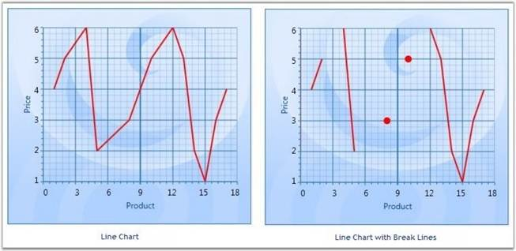

::: {style="DISPLAY: none"}
{#d2h_url_template}{#d2h_package_url style="WIDTH: 0px; DISPLAY: none; HEIGHT: 0px"}
:::

::::: {.d2h_secondary_topic style="PADDING-BOTTOM: 10pt; MARGIN: 0pt; PADDING-LEFT: 0pt; PADDING-RIGHT: 0pt; PADDING-TOP: 0pt"}
##### Break Lines {#break-lines style="tab-stops: 0pt"}

Line charts with missing data points can be drawn with gaps for the missing points. When there is a huge gap between consecutive points, we could make the lines break for more clarity.

 

**SetBreakLineForNonIndexedData** is used to specify whether the line segments could be drawn with break lines. **SetBreakLineForDoublePointsDistanceMoreThan** is used to set the distance for lines that should be broken.

 

+----------------------------------------------------------------------------------------------------------------------------------------------------------------+
| **[\[C#\]]{style="FONT-FAMILY: 'Courier New'; FONT-SIZE: 9pt"}**                                                                                               |
|                                                                                                                                                                |
| []{style="FONT-FAMILY: 'Courier New'; FONT-SIZE: 9pt"}                                                                                                         |
|                                                                                                                                                                |
| [ChartLineType.SetBreakLineForNonIndexedData(Chart1.Areas\[0\].Series\[0\], [true]{style="COLOR: blue"});]{style="FONT-FAMILY: 'Courier New'; FONT-SIZE: 9pt"} |
|                                                                                                                                                                |
| [ChartLineType.SetBreakLineForDoublePointsDistanceMoreThan(Chart1.Areas\[0\].Series\[0\], 1);]{style="FONT-FAMILY: 'Courier New'; FONT-SIZE: 9pt"}             |
+----------------------------------------------------------------------------------------------------------------------------------------------------------------+

 

If the data given are 1, 2, 4, 5, 8, 10, 12, 13, 14, 15, 16, 17 and the SetBreakLineForDoublePointsDistanceMoreThan is passed with a value 1, all points that don\'t have a point after 1 will not be drawn. Below screen shot shows the output for this data.

 

{border="0"}

Figure 162: Line Segments in the Line Chart drawn with Break Lines

[]{style="FONT-FAMILY: 'Trebuchet MS','sans-serif'; COLOR: #15428b; FONT-SIZE: 9pt"} 

::: {style="BORDER-BOTTOM: windowtext 1pt solid; BORDER-LEFT: medium none; PADDING-BOTTOM: 1pt; MARGIN-TOP: 9pt; PADDING-LEFT: 0pt; PADDING-RIGHT: 0pt; MARGIN-BOTTOM: 9pt; BORDER-TOP: windowtext 1pt solid; BORDER-RIGHT: medium none; PADDING-TOP: 1pt"}
{border="0"}Note: This feature can be applied for both Line and Spline type charts. This can be applied for both Double and DateTime type axis values.
:::

[]{style="FONT-FAMILY: 'Trebuchet MS','sans-serif'; COLOR: #15428b; FONT-SIZE: 9pt"} 

Break Lines for Spline Type

[]{style="FONT-FAMILY: 'Trebuchet MS','sans-serif'; COLOR: #15428b; FONT-SIZE: 9pt"} 

+------------------------------------------------------------------------------------------------------------------------------------------------------------------+
| **[\[C#\]]{style="FONT-FAMILY: 'Courier New'; FONT-SIZE: 9pt"}**                                                                                                 |
|                                                                                                                                                                  |
| []{style="FONT-FAMILY: 'Courier New'; FONT-SIZE: 9pt"}                                                                                                           |
|                                                                                                                                                                  |
| [ChartSplineType.SetBreakLineForNonIndexedData(Chart1.Areas\[0\].Series\[0\], [true]{style="COLOR: blue"});]{style="FONT-FAMILY: 'Courier New'; FONT-SIZE: 9pt"} |
|                                                                                                                                                                  |
| [ChartSplineType.SetBreakLineForDoublePointsDistanceMoreThan(Chart1.Areas\[0\].Series\[0\], 1);]{style="FONT-FAMILY: 'Courier New'; FONT-SIZE: 9pt"}             |
+------------------------------------------------------------------------------------------------------------------------------------------------------------------+

[]{style="FONT-FAMILY: 'Trebuchet MS','sans-serif'; COLOR: #15428b; FONT-SIZE: 9pt"} 

The below given code could be used to specify the break distance for axis with DateTime ValueTypes.

[]{style="FONT-FAMILY: 'Trebuchet MS','sans-serif'; COLOR: #15428b; FONT-SIZE: 9pt"} 

+--------------------------------------------------------------------------------------------------------------------------------------------------------------------------------------------------------------------------------+
| **[\[C#\]]{style="FONT-FAMILY: 'Courier New'; FONT-SIZE: 9pt"}**                                                                                                                                                               |
|                                                                                                                                                                                                                                |
| []{style="FONT-FAMILY: 'Courier New'; FONT-SIZE: 9pt"}                                                                                                                                                                         |
|                                                                                                                                                                                                                                |
| [ChartLineType.SetBreakLineForTimeSpanPointsDistanceMoreThan(Chart2.Areas\[0\].Series\[0\], [new]{style="COLOR: blue"} [TimeSpan]{style="COLOR: #2b91af"}(1, 0, 0, 0));]{style="FONT-FAMILY: 'Courier New'; FONT-SIZE: 9pt"}   |
|                                                                                                                                                                                                                                |
| [ChartSplineType.SetBreakLineForTimeSpanPointsDistanceMoreThan(Chart2.Areas\[0\].Series\[0\], [new]{style="COLOR: blue"} [TimeSpan]{style="COLOR: #2b91af"}(1, 0, 0, 0));]{style="FONT-FAMILY: 'Courier New'; FONT-SIZE: 9pt"} |
+--------------------------------------------------------------------------------------------------------------------------------------------------------------------------------------------------------------------------------+

[]{style="FONT-FAMILY: 'Trebuchet MS','sans-serif'; COLOR: #15428b; FONT-SIZE: 9pt"} 

::: {style="BORDER-BOTTOM: windowtext 1pt solid; BORDER-LEFT: medium none; PADDING-BOTTOM: 1pt; MARGIN-TOP: 9pt; PADDING-LEFT: 0pt; PADDING-RIGHT: 0pt; MARGIN-BOTTOM: 9pt; BORDER-TOP: windowtext 1pt solid; BORDER-RIGHT: medium none; PADDING-TOP: 1pt"}
{border="0"}Note: This feature can be applied for non-indexed data alone. It cannot be applied for 3D charts.
:::

 

 

 

[]{#related-topics}
:::::
