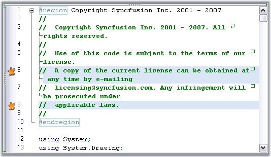

::: {style="DISPLAY: none"}
{#d2h_url_template}{#d2h_package_url style="WIDTH: 0px; DISPLAY: none; HEIGHT: 0px"}
:::

::::: {#nsbanner .d2h_main_nsbanner style="BORDER-BOTTOM: #999999 1px solid; POSITION: relative; PADDING-BOTTOM: 0px; BACKGROUND-COLOR: transparent; PADDING-LEFT: 0px; PADDING-RIGHT: 0px; DISPLAY: none; BORDER-TOP: #999999 1px solid; PADDING-TOP: 0px; LEFT: 0px"}
:::: {#TitleRow .d2h_main_titlerow style="PADDING-BOTTOM: 4px; BACKGROUND-COLOR: transparent; PADDING-LEFT: 22px; WIDTH: 100%; PADDING-RIGHT: 10px; DISPLAY: none; PADDING-TOP: 4px"}
::: {#ienav .d2h_main_ienav style="DISPLAY: none"}
{#D2HPrevious .D2HPreviousEnabled}  {#D2HNext .D2HNextEnabled}
:::
::::
:::::

:::: {#nstext .d2h_main_nstext style="PADDING-BOTTOM: 10px; BACKGROUND-COLOR: transparent; PADDING-LEFT: 22px; PADDING-RIGHT: 10px; HEIGHT: 100%; OVERFLOW: auto; PADDING-TOP: 5px" hasuserbackground="true" valign="bottom"}
::: {#d2h_breadcrumbs .d2h_breadcrumbs}
[Essential Studio User Guide Documentation](ms-xhelp:///?Id=12457748-09e3-4d74-a240-8e049cedf030){.d2h_breadcrumbsNormal}[ \> ]{.d2h_breadcrumbsLinkSeparator}[User Interface Edition](ms-xhelp:///?Id=c29296b7-531c-413b-a0ec-488ca1f7f669){.d2h_breadcrumbsNormal}[ \> ]{.d2h_breadcrumbsLinkSeparator}[Essential Windows](ms-xhelp:///?Id=e60759d8-47a4-4570-9d7a-16a68d63f2ea){.d2h_breadcrumbsNormal}[ \> ]{.d2h_breadcrumbsLinkSeparator}[Essential Edit]{.d2h_breadcrumbsContentsOnly}[ \> ]{.d2h_breadcrumbsLinkSeparator}[Concepts And Features](ms-xhelp:///?Id=7c39cee6-8434-4711-a18e-efaba8ac85c0){.d2h_breadcrumbsNormal}[ \> ]{.d2h_breadcrumbsLinkSeparator}[Text Visualization](ms-xhelp:///?Id=03937960-0195-4ded-b842-e48212f822d3){.d2h_breadcrumbsNormal}
:::

### Break Points {#break-points style="tab-stops: 0pt"}

 

Essential Edit allows you to set a pause at some specified location in the Edit Control by using the **Break Points** feature. This is done by combining the [Line Background]{.UGHyperlink} and Custom Indicator features. **IndicatorMarginClick** event can be handled to insert a break point.

 

+--------------------------------------------------------------------------------------------------------------------------------------------------------------------------------------------------------------------------------------------------------------------------------------+
| **[\[C#\]]{style="FONT-FAMILY: 'Courier New'; COLOR: black"}**                                                                                                                                                                                                                       |
|                                                                                                                                                                                                                                                                                      |
| []{style="FONT-FAMILY: 'Courier New'; COLOR: black"}                                                                                                                                                                                                                                 |
|                                                                                                                                                                                                                                                                                      |
| [private]{style="FONT-FAMILY: 'Courier New'; COLOR: blue"}[ [void]{style="COLOR: blue"} editControl1_IndicatorMarginClick([object]{style="COLOR: blue"} sender, Syncfusion.Windows.Forms.Edit.[IndicatorClickEventArgs]{style="COLOR: teal"} e)]{style="FONT-FAMILY: 'Courier New'"} |
|                                                                                                                                                                                                                                                                                      |
| [{]{style="FONT-FAMILY: 'Courier New'"}                                                                                                                                                                                                                                              |
|                                                                                                                                                                                                                                                                                      |
| [// Set breakpoint indicator.]{style="FONT-FAMILY: 'Courier New'; COLOR: green"}                                                                                                                                                                                                     |
|                                                                                                                                                                                                                                                                                      |
| [this]{style="FONT-FAMILY: 'Courier New'; COLOR: blue"}[.editControl1.SetCustomBookmark(e.LineIndex, [new]{style="COLOR: blue"} BookmarkPaintEventHandler(CustomBookmarkPainter));]{style="FONT-FAMILY: 'Courier New'"}                                                              |
|                                                                                                                                                                                                                                                                                      |
| [                        ]{style="FONT-FAMILY: 'Courier New'"}                                                                                                                                                                                                                       |
|                                                                                                                                                                                                                                                                                      |
| [// Highlight the relevant line.]{style="FONT-FAMILY: 'Courier New'; COLOR: green"}                                                                                                                                                                                                  |
|                                                                                                                                                                                                                                                                                      |
| [IBackgroundFormat format = [this]{style="COLOR: blue"}.editControl1.RegisterBackColorFormat(color, [Color]{style="COLOR: teal"}.Transparent);]{style="FONT-FAMILY: 'Courier New'"}                                                                                                  |
|                                                                                                                                                                                                                                                                                      |
| [this]{style="FONT-FAMILY: 'Courier New'; COLOR: blue"}[.editControl1.SetLineBackColor(e.LineIndex, [true]{style="COLOR: blue"}, format);]{style="FONT-FAMILY: 'Courier New'"}                                                                                                       |
|                                                                                                                                                                                                                                                                                      |
| [}]{style="FONT-FAMILY: 'Courier New'"}                                                                                                                                                                                                                                              |
+--------------------------------------------------------------------------------------------------------------------------------------------------------------------------------------------------------------------------------------------------------------------------------------+

[]{style="FONT-FAMILY: 'Trebuchet MS','sans-serif'; COLOR: #15428b; FONT-SIZE: 9pt"} 

+------------------------------------------------------------------------------------------------------------------------------------------------------------------------------------------------------------------------------------+
| **[\[VB.NET\]]{style="FONT-FAMILY: 'Courier New'; COLOR: black"}**                                                                                                                                                                 |
|                                                                                                                                                                                                                                    |
| []{style="FONT-FAMILY: 'Courier New'; COLOR: black"}                                                                                                                                                                               |
|                                                                                                                                                                                                                                    |
| [Private Sub editControl1_IndicatorMarginClick(sender As Object, e As Syncfusion.Windows.Forms.Edit.[IndicatorClickEventArgs]{style="COLOR: teal"}) Handles editControl1.IndicatorMarginClick]{style="FONT-FAMILY: 'Courier New'"} |
|                                                                                                                                                                                                                                    |
| [\' Set breakpoint indicator.]{style="FONT-FAMILY: 'Courier New'; COLOR: green"}                                                                                                                                                   |
|                                                                                                                                                                                                                                    |
| [Me.editControl1.SetCustomBookmark(e.LineIndex, New BookmarkPaintEventHandler(AddressOf CustomBookmarkPainter))]{style="FONT-FAMILY: 'Courier New'"}                                                                               |
|                                                                                                                                                                                                                                    |
| []{style="FONT-FAMILY: 'Courier New'"}                                                                                                                                                                                             |
|                                                                                                                                                                                                                                    |
| [\']{style="FONT-FAMILY: 'Courier New'; COLOR: green"}[ ]{style="FONT-FAMILY: 'Courier New'; COLOR: maroon"}[Highlight the relevant line.]{style="FONT-FAMILY: 'Courier New'; COLOR: green"}                                       |
|                                                                                                                                                                                                                                    |
| [Dim format As IBackgroundFormat = Me.editControl1.RegisterBackColorFormat(color, [Color]{style="COLOR: teal"}.Transparent)]{style="FONT-FAMILY: 'Courier New'"}                                                                   |
|                                                                                                                                                                                                                                    |
| [Me.editControl1.SetLineBackColor(e.LineIndex, True, format)]{style="FONT-FAMILY: 'Courier New'"}                                                                                                                                  |
|                                                                                                                                                                                                                                    |
| [End Sub]{style="FONT-FAMILY: 'Courier New'"}                                                                                                                                                                                      |
+------------------------------------------------------------------------------------------------------------------------------------------------------------------------------------------------------------------------------------+

[]{style="FONT-FAMILY: 'Trebuchet MS','sans-serif'; COLOR: #15428b; FONT-SIZE: 9pt"} 

{border="0"}

Figure 25: Inserting Break Points in Edit Control

 

A sample which demonstrates setting custom indicators is available in the below sample installation path.

 

..\\My Documents\\Syncfusion\\EssentialStudio\\***Version Number***\\Windows\\Edit.Windows\\Samples\\2.0\\Text Navigation\\BreakPointDemo

[]{#p45} 

[]{#related-topics}
::::
