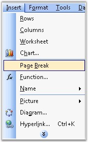
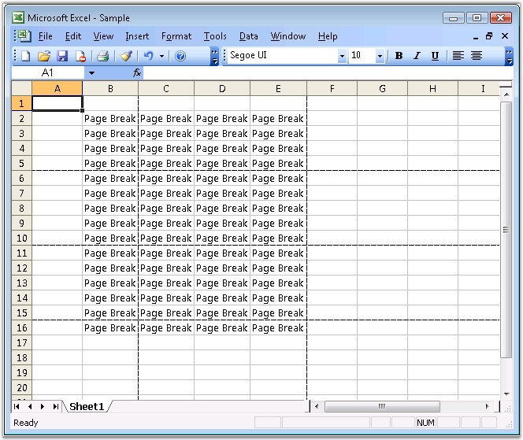

::: {style="DISPLAY: none"}
{#d2h_url_template}{#d2h_package_url style="WIDTH: 0px; DISPLAY: none; HEIGHT: 0px"}
:::

:::: {.d2h_secondary_topic style="PADDING-BOTTOM: 10pt; MARGIN: 0pt; PADDING-LEFT: 0pt; PADDING-RIGHT: 0pt; PADDING-TOP: 0pt"}
#### Breaks {#breaks style="tab-stops: 0pt"}

**[]{style="FONT-FAMILY: 'Segoe UI','sans-serif'; COLOR: black"}** 

Page Breaks are dividers that break a worksheet into separate pages for printing. To print a worksheet with the exact number of pages that you want, you can adjust the page breaks in the worksheet before you print it. Excel inserts automatic page breaks, based on the paper size, margin settings, scaling options, and the positions of any manual page breaks that you insert, and it also allows to insert/remove breaks at preferred locations.

[]{style="FONT-FAMILY: 'Trebuchet MS','sans-serif'; COLOR: #15428b; FONT-SIZE: 9pt"} 

{border="0"}

Figure 112: Insert menu -\> Page Break[]{style="FONT-FAMILY: 'Trebuchet MS','sans-serif'; COLOR: #15428b"}

[]{style="FONT-FAMILY: 'Trebuchet MS','sans-serif'; COLOR: #15428b; FONT-SIZE: 9pt"} 

XlsIO provides support for inserting/removing Horizontal and Vertical page breaks in a worksheet by using the **IHPagebreak** and **IVPagebreak** interfaces.

[]{style="FONT-FAMILY: 'Trebuchet MS','sans-serif'; COLOR: #15428b; FONT-SIZE: 9pt"} 

::: {style="BORDER-BOTTOM: windowtext 1pt solid; BORDER-LEFT: medium none; PADDING-BOTTOM: 1pt; MARGIN-TOP: 9pt; PADDING-LEFT: 0pt; PADDING-RIGHT: 0pt; MARGIN-BOTTOM: 9pt; BORDER-TOP: windowtext 1pt solid; BORDER-RIGHT: medium none; PADDING-TOP: 1pt"}
{border="0"}Note: By default, page breaks are not shown in the Normal view. However, you can view them by inserting new page breaks.
:::

[]{style="FONT-FAMILY: 'Trebuchet MS','sans-serif'; COLOR: #15428b; FONT-SIZE: 9pt"} 

+-------------------------------------------------------------------------------------------------------------------------------------------+
| **[\[C#\]]{style="FONT-FAMILY: 'Courier New'"}**                                                                                          |
|                                                                                                                                           |
| **[]{style="FONT-FAMILY: 'Courier New'"}**                                                                                                |
|                                                                                                                                           |
| [// Entering text into the cells.]{style="FONT-FAMILY: 'Courier New'; COLOR: green"}                                                      |
|                                                                                                                                           |
| [sheet.Range\[[\"A1:M20\"]{style="COLOR: #a31515"}\].Text = [\"PageBreak\"]{style="COLOR: #a31515"};]{style="FONT-FAMILY: 'Courier New'"} |
|                                                                                                                                           |
| []{style="FONT-FAMILY: 'Courier New'"}                                                                                                    |
|                                                                                                                                           |
| [// Giving Horizontal Page Breaks.]{style="FONT-FAMILY: 'Courier New'; COLOR: green"}                                                     |
|                                                                                                                                           |
| [sheet.HPageBreaks.Add(sheet.Range\[[\"A5\"]{style="COLOR: #a31515"}\]);]{style="FONT-FAMILY: 'Courier New'"}                             |
|                                                                                                                                           |
| [sheet.HPageBreaks.Add(sheet.Range\[[\"A10\"]{style="COLOR: #a31515"}\]);]{style="FONT-FAMILY: 'Courier New'"}                            |
|                                                                                                                                           |
| [sheet.HPageBreaks.Add(sheet.Range\[[\"A15\"]{style="COLOR: #a31515"}\]);]{style="FONT-FAMILY: 'Courier New'"}                            |
|                                                                                                                                           |
| []{style="FONT-FAMILY: 'Courier New'"}                                                                                                    |
|                                                                                                                                           |
| [// Giving Vertical Page Breaks.]{style="FONT-FAMILY: 'Courier New'; COLOR: green"}                                                       |
|                                                                                                                                           |
| [sheet.VPageBreaks.Add(sheet.Range\[[\"B5\"]{style="COLOR: #a31515"}\]);]{style="FONT-FAMILY: 'Courier New'"}                             |
|                                                                                                                                           |
| [sheet.VPageBreaks.Add(sheet.Range\[[\"E10\"]{style="COLOR: #a31515"}\]);]{style="FONT-FAMILY: 'Courier New'"}                            |
|                                                                                                                                           |
| [sheet.VPageBreaks.Add(sheet.Range\[[\"K15\"]{style="COLOR: #a31515"}\]);]{style="FONT-FAMILY: 'Courier New'"}                            |
+-------------------------------------------------------------------------------------------------------------------------------------------+

[]{style="FONT-FAMILY: 'Trebuchet MS','sans-serif'; COLOR: #15428b; FONT-SIZE: 9pt"} 

+--------------------------------------------------------------------------------------------------------------------------------------+
| **[\[VB.NET\]]{style="FONT-FAMILY: 'Courier New'"}**                                                                                 |
|                                                                                                                                      |
| **[]{style="FONT-FAMILY: 'Courier New'"}**                                                                                           |
|                                                                                                                                      |
| [\' Entering text into the cells.]{style="FONT-FAMILY: 'Courier New'; COLOR: green"}                                                 |
|                                                                                                                                      |
| [sheet.Range([\"A1:M20\"]{style="COLOR: maroon"}).Text = [\"PageBreak\"]{style="COLOR: maroon"}]{style="FONT-FAMILY: 'Courier New'"} |
|                                                                                                                                      |
| []{style="FONT-FAMILY: 'Courier New'; COLOR: maroon"}                                                                                |
|                                                                                                                                      |
| [\' Giving Horizontal Page Breaks.]{style="FONT-FAMILY: 'Courier New'; COLOR: green"}                                                |
|                                                                                                                                      |
| [sheet.HPageBreaks.Add(sheet.Range([\"A5\"]{style="COLOR: maroon"}))]{style="FONT-FAMILY: 'Courier New'"}                            |
|                                                                                                                                      |
| [sheet.HPageBreaks.Add(sheet.Range([\"A10\"]{style="COLOR: maroon"}))]{style="FONT-FAMILY: 'Courier New'"}                           |
|                                                                                                                                      |
| [sheet.HPageBreaks.Add(sheet.Range([\"A15\"]{style="COLOR: maroon"}))]{style="FONT-FAMILY: 'Courier New'"}                           |
|                                                                                                                                      |
| []{style="FONT-FAMILY: 'Courier New'"}                                                                                               |
|                                                                                                                                      |
| [\' Giving Vertical Page Breaks.]{style="FONT-FAMILY: 'Courier New'; COLOR: green"}                                                  |
|                                                                                                                                      |
| [sheet.VPageBreaks.Add(sheet.Range([\"B5\"]{style="COLOR: maroon"}))]{style="FONT-FAMILY: 'Courier New'"}                            |
|                                                                                                                                      |
| [sheet.VPageBreaks.Add(sheet.Range([\"E10\"]{style="COLOR: maroon"}))]{style="FONT-FAMILY: 'Courier New'"}                           |
|                                                                                                                                      |
| [sheet.VPageBreaks.Add(sheet.Range([\"K15\"]{style="COLOR: maroon"})) ]{style="FONT-FAMILY: 'Courier New'"}                          |
+--------------------------------------------------------------------------------------------------------------------------------------+

[]{style="FONT-FAMILY: 'Trebuchet MS','sans-serif'; COLOR: #15428b; FONT-SIZE: 9pt"} 

{border="0"}

Figure 113: XlsIO with Page Breaks[]{style="FONT-FAMILY: 'Trebuchet MS','sans-serif'; COLOR: #15428b"}

 

You can also display or hide page breaks in the normal view by using the **DisplayPageBreaks** property of **IWorksheet**.

 

[]{#related-topics}
::::
